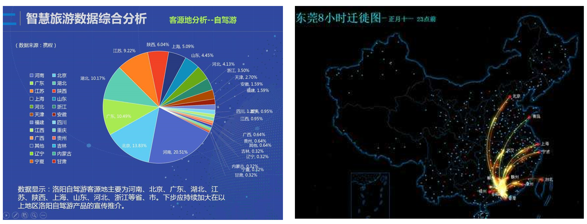
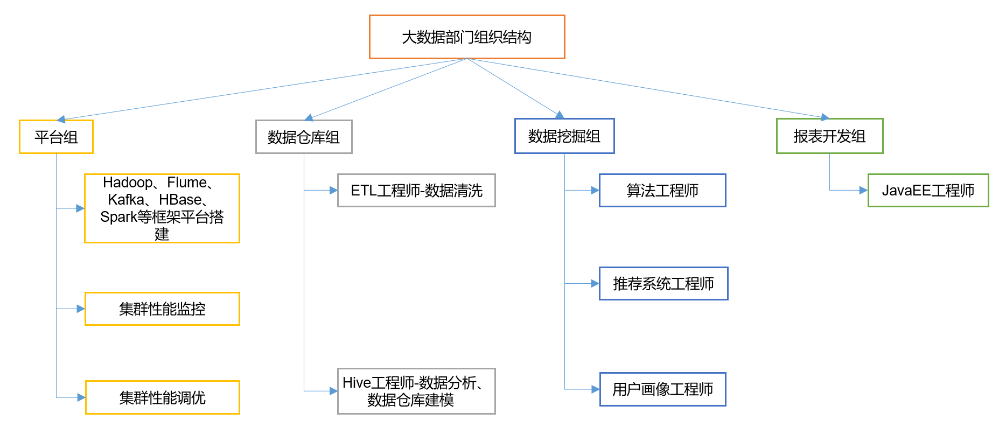
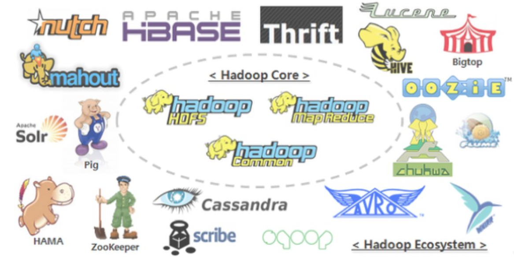
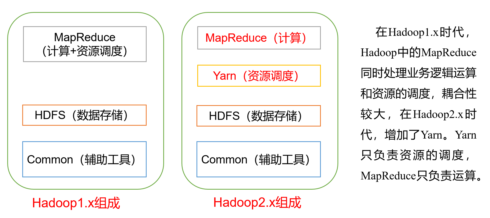
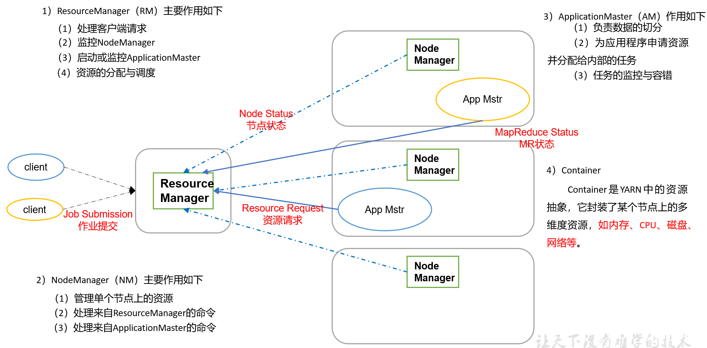
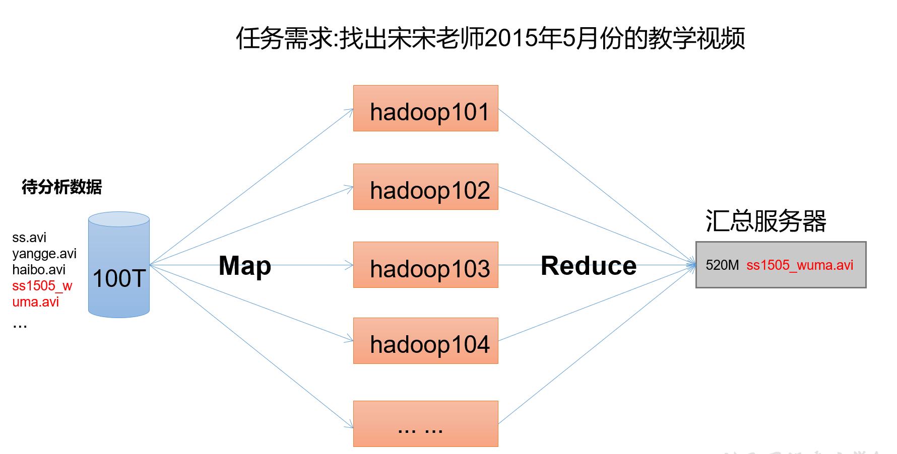
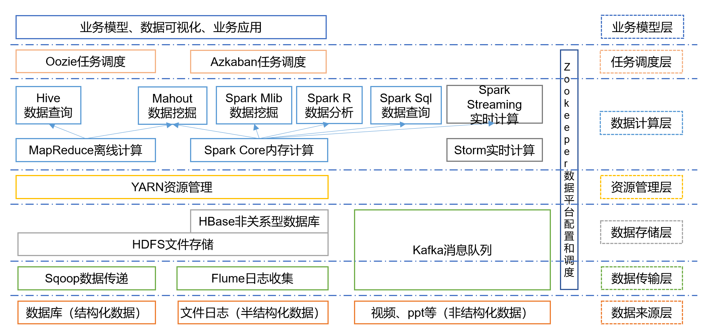
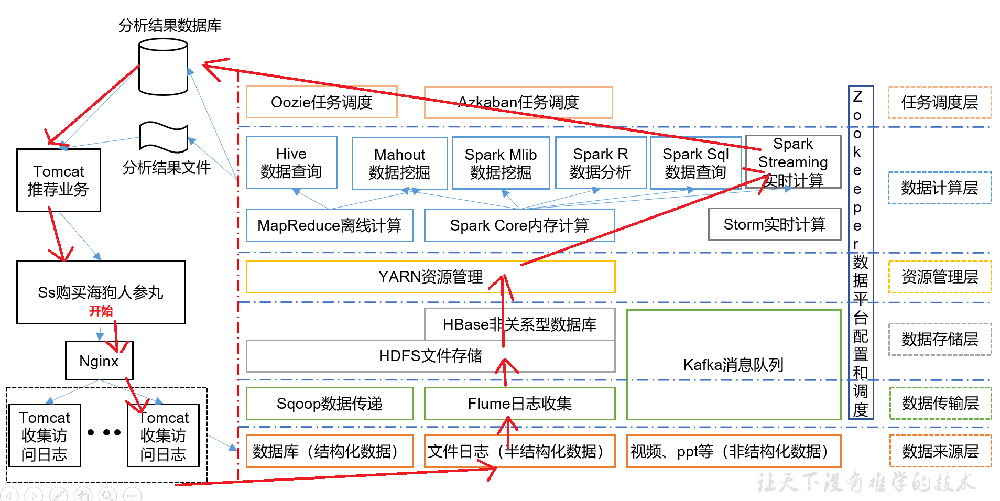

## 1、大数据概论

### 1.1 大数据概念

大数据（big data），IT行业术语，是指无法在一定时间范围内用常规软件工具进行捕捉、管理和处理的数据集合，是需要新处理模式才能具有更强的决策力、洞察发现力和流程优化能力的海量、高增长率和多样化的信息资产。

主要解决，海量数据的**存储**和海量数据的**分析计算**问题。

最小的基本单位是bit，按顺序给出所有单位：bit、Byte、KB、MB、GB、TB、PB、EB、ZB、YB、BB、NB、DB。

- 1 Byte =8 bit
- 1 KB = 1,024 Bytes
- 1 MB = 1,024 KB 
- 1 GB = 1,024 MB 
- 1 TB = 1,024 GB 
- 1 PB = 1,024 TB

###  1.2 大数据的特点（4V）

**1、Volume（大量）**

​	社交网络（微博、推特、脸书）、移动网络、各种智能工具，服务工具等，都成为数据的来源。淘宝网近4亿的会员每天产生的商品交易数据约20TB；脸书约10亿的用户每天产生的日志数据超过300TB。

**2、Velocity（高速）**

​	大数据的产生非常迅速，主要通过互联网传输。生活中每个人都离不开互联网，也就是说每天个人每天都在向大数据提供大量的资料。并且这些数据是需要及时处理的，因为花费大量资本去存储作用较小的历史数据是非常不划算的，对于一个平台而言，也许保存的数据只有过去几天或者一个月之内，再远的数据就要及时清理，不然代价太大。基于这种情况，大数据对处理速度有非常严格的要求，服务器中大量的资源都用于处理和计算数据，很多平台都需要做到实时分析。数据无时无刻不在产生，谁的速度更快，谁就有优势。

**3、Variety（多样）**

广泛的数据来源，决定了大数据形式的多样性。任何形式的数据都可以产生作用，目前应用最广泛的就是推荐系统，如淘宝，网易云音乐、今日头条等，这些平台都会通过对用户的日志数据进行分析，从而进一步推荐用户喜欢的东西。日志数据是**结构化明显的数据**，还有一些**数据结构化不明显**，例如图片、音频、视频等，这些数据因果关系弱，就需要人工对其进行标注。

**4、value（价值）**

这也是大数据的核心特征。现实世界所产生的数据中，有价值的数据所占比例很小。相比于传统的小数据，大数据最大的价值在于通过从大量不相关的各种类型的数据中，挖掘出对未来趋势与模式预测分析有价值的数据，并通过机器学习方法、人工智能方法或数据挖掘方法深度分析，发现新规律和新知识，并运用于农业、金融、医疗等各个领域，从而最终达到改善社会治理、提高生产效率、推进科学研究的效果。

### 1.3 大数据的应用场景

1、物流仓储：大数据分析系统助力商家精细化运营、提升销量、节约成本。

2、零售：分析用户消费习惯，为用户购买商品提供方便，从而提升商品销量。经典案例：尿布+啤酒

3、旅游：深度结合大数据能力与旅游行业需求，共建旅游产业智慧管理、智慧服务和智慧营销的未来。

4、商品广告推荐：给用户推荐可能喜欢的产品

5、保险：海量数据挖掘及风险预测，助力保险行业精准营销，提升精细化定价能力。

6、金融：多维度体现用户特征，帮助金融机构推荐优质用户，防范欺诈风险。

7、房产：大数据全面助力房地产行业，打造精准投策与营销，选出更合适的迪，建造更合适的楼，卖给更合适的人。

8、人工智能

### 1.4 大数据部门组织结构（重点）

## 2、从Hadoop框架讨论大数据生态

### 2.1 Hadoop是什么

1. Hadoop是一个由Apache基金会所开发的[分布式系统](https://baike.baidu.com/item/分布式系统/4905336)基础架构。
2. 主要解决，海量数据的**存储**和海量数据的**分析计算**问题。
3. 广义上来说，Hadoop通常是指一个更广泛的概念---Hadoop生态圈。

### 2.2 Hadoop发展历史

- Hadoop是Apache Lucene创始人Doug Cutting创建的，Lucene是一个广泛使用的文本搜索系统库。Hadoop起源于Apache Nutch，一个开源的网络搜索引擎， 它本身也是Lucene项目的一部分。

- 2005年，Hadoop作为Lucene的子项目Nutch的一部分正式引入Apache基金会。

- 2006年2月被分离出来，成为一套完整独立的软件，起名为Hadoop

- Hadoop名字不是一个缩写，而是一个生造出来的词。是Hadoop之父Doug Cutting儿子毛绒玩具象命名的。

  

- Hadoop的成长过程：Lucene–>Nutch—>Hadoop

  

- 总结起来，Hadoop起源于Google的**三大论文**：
  
  - GFS：Google的分布式文件系统Google File System
  - MapReduce：Google的MapReduce开源分布式并行计算框架
  - BigTable：一个大型的分布式数据库

- 演变关系
  - GFS—->HDFS
  - Google MapReduce—->Hadoop MapReduce
  - BigTable—->HBase

### 2.3 Hadoop 三大发行版本

**1.免费开源版本apache：**
http://hadoop.apache.org/
优点：拥有全世界的开源贡献者，代码更新迭代版本比较快，
缺点：版本的升级，版本的维护，版本的兼容性，版本的补丁都可能考虑不太周到，学习可以用，实际生产工作环境尽量不要使用
apache所有软件的下载地址（包括各种历史版本）：
http://archive.apache.org/dist/

**2.免费开源版本hortonWorks：**
https://hortonworks.com/
hortonworks主要是雅虎主导Hadoop开发的副总裁，带领二十几个核心成员成立Hortonworks，核心产品软件HDP（ambari），HDF免费开源，并且提供一整套的web管理界面，供我们可以通过web界面管理我们的集群状态，web管理界面软件HDF网址（http://ambari.apache.org/）

**3.软件收费版本ClouderaManager:**
https://www.cloudera.com/
cloudera主要是美国一家大数据公司在apache开源hadoop的版本上，通过自己公司内部的各种补丁，实现版本之间的稳定运行，大数据生态圈的各个版本的软件都提供了对应的版本，解决了版本的升级困难，版本兼容性等各种问题，生产环境强烈推荐使用，在大型互联网公司用的较多。

### 2.4 Hadoop 的优势（4高）

1. **高可靠性：**Hadoop底层维护多个数据副本，所以即使Hadoop某个计算元素或存储出现故障，也不会导致数据的丢失。
2. **高扩展性：**Hadoop是在可用的计算机集群间分配数据并完成计算任务的，这些集群可用方便的扩展到数以千计个节点中。
3. **高效性：**通过并发数据，Hadoop可以在节点之间动态并行的移动数据，使得速度非常快。
4. **高容错性：**能够自动将失败的任务重新分配。

### 2.5 Hadoop组成（面试重点）

#### 2.5.1 HDFS 架构概述

**NameNode**：集群当中的主节点，主要用于管理集群当中的各种数据，存储文件的元数据，如文件名，文件目录结构，文件属性，以及每个文件的块列表和块所在的DataNode等。
**secondaryNameNode**：主要能用于hadoop当中元数据信息的辅助管理。
**DataNode**：集群当中的从节点，主要用于存储集群当中的各种数据。

#### 2.5.2 Yarn 架构概述

#### 2.5.3 MapReduce

MapReduce将计算过程分为两个阶段：Map和Reduce

1. Map阶段并行处理输入数据
2. Reduce阶段对Map结果进行汇总

### 2.6 大数据技术生态体系

图中涉及的技术名词解释如下：

1）Sqoop：Sqoop是一款开源的工具，主要用于在Hadoop、Hive与传统的数据库(MySql)间进行数据的传递，可以将一个关系型数据库（例如 ：MySQL，Oracle 等）中的数据导进到Hadoop的HDFS中，也可以将HDFS的数据导进到关系型数据库中。

2）Flume：Flume是Cloudera提供的一个高可用的，高可靠的，分布式的海量日志采集、聚合和传输的系统，Flume支持在日志系统中定制各类数据发送方，用于收集数据；同时，Flume提供对数据进行简单处理，并写到各种数据接受方（可定制）的能力。

3）Kafka：Kafka是一种高吞吐量的分布式发布订阅消息系统，有如下特性：

（1）通过O(1)的磁盘数据结构提供消息的持久化，这种结构对于即使数以TB的消息存储也能够保持长时间的稳定性能。

（2）高吞吐量：即使是非常普通的硬件Kafka也可以支持每秒数百万的消息。

（3）支持通过Kafka服务器和消费机集群来分区消息。

（4）支持Hadoop并行数据加载。

4）Storm：Storm用于“连续计算”，对数据流做连续查询，在计算时就将结果以流的形式输出给用户。

5）Spark：Spark是当前最流行的开源大数据内存计算框架。可以基于Hadoop上存储的大数据进行计算。

6）Oozie：Oozie是一个管理Hdoop作业（job）的工作流程调度管理系统。

7）Hbase：HBase是一个分布式的、面向列的开源数据库。HBase不同于一般的关系数据库，它是一个适合于非结构化数据存储的数据库。

8）Hive：Hive是基于Hadoop的一个数据仓库工具，可以将结构化的数据文件映射为一张数据库表，并提供简单的SQL查询功能，可以将SQL语句转换为MapReduce任务进行运行。 其优点是学习成本低，可以通过类SQL语句快速实现简单的MapReduce统计，不必开发专门的MapReduce应用，十分适合数据仓库的统计分析。

10）R语言：R是用于统计分析、绘图的语言和操作环境。R是属于GNU系统的一个自由、免费、源代码开放的软件，它是一个用于统计计算和统计制图的优秀工具。

11）Mahout：Apache Mahout是个可扩展的机器学习和数据挖掘库。

12）ZooKeeper：Zookeeper是Google的Chubby一个开源的实现。它是一个针对大型分布式系统的可靠协调系统，提供的功能包括：配置维护、名字服务、 分布式同步、组服务等。ZooKeeper的目标就是封装好复杂易出错的关键服务，将简单易用的接口和性能高效、功能稳定的系统提供给用户。

### 2.7 推荐系统项目框架

