## 1、大数据概论

### 1.1 大数据概念

大数据（big data），IT行业术语，是指无法在一定时间范围内用常规软件工具进行捕捉、管理和处理的数据集合，是需要新处理模式才能具有更强的决策力、洞察发现力和流程优化能力的海量、高增长率和多样化的信息资产。


主要解决，海量数据的**存储**和海量数据的**分析计算**问题。

最小的基本单位是bit，按顺序给出所有单位：bit、Byte、KB、MB、GB、TB、PB、EB、ZB、YB、BB、NB、DB。

- 1 Byte =8 bit
- 1 KB = 1,024 Bytes
- 1 MB = 1,024 KB 
- 1 GB = 1,024 MB 
- 1 TB = 1,024 GB 
- 1 PB = 1,024 TB

###  1.2 大数据的特点（4V）

**1、Volume（大量）**

​	社交网络（微博、推特、脸书）、移动网络、各种智能工具，服务工具等，都成为数据的来源。淘宝网近4亿的会员每天产生的商品交易数据约20TB；脸书约10亿的用户每天产生的日志数据超过300TB。

**2、Velocity（高速）**

​	大数据的产生非常迅速，主要通过互联网传输。生活中每个人都离不开互联网，也就是说每天个人每天都在向大数据提供大量的资料。并且这些数据是需要及时处理的，因为花费大量资本去存储作用较小的历史数据是非常不划算的，对于一个平台而言，也许保存的数据只有过去几天或者一个月之内，再远的数据就要及时清理，不然代价太大。基于这种情况，大数据对处理速度有非常严格的要求，服务器中大量的资源都用于处理和计算数据，很多平台都需要做到实时分析。数据无时无刻不在产生，谁的速度更快，谁就有优势。

**3、Variety（多样）**

广泛的数据来源，决定了大数据形式的多样性。任何形式的数据都可以产生作用，目前应用最广泛的就是推荐系统，如淘宝，网易云音乐、今日头条等，这些平台都会通过对用户的日志数据进行分析，从而进一步推荐用户喜欢的东西。日志数据是**结构化明显的数据**，还有一些**数据结构化不明显**，例如图片、音频、视频等，这些数据因果关系弱，就需要人工对其进行标注。

**4、value（价值）**

这也是大数据的核心特征。现实世界所产生的数据中，有价值的数据所占比例很小。相比于传统的小数据，大数据最大的价值在于通过从大量不相关的各种类型的数据中，挖掘出对未来趋势与模式预测分析有价值的数据，并通过机器学习方法、人工智能方法或数据挖掘方法深度分析，发现新规律和新知识，并运用于农业、金融、医疗等各个领域，从而最终达到改善社会治理、提高生产效率、推进科学研究的效果。

### 1.3 大数据的应用场景

1、物流仓储：大数据分析系统助力商家精细化运营、提升销量、节约成本。


2、零售：分析用户消费习惯，为用户购买商品提供方便，从而提升商品销量。经典案例：尿布+啤酒


3、旅游：深度结合大数据能力与旅游行业需求，共建旅游产业智慧管理、智慧服务和智慧营销的未来。


4、商品广告推荐：给用户推荐可能喜欢的产品


5、保险：海量数据挖掘及风险预测，助力保险行业精准营销，提升精细化定价能力。

6、金融：多维度体现用户特征，帮助金融机构推荐优质用户，防范欺诈风险。

7、房产：大数据全面助力房地产行业，打造精准投策与营销，选出更合适的迪，建造更合适的楼，卖给更合适的人。

8、人工智能


### 1.4 大数据部门组织结构（重点）


## 2、从Hadoop框架讨论大数据生态

### 2.1 Hadoop是什么

1. Hadoop是一个由Apache基金会所开发的[分布式系统](https://baike.baidu.com/item/分布式系统/4905336)基础架构。
2. 主要解决，海量数据的**存储**和海量数据的**分析计算**问题。
3. 广义上来说，Hadoop通常是指一个更广泛的概念---Hadoop生态圈。


### 2.2 Hadoop发展历史

- Hadoop是Apache Lucene创始人Doug Cutting创建的，Lucene是一个广泛使用的文本搜索系统库。Hadoop起源于Apache Nutch，一个开源的网络搜索引擎， 它本身也是Lucene项目的一部分。

- 2005年，Hadoop作为Lucene的子项目Nutch的一部分正式引入Apache基金会。

- 2006年2月被分离出来，成为一套完整独立的软件，起名为Hadoop

- Hadoop名字不是一个缩写，而是一个生造出来的词。是Hadoop之父Doug Cutting儿子毛绒玩具象命名的。

  

- Hadoop的成长过程：Lucene–>Nutch—>Hadoop

  

- 总结起来，Hadoop起源于Google的**三大论文**：
  
  - GFS：Google的分布式文件系统Google File System
  - MapReduce：Google的MapReduce开源分布式并行计算框架
  - BigTable：一个大型的分布式数据库

- 演变关系
  - GFS—->HDFS
  - Google MapReduce—->Hadoop MapReduce
  - BigTable—->HBase

### 2.3 Hadoop 三大发行版本

**1.免费开源版本apache：**
http://hadoop.apache.org/
优点：拥有全世界的开源贡献者，代码更新迭代版本比较快，
缺点：版本的升级，版本的维护，版本的兼容性，版本的补丁都可能考虑不太周到，学习可以用，实际生产工作环境尽量不要使用
apache所有软件的下载地址（包括各种历史版本）：
http://archive.apache.org/dist/

**2.免费开源版本hortonWorks：**
https://hortonworks.com/
hortonworks主要是雅虎主导Hadoop开发的副总裁，带领二十几个核心成员成立Hortonworks，核心产品软件HDP（ambari），HDF免费开源，并且提供一整套的web管理界面，供我们可以通过web界面管理我们的集群状态，web管理界面软件HDF网址（http://ambari.apache.org/）

**3.软件收费版本ClouderaManager:**
https://www.cloudera.com/
cloudera主要是美国一家大数据公司在apache开源hadoop的版本上，通过自己公司内部的各种补丁，实现版本之间的稳定运行，大数据生态圈的各个版本的软件都提供了对应的版本，解决了版本的升级困难，版本兼容性等各种问题，生产环境强烈推荐使用，在大型互联网公司用的较多。

### 2.4 Hadoop 的优势（4高）

1. **高可靠性：**Hadoop底层维护多个数据副本，所以即使Hadoop某个计算元素或存储出现故障，也不会导致数据的丢失。
2. **高扩展性：**Hadoop是在可用的计算机集群间分配数据并完成计算任务的，这些集群可用方便的扩展到数以千计个节点中。
3. **高效性：**通过并发数据，Hadoop可以在节点之间动态并行的移动数据，使得速度非常快。
4. **高容错性：**能够自动将失败的任务重新分配。

### 2.5 Hadoop组成（面试重点）


#### 2.5.1 HDFS 架构概述

**NameNode**：集群当中的主节点，主要用于管理集群当中的各种数据，存储文件的元数据，如文件名，文件目录结构，文件属性，以及每个文件的块列表和块所在的DataNode等。
**secondaryNameNode**：主要能用于hadoop当中元数据信息的辅助管理。
**DataNode**：集群当中的从节点，主要用于存储集群当中的各种数据。

#### 2.5.2 Yarn 架构概述


#### 2.5.3 MapReduce

MapReduce将计算过程分为两个阶段：Map和Reduce

1. Map阶段并行处理输入数据
2. Reduce阶段对Map结果进行汇总


### 2.6 大数据技术生态体系


图中涉及的技术名词解释如下：

1）Sqoop：Sqoop是一款开源的工具，主要用于在Hadoop、Hive与传统的数据库(MySql)间进行数据的传递，可以将一个关系型数据库（例如 ：MySQL，Oracle 等）中的数据导进到Hadoop的HDFS中，也可以将HDFS的数据导进到关系型数据库中。

2）Flume：Flume是Cloudera提供的一个高可用的，高可靠的，分布式的海量日志采集、聚合和传输的系统，Flume支持在日志系统中定制各类数据发送方，用于收集数据；同时，Flume提供对数据进行简单处理，并写到各种数据接受方（可定制）的能力。

3）Kafka：Kafka是一种高吞吐量的分布式发布订阅消息系统，有如下特性：

（1）通过O(1)的磁盘数据结构提供消息的持久化，这种结构对于即使数以TB的消息存储也能够保持长时间的稳定性能。

（2）高吞吐量：即使是非常普通的硬件Kafka也可以支持每秒数百万的消息。

（3）支持通过Kafka服务器和消费机集群来分区消息。

（4）支持Hadoop并行数据加载。

4）Storm：Storm用于“连续计算”，对数据流做连续查询，在计算时就将结果以流的形式输出给用户。

5）Spark：Spark是当前最流行的开源大数据内存计算框架。可以基于Hadoop上存储的大数据进行计算。

6）Oozie：Oozie是一个管理Hdoop作业（job）的工作流程调度管理系统。

7）Hbase：HBase是一个分布式的、面向列的开源数据库。HBase不同于一般的关系数据库，它是一个适合于非结构化数据存储的数据库。

8）Hive：Hive是基于Hadoop的一个数据仓库工具，可以将结构化的数据文件映射为一张数据库表，并提供简单的SQL查询功能，可以将SQL语句转换为MapReduce任务进行运行。 其优点是学习成本低，可以通过类SQL语句快速实现简单的MapReduce统计，不必开发专门的MapReduce应用，十分适合数据仓库的统计分析。

10）R语言：R是用于统计分析、绘图的语言和操作环境。R是属于GNU系统的一个自由、免费、源代码开放的软件，它是一个用于统计计算和统计制图的优秀工具。

11）Mahout：Apache Mahout是个可扩展的机器学习和数据挖掘库。

12）ZooKeeper：Zookeeper是Google的Chubby一个开源的实现。它是一个针对大型分布式系统的可靠协调系统，提供的功能包括：配置维护、名字服务、 分布式同步、组服务等。ZooKeeper的目标就是封装好复杂易出错的关键服务，将简单易用的接口和性能高效、功能稳定的系统提供给用户。

### 2.7 推荐系统项目框架


---

## 3、Hadoop运行环境搭建（开发重点）

### 3.1 虚拟机环境准备

1. 克隆虚拟机[克隆虚拟机详细教程](../paper/虚拟机安装CentOS7镜像.md)

2. 修改克隆虚拟机的静态IP

3. 修改主机名

4. 关闭防火墙

   - 暂时关闭防火墙

   - ~~~shell
     systemctl stop firewalld
     ~~~

   - 永久关闭防火墙

   - ~~~shell
     #先暂时关闭
     systemctl stop firewalld
     #再永久关闭，这样就不用重启啦
     systemctl disable firewalld
     ~~~

5. 创建xiaoliuya用户

   - ~~~shell
     [root@CentOS72020clone ~]# adduser xiaoliuya
     [root@CentOS72020clone ~]# passwd xiaoliuya
     ~~~

   - 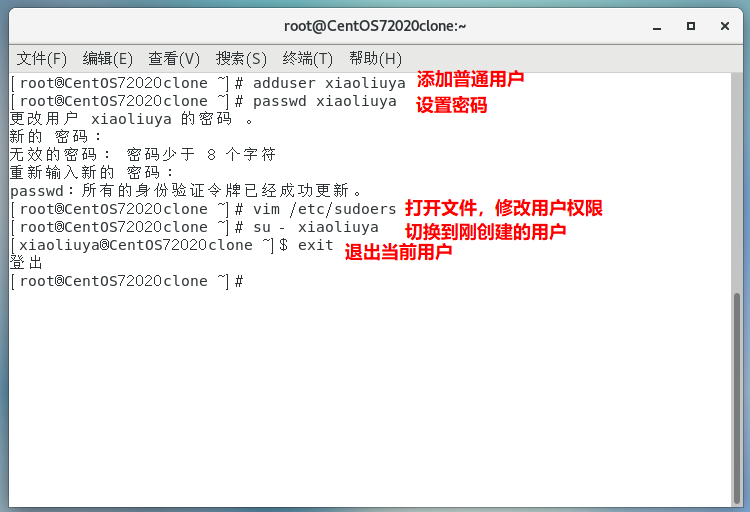

6. 配置xiaoliuya用户具有root权限(详见《尚硅谷大数据之Linux》)

   - ~~~shell
     [root@CentOS72020clone ~]# vim /etc/sudoers
     ~~~

   - 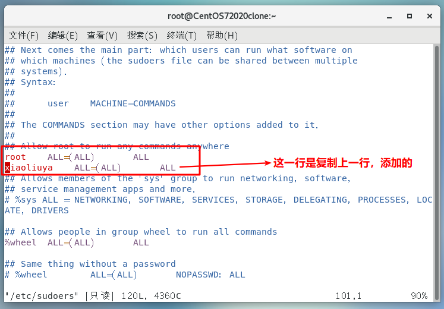

7. 在/opt目录下创建文件夹

   （1）在/opt目录下创建module、software文件夹

   ~~~shell
   [xiaoliuya@CentOS72020clone opt]$ sudo mkdir module
   [xiaoliuya@CentOS72020clone opt]$ sudo mkdir software
   ~~~

   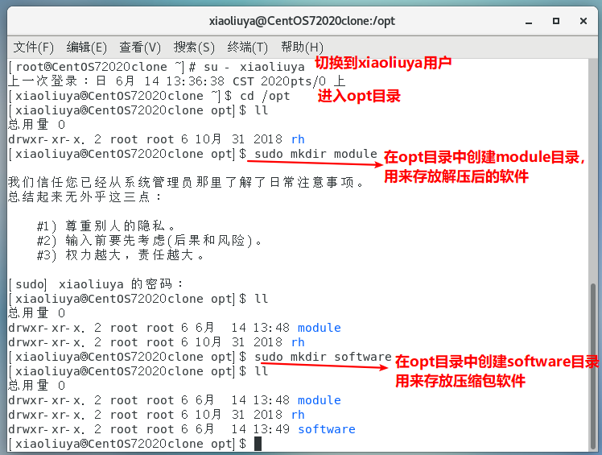

   （2）修改module、software文件夹的所属者和所属组

   ~~~shell
   [xiaoliuya@CentOS72020clone opt]$ sudo chown -R xiaoliuya:xiaoliuya module/ software/
   [xiaoliuya@CentOS72020clone opt]$ ll
   ~~~

   ~~~shell
   总用量 0
   drwxr-xr-x. 2 xiaoliuya xiaoliuya 6 6月  14 13:48 module
   drwxr-xr-x. 2 root      root      6 10月 31 2018 rh
   drwxr-xr-x. 2 xiaoliuya xiaoliuya 6 6月  14 13:49 software
   ~~~

   ~~~shell
   #可以删除rh目录
   [xiaoliuya@CentOS72020clone opt]$ sudo rm -rf r/
   ~~~


### 3.2 安装JDK

1.用Xshell和Xftp上传jdk的jar包到opt目录下的software目录下

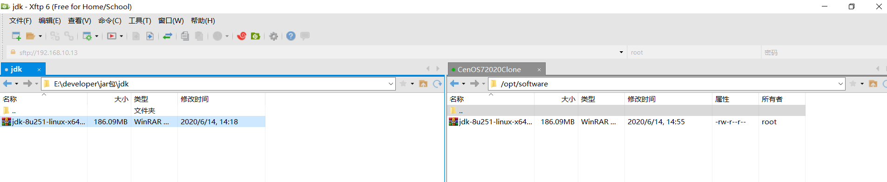

2.解压到opt目录下的module

~~~shell
[xiaoliuya@CentOS72020clone opt]$ cd software/
[xiaoliuya@CentOS72020clone software]$ ll
总用量 190560
-rw-r--r--. 1 root root 195132576 6月  14 14:55 jdk-8u251-linux-x64.tar.gz
[xiaoliuya@CentOS72020clone software]$ tar -zxvf jdk-8u251-linux-x64.tar.gz -C /opt/module
~~~

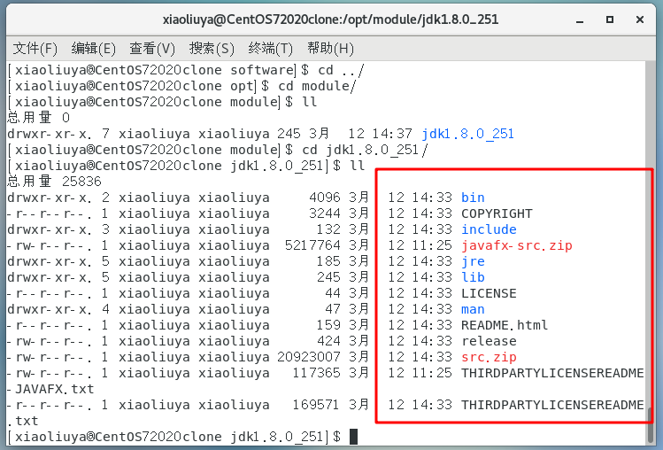

3.设置环境变量

~~~shell
#获取安装路径
[xiaoliuya@CentOS72020clone jdk1.8.0_251]$ pwd
/opt/module/jdk1.8.0_251
#在此文件中设置环境变量
[xiaoliuya@CentOS72020clone opt]$ sudo vim /etc/profile
#打开文件后，在末尾添加如下配置
~~~

~~~properties
##JAVA_HOME
export JAVA_HOME=/opt/module/jdk1.8.0_251
export PATH=$PATH:$JAVA_HOME/bin
~~~

~~~shell
#让配置生效
[xiaoliuya@CentOS72020clone jdk1.8.0_251]$ source /etc/profile

[xiaoliuya@CentOS72020clone jdk1.8.0_251]$ java -version
java version "1.8.0_251"
Java(TM) SE Runtime Environment (build 1.8.0_251-b08)
Java HotSpot(TM) 64-Bit Server VM (build 25.251-b08, mixed mode)

~~~

~~~shell
#如果出现的不是你安装的jdk的版本，可能是自带的
[root@localhost ~]# java -version
openjdk version "1.8.0_242"   #这不是我安装的1.8.0_251版本
OpenJDK Runtime Environment (build 1.8.0_242-b08)
OpenJDK 64-Bit Server VM (build 25.242-b08, mixed mode)
~~~

~~~shell
#用下面这个命令查看有多少jdk相关的
[root@localhost ~]# rpm -qa | grep jdk
java-1.7.0-openjdk-headless-1.7.0.251-2.6.21.1.el7.x86_64    #这个删除
copy-jdk-configs-3.3-10.el7_5.noarch
java-1.7.0-openjdk-1.7.0.251-2.6.21.1.el7.x86_64			 #这个删除
java-1.8.0-openjdk-1.8.0.242.b08-1.el7.x86_64				 #这个删除
java-1.8.0-openjdk-headless-1.8.0.242.b08-1.el7.x86_64		 #这个删除

#使用下面这个命令删除
rpm -e --nodeps 后面跟系统自带的jdk名 
[root@localhost ~]# sudo rpm -e --nodeps java-1.7.0-openjdk-headless-1.7.0.251-2.6.21.1.el7.x86_64
#然后我们自己安装的就生效啦！
~~~

### 3.3 安装Hadoop

1.用Xshell和Xftp上传linux编译过的hadoop jar包到opt目录下的software目录下

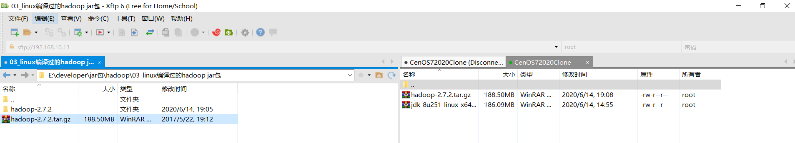

2.解压到opt目录下的module

~~~shell 
[xiaoliuya@CentOS72020clone opt]$ cd software/
[xiaoliuya@CentOS72020clone software]$ ll
总用量 383588
-rw-r--r--. 1 root root 197657687 6月  14 19:08 hadoop-2.7.2.tar.gz
-rw-r--r--. 1 root root 195132576 6月  14 14:55 jdk-8u251-linux-x64.tar.gz
[xiaoliuya@CentOS72020clone software]$ tar -zxvf hadoop-2.7.2.tar.gz -C /opt/module/
~~~

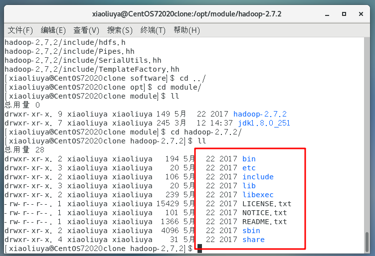

3.设置环境变量

~~~shell
[xiaoliuya@CentOS72020clone hadoop-2.7.2]$ pwd
/opt/module/hadoop-2.7.2
[xiaoliuya@CentOS72020clone hadoop-2.7.2]$ sudo vim /etc/profile
#打开文件后，在末尾添加如下配置
~~~

~~~shell
##HADOOP_HOME
export HADOOP_HOME=/opt/module/hadoop-2.7.2
export PATH=$PATH:$HADOOP_HOME/bin
export PATH=$PATH:$HADOOP_HOME/sbin
~~~

~~~shell
#让配置生效
[xiaoliuya@CentOS72020clone hadoop-2.7.2]$ source /etc/profile

[xiaoliuya@CentOS72020clone hadoop-2.7.2]$ hadoop 
Usage: hadoop [--config confdir] [COMMAND | CLASSNAME]
  CLASSNAME            run the class named CLASSNAME
 or
  where COMMAND is one of:
  fs                   run a generic filesystem user client
  version              print the version
  jar <jar>            run a jar file
                       note: please use "yarn jar" to launch
                             YARN applications, not this command.
  checknative [-a|-h]  check native hadoop and compression libraries availability
  distcp <srcurl> <desturl> copy file or directories recursively
  archive -archiveName NAME -p <parent path> <src>* <dest> create a hadoop archive
  classpath            prints the class path needed to get the
  credential           interact with credential providers
                       Hadoop jar and the required libraries
  daemonlog            get/set the log level for each daemon
  trace                view and modify Hadoop tracing settings

Most commands print help when invoked w/o parameters.

~~~

### 3.4 Hadoop目录结构

1.查看Hadoop目录结构

~~~shell
[xiaoliuya@CentOS72020clone hadoop-2.7.2]$ ll
总用量 28
drwxr-xr-x. 2 xiaoliuya xiaoliuya   194 5月  22 2017 bin
drwxr-xr-x. 3 xiaoliuya xiaoliuya    20 5月  22 2017 etc
drwxr-xr-x. 2 xiaoliuya xiaoliuya   106 5月  22 2017 include
drwxr-xr-x. 3 xiaoliuya xiaoliuya    20 5月  22 2017 lib
drwxr-xr-x. 2 xiaoliuya xiaoliuya   239 5月  22 2017 libexec
-rw-r--r--. 1 xiaoliuya xiaoliuya 15429 5月  22 2017 LICENSE.txt
-rw-r--r--. 1 xiaoliuya xiaoliuya   101 5月  22 2017 NOTICE.txt
-rw-r--r--. 1 xiaoliuya xiaoliuya  1366 5月  22 2017 README.txt
drwxr-xr-x. 2 xiaoliuya xiaoliuya  4096 5月  22 2017 sbin
drwxr-xr-x. 4 xiaoliuya xiaoliuya    31 5月  22 2017 share
~~~

2.重要目录

（1）bin目录：存放对Hadoop相关服务（HDFS,YARN）进行操作的脚本
（2）etc目录：Hadoop的配置文件目录，存放Hadoop的配置文件
（3）lib目录：存放Hadoop的本地库（对数据进行压缩解压缩功能）
（4）sbin目录：存放启动或停止Hadoop相关服务的脚本
（5）share目录：存放Hadoop的依赖jar包、文档、和官方案例

## 4、Hadoop运行模式

Hadoop运行模式包括：本地模式、伪分布式模式以及完全分布式模式。

Hadoop官方网站：http://hadoop.apache.org/

### 4.1 本地运行模式

#### 4.1.1 官方Grep案例

1. 在hadoop-2.7.2文件下面创建一个input文件夹

~~~shell
[xiaoliuya@CentOS72020clone hadoop-2.7.2]$ mkdir input
~~~

2. 将Hadoop的xml配置文件复制到input

~~~shell
[xiaoliuya@CentOS72020clone hadoop-2.7.2]$ cp etc/hadoop/*.xml input
~~~

3. 执行share目录下的MapReduce程序

~~~shell
[xiaoliuya@CentOS72020clone hadoop-2.7.2]$ bin/hadoop jar share/hadoop/mapreduce/hadoop-mapreduce-examples-2.7.2.jar grep input output 'dfs[a-z]+'
~~~

4. 查看输出结果

~~~shell
[xiaoliuya@CentOS72020clone hadoop-2.7.2]$ cat output/*
1	dfsadmin
~~~

#### 4.1.2 官方WordCount案例(统计单词出现的次数)

1. 创建在hadoop-2.7.2文件下面创建一个wcinput文件夹

~~~shell 
[xiaoliuya@CentOS72020clone hadoop-2.7.2]$ mkdir wcinput
~~~

2. 在wcinput文件下创建一个wc.input文件

~~~shell
[xiaoliuya@CentOS72020clone hadoop-2.7.2]$ cd wcinput/
[xiaoliuya@CentOS72020clone wcinput]$ touch wc.input
~~~

3. 编辑wc.input文件

~~~shell 
[atguigu@hadoop101 wcinput]$ vim wc.input
~~~

在文件中输入如下内容

~~~txt
hadoop yarn
hadoop mapreduce
atguigu
atguigu
~~~

保存退出：：wq

4. 回到Hadoop目录/opt/module/hadoop-2.7.2

5. 执行程序

~~~shell
[xiaoliuya@CentOS72020clone hadoop-2.7.2]$ hadoop jar share/hadoop/mapreduce/hadoop-mapreduce-examples-2.7.2.jar wordcount wcinput wcoutput
~~~

6. 查看结果

~~~shell
[xiaoliuya@CentOS72020clone hadoop-2.7.2]$ cat wcoutput/part-r-00000
atguigu	2
hadoop	2
mapreduce	1
yarn	1
~~~

### 4.2 伪分布式运行模式

#### 4.2.1 启动HDFS并运行MapReduce程序

1. 分析

​    （1）配置集群

​    （2）启动、测试集群增、删、查

​    （3）执行WordCount案例

2. 执行步骤

**（1）配置集群**

**配置文件在/opt/module/hadoop-2.7.2/etc/hadoop目录下**

> （a）配置：hadoop-env.sh	

~~~shell
#Linux系统中获取JDK的安装路径：
[xiaoliuya@CentOS72020clone ~]$ echo $JAVA_HOME
/opt/module/jdk1.8.0_251
~~~

~~~shell
#修改JAVA_HOME 路径：
[xiaoliuya@CentOS72020clone hadoop]$ vim hadoop-env.sh
#修改下面这行
export JAVA_HOME=/opt/module/jdk1.8.0_251
~~~

> （b）配置：core-site.xml

~~~xml
<!-- 指定HDFS中NameNode的地址 -->
<property>
<name>fs.defaultFS</name>
    <value>hdfs://CentOS72020Clone:9000</value>
</property>

<!-- 指定Hadoop运行时产生文件的存储目录 -->
<property>
	<name>hadoop.tmp.dir</name>
	<value>/opt/module/hadoop-2.7.2/data/tmp</value>
</property>
~~~

> （c）配置：hdfs-site.xml

~~~shell
<!-- 指定HDFS副本的数量 -->
<property>
	<name>dfs.replication</name>
	<value>1</value>
</property>
~~~

**（2）启动集群**

> （a）格式化NameNode（第一次启动时格式化，**以后就不要总格式化**）

~~~shell
[xiaoliuya@CentOS72020clone hadoop-2.7.2]$ bin/hdfs namenode -format
~~~

> （b）启动NameNode

```shell
[xiaoliuya@CentOS72020Clone hadoop-2.7.2]$ sbin/hadoop-daemon.sh start namenode
```

查看namenode是否启动

~~~shell
[xiaoliuya@CentOS72020Clone hadoop-2.7.2]$ jps
2257 NameNode
2333 Jps
~~~

> （c）启动DataNode

~~~shell
[xiaoliuya@CentOS72020Clone hadoop-2.7.2]$ sbin/hadoop-daemon.sh start datanode
~~~

查看datanode是否启动

~~~shell
[xiaoliuya@CentOS72020Clone hadoop-2.7.2]$ jps
2257 NameNode
2387 DataNode
2458 Jps
~~~

**（3）查看集群**

> （a）查看是否启动成功

~~~shell
[xiaoliuya@CentOS72020Clone hadoop-2.7.2]$ jps
2257 NameNode
2387 DataNode
2458 Jps
~~~

13586 NameNode

13668 DataNode

13786 Jps

注意：jps是JDK中的命令，不是Linux命令。不安装JDK不能使用jps

> （b）web端查看HDFS文件系统

http://192.168.10.13:50070/

> （c）查看产生的Log日志

**说明：在企业中遇到Bug时，经常根据日志提示信息去分析问题、解决Bug。**

**当前目录：/opt/module/hadoop-2.7.2/logs**

~~~shell
[xiaoliuya@CentOS72020Clone logs]$ ls
hadoop-xiaoliuya-datanode-CentOS72020Clone.log    
hadoop-xiaoliuya-namenode-CentOS72020Clone.out
hadoop-xiaoliuya-datanode-CentOS72020Clone.out    
hadoop-xiaoliuya-namenode-CentOS72020Clone.out.1
hadoop-xiaoliuya-datanode-CentOS72020Clone.out.1  
SecurityAuth-xiaoliuya.audit
hadoop-xiaoliuya-namenode-CentOS72020Clone.log
~~~

hadoop-atguigu-datanode-hadoop.atguigu.com.log

hadoop-atguigu-datanode-hadoop.atguigu.com.out

hadoop-atguigu-namenode-hadoop.atguigu.com.log

hadoop-atguigu-namenode-hadoop.atguigu.com.out

SecurityAuth-root.audit

> （d）思考：为什么不能一直格式化NameNode，格式化NameNode，要注意什么？

~~~shell
[xiaoliuya@CentOS72020Clone hadoop-2.7.2]$ cd data/tmp/dfs/name/current/
[xiaoliuya@CentOS72020Clone current]$ cat VERSION
clusterID=CID-f0330a58-36fa-4a2a-a65f-2688269b5837

[xiaoliuya@CentOS72020Clone hadoop-2.7.2]$ cd data/tmp/dfs/data/current/
[xiaoliuya@CentOS72020Clone current]$ cat VERSION
clusterID=CID-f0330a58-36fa-4a2a-a65f-2688269b5837
~~~

**注意：格式化NameNode，会产生新的集群id,导致NameNode和DataNode的集群id不一致，集群找不到已往数据。所以，格式NameNode时，一定要先删除data数据和log日志，然后再格式化NameNode。**

**（4）操作集群**

> （a）在HDFS文件系统上创建一个input文件夹

~~~shell
[xiaoliuya@CentOS72020Clone hadoop-2.7.2]$ bin/hdfs dfs -mkdir -p /user/xiaoliuya/input
~~~

> （b）将测试文件内容上传到文件系统上

~~~shell
[xiaoliuya@CentOS72020Clone hadoop-2.7.2]$bin/hdfs dfs -put wcinput/wc.input /user/xiaoliuya/input/
~~~

> （c）查看上传的文件是否正确

~~~shell
[xiaoliuya@CentOS72020Clone hadoop-2.7.2]$ bin/hdfs dfs -ls  /user/xiaoliuya/input/
[xiaoliuya@CentOS72020Clone hadoop-2.7.2]$ bin/hdfs dfs -cat  /user/xiaoliuya/ input/wc.input
~~~

> （d）运行MapReduce程序

~~~shell
[xiaoliuya@CentOS72020Clone hadoop-2.7.2]$ bin/hadoop jar
share/hadoop/mapreduce/hadoop-mapreduce-examples-2.7.2.jar wordcount /user/xiaoliuya/input/ /user/xiaoliuya/output
~~~

> （e）查看输出结果

命令行查看：

~~~shell
[xiaoliuya@CentOS72020Clone hadoop-2.7.2]$ bin/hdfs dfs -cat /user/xiaoliuya/output/*
#输出结果：
atguigu	2
hadoop	2
mapreduce	1
yarn	1
~~~

浏览器查看output文件：

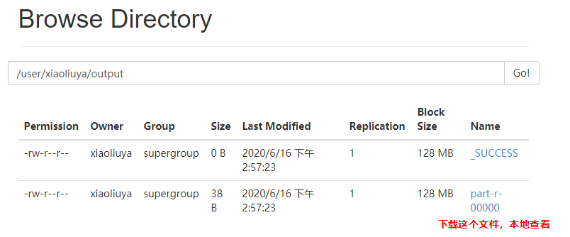

> （f）将测试文件内容下载到本地(浏览器下载也可以)

~~~shell
[xiaoliuya@CentOS72020Clone hadoop-2.7.2]$ hdfs dfs -get /user/xiaoliuya/output/part-r-00000 ./wcoutput/
~~~

> （g）删除输出结果

~~~shell
[xiaoliuya@CentOS72020Clone hadoop-2.7.2]$ hdfs dfs -rm -r /user/xiaoliuya/output
~~~

#### 4.2.2 启动YARN并运行MapReduce程序

1. 分析

​    （1）配置集群在YARN上运行MR

​    （2）启动、测试集群增、删、查

​    （3）在YARN上执行WordCount案例

2. 执行步骤    

**（1）配置集群**

> （a）配置yarn-env.sh

配置一下JAVA_HOME，好像也不需要配置

~~~shell
export JAVA_HOME=/opt/module/jdk1.8.0_251
~~~

> （b）配置yarn-site.xml

~~~xml
<!-- Reducer获取数据的方式 shuffle-->
<property>
   <name>yarn.nodemanager.aux-services</name>
   <value>mapreduce_shuffle</value>
</property>
 
<!-- 指定YARN的ResourceManager的地址，放在哪个服务器 -->
<property>
	<name>yarn.resourcemanager.hostname</name>
	<value>CentOS72020Clone</value>
</property>
~~~

> （c）配置：mapred-env.sh

配置一下JAVA_HOME

~~~shell
export JAVA_HOME=/opt/module/jdk1.8.0_251
~~~

> （d）配置： (对mapred-site.xml.template重新命名为) mapred-site.xml

~~~xml
[xiaoliuya@CentOS72020Clone hadoop]$ mv mapred-site.xml.template mapred-site.xml
[xiaoliuya@CentOS72020Clone hadoop]$ vim mapred-site.xml
<!-- 指定MR运行在YARN上 -->
<property>
    <name>mapreduce.framework.name</name>
    <value>yarn</value>
</property>
~~~

**（2）启动集群**

> （a）启动前必须保证NameNode和DataNode已经启动

> （b）启动ResourceManager

~~~shell
[xiaoliuya@CentOS72020Clone hadoop-2.7.2]$ sbin/yarn-daemon.sh start resourcemanager
~~~

> （c）启动NodeManager

~~~shell
[xiaoliuya@CentOS72020Clone hadoop-2.7.2]$ sbin/yarn-daemon.sh start nodemanager
~~~

**（3）集群操作**

> （a）YARN的浏览器页面查看:http://centos72020clone:8088/cluster
>
> ​	或者：http://192.168.10.13:8088/

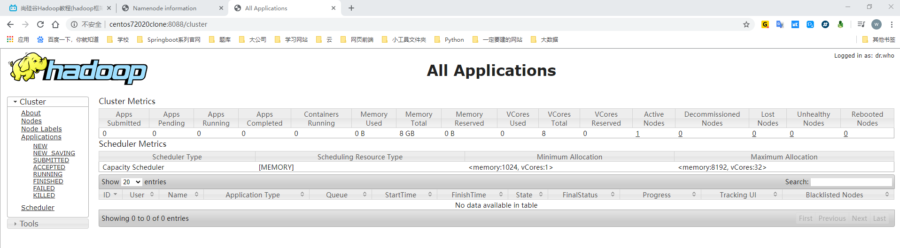

> （b）删除文件系统上的output文件

~~~shell
[xiaoliuya@CentOS72020Clone hadoop-2.7.2]$ bin/hdfs dfs -rm -r /user/xiaoliuya/output
~~~

> （c）执行MapReduce程序

~~~shell
[xiaoliuya@CentOS72020Clone hadoop-2.7.2]$ hadoop jar share/hadoop/mapreduce/hadoop-mapreduce-examples-2.7.2.jar wordcount /user/xiaoliuya/input /user/xiaoliuya/output
~~~

> （d）查看运行结果

~~~shell
[xiaoliuya@CentOS72020Clone hadoop-2.7.2]$ bin/hdfs dfs -cat /user/atguigu/output/*
~~~

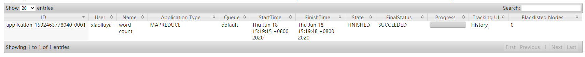

#### 4.2.3 配置历史服务器

为了查看程序的历史运行情况，需要配置一下历史服务器。具体配置步骤如下：

1. 配置mapred-site.xml

~~~shell
[xiaoliuya@CentOS72020Clone hadoop]$ vim mapred-site.xml
~~~

在该文件里面增加如下配置

~~~xml
<!-- 历史服务器端地址 -->
<property>
    <name>mapreduce.jobhistory.address</name>
    <value>CentOS72020Clone:10020</value>
</property>
<!-- 历史服务器web端地址 -->
<property>
    <name>mapreduce.jobhistory.webapp.address</name>
    <value>CentOS72020Clone:19888</value>
</property>
~~~

2. 启动历史服务器

~~~shell
[xiaoliuya@CentOS72020Clone hadoop-2.7.2]$ sbin/mr-jobhistory-daemon.sh start historyserver
~~~

3. 查看历史服务器是否启动

~~~shell
[xiaoliuya@CentOS72020Clone hadoop-2.7.2]$ jps
~~~

4. 查看JobHistory

http://centos72020clone:19888/jobhistory

#### 4.2.4 配置日志的聚集

日志聚集概念：应用运行完成以后，将程序运行日志信息上传到HDFS系统上。

日志聚集功能好处：可以方便的查看到程序运行详情，方便开发调试。

**注意：开启日志聚集功能，需要重新启动NodeManager 、ResourceManager和HistoryManager。**

开启日志聚集功能具体步骤如下：

1. 配置yarn-site.xml

~~~shell
[xiaoliuya@CentOS72020Clone hadoop]$ vim yarn-site.xml
~~~

在该文件里面增加如下配置

~~~xml
<!-- 日志聚集功能使能 -->
<property>
<name>yarn.log-aggregation-enable</name>
<value>true</value>
</property>
<!-- 日志保留时间设置7天 -->
<property>
<name>yarn.log-aggregation.retain-seconds</name>
<value>604800</value>
</property>
~~~

2. 关闭NodeManager 、ResourceManager和HistoryManager

~~~shell
[xiaoliuya@CentOS72020Clone hadoop-2.7.2]$ sbin/yarn-daemon.sh stop resourcemanager
[xiaoliuya@CentOS72020Clone hadoop-2.7.2]$ sbin/yarn-daemon.sh stop nodemanager
[xiaoliuya@CentOS72020Clone hadoop-2.7.2]$ sbin/mr-jobhistory-daemon.sh stop historyserver
~~~

3. 启动NodeManager 、ResourceManager和HistoryManager

~~~shell
[xiaoliuya@CentOS72020Clone hadoop-2.7.2]$ sbin/yarn-daemon.sh start resourcemanager
[xiaoliuya@CentOS72020Clone hadoop-2.7.2]$ sbin/yarn-daemon.sh start nodemanager
[xiaoliuya@CentOS72020Clone hadoop-2.7.2]$ sbin/mr-jobhistory-daemon.sh start historyserver
~~~

4. 删除HDFS上已经存在的输出文件

~~~shell
[xiaoliuya@CentOS72020Clone hadoop-2.7.2]$ bin/hdfs dfs -rm -R /user/xiaoliuya/output
~~~

5. 执行WordCount程序

~~~shell
[xiaoliuya@CentOS72020Clone hadoop-2.7.2]$ hadoop jar
 share/hadoop/mapreduce/hadoop-mapreduce-examples-2.7.2.jar wordcount /user/xiaoliuya/input /user/xiaoliuya/output
~~~

6. 查看日志

http://centos72020clone:19888/jobhistory/logs

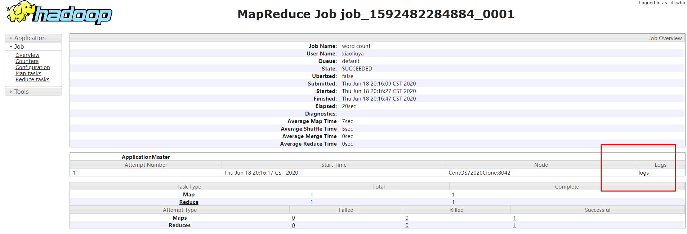

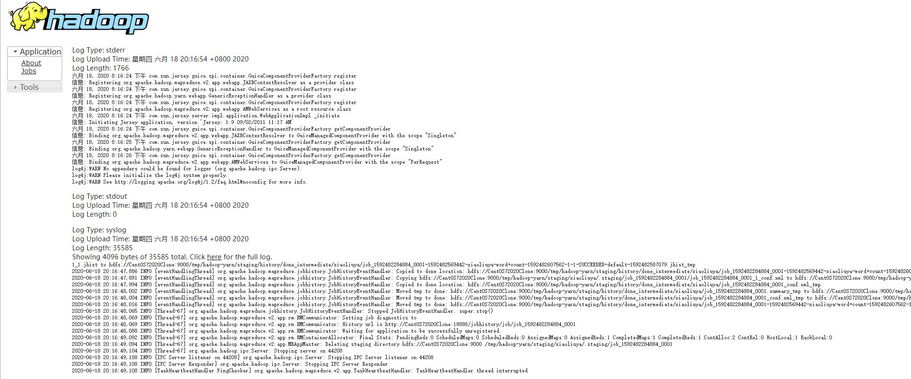

#### 4.2.5 配置文件说明

Hadoop配置文件分两类：默认配置文件和自定义配置文件，只有用户想修改某一默认配置值时，才需要修改自定义配置文件，更改相应属性值。

（1）默认配置文件：

| 要获取的默认文件     | 文件存放在Hadoop的jar包中的位置                             |
| -------------------- | ----------------------------------------------------------- |
| [core-default.xml]   | hadoop-common-2.7.2.jar/  core-default.xml                  |
| [hdfs-default.xml]   | hadoop-hdfs-2.7.2.jar/  hdfs-default.xml                    |
| [yarn-default.xml]   | hadoop-yarn-common-2.7.2.jar/  yarn-default.xml             |
| [mapred-default.xml] | hadoop-mapreduce-client-core-2.7.2.jar/  mapred-default.xml |

（2）自定义配置文件：

**core-site.xml、hdfs-site.xml、yarn-site.xml、mapred-site.xml**四个配置文件存放在$HADOOP_HOME/etc/hadoop这个路径上，用户可以根据项目需求重新进行修改配置。

### 4.3 完全分布式运行模式（开发重点）


