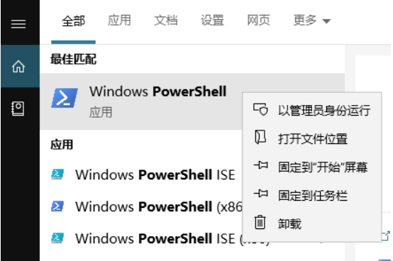
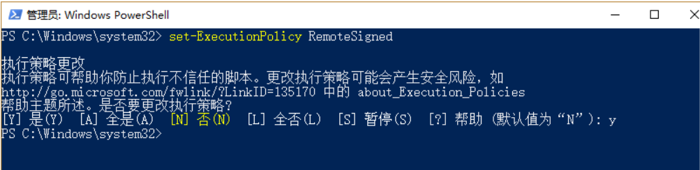
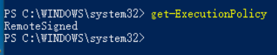

::: tip 出现此问题
PowerShell yarn : 无法加载文件 C:\Users\Admin\AppData\Roaming\npm\yarn.ps1,因为在此系统因为在此系统上禁止运行脚本。
:::

<!-- ::: tip 以下步骤进行 -->
- 1、搜索powershell，右键以管理员身份运行

- 2、运行cmd，执行：set-ExecutionPolicy RemoteSigned

- 3、查看执行策略：get-ExecutionPolicy 

- 4、关闭命令窗口 即可
<!-- ::: -->