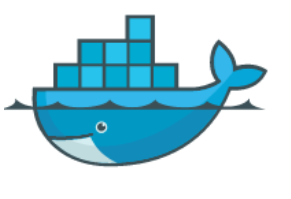
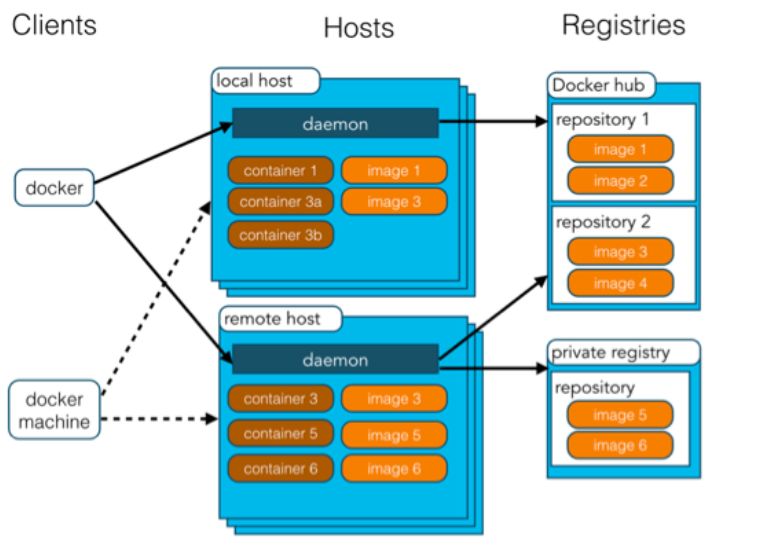
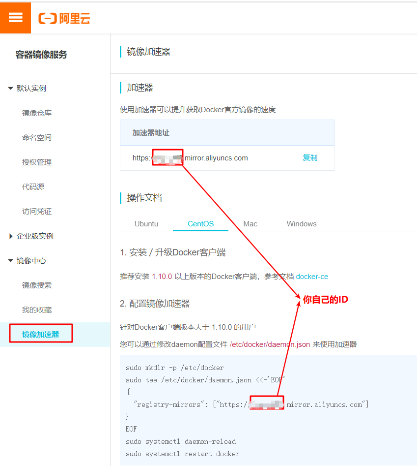

## Docker概述

### Docker 简介

Docker 是一个开源的应用容器引擎，基于 [Go 语言](https://www.runoob.com/go/go-tutorial.html) 并遵从 Apache2.0 协议开源。

Docker 可以让开发者打包他们的应用以及依赖包到一个轻量级、可移植的容器中，然后发布到任何流行的 Linux 机器上，也可以实现虚拟化。

容器是完全使用沙箱机制，相互之间不会有任何接口（类似 iPhone 的 app）,更重要的是容器性能开销极低。

Docker 从 17.03 版本之后分为 CE（Community Edition: 社区版） 和 EE（Enterprise Edition: 企业版），我们用社区版就可以了。

#### **Docker的应用场景：**

- Web 应用的自动化打包和发布。
- 自动化测试和持续集成、发布。
- 在服务型环境中部署和调整数据库或其他的后台应用。
- 从头编译或者扩展现有的 OpenShift 或 Cloud Foundry 平台来搭建自己的 PaaS 环境。

#### **Docker 的优点：**

Docker 是一个用于开发，交付和运行应用程序的开放平台。Docker 使您能够将应用程序与基础架构分开，从而可以快速交付软件。借助 Docker，您可以与管理应用程序相同的方式来管理基础架构。通过利用 Docker 的方法来快速交付，测试和部署代码，您可以大大减少编写代码和在生产环境中运行代码之间的延迟。

**1、快速，一致地交付您的应用程序**

Docker 允许开发人员使用您提供的应用程序或服务的本地容器在标准化环境中工作，从而简化了开发的生命周期。

容器非常适合持续集成和持续交付（CI / CD）工作流程，请考虑以下示例方案：

- 您的开发人员在本地编写代码，并使用 Docker 容器与同事共享他们的工作。
- 他们使用 Docker 将其应用程序推送到测试环境中，并执行自动或手动测试。
- 当开发人员发现错误时，他们可以在开发环境中对其进行修复，然后将其重新部署到测试环境中，以进行测试和验证。
- 测试完成后，将修补程序推送给生产环境，就像将更新的镜像推送到生产环境一样简单。

**2、响应式部署和扩展**

Docker 是基于容器的平台，允许高度可移植的工作负载。Docker 容器可以在开发人员的本机上，数据中心的物理或虚拟机上，云服务上或混合环境中运行。

Docker 的可移植性和轻量级的特性，还可以使您轻松地完成动态管理的工作负担，并根据业务需求指示，实时扩展或拆除应用程序和服务。

**3、在同一硬件上运行更多工作负载**

Docker 轻巧快速。它为基于虚拟机管理程序的虚拟机提供了可行、经济、高效的替代方案，因此您可以利用更多的计算能力来实现业务目标。Docker 非常适合于高密度环境以及中小型部署，而您可以用更少的资源做更多的事情。

#### 相关链接

Docker 官网：[https://www.docker.com](https://www.docker.com/)

Github Docker 源码：https://github.com/docker/docker-ce

Docker Hub 公共仓库：[https://hub.docker.com](https://hub.docker.com/)

---

### Docker 架构

Docker 基本概念:

- **docker主机(Host)**：安装了Docker程序的机器（Docker直接安装在操作系统之上），用于执行 Docker 守护进程和容器。
- **docker客户端(Client)**：连接docker主机进行操作；

- **docker镜像（Image）**：Docker 镜像（Image），就相当于是一个 root 文件系统。比如官方镜像 ubuntu:16.04 就包含了完整的一套 Ubuntu16.04 最小系统的 root 文件系统。

- **docker容器（Container）**：镜像（Image）和容器（Container）的关系，就像是面向对象程序设计中的类和实例一样，镜像是静态的定义，容器是镜像运行时的实体。容器可以被创建、启动、停止、删除、暂停等。

  容器是独立运行的一个或一组应用，是镜像运行时的实体。

- **docker仓库（Repository）**：仓库可看着一个代码控制中心，用来保存镜像。

Docker 使用客户端-服务器 (C/S) 架构模式，使用远程API来管理和创建Docker容器。

Docker 容器通过 Docker 镜像来创建。

容器与镜像的关系类似于面向对象编程中的对象与类。

| Docker | 面向对象 |
| :----- | :------- |
| 容器   | 对象     |
| 镜像   | 类       |



**使用Docker的步骤：**

1）、安装Docker

2）、去Docker仓库找到这个软件对应的镜像；

3）、使用Docker运行这个镜像，这个镜像就会生成一个Docker容器；

4）、对容器的启动停止就是对软件的启动停止；

---

## Docker 安装与卸载

### 在CentOS上安装Docker Engine

docker官方文档：[https://docs.docker.com/engine/install/centos/](https://docs.docker.com/engine/install/centos/)

#### **操作系统要求**

- CentOS 7
- CentOS 8
- 更高版本...

#### **卸载旧版本**

较旧的Docker版本称为`docker`或`docker-engine`。如果已安装这些程序，请卸载它们以及相关的依赖项。

```shell
$ sudo yum remove docker \
                  docker-client \
                  docker-client-latest \
                  docker-common \
                  docker-latest \
                  docker-latest-logrotate \
                  docker-logrotate \
                  docker-engine
```

如果`yum`报告未安装这些软件包，则可以。Docker Engine软件包现在称为`docker-ce`。

#### 使用存储库安装

在新主机上首次安装 Docker Engine-Community 之前，需要设置 Docker 仓库。之后，您可以从仓库安装和更新 Docker。

**设置存储库**

安装`yum-utils`软件包（提供`yum-config-manager` 实用程序）并设置稳定的存储库。

```shell
$ sudo yum install -y yum-utils

$ sudo yum-config-manager \
    --add-repo \
    https://download.docker.com/linux/centos/docker-ce.repo
```

**安装DOCKER引擎**

安装*最新版本*的Docker Engine和容器

```shell
$ sudo yum install docker-ce docker-ce-cli containerd.io
```

**启动 Docker**

```shell
$ sudo systemctl start docker
```

**通过运行 hello-world 映像来验证是否正确安装了 Docker Engine-Community **

```shell
$ sudo docker run hello-world
```

---

### 镜像加速器

使用加速器可以提升获取Docker官方镜像的速度

1、要先注册阿里云账号的哈！

2、关于加速器的地址，您登录[容器镜像服务控制台](https://cr.console.aliyun.com/)后左侧的加速器帮助页面就会显示为您独立分配的加速地址。

3、配置镜像加速器：根据自己的文档来操作即可




---

### 卸载Docker

1. 卸载Docker Engine，CLI和Containerd软件包：

   ```shell
   $ sudo yum remove docker-ce docker-ce-cli containerd.io
   ```

2. 主机上的映像，容器，卷或自定义配置文件不会自动删除。要删除所有图像，容器和卷：

   ```shell
   $ sudo rm -rf /var/lib/docker
   ```

   您必须手动删除所有已编辑的配置文件。

---

## Docker使用

### 镜像操作

