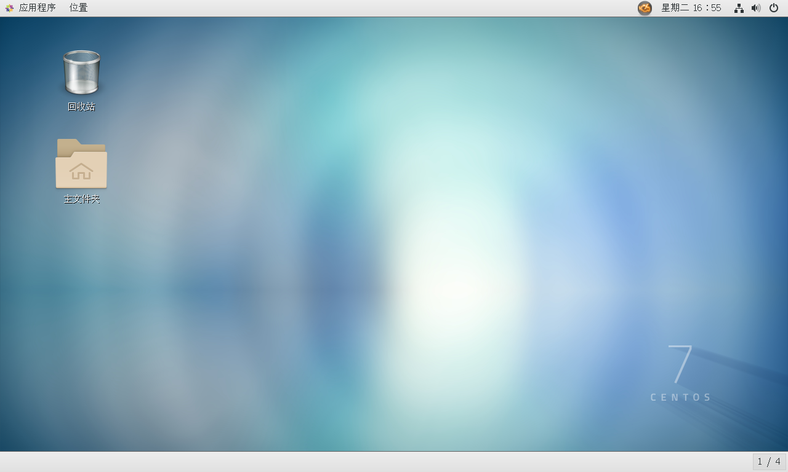

## Linux入门概述

这个课程基于CentOS 7学习！

Linux 一切皆文件：文件就是 读、写、（权限）

学习方式：

1、认识Linux

2、基本的命令（重点：Git讲了一些基本的命令（文件操作、目录管理、文件属性、Vim编辑器、账号管理、磁盘管理。。。。））

3、软件的安装和部署！（java、tomcat、docker）

​		Linux--Redis--Docker

### Linux简介

- 
  Linux 内核最初只是由芬兰人林纳斯·托瓦兹（Linus Torvalds）在赫尔辛基大学上学时出于个人爱好而编写的。

- Linux 是一套免费使用和自由传播的类 Unix 操作系统，是一个基于 POSIX 和 UNIX 的多用户、多任务、支持多线程和多 CPU 的操作系统。

- Linux 能运行主要的 UNIX 工具软件、应用程序和网络协议。它支持 32 位和 64 位硬件。Linux 继承了 Unix 以网络为核心的设计思想，是一个性能稳定的多用户网络操作系统。


### Linux 的发行版

Linux 的发行版说简单点就是将 Linux 内核与应用软件做一个打包。


目前市面上较知名的发行版有：Ubuntu、RedHat、CentOS、Debian、Fedora、SuSE、OpenSUSE、Arch Linux、SolusOS 等。


### Linux 应用领域

今天各种场合都有使用各种 Linux 发行版，从嵌入式设备到超级计算机，并且在服务器领域确定了地位，通常服务器使用 LAMP（Linux + Apache + MySQL + PHP）或 LNMP（Linux + Nginx+ MySQL + PHP）组合。

目前 Linux 不仅在家庭与企业中使用，并且在政府中也很受欢迎。

- 巴西联邦政府由于支持 Linux 而世界闻名。
- 有新闻报道俄罗斯军队自己制造的 Linux 发布版的，做为 G.H.ost 项目已经取得成果。
- 印度的 Kerala 联邦计划在向全联邦的高中推广使用 Linux。
- 中华人民共和国为取得技术独立，在龙芯处理器中排他性地使用 Linux。
- 在西班牙的一些地区开发了自己的 Linux 发布版，并且在政府与教育领域广泛使用，如 Extremadura 地区的 gnuLinEx 和 Andalusia 地区的 Guadalinex。
- 葡萄牙同样使用自己的 Linux 发布版 Caixa Mágica，用于 Magalh?es 笔记本电脑和 e-escola 政府软件。
- 法国和德国同样开始逐步采用 Linux。

### Linux vs Windows

目前国内 Linux 更多的是应用于服务器上，而桌面操作系统更多使用的是 Windows。主要区别如下

| 比较     | Windows                                                      | Linux                                                        |
| :------- | :----------------------------------------------------------- | :----------------------------------------------------------- |
| 界面     | 界面统一，外壳程序固定所有 Windows 程序菜单几乎一致，快捷键也几乎相同 | 图形界面风格依发布版不同而不同，可能互不兼容。GNU/Linux 的终端机是从 UNIX 传承下来，基本命令和操作方法也几乎一致。 |
| 驱动程序 | 驱动程序丰富，版本更新频繁。默认安装程序里面一般包含有该版本发布时流行的硬件驱动程序，之后所出的新硬件驱动依赖于硬件厂商提供。对于一些老硬件，如果没有了原配的驱动有时很难支持。另外，有时硬件厂商未提供所需版本的 Windows 下的驱动，也会比较头痛。 | 由志愿者开发，由 Linux 核心开发小组发布，很多硬件厂商基于版权考虑并未提供驱动程序，尽管多数无需手动安装，但是涉及安装则相对复杂，使得新用户面对驱动程序问题（是否存在和安装方法）会一筹莫展。但是在开源开发模式下，许多老硬件尽管在Windows下很难支持的也容易找到驱动。HP、Intel、AMD 等硬件厂商逐步不同程度支持开源驱动，问题正在得到缓解。 |
| 使用     | 使用比较简单，容易入门。图形化界面对没有计算机背景知识的用户使用十分有利。 | 图形界面使用简单，容易入门。文字界面，需要学习才能掌握。     |
| 学习     | 系统构造复杂、变化频繁，且知识、技能淘汰快，深入学习困难。   | 系统构造简单、稳定，且知识、技能传承性好，深入学习相对容易。 |
| 软件     | 每一种特定功能可能都需要商业软件的支持，需要购买相应的授权。 | 大部分软件都可以自由获取，同样功能的软件选择较少。           |

## 环境搭建

> 两种选择：VMware虚拟机 或者 阿里云服务器

### VMware本地安装CentOS7

1、VMware下载安装（收费，注册码（网上搜一个））

VMware Workstation15
官方下载地址： [https://www.vmware.com/cn/products/workstation-pro/workstation-pro-evaluation.html](https://www.vmware.com/cn/products/workstation-pro/workstation-pro-evaluation.html)


完成安装后有如下界面：


2、下载CentOS7镜像，在虚拟机上安装

CentOS7镜像下载：阿里云站点：[http://mirrors.aliyun.com/centos/7/isos/x86_64/](http://mirrors.aliyun.com/centos/7/isos/x86_64/)


3、打开后的样子



注：详细安装教程请看[虚拟机安装CentOS7镜像](../paper/虚拟机安装CentOS7镜像.md)

### 阿里云服务器

> [购买阿里云服务器]()

服务器一般不会关机！

1、阿里云购买服务器：[https://www.aliyun.com/?spm=5176.13735996.fszjobuve.2.461b3b5aCK3bsd](https://www.aliyun.com/?spm=5176.13735996.fszjobuve.2.461b3b5aCK3bsd)

2、购买完毕后，获取服务器的ip地址，重置服务器密码，就可以远程登录了。

关于安全组，以后截图说明

3、下载[Xshell工具](https://xshell.en.softonic.com/)和[Xftp工具](https://www.netsarang.com/zh/all-downloads/)，进行远程连接使用

4、使用Xshell工具进行远程连接

 5、使用Xftp工具上传文件

## 走进Linux

### 开机登录

开机会启动许多程序。他们在Windows叫做“服务”（service），在linux就叫做“守护进程：（daemon）。

开机成功后，他会显示一个文本登录界面，这个界面就是我们经常看到的登录界面，在这份登录界面中会提示用户输入用户名，而用户输入的用户名作为参数传给login程序来验证用户的身份，密码是不显示的，输入回车即可！

一般来说，用户的登录方式有三种：

- 命令行登录
- ssh登录
- 图形界面登录

最高权限账户为root，可以操作一切~

### 关机

在linux领域内大多用在服务器上，很少遇到关机的操作。毕竟服务器上跑一个服务是永无止境的，除非特殊情况下，不得已才会关机。

正确的关机流程为：sync > shutdown > reboot > halt

关机指令为：shutdown ，你可以man shutdown 来看一下帮助文档。

例如你可以运行如下命令关机：

```shell
sync #将数据由内存同步到硬盘中。

shutdown #关机指令，你可以man shutdown 来看一下帮助文档。例如你可以运行如下命令关机：

shutdown –h 10 ‘This server will shutdown after 10 mins’ #这个命令告诉大家，计算机将在10分钟后关机，并且会显示在登陆用户的当前屏幕中。

shutdown –h now #立马关机

shutdown –h 20:25 #系统会在今天20:25关机

shutdown –h +10 #十分钟后关机

shutdown –r now #系统立马重启

shutdown –r +10 #系统十分钟后重启

reboot #就是重启，等同于 shutdown –r now

halt #关闭系统，等同于shutdown –h now 和 poweroff
```

最后总结一下，不管是重启系统还是关闭系统，首先要运行 **sync** 命令，把内存中的数据写到磁盘中。

关机的命令还有**init 0** , 重启系统的命令还有 **init 6**。

---

### 系统目录结构

登录系统后，在当前命令窗口下输入命令：

```shell
ls / 
```

你会看到如下图红框内所示:


树状目录结构：


**以下是对这些目录的解释：**

- **/bin**：bin是Binary的缩写, 这个目录存放着最经常使用的命令。

- **/boot：**这里存放的是启动Linux时使用的一些核心文件，包括一些连接文件以及镜像文件。

- **/dev ：**dev是Device(设备)的缩写, 该目录下存放的是Linux的外部设备，在Linux中访问设备的方式和访问文件的方式是相同的。

- **/etc：这个目录用来存放所有的系统管理所需要的配置文件和子目录。**

- **/home**：**用户的主目录，在Linux中，每个用户都有一个自己的目录，一般该目录名是以用户的账号命名的。**

- **/lib**：这个目录里存放着系统最基本的动态连接共享库，其作用类似于Windows里的DLL文件。几乎所有的应用程序都需要用到这些共享库。

- **/lost+found**：这个目录一般情况下是空的，当系统非法关机后，这里就存放了一些文件。

- **/media**：linux系统会自动识别一些设备，例如U盘、光驱等等，当识别后，linux会把识别的设备挂载到这个目录下。

- **/mnt**：系统提供该目录是为了让用户临时挂载别的文件系统的，我们可以将光驱挂载在/mnt/上，然后进入该目录就可以查看光驱里的内容了。

- **/opt**： **这是给主机额外安装软件所摆放的目录。比如你安装一个ORACLE数据库则就可以放到这个目录下。默认是空的。**

- **/proc**：这个目录是一个虚拟的目录，它是系统内存的映射，我们可以通过直接访问这个目录来获取系统信息。这个目录的内容不在硬盘上而是在内存里，我们也可以直接修改里面的某些文件，比如可以通过下面的命令来屏蔽主机的ping命令，使别人无法ping你的机器：

  ```
  echo 1 > /proc/sys/net/ipv4/icmp_echo_ignore_all
  ```

- **/root**：**该目录为系统管理员，也称作超级权限者的用户主目录。**

- **/sbin**：s就是Super User的意思，这里存放的是系统管理员使用的系统管理程序。

- **/selinux**： 这个目录是Redhat/CentOS所特有的目录，Selinux是一个安全机制，类似于windows的防火墙，但是这套机制比较复杂，这个目录就是存放selinux相关的文件的。

- **/srv**： 该目录存放一些服务启动之后需要提取的数据。

- **/sys**： 这是linux2.6内核的一个很大的变化。该目录下安装了2.6内核中新出现的一个文件系统 sysfs 。

  sysfs文件系统集成了下面3种文件系统的信息：针对进程信息的proc文件系统、针对设备的devfs文件系统以及针对伪终端的devpts文件系统。

  该文件系统是内核设备树的一个直观反映。

  当一个内核对象被创建的时候，对应的文件和目录也在内核对象子系统中被创建。

- **/tmp**：**这个目录是用来存放一些临时文件的，例如安装包，解压完就不用了。**

- **/usr**： **这是一个非常重要的目录，用户的很多应用程序和文件都放在这个目录下，类似于windows下的program files目录。**

- **/usr/bin：**系统用户使用的应用程序。

- **/usr/sbin：**超级用户使用的比较高级的管理程序和系统守护程序。

- **/usr/src：**内核源代码默认的放置目录。

- **/var**：这个目录中存放着在不断扩充着的东西，我们习惯将那些经常被修改的目录放在这个目录下。包括各种日志文件。

- **/run**：是一个临时文件系统，存储系统启动以来的信息。当系统重启时，这个目录下的文件应该被删掉或清除。如果你的系统上有 /var/run 目录，应该让它指向 run。

- **/www：存放服务器网站相关的资源，环境，网站的项目。**

---

## 常用的基本命令

### 文件目录管理

- **绝对路径：**
  路径的写法，由根目录 / 写起，例如： /usr/share/doc 这个目录。
- **相对路径：**
  路径的写法，不是由 / 写起，例如由 /usr/share/doc 要到 /usr/share/man 底下时，可以写成： cd ../man 这就是相对路径的写法啦！

---

#### 处理目录的常用命令

- ls: 列出目录
- cd：切换目录
- pwd：显示目前的目录
- mkdir：创建一个新的目录
- rmdir：删除一个空的目录
- cp: 复制文件或目录
- rm: 移除文件或目录
- mv: 移动文件与目录，或修改文件与目录的名称

#### ls (列出目录)

在Linux系统当中， ls 命令可能是最常被运行的。

选项与参数：

- -a ：全部的文件，连同隐藏文件( 开头为 . 的文件) 一起列出来(常用)
- -d ：仅列出目录本身，而不是列出目录内的文件数据(常用)
- -l ：长数据串列出，包含文件的属性与权限等等数据；(常用)

例：

~~~bash
ls -l
ls -al
~~~

#### cd (切换目录)

cd是Change Directory的缩写，这是用来变换工作目录的命令。

语法：

~~~bash
 cd [相对路径或绝对路径]
~~~

```bash
#使用 mkdir 命令创建 runoob 目录
[root@www ~]# mkdir runoob

#使用绝对路径切换到 runoob 目录
[root@www ~]# cd /root/runoob/

#使用相对路径切换到 runoob 目录
[root@www ~]# cd ./runoob/

# 表示回到自己的家目录，亦即是 /root 这个目录
[root@www runoob]# cd ~

# 表示去到目前的上一级目录，亦即是 /root 的上一级目录的意思；
[root@www ~]# cd ..
```

#### pwd (显示目前所在的目录)

pwd 是 **Print Working Directory** 的缩写，也就是显示目前所在目录的命令。

```bash
[root@www ~]# pwd [-P]
```

选项与参数：

- **-P** ：显示出确实的路径，而非使用连结 (link) 路径。

实例：单纯显示出目前的工作目录：

```bash
[root@www ~]# pwd
/root   <== 显示出目录啦～
```

实例显示出实际的工作目录，而非连结档本身的目录名而已。

```bash
[root@www ~]# cd /var/mail   <==注意，/var/mail是一个连结档
[root@www mail]# pwd
/var/mail         <==列出目前的工作目录
[root@www mail]# pwd -P
/var/spool/mail   <==怎么回事？有没有加 -P 差很多～
[root@www mail]# ls -ld /var/mail
lrwxrwxrwx 1 root root 10 Sep  4 17:54 /var/mail -> spool/mail
# 看到这里应该知道为啥了吧？因为 /var/mail 是连结档，连结到 /var/spool/mail 
# 所以，加上 pwd -P 的选项后，会不以连结档的数据显示，而是显示正确的完整路径啊！
```

#### mkdir (创建新目录)

如果想要创建新的目录的话，那么就使用mkdir (make directory)吧。

语法：

```bash
mkdir [-mp] 目录名称
```

选项与参数：

- -m ：配置文件的权限喔！直接配置，不需要看默认权限 (umask) 的脸色～
- -p ：帮助你直接将所需要的目录(包含上一级目录)递归创建起来！

实例：请到/tmp底下尝试创建数个新目录看看：

```bash
[root@www ~]# cd /tmp
[root@www tmp]# mkdir test    <==创建一名为 test 的新目录
[root@www tmp]# mkdir test1/test2/test3/test4
mkdir: cannot create directory `test1/test2/test3/test4': 
No such file or directory       <== 没办法直接创建此目录啊！
[root@www tmp]# mkdir -p test1/test2/test3/test4
```

加了这个 -p 的选项，可以自行帮你创建多层目录！

实例：创建权限为 **rwx--x--x** 的目录。

```bash
[root@www tmp]# mkdir -m 711 test2
[root@www tmp]# ls -l
drwxr-xr-x  3 root  root 4096 Jul 18 12:50 test
drwxr-xr-x  3 root  root 4096 Jul 18 12:53 test1
drwx--x--x  2 root  root 4096 Jul 18 12:54 test2
```

上面的权限部分，如果没有加上 -m 来强制配置属性，系统会使用默认属性。

如果我们使用 -m ，如上例我们给予 -m 711 来给予新的目录 drwx--x--x 的权限。

#### rmdir (删除空的目录)

语法：

```bash 
 rmdir [-p] 目录名称
```

选项与参数：

- **-p ：**连同上一级『空的』目录也一起删除

删除 runoob 目录

```bash
[root@www tmp]# rmdir runoob/
```

将 mkdir 实例中创建的目录(/tmp 底下)删除掉！

```bash
[root@www tmp]# ls -l   <==看看有多少目录存在？
drwxr-xr-x  3 root  root 4096 Jul 18 12:50 test
drwxr-xr-x  3 root  root 4096 Jul 18 12:53 test1 #test1下还有test2/test3/test4
drwx--x--x  2 root  root 4096 Jul 18 12:54 test2
[root@www tmp]# rmdir test   <==可直接删除掉，没问题
[root@www tmp]# rmdir test1  <==因为尚有内容，所以无法删除！
rmdir: `test1': Directory not empty
[root@www tmp]# rmdir -p test1/test2/test3/test4
[root@www tmp]# ls -l        <==您看看，底下的输出中test与test1不见了！
drwx--x--x  2 root  root 4096 Jul 18 12:54 test2
```

利用 -p 这个选项，立刻就可以将 test1/test2/test3/test4 一次删除。

不过要注意的是，这个 rmdir 仅能删除空的目录，你可以使用 rm 命令来删除非空目录。

#### cp (复制文件或目录)

cp 即拷贝文件和目录。

语法:

```bash
[root@www ~]# cp [-adfilprsu] 来源档(source) 目标档(destination)
[root@www ~]# cp [options] source1 source2 source3 .... directory
```

选项与参数：

- **-a：**相当于 -pdr 的意思，至于 pdr 请参考下列说明；(常用)
- **-d：**若来源档为连结档的属性(link file)，则复制连结档属性而非文件本身；
- **-f：**为强制(force)的意思，若目标文件已经存在且无法开启，则移除后再尝试一次；
- **-i：**若目标档(destination)已经存在时，在覆盖时会先询问动作的进行(常用)
- **-l：**进行硬式连结(hard link)的连结档创建，而非复制文件本身；
- **-p：**连同文件的属性一起复制过去，而非使用默认属性(备份常用)；
- **-r：**递归持续复制，用于目录的复制行为；(常用)
- **-s：**复制成为符号连结档 (symbolic link)，亦即『捷径』文件；
- **-u：**若 destination 比 source 旧才升级 destination ！

用 root 身份，将 root 目录下的 .bashrc 复制到 /tmp 下，并命名为 bashrc

```bash
[root@www ~]# cp ~/.bashrc /tmp/bashrc
[root@www ~]# cp -i ~/.bashrc /tmp/bashrc
cp: overwrite `/tmp/bashrc'? n  <==n不覆盖，y为覆盖
```

#### rm (移除文件或目录)

语法：

```bash
 rm [-fir] 文件或目录
```

选项与参数：

- -f ：就是 force 的意思，忽略不存在的文件，不会出现警告信息；
- -i ：互动模式，在删除前会询问使用者是否动作
- -r ：递归删除啊！最常用在目录的删除了！这是非常危险的选项！！！

将刚刚在 cp 的实例中创建的 bashrc 删除掉！

```bash
[root@www tmp]# rm -i bashrc
rm: remove regular file `bashrc'? y
```

如果加上 -i 的选项就会主动询问喔，避免你删除到错误的档名！

~~~bash
rm -rf / #系统中所有的文件就被删除，删除跑路就是这么操作的
~~~

#### mv (移动文件与目录，或修改名称)

语法：

```bash
[root@www ~]# mv [-fiu] source destination
[root@www ~]# mv [options] source1 source2 source3 .... directory
```

选项与参数：

- -f ：force 强制的意思，如果目标文件已经存在，不会询问而直接覆盖；
- -i ：若目标文件 (destination) 已经存在时，就会询问是否覆盖！
- -u ：若目标文件已经存在，且 source 比较新，才会升级 (update)

复制一文件，创建一目录，将文件移动到目录中

```bash
[root@www ~]# cd /tmp
[root@www tmp]# cp ~/.bashrc bashrc
[root@www tmp]# mkdir mvtest
[root@www tmp]# mv bashrc mvtest
```

将某个文件移动到某个目录去，就是这样做！

将刚刚的目录名称更名为 mvtest2

```bash
[root@www tmp]# mv mvtest mvtest2
```

---

### 文件内容查看

Linux系统中使用以下命令来查看文件的内容：

- cat 由第一行开始显示文件内容
- tac 从最后一行开始显示，可以看出 tac 是 cat 的倒着写！
- nl  显示的时候，顺道输出行号！
- more 一页一页的显示文件内容
- less 与 more 类似，但是比 more 更好的是，他可以往前翻页！
- head 只看头几行
- tail 只看尾巴几行

你可以使用 *man [命令]*来查看各个命令的使用文档，如 ：man cp。

#### cat

由第一行开始显示文件内容

语法：

```bash
cat [-AbEnTv]
```

选项与参数：

- -A ：相当于 -vET 的整合选项，可列出一些特殊字符而不是空白而已；
- -b ：列出行号，仅针对非空白行做行号显示，空白行不标行号！
- -E ：将结尾的断行字节 $ 显示出来；
- -n ：列印出行号，连同空白行也会有行号，与 -b 的选项不同；
- -T ：将 [tab] 按键以 ^I 显示出来；
- -v ：列出一些看不出来的特殊字符

检看 /etc/issue 这个文件的内容：

```bash
[root@www ~]# cat /etc/issue
CentOS release 6.4 (Final)
Kernel \r on an \m
```

#### tac

tac与cat命令刚好相反，文件内容从最后一行开始显示，可以看出 tac 是 cat 的倒着写！如：

```bash
[root@www ~]# tac /etc/issue

Kernel \r on an \m
CentOS release 6.4 (Final)
```

#### nl

显示行号

语法：

```bash
nl [-bnw] 文件
```

选项与参数：

- -b ：指定行号指定的方式，主要有两种：
  -b a ：表示不论是否为空行，也同样列出行号(类似 cat -n)；
  -b t ：如果有空行，空的那一行不要列出行号(默认值)；
- -n ：列出行号表示的方法，主要有三种：
  -n ln ：行号在荧幕的最左方显示；
  -n rn ：行号在自己栏位的最右方显示，且不加 0 ；
  -n rz ：行号在自己栏位的最右方显示，且加 0 ；
- -w ：行号栏位的占用的位数。

实例一：用 nl 列出 /etc/issue 的内容

```bash
[root@www ~]# nl /etc/issue
     1  CentOS release 6.4 (Final)
     2  Kernel \r on an \m
```

#### more

一页一页翻动

```bash
[root@www ~]# more /etc/man_db.config 
#
# Generated automatically from man.conf.in by the
# configure script.
#
# man.conf from man-1.6d
....(中间省略)....
--More--(28%)  <== 重点在这一行喔！你的光标也会在这里等待你的命令
```

在 more 这个程序的运行过程中，你有几个按键可以按的：

- 空白键 (space)：代表向下翻一页；
- Enter     ：代表向下翻『一行』；
- /字串     ：代表在这个显示的内容当中，向下搜寻『字串』这个关键字；
- :f      ：立刻显示出档名以及目前显示的行数；
- q       ：代表立刻离开 more ，不再显示该文件内容。
- b 或 [ctrl]-b ：代表往回翻页，不过这动作只对文件有用，对管线无用。

#### less

一页一页翻动，以下实例输出/etc/man.config文件的内容：

```bash
[root@www ~]# less /etc/man.config
#
# Generated automatically from man.conf.in by the
# configure script.
#
# man.conf from man-1.6d
....(中间省略)....
:   <== 这里可以等待你输入命令！
```

less运行时可以输入的命令有：

- 空白键  ：向下翻动一页；
- [pagedown]：向下翻动一页；
- [pageup] ：向上翻动一页；
- /字串   ：向下搜寻『字串』的功能；
- ?字串   ：向上搜寻『字串』的功能；
- n     ：重复前一个搜寻 (与 / 或 ? 有关！)
- N     ：反向的重复前一个搜寻 (与 / 或 ? 有关！)
- q     ：离开 less 这个程序；

#### head

取出文件前面几行

语法：

```bash
head [-n number] 文件 
```

选项与参数：

- -n ：后面接数字，代表显示几行的意思

```bash
[root@www ~]# head /etc/man.config
```

默认的情况中，显示前面 10 行！若要显示前 20 行，就得要这样：

```bash
[root@www ~]# head -n 20 /etc/man.config
```

#### tail

取出文件后面几行

语法：

```bash
tail [-n number] 文件 
```

选项与参数：

- -n ：后面接数字，代表显示几行的意思
- -f ：表示持续侦测后面所接的档名，要等到按下[ctrl]-c才会结束tail的侦测

```shell
[root@www ~]# tail /etc/man.config
# 默认的情况中，显示最后的十行！若要显示最后的 20 行，就得要这样：
[root@www ~]# tail -n 20 /etc/man.config
```

---

### 文件基本属性

#### 文件类型和权限

Linux系统是一种典型的多用户系统，不同的用户处于不同的地位，拥有不同的权限。为了保护系统的安全性，Linux系统对不同的用户访问同一文件（包括目录文件）的权限做了不同的规定。

在Linux中我们可以使用`ll`或者`ls –l`命令来显示一个文件的属性以及文件所属的用户和组，如：

```shell
[root@www /]# ls -l
total 64
dr-xr-xr-x   2 root root 4096 Dec 14  2012 bin
dr-xr-xr-x   4 root root 4096 Apr 19  2012 boot
……
```

实例中，bin文件的第一个属性用"d"表示。"d"在Linux中代表该文件是一个目录文件。

在Linux中第一个字符代表这个文件是目录、文件或链接文件等等。

- **当为[ d ]则是目录**
- **当为[ - ]则是文件；**
- **若是[ l ]则表示为链接文档(link file)；**
- 若是[ **b** ]则表示为装置文件里面的可供储存的接口设备(可随机存取装置)；
- 若是[ **c** ]则表示为装置文件里面的串行端口设备，例如键盘、鼠标(一次性读取装置)。

接下来的字符中，以三个为一组，且均为『rwx』 的三个参数的组合。其中，[ r ]代表可读(read)、[ w ]代表可写(write)、[ x ]代表可执行(execute)。 要注意的是，这三个权限的位置不会改变，如果没有权限，就会出现减号[ - ]而已。

每个文件的属性由左边第一部分的10个字符来确定（如下图）。


从左至右用0-9这些数字来表示。

第0位确定文件类型，第1-3位确定属主（该文件的所有者）拥有该文件的权限。

第4-6位确定属组（所有者的同组用户）拥有该文件的权限，第7-9位确定其他用户拥有该文件的权限。

**其中，第1、4、7位表示读权限，如果用"r"字符表示，则有读权限，如果用"-"字符表示，则没有读权限；**

**第2、5、8位表示写权限，如果用"w"字符表示，则有写权限，如果用"-"字符表示没有写权限；**

**第3、6、9位表示可执行权限，如果用"x"字符表示，则有执行权限，如果用"-"字符表示，则没有执行权限。**

---

#### 文件属主和属组


---

#### 更改文件属性

**1、chgrp：更改文件属组**

语法：

```shell
chgrp [-R] 属组名 文件名
```

参数选项

- -R：递归更改文件属组，就是在更改某个目录文件的属组时，如果加上-R的参数，那么该目录下的所有文件的属组都会更改。

**2、chown：更改文件属主，也可以同时更改文件属组**

语法：

```shell
chown [–R] 属主名 文件名
chown [-R] 属主名：属组名 文件名
```

进入 /root 目录（~）将install.log的拥有者改为bin这个账号：

```shell
[root@www ~] cd ~
[root@www ~]# chown bin install.log
[root@www ~]# ls -l
-rw-r--r--  1 bin  users 68495 Jun 25 08:53 install.log
```

将install.log的拥有者与群组改回为root：

```shell
[root@www ~]# chown root:root install.log
[root@www ~]# ls -l
-rw-r--r--  1 root root 68495 Jun 25 08:53 install.log
```

**3、chmod：更改文件9个属性（重要，必须掌握）**

Linux文件属性有两种设置方法，一种是数字，一种是符号。

> 先用数字来改变文件权限（常用）

Linux文件的基本权限就有九个，分别是owner/group/others三种身份各有自己的read/write/execute权限。

先复习一下刚刚上面提到的数据：文件的权限字符为：『-rwxrwxrwx』， 这九个权限是三个三个一组的！其中，我们可以使用数字来代表各个权限，各权限的分数对照表如下：

- r:4
- w:2
- x:1

每种身份(owner/group/others)各自的三个权限(r/w/x)分数是需要累加的，例如当权限为： [-rwxrwx---] 分数则是：

- owner = rwx = 4+2+1 = 7
- group = rwx = 4+2+1 = 7
- others= --- = 0+0+0 = 0

所以等一下我们设定权限的变更时，该文件的权限数字就是770啦！变更权限的指令chmod的语法是这样的：

```shell
 chmod [-R] xyz 文件或目录
```

选项与参数：

- xyz : 就是刚刚提到的数字类型的权限属性，为 rwx 属性数值的相加。
- -R : 进行递归(recursive)的持续变更，亦即连同次目录下的所有文件都会变更

举例来说，如果要将.bashrc这个文件所有的权限都设定启用，那么命令如下：

```shell
[root@www ~]# ls -al .bashrc
-rw-r--r--  1 root root 395 Jul  4 11:45 .bashrc
[root@www ~]# chmod 777 .bashrc
[root@www ~]# ls -al .bashrc
-rwxrwxrwx  1 root root 395 Jul  4 11:45 .bashrc
```

那如果要将权限变成 *-rwxr-xr--* 呢？那么权限的分数就成为 [4+2+1][4+0+1][4+0+0]=754。

> 用符号来改变文件权限

还有一个改变权限的方法，从之前的介绍中我们可以发现，基本上就九个权限分别是：

- (1)user
- (2)group
- (3)others

那么我们就可以使用 **u, g, o** 来代表三种身份的权限！

此外， **a** 则代表 **all**，即全部的身份。

读写的权限可以写成 **r, w, x**，

**+（加入），-（除去），=（设定）**

如果我们需要将文件权限设置为 **-rwxr-xr--** ，可以使用 **chmod u=rwx,g=rx,o=r 文件名** 来设定:

```shell
touch test1    # 创建 test1 文件
ls -al test1   # 查看 test1 默认权限
-rw-r--r-- 1 root root 0 Nov 15 10:32 test1
chmod u=rwx,g=rx,o=r  test1    # 修改 test1 权限
ls -al test1
-rwxr-xr-- 1 root root 0 Nov 15 10:32 test1
```

而如果是要将权限去掉而不改变其他已存在的权限呢？例如要拿掉全部人的可执行权限，则：

```shell
chmod  a-x test1
ls -al test1
-rw-r--r-- 1 root root 0 Nov 15 10:32 test1
```

#### 拓展：Linux 链接的概念

Linux上的链接分为两种：硬链接、软链接！默认情况下，`ln `命令产生硬链接。

**硬链接：**

硬连接指通过索引节点来进行连接。在 Linux 的文件系统中，保存在磁盘分区中的文件不管是什么类型都给它分配一个编号，称为索引节点号(Inode Index)。在 Linux 中，多个文件名指向同一索引节点是存在的。比如：A 是 B 的硬链接（A 和 B 都是文件名），则 A 的目录项中的 inode 节点号与 B 的目录项中的 inode 节点号相同，即一个 inode 节点对应两个不同的文件名，两个文件名指向同一个文件，A 和 B 对文件系统来说是完全平等的。删除其中任何一个都不会影响另外一个的访问。

硬连接的作用是允许一个文件拥有多个有效路径名，这样用户就可以建立硬连接到重要文件，以防止“误删”的功能。其原因如上所述，因为对应该目录的索引节点有一个以上的连接。只删除一个连接并不影响索引节点本身和其它的连接，只有当最后一个连接被删除后，文件的数据块及目录的连接才会被释放。也就是说，文件真正删除的条件是与之相关的所有硬连接文件均被删除。

**软链接：**

另外一种连接称之为符号连接（Symbolic Link），也叫软连接。软链接文件有类似于 Windows 的快捷方式。它实际上是一个特殊的文件。在符号连接中，文件实际上是一个文本文件，其中包含的有另一文件的位置信息。比如：A 是 B 的软链接（A 和 B 都是文件名），A 的目录项中的 inode 节点号与 B 的目录项中的 inode 节点号不相同，A 和 B 指向的是两个不同的 inode，继而指向两块不同的数据块。但是 A 的数据块中存放的只是 B 的路径名（可以根据这个找到 B 的目录项）。A 和 B 之间是“主从”关系，如果 B 被删除了，A 仍然存在（因为两个是不同的文件），但指向的是一个无效的链接。

**通过实验加深理解**

```shell 
[oracle@Linux]$ touch f1          #创建一个测试文件f1
[oracle@Linux]$ ln f1 f2          #创建f1的一个硬连接文件f2
[oracle@Linux]$ ln -s f1 f3       #创建f1的一个符号连接文件f3
[oracle@Linux]$ ls -li            # -i参数显示文件的inode节点信息
total 0
9797648 -rw-r--r--  2 oracle oinstall 0 Apr 21 08:11 f1
9797648 -rw-r--r--  2 oracle oinstall 0 Apr 21 08:11 f2
9797649 lrwxrwxrwx  1 oracle oinstall 2 Apr 21 08:11 f3 -> f1
```

从上面的结果中可以看出，硬连接文件 f2 与原文件 f1 的 inode 节点相同，均为 9797648，然而符号连接文件的 inode 节点不同。

```shell
[oracle@Linux]$ echo "I am f1 file" >>f1
[oracle@Linux]$ cat f1
I am f1 file
[oracle@Linux]$ cat f2
I am f1 file
[oracle@Linux]$ cat f3
I am f1 file
[oracle@Linux]$ rm -f f1
[oracle@Linux]$ cat f2
I am f1 file
[oracle@Linux]$ cat f3
cat: f3: No such file or directory
```

通过上面的测试可以看出：当删除原始文件 f1 后，硬连接 f2 不受影响，但是符号连接 f1 文件无效

**总结**

依此您可以做一些相关的测试，可以得到以下全部结论：

-  **1).删除符号连接f3,对f1,f2无影响；**
-  **2).删除硬连接f2，对f1,f3也无影响；**
-  **3).删除原文件f1，对硬连接f2没有影响，导致符号连接f3失效；**
-  **4).同时删除原文件f1,硬连接f2，整个文件会真正的被删除。**

---

## Vim 编辑器

### 什么是 vim？

Vim是从 vi 发展出来的一个**文本编辑器**。代码补完、编译及错误跳转等方便编程的功能特别丰富，在程序员中被广泛使用。

简单的来说， vi 是老式的字处理器，不过功能已经很齐全了，但是还是有可以进步的地方。

 vim 则可以说是程序开发者的一项很好用的工具。

连 vim 的官方网站 ([http://www.vim.org](http://www.vim.org/)) 自己也说 vim 是一个程序开发工具而不是文字处理软件。

Vim通过一些插件可以实现和IDE一样的功能！

vim 键盘图：


---

### vim 的使用

基本上 vi/vim 共分为三种模式，分别是**命令模式（Command mode）**，**输入模式（Insert mode）**和**底线命令模式（Last line mode）**。 这三种模式的作用分别是：

#### 命令模式：

**用户刚刚启动 vi/vim，便进入了命令模式。**

此状态下敲击键盘动作会被Vim识别为命令，而非输入字符。比如我们此时按下i，并不会输入一个字符，i被当作了一个命令。

以下是常用的几个命令：

- **i** 切换到输入模式，以输入字符。
- **x** 删除当前光标所在处的字符。
- **:** 切换到底线命令模式，以在最底一行输入命令。

若想要编辑文本：启动Vim，进入了命令模式，按下i，切换到输入模式。

命令模式只有一些最基本的命令，因此仍要依靠底线命令模式输入更多命令。

#### 输入模式：

**在命令模式下按下`i `就进入了输入模式。**

在输入模式中，可以使用以下按键：

- **字符按键以及Shift组合**，输入字符
- **ENTER**，回车键，换行
- **BACK SPACE**，退格键，删除光标前一个字符
- **DEL**，删除键，删除光标后一个字符
- **方向键**，在文本中移动光标
- **HOME**/**END**，移动光标到行首/行尾
- **Page Up**/**Page Down**，上/下翻页
- **Insert**，切换光标为输入/替换模式，光标将变成竖线/下划线
- **ESC**，退出输入模式，切换到命令模式

#### 底线命令模式：

**在命令模式下按下`:`（英文冒号）就进入了底线命令模式。**

底线命令模式可以输入单个或多个字符的命令，可用的命令非常多。

在底线命令模式中，基本的命令有（已经省略了冒号）：

- q 退出程序
- w 保存文件

按ESC键可随时退出底线命令模式。

简单的说，我们可以将这三个模式想成底下的图标来表示：


---

### vim 使用实例

**使用 vi/vim 进入一般模式**

如果你想要使用 vim 来建立一个名为 runoob.txt 的文件时，你可以这样做：

```shell
$ vim runoob.txt
```

直接输入` vim 文件名 `就能够进入 vim 的命令模式了。请注意，记得 vim 后面一定要加文件名，不管该文件存在与否！


**按下 `i `进入输入模式(也称为编辑模式)，开始编辑文字**

在命令模式之中，只要按下` i, o, a `等字符就可以进入输入模式了！

在编辑模式当中，你可以发现在左下角状态栏中会出现 –INSERT- 的字样，那就是可以输入任意字符的提示。

这个时候，键盘上除了 **Esc** 这个按键之外，其他的按键都可以视作为一般的输入按钮了，所以你可以进行任何的编辑。


**按下 ESC 按钮回到一般模式**

好了，假设我已经按照上面的样式给他编辑完毕了，那么应该要如何退出呢？是的！没错！就是给他按下 **Esc** 这个按钮即可！马上你就会发现画面左下角的 – INSERT – 不见了！

**在命令模式中按下 :wq 储存后离开 vim**


OK! 这样我们就成功创建了一个 runoob.txt 的文件。

---

### vi/vim 按键说明

除了上面简易范例的 i, Esc, :wq 之外，其实 vim 还有非常多的按键可以使用。

**第一部分：一般模式（命令模式）可用的光标移动、复制粘贴、搜索替换等**

| 移动光标的方法     |                      |
| :----------------- | -------------------- |
| h 或 向左箭头键(←) | 光标向左移动一个字符 |
| j 或 向下箭头键(↓) | 光标向下移动一个字符 |
| k 或 向上箭头键(↑) | 光标向上移动一个字符 |
| l 或 向右箭头键(→) | 光标向右移动一个字符 |

如果你将右手放在键盘上的话，你会发现 hjkl 是排列在一起的，因此可以使用这四个按钮来移动光标。 如果想要进行多次移动的话，例如向下移动 30 行，可以使用 "30j" 或 "30↓" 的组合按键， 亦即加上想要进行的次数(数字)后，按下动作即可！

| 移动光标的方法   |                                                              |
| :--------------- | ------------------------------------------------------------ |
| [Ctrl] + [f]     | 屏幕『向下』移动一页，相当于 [Page Down]按键 (常用)          |
| [Ctrl] + [b]     | 屏幕『向上』移动一页，相当于 [Page Up] 按键 (常用)           |
| [Ctrl] + [d]     | 屏幕『向下』移动半页                                         |
| [Ctrl] + [u]     | 屏幕『向上』移动半页                                         |
| +                | 光标移动到非空格符的下一行                                   |
| -                | 光标移动到非空格符的上一行                                   |
| 数字+空格        | 例如 20 。按下数字后再按空格键，光标会向右移动这一行的 n 个字符。例如 20+空格 则光标会向后面移动 20 个字符距离。 |
| 0 或功能键[Home] | 这是数字『 0 』：移动到这一行的最前面字符处 (常用)           |
| $ 或功能键[End]  | 移动到这一行的最后面字符处(常用)                             |
| H                | 光标移动到这个屏幕的最上方那一行的第一个字符                 |
| M                | 光标移动到这个屏幕的中央那一行的第一个字符                   |
| L                | 光标移动到这个屏幕的最下方那一行的第一个字符                 |
| G                | 移动到这个档案的最后一行(常用)                               |
| nG               | n 为数字。移动到这个档案的第 n 行。例如 20G 则会移动到这个档案的第 20 行(可配合 :set nu) |
| gg               | 移动到这个档案的第一行，相当于 1G 啊！ (常用)                |
| 数字+确定键      | n 为数字。光标向下移动 n 行(常用)                            |

| 搜索替换                                                     |                                                              |
| :----------------------------------------------------------- | ------------------------------------------------------------ |
| /word                                                        | 向光标之下寻找一个名称为 word 的字符串。例如要在档案内搜寻 vbird 这个字符串，就输入 /vbird 即可！ (常用) |
| ?word                                                        | 向光标之上寻找一个字符串名称为 word 的字符串。               |
| n                                                            | 这个 n 是英文按键。代表重复前一个搜寻的动作。举例来说， 如果刚刚我们执行 /vbird 去向下搜寻 vbird 这个字符串，则按下 n 后，会向下继续搜寻下一个名称为 vbird 的字符串。如果是执行 ?vbird 的话，那么按下 n 则会向上继续搜寻名称为 vbird 的字符串！ |
| N                                                            | 这个 N 是英文按键。与 n 刚好相反，为『反向』进行前一个搜寻动作。 例如 /vbird 后，按下 N 则表示『向上』搜寻 vbird 。 |
| 使用 /word 配合 n 及 N 是非常有帮助的！可以让你重复的找到一些你搜寻的关键词！ |                                                              |
| :n1,n2s/word1/word2/g                                        | n1 与 n2 为数字。在第 n1 与 n2 行之间寻找 word1 这个字符串，并将该字符串取代为 word2 ！举例来说，在 100 到 200 行之间搜寻 vbird 并取代为 VBIRD 则： 『:100,200s/vbird/VBIRD/g』。(常用) |
| **:1,$s/word1/word2/g** 或 **:%s/word1/word2/g**             | 从第一行到最后一行寻找 word1 字符串，并将该字符串取代为 word2 ！(常用) |
| **:1,$s/word1/word2/gc** 或 **:%s/word1/word2/gc**           | 从第一行到最后一行寻找 word1 字符串，并将该字符串取代为 word2 ！且在取代前显示提示字符给用户确认 (confirm) 是否需要取代！(常用) |

| 删除、复制与贴上                                             |                                                              |
| :----------------------------------------------------------- | ------------------------------------------------------------ |
| x, X                                                         | 在一行字当中，x 为向后删除一个字符 (相当于 [del] 按键)， X 为向前删除一个字符(相当于 [backspace] 亦即是退格键) (常用) |
| nx                                                           | n 为数字，连续向后删除 n 个字符。举例来说，我要连续删除 10 个字符， 『10x』。 |
| dd                                                           | 删除游标所在的那一整行(常用)                                 |
| ndd                                                          | n 为数字。删除光标所在的向下 n 行，例如 20dd 则是删除 20 行 (常用) |
| d1G                                                          | 删除光标所在到第一行的所有数据                               |
| dG                                                           | 删除光标所在到最后一行的所有数据                             |
| d$                                                           | 删除游标所在处，到该行的最后一个字符                         |
| d0                                                           | 那个是数字的 0 ，删除游标所在处，到该行的最前面一个字符      |
| yy                                                           | 复制游标所在的那一行(常用)                                   |
| nyy                                                          | n 为数字。复制光标所在的向下 n 行，例如 20yy 则是复制 20 行(常用) |
| y1G                                                          | 复制游标所在行到第一行的所有数据                             |
| yG                                                           | 复制游标所在行到最后一行的所有数据                           |
| y0                                                           | 复制光标所在的那个字符到该行行首的所有数据                   |
| y$                                                           | 复制光标所在的那个字符到该行行尾的所有数据                   |
| p, P                                                         | p 为将已复制的数据在光标下一行贴上，P 则为贴在游标上一行！ 举例来说，我目前光标在第 20 行，且已经复制了 10 行数据。则按下 p 后， 那 10 行数据会贴在原本的 20 行之后，亦即由 21 行开始贴。但如果是按下 P 呢？ 那么原本的第 20 行会被推到变成 30 行。 (常用) |
| J                                                            | 将光标所在行与下一行的数据结合成同一行                       |
| c                                                            | 重复删除多个数据，例如向下删除 10 行，[ 10cj ]               |
| u                                                            | 复原前一个动作。(常用)                                       |
| [Ctrl]+r                                                     | 重做上一个动作。(常用)                                       |
| 这个 u 与 [Ctrl]+r 是很常用的指令！一个是复原，另一个则是重做一次～ 利用这两个功能按键，你的编辑，嘿嘿！很快乐的啦！ |                                                              |
| .                                                            | 不要怀疑！这就是小数点！意思是重复前一个动作的意思。 如果你想要重复删除、重复贴上等等动作，按下小数点『.』就好了！ (常用) |

**第二部分：一般模式切换到编辑模式的可用的按钮说明**

| 进入输入或取代的编辑模式                                     |                                                              |
| :----------------------------------------------------------- | ------------------------------------------------------------ |
| i, I                                                         | 进入输入模式(Insert mode)： i 为『从目前光标所在处输入』， I 为『在目前所在行的第一个非空格符处开始输入』。 (常用) |
| a, A                                                         | 进入输入模式(Insert mode)： a 为『从目前光标所在的下一个字符处开始输入』， A 为『从光标所在行的最后一个字符处开始输入』。(常用) |
| o, O                                                         | 进入输入模式(Insert mode)： 这是英文字母 o 的大小写。o 为『在目前光标所在的下一行处输入新的一行』； O 为在目前光标所在处的上一行输入新的一行！(常用) |
| r, R                                                         | 进入取代模式(Replace mode)： r 只会取代光标所在的那一个字符一次；R会一直取代光标所在的文字，直到按下 ESC 为止；(常用) |
| 上面这些按键中，在 vi 画面的左下角处会出现『--INSERT--』或『--REPLACE--』的字样。 由名称就知道该动作了吧！！特别注意的是，我们上面也提过了，你想要在档案里面输入字符时， 一定要在左下角处看到 INSERT 或 REPLACE 才能输入喔！ |                                                              |
| [Esc]                                                        | 退出编辑模式，回到一般模式中(常用)                           |

**第三部分：一般模式切换到指令行模式的可用的按钮说明**

| 指令行的储存、离开等指令                                     |                                                              |
| :----------------------------------------------------------- | ------------------------------------------------------------ |
| :w                                                           | 将编辑的数据写入硬盘档案中(常用)                             |
| :w!                                                          | 若文件属性为『只读』时，强制写入该档案。不过，到底能不能写入， 还是跟你对该档案的档案权限有关啊！ |
| :q                                                           | 离开 vi (常用)                                               |
| :q!                                                          | 若曾修改过档案，又不想储存，使用 ! 为强制离开不储存档案。    |
| 注意一下啊，那个惊叹号 (!) 在 vi 当中，常常具有『强制』的意思～ |                                                              |
| :wq                                                          | 储存后离开，若为 :wq! 则为强制储存后离开 (常用)              |
| ZZ                                                           | 这是大写的 Z 喔！若档案没有更动，则不储存离开，若档案已经被更动过，则储存后离开！ |
| :w [filename]                                                | 将编辑的数据储存成另一个档案（类似另存新档）                 |
| :r [filename]                                                | 在编辑的数据中，读入另一个档案的数据。亦即将 『filename』 这个档案内容加到游标所在行后面 |
| :n1,n2 w [filename]                                          | 将 n1 到 n2 的内容储存成 filename 这个档案。                 |
| :! command                                                   | 暂时离开 vi 到指令行模式下执行 command 的显示结果！例如 『:! ls /home』即可在 vi 当中察看 /home 底下以 ls 输出的档案信息！ |

| vim 环境的变更 |                                                    |
| :------------- | -------------------------------------------------- |
| :set nu        | 显示行号，设定之后，会在每一行的前缀显示该行的行号 |
| :set nonu      | 与 set nu 相反，为取消行号！                       |

特别注意，在 vi/vim 中，数字是很有意义的！数字通常代表重复做几次的意思！ 也有可能是代表去到第几个什么什么的意思。

举例来说，要删除 50 行，则是用 『50dd』 对吧！ 数字加在动作之前，如我要向下移动 20 行呢？那就是『20j』或者是『20↓』即可。

---

## 用户账号和用户组管理

Linux系统是一个多用户多任务的分时操作系统，任何一个要使用系统资源的用户，都必须首先向系统管理员申请一个账号，然后以这个账号的身份进入系统。

用户的账号一方面可以帮助系统管理员对使用系统的用户进行跟踪，并控制他们对系统资源的访问；另一方面也可以帮助用户组织文件，并为用户提供安全性保护。

每个用户账号都拥有一个唯一的用户名和各自的口令。

用户在登录时键入正确的用户名和口令后，就能够进入系统和自己的主目录。

实现用户账号的管理，要完成的工作主要有如下几个方面：

- 用户账号的添加、删除与修改。
- 用户口令的管理。
- 用户组的管理。

### Linux系统用户账号的管理

用户账号的管理工作主要涉及到用户账号的添加、修改和删除。

添加用户账号就是在系统中创建一个新账号，然后为新账号分配用户号、用户组、主目录和登录Shell等资源。

刚添加的账号是被锁定的，无法使用。

**1、添加新的用户账号使用useradd命令，其语法如下：**

```shell
useradd 选项 用户名
```

参数说明：

- 选项:

  - -m 自动创建这个用户的主目录 /home/liuwenjie
  - -c comment 指定一段注释性描述。
  - -d 目录 指定用户主目录，如果此目录不存在，则同时使用-m选项，可以创建主目录。
  - -g 用户组 指定用户所属的用户组。
  - -G 用户组，用户组 指定用户所属的附加组。
  - -s Shell文件 指定用户的登录Shell。
  - -u 用户号 指定用户的用户号，如果同时有-o选项，则可以重复使用其他用户的标识号。

- 用户名:

  指定新账号的登录名。

**经常使用：**

~~~shell
useradd -m liuwenjie
~~~

**实例1**

```shell
# useradd –d  /home/sam -m sam
```

此命令创建了一个用户sam，其中-d和-m选项用来为登录名sam产生一个主目录 /home/sam（/home为默认的用户主目录所在的父目录）。

~~**实例2**~~        没看懂，不常用，所以删除线

```shell
# useradd -s /bin/sh -g group –G adm,root gem
```

~~此命令新建了一个用户gem，该用户的登录Shell是 `/bin/sh`，它属于group用户组，同时又属于adm和root用户组，其中group用户组是其主组。~~

~~这里可能新建组：`#groupadd group及groupadd adm`~~

~~增加用户账号就是在/etc/passwd文件中为新用户增加一条记录，同时更新其他系统文件如/etc/shadow, /etc/group等。~~

~~Linux提供了集成的系统管理工具userconf，它可以用来对用户账号进行统一管理。~~

**2、删除帐号**

如果一个用户的账号不再使用，可以从系统中删除。删除用户账号就是要将/etc/passwd等系统文件中的该用户记录删除，必要时还删除用户的主目录。

删除一个已有的用户账号使用`userdel`命令，其格式如下：

```shell
userdel 选项 用户名
```

常用的选项是 **-r**，它的作用是把用户的主目录一起删除。

```shell
# userdel -r sam
```

此命令删除用户sam在系统文件中（主要是/etc/passwd, /etc/shadow, /etc/group等）的记录，同时删除用户的主目录。

**3、修改帐号**

修改用户账号就是根据实际情况更改用户的有关属性，如用户号、主目录、用户组、登录Shell等。

修改已有用户的信息使用`usermod`命令，其格式如下：

```shell
usermod 选项 用户名
```

常用的选项包括`-c, -d, -m, -g, -G, -s, -u以及-o等`，这些选项的意义与`useradd`命令中的选项一样，可以为用户指定新的资源值。

另外，有些系统可以使用选项：`-l `新用户名

这个选项指定一个新的账号，即将原来的用户名改为新的用户名。

例如：

```
# usermod -s /bin/ksh -d /home/z –g developer sam
```

此命令将用户sam的登录Shell修改为ksh，主目录改为/home/z，用户组改为developer。

**4、切换用户**

现在是root用户


1. 切换用户的命令为：su username  【username是你的用户名】
2. 从普通用户切换到root用户，换可以使用命令：sudo su
3. 在终端输入exit或logout或只用快捷方式ctrl+d，可以退回到原来的用户，其实ctrl+d也是执行的exit命令
4. 在切换用户时，如果想在切换用户之后使用新用户的工作环境，可以在su和username之间加-，例如：su - root

- $表示普通用户
- #表示超级用户，也就是root用户


**5、修改密码（用户口令的管理）**

用户管理的一项重要内容是用户口令的管理。用户账号刚创建时没有口令，但是被系统锁定，无法使用，必须为其指定口令后才可以使用，即使是指定空口令。

指定和修改用户口令的Shell命令是`passwd`。超级用户可以为自己和其他用户指定口令，普通用户只能用它修改自己的口令。命令的格式为：

```shell
passwd 选项 用户名
```

可使用的选项：

- -l 锁定口令，即禁用账号。
- -u 口令解锁。
- -d 使账号无口令。
- -f 强迫用户下次登录时修改口令。

如果默认用户名，则修改当前用户的口令。

例如，假设当前用户是sam，则下面的命令修改该用户自己的口令：

```shell
$ passwd 
Old password:****** 
New password:******* 
Re-enter new password:*******
```

如果是超级用户，可以用下列形式指定任何用户的口令：

```shell
# passwd sam 
New password:******* 
Re-enter new password:*******
```

普通用户修改自己的口令时，passwd命令会先询问原口令，验证后再要求用户输入两遍新口令，如果两次输入的口令一致，则将这个口令指定给用户；而超级用户为用户指定口令时，就不需要知道原口令。

为了系统安全起见，用户应该选择比较复杂的口令，例如最好使用8位长的口令，口令中包含有大写、小写字母和数字，并且应该与姓名、生日等不相同。

为用户指定空口令时，执行下列形式的命令：

```shell
# passwd -d sam
```

此命令将用户 sam 的口令删除，这样用户 sam 下一次登录时，系统就不再允许该用户登录了。

passwd 命令**还**可以用 -l(lock) 选项锁定某一用户，使其不能登录，例如：

```shell
# passwd -l sam
```

---

### Linux系统用户组的管理

每个用户都有一个用户组，系统可以对一个用户组中的所有用户进行集中管理。不同Linux 系统对用户组的规定有所不同，如Linux下的用户属于与它同名的用户组，这个用户组在创建用户时同时创建。

用户组的管理涉及用户组的添加、删除和修改。组的增加、删除和修改实际上就是对/etc/group文件的更新。

 **1、增加一个新的用户组使用groupadd命令。其格式如下：**

```shell
groupadd 选项 用户组
```

可以使用的选项有：

- -g GID 指定新用户组的组标识号（GID）。
- -o 一般与-g选项同时使用，表示新用户组的GID可以与系统已有用户组的GID相同。

> 例1：此命令向系统中增加一个新组group1，新组的组标识号是在当前已有的最大组标识号的基础上加1。

```shell
# groupadd group1
```

> 例2：此命令向系统中增加了一个新组group2，同时指定新组的组标识号是101。

```shell
# groupadd -g 101 group2
```

**2、如果要删除一个已有的用户组，使用groupdel命令，其格式如下：**

```shell
groupdel 用户组
```

> 例：从系统中删除组group1。

```shell
# groupdel group1
```

**3、修改用户组的属性使用groupmod命令。其语法如下：**

```shell
groupmod 选项 用户组
```

常用的选项有：

- -g GID 为用户组指定新的组标识号。
- -o 与-g选项同时使用，用户组的新GID可以与系统已有用户组的GID相同。
- -n新用户组 将用户组的名字改为新名字

> 例1：此命令将组group2的组标识号修改为102。

```shell
# groupmod -g 102 group2
```

> 例2：此命令将组group2的标识号改为10000，组名修改为group3。

```shell
# groupmod –g 10000 -n group3 group2
```

**4、如果一个用户同时属于多个用户组，那么用户可以在用户组之间切换，以便具有其他用户组的权限。**

用户可以在登录后，使用命令newgrp切换到其他用户组，这个命令的参数就是目的用户组。例如：

```shell
$ newgrp root
```

这条命令将当前用户切换到root用户组，前提条件是root用户组确实是该用户的主组或附加组。类似于用户账号的管理，用户组的管理也可以通过集成的系统管理工具来完成。

---

### 与用户账号有关的系统文件

完成用户管理的工作有许多种方法，但是每一种方法实际上都是对有关的系统文件进行修改。

与用户和用户组相关的信息都存放在一些系统文件中，这些文件包括**/etc/passwd, /etc/shadow, /etc/group**等。

下面分别介绍这些文件的内容。

#### **1、/etc/passwd文件是用户管理工作涉及的最重要的一个文件**

Linux系统中的每个用户都在/etc/passwd文件中有一个对应的记录行，它记录了这个用户的一些基本属性。

这个文件对所有用户都是可读的。它的内容类似下面的例子：

~~~shell
[root@xiaoliuya /]# cat /etc/passwd
root:x:0:0:root:/root:/bin/bash
bin:x:1:1:bin:/bin:/sbin/nologin
daemon:x:2:2:daemon:/sbin:/sbin/nologin
adm:x:3:4:adm:/var/adm:/sbin/nologin
lp:x:4:7:lp:/var/spool/lpd:/sbin/nologin
sync:x:5:0:sync:/sbin:/bin/sync
shutdown:x:6:0:shutdown:/sbin:/sbin/shutdown
halt:x:7:0:halt:/sbin:/sbin/halt
mail:x:8:12:mail:/var/spool/mail:/sbin/nologin
operator:x:11:0:operator:/root:/sbin/nologin
games:x:12:100:games:/usr/games:/sbin/nologin
ftp:x:14:50:FTP User:/var/ftp:/sbin/nologin
nobody:x:99:99:Nobody:/:/sbin/nologin
systemd-network:x:192:192:systemd Network Management:/:/sbin/nologin
dbus:x:81:81:System message bus:/:/sbin/nologin
polkitd:x:999:998:User for polkitd:/:/sbin/nologin
sshd:x:74:74:Privilege-separated SSH:/var/empty/sshd:/sbin/nologin
postfix:x:89:89::/var/spool/postfix:/sbin/nologin
chrony:x:998:996::/var/lib/chrony:/sbin/nologin
nscd:x:28:28:NSCD Daemon:/:/sbin/nologin
tcpdump:x:72:72::/:/sbin/nologin
ntp:x:38:38::/etc/ntp:/sbin/nologin
www:x:1000:1000::/home/www:/sbin/nologin
~~~

从上面的例子我们可以看到，/etc/passwd中一行记录对应着一个用户，每行记录又被冒号(:)分隔为7个字段，其格式和具体含义如下：

```shell
用户名:口令:用户标识号:组标识号:注释性描述:主目录:登录Shell
```

**1."用户名"是代表用户账号的字符串。**

通常长度不超过8个字符，并且由大小写字母和/或数字组成。登录名中不能有冒号(:)，因为冒号在这里是分隔符。

为了兼容起见，登录名中最好不要包含点字符(.)，并且不使用连字符(-)和加号(+)打头。

**2.“口令”一些系统中，存放着加密后的用户口令字。**

虽然这个字段存放的只是用户口令的加密串，不是明文，但是由于/etc/passwd文件对所有用户都可读，所以这仍是一个安全隐患。因此，现在许多Linux 系统（如SVR4）都使用了shadow技术，**把真正的加密后的用户口令字存放到/etc/shadow文件中**，而在/etc/passwd文件的口令字段中只存放一个特殊的字符，例如“x”或者“*”。

**3.“用户标识号”是一个整数，系统内部用它来标识用户。**

一般情况下它与用户名是一一对应的。如果几个用户名对应的用户标识号是一样的，系统内部将把它们视为同一个用户，但是它们可以有不同的口令、不同的主目录以及不同的登录Shell等。

通常用户标识号的取值范围是0～65 535。0是超级用户root的标识号，1～99由系统保留，作为管理账号，普通用户的标识号从100开始。在Linux系统中，这个界限是500。

**4.“组标识号”字段记录的是用户所属的用户组。**

它对应着/etc/group文件中的一条记录。

**5.“注释性描述”字段记录着用户的一些个人情况。**

例如用户的真实姓名、电话、地址等，这个字段并没有什么实际的用途。在不同的Linux 系统中，这个字段的格式并没有统一。在许多Linux系统中，这个字段存放的是一段任意的注释性描述文字，用做finger命令的输出。

**6.“主目录”，也就是用户的起始工作目录。**

它是用户在登录到系统之后所处的目录。在大多数系统中，各用户的主目录都被组织在同一个特定的目录下，而用户主目录的名称就是该用户的登录名。各用户对自己的主目录有读、写、执行（搜索）权限，其他用户对此目录的访问权限则根据具体情况设置。

**7.用户登录后，要启动一个进程，负责将用户的操作传给内核，这个进程是用户登录到系统后运行的命令解释器或某个特定的程序，即Shell。**

Shell是用户与Linux系统之间的接口。Linux的Shell有许多种，每种都有不同的特点。常用的有sh(Bourne Shell), csh(C Shell), ksh(Korn Shell), tcsh(TENEX/TOPS-20 type C Shell), bash(Bourne Again Shell)等。

系统管理员可以根据系统情况和用户习惯为用户指定某个Shell。如果不指定Shell，那么系统使用sh为默认的登录Shell，即这个字段的值为/bin/sh。

用户的登录Shell也可以指定为某个特定的程序（此程序不是一个命令解释器）。

利用这一特点，我们可以限制用户只能运行指定的应用程序，在该应用程序运行结束后，用户就自动退出了系统。有些Linux 系统要求只有那些在系统中登记了的程序才能出现在这个字段中。

**8.系统中有一类用户称为伪用户（pseudo users）**

这些用户在/etc/passwd文件中也占有一条记录，但是不能登录，因为它们的登录Shell为空。它们的存在主要是方便系统管理，满足相应的系统进程对文件属主的要求。

常见的伪用户如下所示：

```shell
伪 用 户 含 义 
bin 拥有可执行的用户命令文件 
sys 拥有系统文件 
adm 拥有帐户文件 
uucp UUCP使用 
lp lp或lpd子系统使用 
nobody NFS使用
```

#### 2、/etc/shadow文件存放加密后的口令

**1、除了上面列出的伪用户外，还有许多标准的伪用户，例如：audit, cron, mail, usenet等，它们也都各自为相关的进程和文件所需要。**

由于/etc/passwd文件是所有用户都可读的，如果用户的密码太简单或规律比较明显的话，一台普通的计算机就能够很容易地将它破解，因此对安全性要求较高的Linux系统都把加密后的口令字分离出来，单独存放在一个文件中，这个文件是/etc/shadow文件。 有超级用户才拥有该文件读权限，这就保证了用户密码的安全性。

**2、/etc/shadow中的记录行与/etc/passwd中的一一对应，它由pwconv命令根据/etc/passwd中的数据自动产生**

它的文件格式与/etc/passwd类似，由若干个字段组成，字段之间用":"隔开。这些字段是：

```
登录名:加密口令:最后一次修改时间:最小时间间隔:最大时间间隔:警告时间:不活动时间:失效时间:标志
```

1. "登录名"是与/etc/passwd文件中的登录名相一致的用户账号
2. "口令"字段存放的是加密后的用户口令字，长度为13个字符。如果为空，则对应用户没有口令，登录时不需要口令；如果含有不属于集合 { ./0-9A-Za-z }中的字符，则对应的用户不能登录。
3. "最后一次修改时间"表示的是从某个时刻起，到用户最后一次修改口令时的天数。时间起点对不同的系统可能不一样。例如在SCO Linux 中，这个时间起点是1970年1月1日。
4. "最小时间间隔"指的是两次修改口令之间所需的最小天数。
5. "最大时间间隔"指的是口令保持有效的最大天数。
6. "警告时间"字段表示的是从系统开始警告用户到用户密码正式失效之间的天数。
7. "不活动时间"表示的是用户没有登录活动但账号仍能保持有效的最大天数。
8. "失效时间"字段给出的是一个绝对的天数，如果使用了这个字段，那么就给出相应账号的生存期。期满后，该账号就不再是一个合法的账号，也就不能再用来登录了。

下面是/etc/shadow的一个例子：

```shell
＃ cat /etc/shadow

root:Dnakfw28zf38w:8764:0:168:7:::
daemon:*::0:0::::
bin:*::0:0::::
sys:*::0:0::::
adm:*::0:0::::
uucp:*::0:0::::
nuucp:*::0:0::::
auth:*::0:0::::
cron:*::0:0::::
listen:*::0:0::::
lp:*::0:0::::
sam:EkdiSECLWPdSa:9740:0:0::::
```

#### 3、用户组的所有信息都存放在/etc/group文件中

将用户分组是Linux 系统中对用户进行管理及控制访问权限的一种手段。

每个用户都属于某个用户组；一个组中可以有多个用户，一个用户也可以属于不同的组。

当一个用户同时是多个组中的成员时，在/etc/passwd文件中记录的是用户所属的主组，也就是登录时所属的默认组，而其他组称为附加组。

用户要访问属于附加组的文件时，必须首先使用newgrp命令使自己成为所要访问的组中的成员。

用户组的所有信息都存放在/etc/group文件中。此文件的格式也类似于/etc/passwd文件，由冒号(:)隔开若干个字段，这些字段有：

```shell
组名:口令:组标识号:组内用户列表
```

1. "组名"是用户组的名称，由字母或数字构成。与/etc/passwd中的登录名一样，组名不应重复。
2. "口令"字段存放的是用户组加密后的口令字。一般Linux 系统的用户组都没有口令，即这个字段一般为空，或者是*。
3. "组标识号"与用户标识号类似，也是一个整数，被系统内部用来标识组。
4. "组内用户列表"是属于这个组的所有用户的列表/b]，不同用户之间用逗号(,)分隔。这个用户组可能是用户的主组，也可能是附加组。

/etc/group文件的一个例子如下：

```shell
root::0:root
bin::2:root,bin
sys::3:root,uucp
adm::4:root,adm
daemon::5:root,daemon
lp::7:root,lp
users::20:root,sam
```

---

## 磁盘管理

Linux磁盘管理好坏直接关系到整个系统的性能问题。

Linux磁盘管理常用三个命令为df、du和fdisk。

- df：列出文件系统的整体磁盘使用量
- du：检查磁盘空间使用量
- fdisk：用于磁盘分区

---

### **df**

df命令参数功能：检查文件系统的磁盘空间占用情况。可以利用该命令来获取硬盘被占用了多少空间，目前还剩下多少空间等信息。

语法：

```
df [-ahikHTm] [目录或文件名]
```

选项与参数：

- -a ：列出所有的文件系统，包括系统特有的 /proc 等文件系统；
- -k ：以 KBytes 的容量显示各文件系统；
- -m ：以 MBytes 的容量显示各文件系统；
- -h ：以人们较易阅读的 GBytes, MBytes, KBytes 等格式自行显示；
- -H ：以 M=1000K 取代 M=1024K 的进位方式；
- -T ：显示文件系统类型, 连同该 partition 的 filesystem 名称 (例如 ext3) 也列出；
- -i ：不用硬盘容量，而以 inode 的数量来显示

>例 1：将系统内所有的文件系统列出来！

```
[root@www ~]# df
Filesystem      1K-blocks      Used Available Use% Mounted on
/dev/hdc2         9920624   3823112   5585444  41% /
/dev/hdc3         4956316    141376   4559108   4% /home
/dev/hdc1          101086     11126     84741  12% /boot
tmpfs              371332         0    371332   0% /dev/shm
```

在 Linux 底下如果 df 没有加任何选项，那么默认会将系统内所有的 (不含特殊内存内的文件系统与 swap) 都以 1 Kbytes 的容量来列出来！

> 例 2：将容量结果以易读的容量格式显示出来

```
[root@www ~]# df -h
Filesystem            Size  Used Avail Use% Mounted on
/dev/hdc2             9.5G  3.7G  5.4G  41% /
/dev/hdc3             4.8G  139M  4.4G   4% /home
/dev/hdc1              99M   11M   83M  12% /boot
tmpfs                 363M     0  363M   0% /dev/shm
```

> 例 3：将系统内的所有特殊文件格式及名称都列出来

```
[root@www ~]# df -aT
Filesystem    Type 1K-blocks    Used Available Use% Mounted on
/dev/hdc2     ext3   9920624 3823112   5585444  41% /
proc          proc         0       0         0   -  /proc
sysfs        sysfs         0       0         0   -  /sys
devpts      devpts         0       0         0   -  /dev/pts
/dev/hdc3     ext3   4956316  141376   4559108   4% /home
/dev/hdc1     ext3    101086   11126     84741  12% /boot
tmpfs        tmpfs    371332       0    371332   0% /dev/shm
none   binfmt_misc         0       0         0   -  /proc/sys/fs/binfmt_misc
sunrpc  rpc_pipefs         0       0         0   -  /var/lib/nfs/rpc_pipefs
```

> 例 4：将 /etc 底下的可用的磁盘容量以易读的容量格式显示

```
[root@www ~]# df -h /etc
Filesystem            Size  Used Avail Use% Mounted on
/dev/hdc2             9.5G  3.7G  5.4G  41% /
```

---

### du

Linux du命令也是查看使用空间的，但是与df命令不同的是Linux du命令是对文件和目录磁盘使用的空间的查看，还是和df命令有一些区别的，这里介绍Linux du命令。

语法：

```
du [-ahskm] 文件或目录名称
```

选项与参数：

- -a ：列出所有的文件与目录容量，因为默认仅统计目录底下的文件量而已。
- -h ：以人们较易读的容量格式 (G/M) 显示；
- -s ：列出总量而已，而不列出每个各别的目录占用容量；
- -S ：不包括子目录下的总计，与 -s 有点差别。
- -k ：以 KBytes 列出容量显示；
- -m ：以 MBytes 列出容量显示；

> 例 1：只列出当前目录下的所有文件夹容量（包括隐藏文件夹）:

```
[root@www ~]# du
8       ./test4     <==每个目录都会列出来
8       ./test2
....中间省略....
12      ./.gconfd   <==包括隐藏文件的目录
220     .           <==这个目录(.)所占用的总量
```

直接输入 du 没有加任何选项时，则 du 会分析当前所在目录的文件与目录所占用的硬盘空间。

> 例 2：将文件的容量也列出来

```
[root@www ~]# du -a
12      ./install.log.syslog   <==有文件的列表了
8       ./.bash_logout
8       ./test4
8       ./test2
....中间省略....
12      ./.gconfd
220     .
```

> 例 3：检查根目录底下每个目录所占用的容量

```
[root@www ~]# du -sm /*
7       /bin
6       /boot
.....中间省略....
0       /proc
.....中间省略....
1       /tmp
3859    /usr     <==系统初期最大就是他了啦！
77      /var
```

通配符 * 来代表每个目录。

与 df 不一样的是，du 这个命令其实会直接到文件系统内去搜寻所有的文件数据。

---

### fdisk

fdisk 是 Linux 的磁盘分区表操作工具。

语法：

```
fdisk [-l] 装置名称
```

选项与参数：

- -l ：输出后面接的装置所有的分区内容。若仅有 fdisk -l 时， 则系统将会把整个系统内能够搜寻到的装置的分区均列出来。

> 例 1：列出所有分区信息

```
[root@AY120919111755c246621 tmp]# fdisk -l

Disk /dev/xvda: 21.5 GB, 21474836480 bytes
255 heads, 63 sectors/track, 2610 cylinders
Units = cylinders of 16065 * 512 = 8225280 bytes
Sector size (logical/physical): 512 bytes / 512 bytes
I/O size (minimum/optimal): 512 bytes / 512 bytes
Disk identifier: 0x00000000

    Device Boot      Start         End      Blocks   Id  System
/dev/xvda1   *           1        2550    20480000   83  Linux
/dev/xvda2            2550        2611      490496   82  Linux swap / Solaris

Disk /dev/xvdb: 21.5 GB, 21474836480 bytes
255 heads, 63 sectors/track, 2610 cylinders
Units = cylinders of 16065 * 512 = 8225280 bytes
Sector size (logical/physical): 512 bytes / 512 bytes
I/O size (minimum/optimal): 512 bytes / 512 bytes
Disk identifier: 0x56f40944

    Device Boot      Start         End      Blocks   Id  System
/dev/xvdb2               1        2610    20964793+  83  Linux
```

> 例 2：找出你系统中的根目录所在磁盘，并查阅该硬盘内的相关信息

```
[root@www ~]# df /            <==注意：重点在找出磁盘文件名而已
Filesystem           1K-blocks      Used Available Use% Mounted on
/dev/hdc2              9920624   3823168   5585388  41% /

[root@www ~]# fdisk /dev/hdc  <==仔细看，不要加上数字喔！
The number of cylinders for this disk is set to 5005.
There is nothing wrong with that, but this is larger than 1024,
and could in certain setups cause problems with:
1) software that runs at boot time (e.g., old versions of LILO)
2) booting and partitioning software from other OSs
   (e.g., DOS FDISK, OS/2 FDISK)

Command (m for help):     <==等待你的输入！
```

输入 m 后，就会看到底下这些命令介绍

```
Command (m for help): m   <== 输入 m 后，就会看到底下这些命令介绍
Command action
   a   toggle a bootable flag
   b   edit bsd disklabel
   c   toggle the dos compatibility flag
   d   delete a partition            <==删除一个partition
   l   list known partition types
   m   print this menu
   n   add a new partition           <==新增一个partition
   o   create a new empty DOS partition table
   p   print the partition table     <==在屏幕上显示分割表
   q   quit without saving changes   <==不储存离开fdisk程序
   s   create a new empty Sun disklabel
   t   change a partition's system id
   u   change display/entry units
   v   verify the partition table
   w   write table to disk and exit  <==将刚刚的动作写入分割表
   x   extra functionality (experts only)
```

离开 fdisk 时按下 `q`，那么所有的动作都不会生效！相反的， 按下`w`就是动作生效的意思。

```
Command (m for help): p  <== 这里可以输出目前磁盘的状态

Disk /dev/hdc: 41.1 GB, 41174138880 bytes        <==这个磁盘的文件名与容量
255 heads, 63 sectors/track, 5005 cylinders      <==磁头、扇区与磁柱大小
Units = cylinders of 16065 * 512 = 8225280 bytes <==每个磁柱的大小

   Device Boot      Start         End      Blocks   Id  System
/dev/hdc1   *           1          13      104391   83  Linux
/dev/hdc2              14        1288    10241437+  83  Linux
/dev/hdc3            1289        1925     5116702+  83  Linux
/dev/hdc4            1926        5005    24740100    5  Extended
/dev/hdc5            1926        2052     1020096   82  Linux swap / Solaris
# 装置文件名 启动区否 开始磁柱    结束磁柱  1K大小容量 磁盘分区槽内的系统

Command (m for help): q
```

想要不储存离开吗？按下 q 就对了！不要随便按 w 啊！

使用 `p` 可以列出目前这颗磁盘的分割表信息，这个信息的上半部在显示整体磁盘的状态。

---

## 进程管理

> 基本概念

1、在Linux中，每一个程序都有自己的一个进程，每个进程都有一个id号。

2、每一个进程，都会有一个父进程。

3、进程可以有两种存在方式：前台、后台运行。

> 命令

**ps** 查看当前系统中正在进行的各种进程的信息！

**语法**

```shell
ps [options] [--help]
```

**参数：**

- -A 列出所有的行程
- -a   显示当前终端运行的所有的进程信息
- -u   以用户的信息显示进程
- -x   显示后台运行进程的参数
- -au 显示较详细的资讯
- -aux 显示所有包含其他使用者的行程

~~~shell
# ps -aux 查看所有进程
ps -aux|grep mysql

# |  在Linux这个叫做管道符    A|B
# grep 查找文件中符合条件的字符串！
~~~

~~~shell
ps -ef|grep mysql #可以查看父进程的信息

pstree -pu
	-p 显示父id
	-u 显示用户组
~~~

~~~shell 
kill -9 进程的id #表示强制结束该进程
~~~

## 环境安装

安装软件一般有三种方式：

- rpm安装（jdk：在线发布一个springboot项目）
- 解压缩安装（Tomcat，启动并通过外网访问，发布网站）
- yum在线安装（docker，直接安装运行跑起来docker）

### JDK安装

1、下载jdk rpm，去oracle官网下载。 

2、安装java环境

~~~shell
# 检测当前系统是否存在java环境 java -version
# 如果有的话就需要卸载
# rpm -qa|grep jdk # 检测jdk版本信息
# rpm -e --nodeps 查出来的名字

# 卸载完毕后即可安装jdk
# rpm -ivh rpm包名字

#rpm方式安装jdk不需要配置环境变量
~~~

~~配置环境变量~~

其他方式安装需要配置，配置方法如下：

~~~shell
# vim /etc/profile
JAVA_HOME=/usr/java/[安装的jdk名字]   #可以cd /usr/java 来查看4
JAVA_HOME=/usr/java/jdk1.8.0_231-amd64
CLASSPATH=%JAVA_HOME%/lib:%JAVA_HOME%/jre/lib
PATH=$JAVA_HOME/bin:$JAVA_HOME/jre/bin
export PATH CLASSPATH JAVA_HOME
#退出编辑模式后
:wq 保存
~~~

让这个配置文件生效！使用`source /etc/profile`命令

**关于开启防火墙端口**

~~~shell
# 开启防火墙端口
firewall-cmd --zone=public --add-port=[要开启的端口号]/tcp --permanent
firewall-cmd --zone=public --add-port=9000/tcp --permanent
# 重启防火墙
systemctl restart firewalld.service
# 查看所有开启的端口，如果是阿里云，需要配置安全组规则！
firewall-cmd --list-ports
~~~

在宝塔面板配置也可以

---

### Tomcat 安装

ssm war 包就需要放到Tomcat中运行！

1、下载tomcat，官网下载Tomcat9 `apache-tomcat-9.0.34.tar.gz`

2、解压这个文件

~~~bash
tar -zxvf apache-tomcat-9.0.34.tar.gz
~~~


3、启动Tomcat测试!     ./xxx.sh  脚本即可

~~~bash
# 执行  ./startup.sh
# 停止  ./shotdown.sh
~~~

---

### Docker （yum安装）

Docker的安装请看:[Docker->Docker 安装与卸载](./Docker.md#在centos上安装docker-engine)


