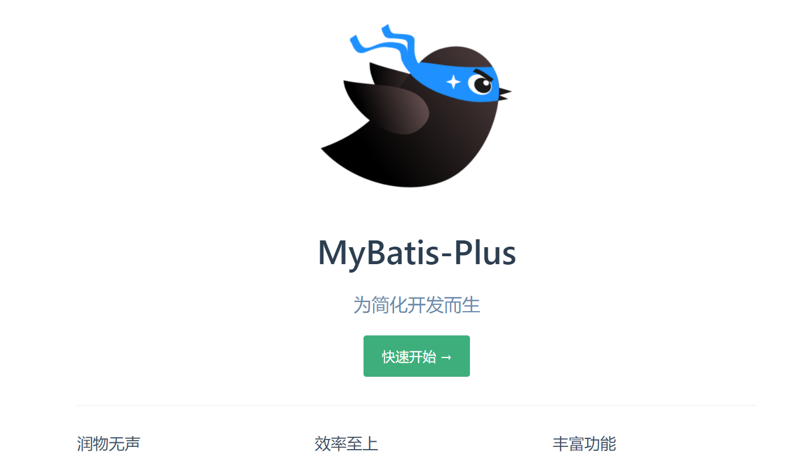
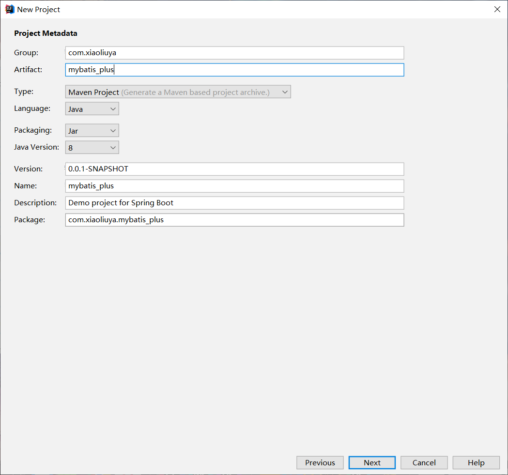
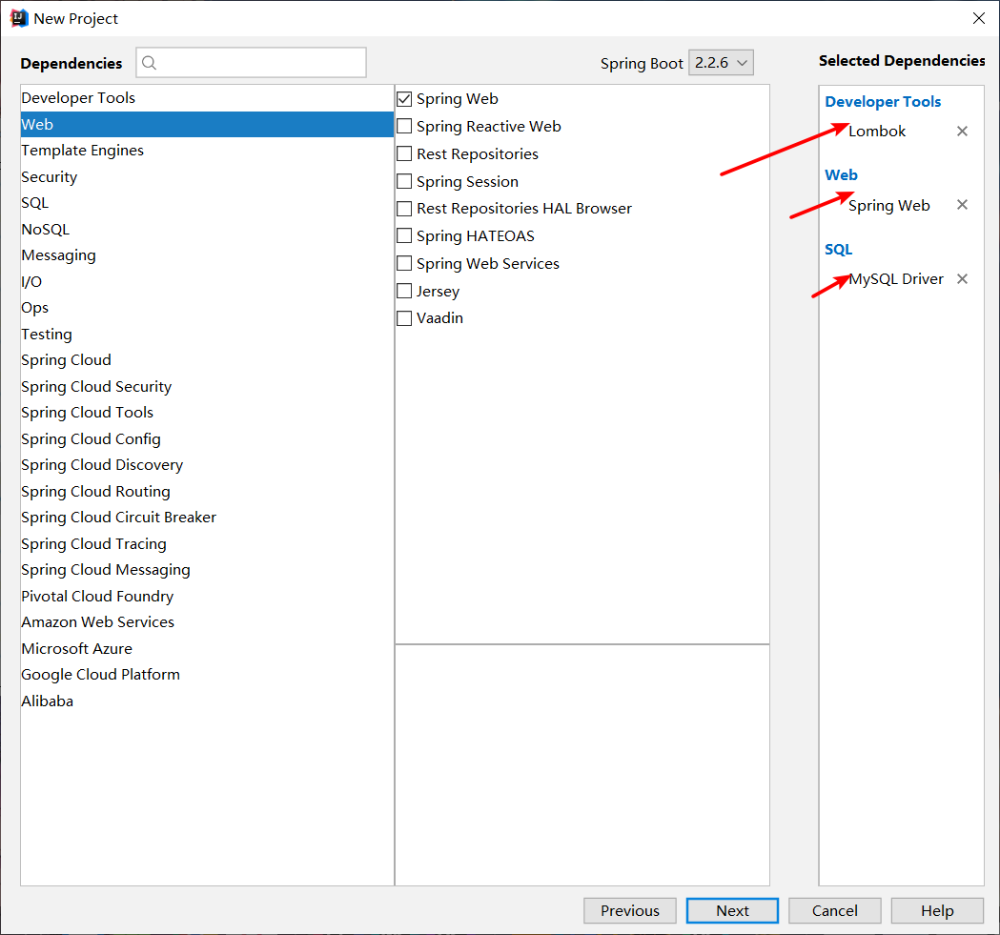
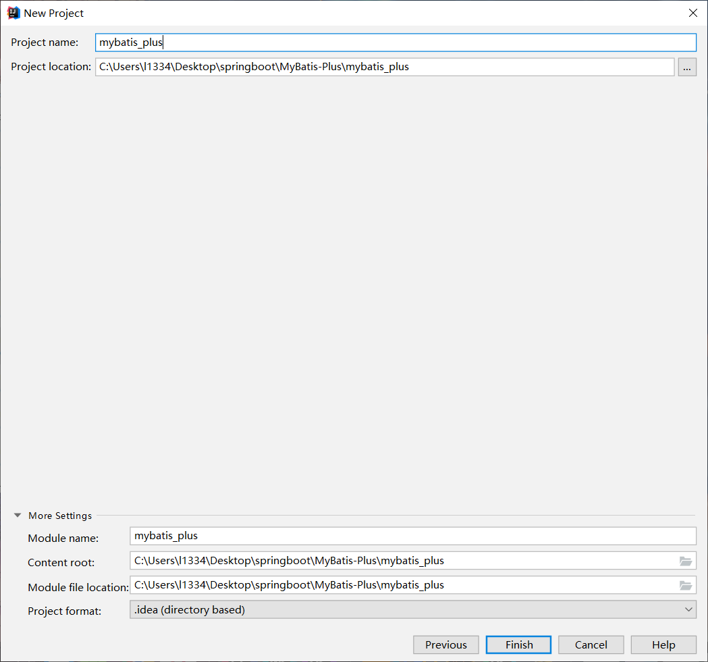
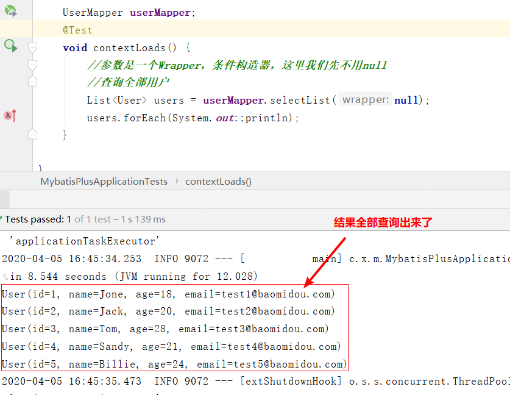
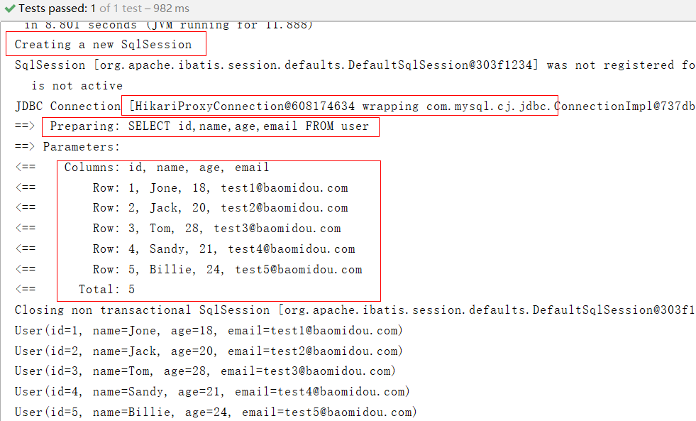

## MyBatisPlus简介

### MybatisPlus概述

需要的基础：学完MyBatis、Spring、SpringMVC。

为什么要学习它：MybatisPlus可以为我们节省大量工作时间，所有的CRUD代码它都可以自动化完成！

同类产品：JPA、tk-mapper

是什么：MyBatis本来就是简化JDBC操作的，MyBatisPlus简化MyBatis

MyBatisPlus官网：https://mp.baomidou.com/




### 特性

- **无侵入**：只做增强不做改变，引入它不会对现有工程产生影响，如丝般顺滑
- **损耗小**：启动即会自动注入基本 CURD，性能基本无损耗，直接面向对象操作
- **强大的 CRUD 操作**：内置通用 Mapper、通用 Service，仅仅通过少量配置即可实现单表大部分 CRUD 操作，更有强大的条件构造器，满足各类使用需求
- **支持 Lambda 形式调用**：通过 Lambda 表达式，方便的编写各类查询条件，无需再担心字段写错
- **支持主键自动生成**：支持多达 4 种主键策略（内含分布式唯一 ID 生成器 - Sequence），可自由配置，完美解决主键问题
- **支持 ActiveRecord 模式**：支持 ActiveRecord 形式调用，实体类只需继承 Model 类即可进行强大的 CRUD 操作
- **支持自定义全局通用操作**：支持全局通用方法注入（ Write once, use anywhere ）
- **内置代码生成器**：采用代码或者 Maven 插件可快速生成 Mapper 、 Model 、 Service 、 Controller 层代码，支持模板引擎，更有超多自定义配置等您来使用
- **内置分页插件**：基于 MyBatis 物理分页，开发者无需关心具体操作，配置好插件之后，写分页等同于普通 List 查询
- **分页插件支持多种数据库**：支持 MySQL、MariaDB、Oracle、DB2、H2、HSQL、SQLite、Postgre、SQLServer 等多种数据库
- **内置性能分析插件**：可输出 Sql 语句以及其执行时间，建议开发测试时启用该功能，能快速揪出慢查询
- **内置全局拦截插件**：提供全表 delete 、 update 操作智能分析阻断，也可自定义拦截规则，预防误操作

---

## 快速入门

### 步骤

1、创建数据库`MyBatis-Plus`

2、创建user表

~~~sql
DROP TABLE IF EXISTS user;

CREATE TABLE user
(
	id BIGINT(20) NOT NULL COMMENT '主键ID',
	name VARCHAR(30) NULL DEFAULT NULL COMMENT '姓名',
	age INT(11) NULL DEFAULT NULL COMMENT '年龄',
	email VARCHAR(50) NULL DEFAULT NULL COMMENT '邮箱',
	PRIMARY KEY (id)
);

INSERT INTO user (id, name, age, email) VALUES
(1, 'Jone', 18, 'test1@baomidou.com'),
(2, 'Jack', 20, 'test2@baomidou.com'),
(3, 'Tom', 28, 'test3@baomidou.com'),
(4, 'Sandy', 21, 'test4@baomidou.com'),
(5, 'Billie', 24, 'test5@baomidou.com');

-- 真是开发中，version（乐观锁）、deleted（逻辑删除）、gmt_create、gmt_modified
~~~

3、编写项目、初始化项目。使用Springboot初始化！







4、导入依赖

~~~xml
<!--mybatis-plus-->
        <dependency>
            <groupId>com.baomidou</groupId>
            <artifactId>mybatis-plus-boot-starter</artifactId>
            <version>3.0.5</version>
        </dependency>
~~~

注意：尽量不要同时导入mybatis和mybatisPlus！版本差异！

5、进行配置，连接数据库

```properties
#MySQL 5   驱动不同com.mysql.jdbc.Driver(高版本兼容低版本)
#spring.datasource.username=root
#spring.datasource.password=123456
#spring.datasource.url=jdbc:mysql://localhost:3306/mybatis-plus?useSSL=false&Unicode=true&characterEncoding=utf-8
#spring.datasource.driver-class-name=com.mysql.cj.jdbc.Driver

#MySQL 8   驱动不同com.mysql.cj.jdbc.Driver，需要增加时区的配置serverTimezone=GMT%2B8
spring.datasource.username=root
spring.datasource.password=123456
spring.datasource.url=jdbc:mysql://localhost:3306/mybatis-plus?useSSL=false&Unicode=true&characterEncoding=utf-8&serverTimezone=GMT%2B8
spring.datasource.driver-class-name=com.mysql.cj.jdbc.Driver
```

~~6、传统方式：pojo-dao(连接mybatis，配饰mapper.xml文件)-service-controller~~

6、使用mybatisplus之后，

- pojo

  ~~~java
  @Data
  @AllArgsConstructor
  @NoArgsConstructor
  public class User {
      private Integer id;
      private String name;
      private Integer age;
      private String email;
  }
  ~~~

- mapper

  ~~~java
  package com.xiaoliuya.mybatis_plus.mapper;
  
  import com.baomidou.mybatisplus.core.mapper.BaseMapper;
  import com.xiaoliuya.mybatis_plus.pojo.User;
  import org.springframework.stereotype.Repository;
  
  //在对应的Mapper上继承接本的接口 BaseMapper
  @Repository //代表持久层,使用之后自动装配不会显示错误，不使用也可
  public interface UserMapper extends BaseMapper<User> {
      //所有的CRUD操作已经编写完成了
      //你不需要像以前一样配置一大堆文件了
  }
  
  ~~~

  注意：我们需要在主启动类上去扫描我们的mapper包下的所有接口

  ~~~java
  //扫描我们的mapper文件夹
  @MapperScan("com.xiaoliuya.mybatis_plus.mapper")
  @SpringBootApplication
  public class MybatisPlusApplication {
  
      public static void main(String[] args) {
          SpringApplication.run(MybatisPlusApplication.class, args);
      }
  
  }
  ~~~

- 测试类中测试

  ~~~java
  @SpringBootTest
  class MybatisPlusApplicationTests {
  
      @Autowired
      UserMapper userMapper;
      @Test
      void contextLoads() {
          //参数是一个Wrapper，条件构造器，这里我们先不用null
          //查询全部用户
          List<User> users = userMapper.selectList(null);
          users.forEach(System.out::println);
      }
  
  }
  ~~~

- 结果

  

  通过以上几个简单的步骤，我们就实现了 User 表的 CRUD 功能，甚至连 XML 文件都不用编写！

  从以上步骤中，我们可以看到集成`MyBatis-Plus`非常的简单，只需要引入 starter 工程，并配置 mapper 扫描路径即可。

  但 MyBatis-Plus 的强大远不止这些功能，想要详细了解 MyBatis-Plus 的强大功能？那就继续往下看吧！

> 思考问题

1、SQL谁帮我们写的？MyBatis-Plus

2、方法哪里来的？MyBatis-Plus

## 配置日志

我们所有的sql现在是不可见的，我们希望知道它是怎么执行的，所以我们必须要看日志。

~~~properties
#配置日志
#这是控制台输出
mybatis-plus.configuration.log-impl=org.apache.ibatis.logging.stdout.StdOutImpl
~~~



---

## CRUD扩展

