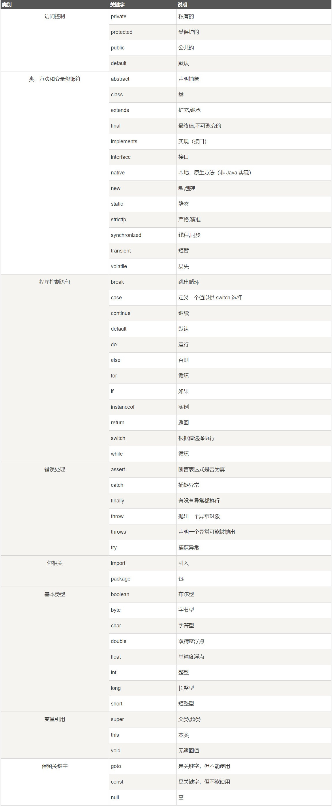
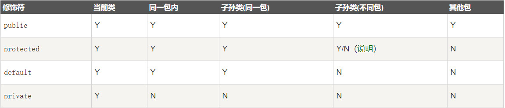
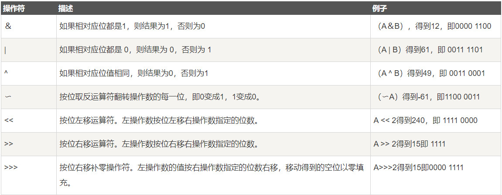
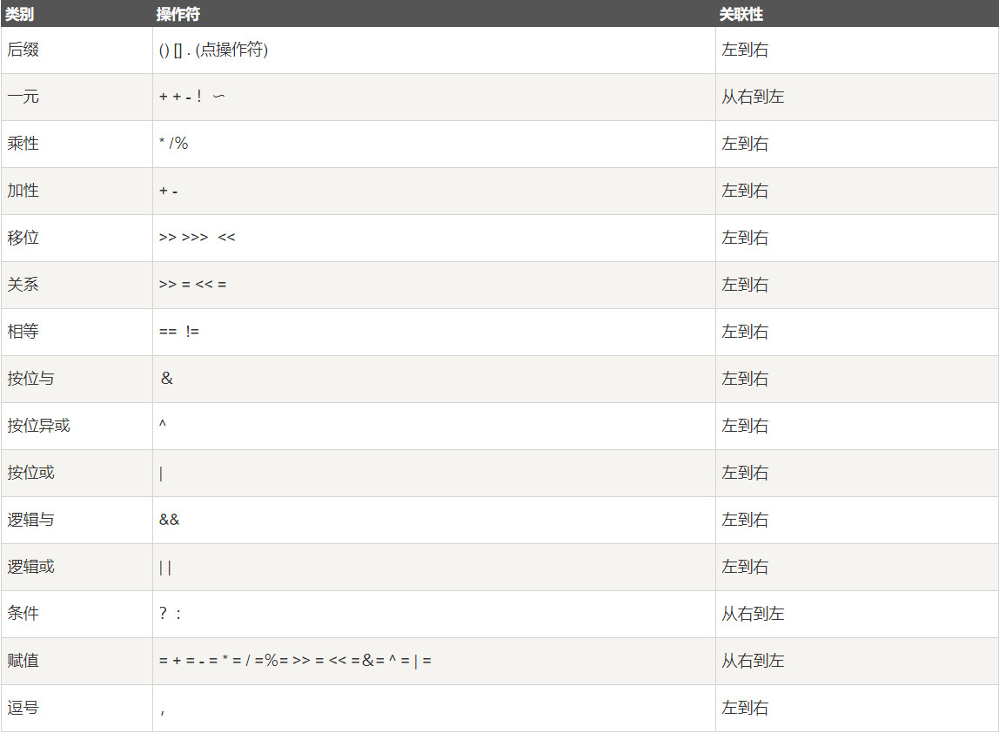
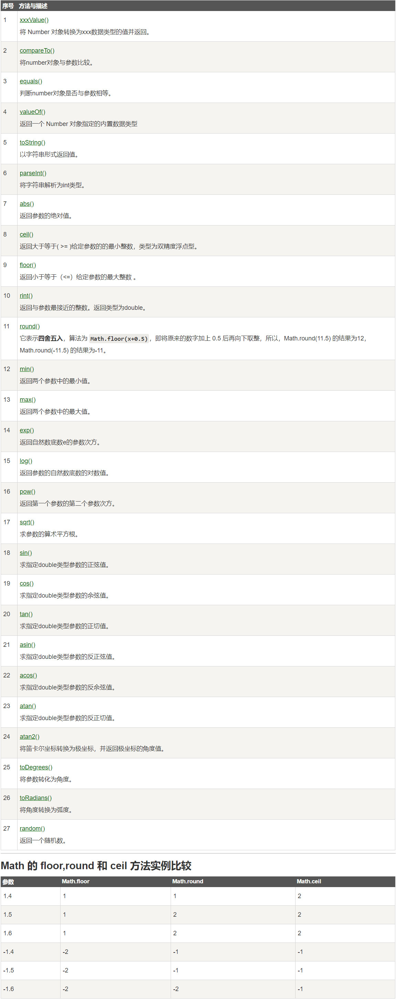
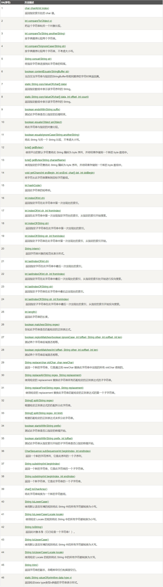
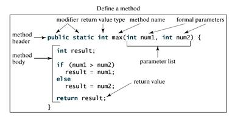

## java教程

#### 第一个java程序

~~~java
public class HelloWoorld{
    public static void main(String[] args){
        System.out.println("Hello World");
    }
}
~~~

## java简介

java分为三个体系：

- **JavaSE**（Java2 Platform Standard Edition，java平台标准版）
- JavaEE(Java 2 Platform,Enterprise Edition，java平台企业版)
- JavaME(Java 2 Platform Micro Edition，java平台微型版)。

## java 基础语法

先简要介绍下类、对象、方法和实例变量的概念。

- **对象**：对象是一个类的实例，有状态和行为。例如：一条狗是一个对象，它的状态有：颜色，名字，品种；行为有：摇尾巴，叫，吃。
- **类**：类是一个模板，它描述一类对象的行为和状态。
- **方法**：方法就是行为，一个类可以有很多方法。
- **实例变量**：每个对象都有独特的实例变量，对象的状态由这些实施变量的值决定。

编写 Java 程序时，应注意以下几点：

- **大小写敏感**：==Java 是大小写敏感的，这就意味着标识符 Hello 与 hello 是不同的。==
- **类名**：对于所有的类来说，==类名的首字母应该大写==。如果类名由若干单词组成，那么每个单词的首字母应该大写，例如 **MyFirstJavaClass** 。
- **方法名**：==所有的方法名都应该以小写字母开头==。如果方法名含有若干单词，则后面的每个单词首字母大写。
- **源文件名**：源文件名必须和类名相同。当保存文件的时候，你应该使用类名作为文件名保存（切记 Java 是大小写敏感的），文件名的后缀为 **.java**。（如果文件名和类名不相同则会导致编译错误）。
- **主方法入口**：所有的 Java 程序由 **public static void main(String []args)** 方法开始执行。

---

### java标识符

Java 所有的组成部分都需要名字。类名、变量名以及方法名都被称为标识符。

关于 Java 标识符，有以下几点需要注意：

- 所有的标识符都应该以字母（A-Z 或者 a-z）,美元符（$）、或者下划线（_）开始
- 首字符之后可以是字母（A-Z 或者 a-z）,美元符（$）、下划线（_）或数字的任何字符组合
- 关键字不能用作标识符
- 标识符是大小写敏感的
- 合法标识符举例：age、$salary、_value、__1_value
- 非法标识符举例：123abc、-salary

---

### java修饰符

像其他语言一样，Java可以使用修饰符来修饰类中方法和属性。主要有两类修饰符：

- 访问控制修饰符 : default, public , protected, private
- 非访问控制修饰符 : final, abstract, static, synchronized

在后面的章节中我们会深入讨论 Java 修饰符。

---

### java变量

Java 中主要有如下几种类型的变量

- 局部变量
- 类变量（静态变量）
- 成员变量（非静态变量）

---

### java数组

数组是储存在堆上的对象，可以保存多个同类型变量。在后面的章节中，我们将会学到如何声明、构造以及初始化一个数组。

---

### java枚举

Java 5.0引入了枚举，枚举限制变量只能是预先设定好的值。使用枚举可以减少代码中的 bug。

例如，我们为果汁店设计一个程序，它将限制果汁为小杯、中杯、大杯。这就意味着它不允许顾客点除了这三种尺寸外的果汁。

~~~java
class FreshJuice {
   enum FreshJuiceSize{ SMALL, MEDIUM , LARGE }
   FreshJuiceSize size;
}
 
public class FreshJuiceTest {
   public static void main(String []args){
      FreshJuice juice = new FreshJuice();
      juice.size = FreshJuice.FreshJuiceSize.MEDIUM  ;
   }
}
~~~

**注意：**枚举可以单独声明或者声明在类里面。方法、变量、构造函数也可以在枚举中定义。

---

### java关键字

下面列出了 Java 关键字。这些保留字不能用于常量、变量、和任何标识符的名称。



---

### java注释

~~~java
public class HelloWorld {
   /* 这是第一个Java程序
    *它将打印Hello World
    * 这是一个多行注释的示例
    */
    public static void main(String []args){
       // 这是单行注释的示例
       /* 这个也是单行注释的示例 */
       System.out.println("Hello World"); 
    }
}
~~~

---

### java空行

空白行或者有注释的行，Java 编译器都会忽略掉。

---

### 继承


在 Java 中，一个类可以由其他类派生。如果你要创建一个类，而且已经存在一个类具有你所需要的属性或方法，那么你可以将新创建的类继承该类。

利用继承的方法，可以重用已存在类的方法和属性，而不用重写这些代码。被继承的类称为超类（super class），派生类称为子类（subclass）。

---

### 接口

在 Java 中，接口可理解为对象间相互通信的协议。接口在继承中扮演着很重要的角色。

接口只定义派生要用到的方法，但是方法的具体实现完全取决于派生类。

---


## java对象和类

Java作为一种面向对象语言。支持以下基本概念：多态、继承、封装、抽象、类、对象、实例、方法、重载。

- 对象：对象是类的一个实例，有状态和行为。
- 类：类是一个模板，它描述一类对象的行为和状态。

~~~java
public class Dog{
  String breed;
  int age;
  String color;
  void barking(){
  }
 
  void hungry(){
  }
 
  void sleeping(){
  }
}
~~~

一个类可以包含以下类型变量：

- **局部变量**：在方法、构造方法或者语句块中定义的变量被称为局部变量。变量声明和初始化都是在方法中，方法结束后，变量就会自动销毁。
- **成员变量**：成员变量是定义在类中，方法体之外的变量。这种变量在创建对象的时候实例化。成员变量可以被类中方法、构造方法和特定类的语句块访问。
- **类变量**：类变量也声明在类中，方法体之外，但必须声明为static类型。

一个类可以拥有多个方法，在上面的例子中：barking()、hungry()和sleeping()都是Dog类的方法。

---

### 构造方法

每个类都有构造方法。如果没有显式地为类定义构造方法，Java编译器将会为该类提供一个默认构造方法。

在创建一个对象的时候，至少要调用一个构造方法。构造方法的名称必须与类同名，一个类可以有多个构造方法。

下面是一个构造方法示例：

~~~java
public class Puppy{
    public Puppy(){
    }
 
    public Puppy(String name){
        // 这个构造器仅有一个参数：name
    }
}
~~~

---

### 创建对象

对象是根据类创建的。在Java中，==使用关键字new来创建一个新的对象==。创建对象需要以下三步：

- **声明**：声明一个对象，包括对象名称和对象类型。
- **实例化**：使用关键字new来创建一个对象。
- **初始化**：使用new创建对象时，会调用构造方法初始化对象。

下面是一个创建对象的例子：

~~~java
public class Puppy{
   public Puppy(String name){
      //这个构造器仅有一个参数：name
      System.out.println("小狗的名字是 : " + name ); 
   }
   public static void main(String[] args){
      // 下面的语句将创建一个Puppy对象
      Puppy myPuppy = new Puppy( "tommy" );
   }
}

小狗的名字是 : tommy
~~~

---

### 实例

下面的例子展示如何访问实例变量和调用成员方法：

~~~java
public class Puppy{
   int puppyAge;
   public Puppy(String name){
      // 这个构造器仅有一个参数：name
      System.out.println("小狗的名字是 : " + name ); 
   }
 
   public void setAge( int age ){
       puppyAge = age;
   }
 
   public int getAge( ){
       System.out.println("小狗的年龄为 : " + puppyAge ); 
       return puppyAge;
   }
 
   public static void main(String[] args){
      /* 创建对象 */
      Puppy myPuppy = new Puppy( "tommy" );
      /* 通过方法来设定age */
      myPuppy.setAge( 2 );
      /* 调用另一个方法获取age */
      myPuppy.getAge( );
      /*你也可以像下面这样访问成员变量 */
      System.out.println("变量值 : " + myPuppy.puppyAge ); 
   }
}
~~~

编译并运行上面的程序，产生如下结果：

```
小狗的名字是 : tommy
小狗的年龄为 : 2
变量值 : 2
```


## java基本数据类型

变量就是申请内存来存储值。也就是说，当创建变量的时候，需要在内存中申请空间。

内存管理系统根据变量的类型为变量分配存储空间，分配的空间只能用来储存该类型数据。

因此，通过定义不同类型的变量，可以在内存中储存整数、小数或者字符。

Java 的两大数据类型:

- 内置数据类型
- 引用数据类型

---

### 内置数据类型

Java语言提供了八种基本类型。六种数字类型（四个整数型，两个浮点型），一种字符类型，还有一种布尔型。

**byte：**

- byte 数据类型是8位、有符号的，以二进制补码表示的整数；
- 最小值是 -128（-2^7）；
- 最大值是 127（2^7-1）；
- 默认值是 0；
- byte 类型用在大型数组中节约空间，主要代替整数，因为 byte 变量占用的空间只有 int 类型的四分之一；
- 例子：byte a = 100，byte b = -50。

**short：**

- short 数据类型是 16 位、有符号的以二进制补码表示的整数
- 最小值是 -32768（-2^15）；
- 最大值是 32767（2^15 - 1）；
- Short 数据类型也可以像 byte 那样节省空间。一个short变量是int型变量所占空间的二分之一；
- 默认值是 0；
- 例子：short s = 1000，short r = -20000。

**int：**

- int 数据类型是32位、有符号的以二进制补码表示的整数；
- 最小值是 -2,147,483,648（-2^31）；
- 最大值是 2,147,483,647（2^31 - 1）；
- 一般地整型变量默认为 int 类型；
- 默认值是 0 ；
- 例子：int a = 100000, int b = -200000。

**long：**

- long 数据类型是 64 位、有符号的以二进制补码表示的整数；
- 最小值是 -9,223,372,036,854,775,808（-2^63）；
- 最大值是 9,223,372,036,854,775,807（2^63 -1）；
- 这种类型主要使用在需要比较大整数的系统上；
- 默认值是 0L；
- 例子： long a = 100000L，Long b = -200000L。
  "L"理论上不分大小写，但是若写成"l"容易与数字"1"混淆，不容易分辩。所以最好大写。

**float：**

- float 数据类型是单精度、32位、符合IEEE 754标准的浮点数；
- float 在储存大型浮点数组的时候可节省内存空间；
- 默认值是 0.0f；
- 浮点数不能用来表示精确的值，如货币；
- 例子：float f1 = 234.5f。

**double：**

- double 数据类型是双精度、64 位、符合IEEE 754标准的浮点数；
- 浮点数的默认类型为double类型；
- double类型同样不能表示精确的值，如货币；
- 默认值是 0.0d；
- 例子：double d1 = 123.4。

**boolean：**

- boolean数据类型表示一位的信息；
- 只有两个取值：true 和 false；
- 这种类型只作为一种标志来记录 true/false 情况；
- 默认值是 false；
- 例子：boolean one = true。

**char：**

- char类型是一个单一的 16 位 Unicode 字符；
- 最小值是 \u0000（即为0）；
- 最大值是 \uffff（即为65,535）；
- char 数据类型可以储存任何字符；
- 例子：char letter = 'A'；。

### 类型默认值

~~~java
public class Test {
    static boolean bool;
    static byte by;
    static char ch;
    static double d;
    static float f;
    static int i;
    static long l;
    static short sh;
    static String str;
 
    public static void main(String[] args) {
        System.out.println("Bool :" + bool);
        System.out.println("Byte :" + by);
        System.out.println("Character:" + ch);
        System.out.println("Double :" + d);
        System.out.println("Float :" + f);
        System.out.println("Integer :" + i);
        System.out.println("Long :" + l);
        System.out.println("Short :" + sh);
        System.out.println("String :" + str);
    }
}
~~~

实例输出结果为：

```
Bool     :false
Byte     :0
Character:
Double   :0.0
Float    :0.0
Integer  :0
Long     :0
Short    :0
String   :null
```

---

### 引用类型

- 在Java中，引用类型的变量非常类似于C/C++的指针。引用类型指向一个对象，指向对象的变量是引用变量。这些变量在声明时被指定为一个特定的类型，比如 Employee、Puppy 等。变量一旦声明后，类型就不能被改变了。
- 对象、数组都是引用数据类型。
- 所有引用类型的默认值都是null。
- 一个引用变量可以用来引用任何与之兼容的类型。
- 例子：Site site = new Site("Runoob")。

---

### java常量

Java语言支持一些特殊的转义字符序列。

| 符号   | 字符含义                 |
| ------ | ------------------------ |
| \n     | 换行 (0x0a)              |
| \r     | 回车 (0x0d)              |
| \f     | 换页符(0x0c)             |
| \b     | 退格 (0x08)              |
| \0     | 空字符 (0x20)            |
| \s     | 字符串                   |
| \t     | 制表符                   |
| \"     | 双引号                   |
| \'     | 单引号                   |
| \\     | 反斜杠                   |
| \ddd   | 八进制字符 (ddd)         |
| \uxxxx | 16进制Unicode字符 (xxxx) |

### 自动类型转换

**整型、实型（常量）、字符型数据可以混合运算。运算中，不同类型的数据先转化为同一类型，然后进行运算。**

转换从低级到高级。

```
低  ------------------------------------>  高

byte,short,char—> int —> long—> float —> double 
```

数据类型转换必须满足如下规则：

- 1. 不能对boolean类型进行类型转换。
- 2. 不能把对象类型转换成不相关类的对象。
- 3. 在把容量大的类型转换为容量小的类型时必须使用强制类型转换。
- 4. 转换过程中可能导致溢出或损失精度，例如：

~~~java
int i =128;   
byte b = (byte)i;
~~~

因为 byte 类型是 8 位，最大值为127，所以当 int 强制转换为 byte 类型时，值 128 时候就会导致溢出。

5. 浮点数到整数的转换是通过舍弃小数得到，而不是四舍五入，例如：

```
(int)23.7 == 23;        
(int)-45.89f == -45
```

### 强制类型转换

1. 条件是转换的数据类型必须是兼容的。

2. 格式：(type)value type是要强制类型转换后的数据类型 实例：

   ~~~java 
   public class QiangZhiZhuanHuan{
       public static void main(String[] args){
           int i1 = 123;
           byte b = (byte)i1;//强制类型转换为byte
           System.out.println("int强制类型转换为byte后的值等于"+b);
       }
   }
   ~~~

   运行结果：

   ```
   int强制类型转换为byte后的值等于123
   ```

### 隐含强制类型转换

1. 整数的默认类型是 int。
2. 浮点型不存在这种情况，因为在定义 float 类型时必须在数字后面跟上 F 或者 f。

---


## 6、java变量类型

~~~java
int a, b, c;         // 声明三个int型整数：a、 b、c
int d = 3, e = 4, f = 5; // 声明三个整数并赋予初值
byte z = 22;         // 声明并初始化 z
String s = "runoob";  // 声明并初始化字符串 s
double pi = 3.14159; // 声明了双精度浮点型变量 pi
char x = 'x';        // 声明变量 x 的值是字符 'x'。
~~~

Java语言支持的变量类型有：

- 类变量：独立于方法之外的变量，用 static 修饰。
- 实例变量：独立于方法之外的变量，不过没有 static 修饰。
- 局部变量：类的方法中的变量。

~~~java
public class Variable{
    static int allClicks=0;    // 类变量
 
    String str="hello world";  // 实例变量
 
    public void method(){
 
        int i =0;  // 局部变量
 
    }
}
~~~

---

### java局部变量

- 局部变量声明在方法、构造方法或者语句块中；
- 局部变量在方法、构造方法、或者语句块被执行的时候创建，当它们执行完成后，变量将会被销毁；
- 访问修饰符不能用于局部变量；
- 局部变量只在声明它的方法、构造方法或者语句块中可见；
- 局部变量是在栈上分配的。
- 局部变量没有默认值，所以局部变量被声明后，必须经过初始化，才可以使用。

#### 实例1

在以下实例中age是一个局部变量。定义在pupAge()方法中，它的作用域就限制在这个方法中。

~~~java
package com.runoob.test;
 
public class Test{ 
   public void pupAge(){
      int age = 0;
      age = age + 7;
      System.out.println("小狗的年龄是: " + age);
   }
   
   public static void main(String[] args){
      Test test = new Test();
      test.pupAge();
   }
}
~~~

以下实例编译运行结果如下:

```
小狗的年龄是: 7
```

#### 实例2

在下面的例子中 age 变量没有初始化，所以在编译时会出错：

~~~java
package com.runoob.test;
 
public class Test{ 
   public void pupAge(){
      int age;
      age = age + 7;
      System.out.println("小狗的年龄是 : " + age);
   }
   
   public static void main(String[] args){
      Test test = new Test();
      test.pupAge();
   }
}
~~~

以上实例编译运行结果如下:

```
Test.java:4:variable number might not have been initialized
age = age + 7;
         ^
1 error
```

---

### 实例变量

- 实例变量声明在一个类中，但在方法、构造方法和语句块之外；
- 当一个对象被实例化之后，每个实例变量的值就跟着确定；
- 实例变量在对象创建的时候创建，在对象被销毁的时候销毁；
- 实例变量的值应该至少被一个方法、构造方法或者语句块引用，使得外部能够通过这些方式获取实例变量信息；
- 实例变量可以声明在使用前或者使用后；
- 访问修饰符可以修饰实例变量；
- 实例变量对于类中的方法、构造方法或者语句块是可见的。一般情况下应该把实例变量设为私有。通过使用访问修饰符可以使实例变量对子类可见；
- 实例变量具有默认值。数值型变量的默认值是0，布尔型变量的默认值是false，引用类型变量的默认值是null。变量的值可以在声明时指定，也可以在构造方法中指定；
- 实例变量可以直接通过变量名访问。但在静态方法以及其他类中，就应该使用完全限定名：ObejectReference.VariableName。

#### 实例

Employee.java 文件代码：	

~~~java
import java.io.*;
public class Employee{
   // 这个实例变量对子类可见
   public String name;
   // 私有变量，仅在该类可见
   private double salary;
   //在构造器中对name赋值
   public Employee (String empName){
      name = empName;
   }
   //设定salary的值
   public void setSalary(double empSal){
      salary = empSal;
   }  
   // 打印信息
   public void printEmp(){
      System.out.println("名字 : " + name );
      System.out.println("薪水 : " + salary);
   }
 
   public static void main(String[] args){
      Employee empOne = new Employee("RUNOOB");
      empOne.setSalary(1000.0);
      empOne.printEmp();
   }
}
~~~

以上实例编译运行结果如下:

```
$ javac Employee.java 
$ java Employee
名字 : RUNOOB
薪水 : 1000.0
```

### 类变量（静态变量）

- 类变量也称为静态变量，在类中以 static 关键字声明，但必须在方法之外。
- 无论一个类创建了多少个对象，类只拥有类变量的一份拷贝。
- 静态变量除了被声明为常量外很少使用。常量是指声明为public/private，final和static类型的变量。常量初始化后不可改变。
- 静态变量储存在静态存储区。经常被声明为常量，很少单独使用static声明变量。
- 静态变量在第一次被访问时创建，在程序结束时销毁。
- 与实例变量具有相似的可见性。但为了对类的使用者可见，大多数静态变量声明为public类型。
- 默认值和实例变量相似。数值型变量默认值是0，布尔型默认值是false，引用类型默认值是null。变量的值可以在声明的时候指定，也可以在构造方法中指定。此外，静态变量还可以在静态语句块中初始化。
- 静态变量可以通过：*ClassName.VariableName*的方式访问。
- 类变量被声明为public static final类型时，类变量名称一般建议使用大写字母。如果静态变量不是public和final类型，其命名方式与实例变量以及局部变量的命名方式一致。

#### 实例

Employee.java 文件代码：

~~~java
import java.io.*;
 
public class Employee {
    //salary是静态的私有变量
    private static double salary;
    // DEPARTMENT是一个常量
    public static final String DEPARTMENT = "开发人员";
    public static void main(String[] args){
    salary = 10000;
        System.out.println(DEPARTMENT+"平均工资:"+salary);
    }
}
~~~

以上实例编译运行结果如下:

```
开发人员平均工资:10000.0
```

**注意：**如果其他类想要访问该变量，可以这样访问：**Employee.DEPARTMENT**。

---

 

## 7、java修饰符

Java语言提供了很多修饰符，主要分为以下两类：

- 访问修饰符
- 非访问修饰符

==修饰符用来定义类、方法或者变量，通常放在语句的最前端。==我们通过下面的例子来说明：

~~~java
public class ClassName {
   // ...
}
private boolean myFlag;
static final double weeks = 9.5;
protected static final int BOXWIDTH = 42;
public static void main(String[] arguments) {
   // 方法体
}	
~~~

### 访问控制修饰符

Java中，可以使用访问控制符来保护对类、变量、方法和构造方法的访问。Java 支持 4 种不同的访问权限。

- **default** (即默认，什么也不写）: 在同一包内可见，不使用任何修饰符。使用对象：类、接口、变量、方法。
- **private** : 在同一类内可见。使用对象：变量、方法。 **注意：不能修饰类（外部类）**
- **public** : 对所有类可见。使用对象：类、接口、变量、方法
- **protected** : 对同一包内的类和所有子类可见。使用对象：变量、方法。 **注意：不能修饰类（外部类）**。

我们可以通过以下表来说明访问权限：



#### 默认访问修饰符-不使用任何关键字

使用默认访问修饰符声明的变量和方法，对同一个包内的类是可见的。接口里的变量都隐式声明为 **public static final**,而接口里的方法默认情况下访问权限为 **public**。

如下例所示，变量和方法的声明可以不使用任何修饰符。

~~~java
String version = "1.5.1";
boolean processOrder() {
   return true;
}
~~~

#### 私有访问修饰符-private

私有访问修饰符是最严格的访问级别，所以被声明为 **private** 的方法、变量和构造方法只能被所属类访问，并且==类和接口不能声明为== **private**。

==声明为私有访问类型的变量只能通过类中公共的 getter 方法被外部类访问。==

Private 访问修饰符的使用主要用来隐藏类的实现细节和保护类的数据。

下面的类使用了私有访问修饰符：

~~~java
public class Logger {
   private String format;
   public String getFormat() {
      return this.format;
   }
   public void setFormat(String format) {
      this.format = format;
   }
}
~~~

实例中，Logger 类中的 format 变量为私有变量，所以其他类不能直接得到和设置该变量的值。为了使其他类能够操作该变量，定义了两个 public 方法：getFormat() （返回 format的值）和 setFormat(String)（设置 format 的值）

#### 公有访问修饰符-public

被声明为 public 的类、方法、构造方法和接口能够被任何其他类访问。

如果几个相互访问的 public 类分布在不同的包中，则需要导入相应 public 类所在的包。由于类的继承性，类所有的公有方法和变量都能被其子类继承。

以下函数使用了公有访问控制：

~~~java
public static void main(String[] arguments) {
   // ...
}
~~~

Java 程序的 main() 方法必须设置成公有的，否则，Java 解释器将不能运行该类。

#### 受保护的访问修饰符-protected

protected 需要从以下两个点来分析说明：

- **子类与基类在同一包中**：被声明为 protected 的变量、方法和构造器能被同一个包中的任何其他类访问；
- **子类与基类不在同一包中**：那么在子类中，子类实例可以访问其从基类继承而来的 protected 方法，而不能访问基类实例的protected方法。

protected 可以修饰数据成员，构造方法，方法成员，**不能修饰类（内部类除外）**。

接口及接口的成员变量和成员方法不能声明为 protected。


子类能访问 protected 修饰符声明的方法和变量，这样就能保护不相关的类使用这些方法和变量。

下面的父类使用了 protected 访问修饰符，子类重写了父类的 openSpeaker() 方法。

~~~java
class AudioPlayer {
   protected boolean openSpeaker(Speaker sp) {
      // 实现细节
   }
}
 
class StreamingAudioPlayer extends AudioPlayer {
   protected boolean openSpeaker(Speaker sp) {
      // 实现细节
   }
}
~~~

如果把 openSpeaker() 方法声明为 private，那么除了 AudioPlayer 之外的类将不能访问该方法。

如果把 openSpeaker() 声明为 public，那么所有的类都能够访问该方法。

==如果我们只想让该方法对其所在类的子类可见，则将该方法声明为 protected。==

#### 访问控制和继承

请注意以下方法继承的规则：

- 父类中声明为 public 的方法在子类中也必须为 public。
- 父类中声明为 protected 的方法在子类中要么声明为 protected，要么声明为 public，不能声明为 private。
- 父类中声明为 private 的方法，不能够被继承。

---

### 非访问修饰符

为了实现一些其他的功能，Java 也提供了许多非访问修饰符。

static 修饰符，用来修饰类方法和类变量。

final 修饰符，用来修饰类、方法和变量，==final 修饰的类不能够被继承，修饰的方法不能被继承类重新定义，修饰的变量为常量，是不可修改的==。

abstract 修饰符==，用来创建抽象类和抽象方法。==

synchronized 和 volatile 修饰符，主要用于线程的编程。

#### static 修饰符

- **静态变量：**

  static 关键字用来声明独立于对象的静态变量，无论一个类实例化多少对象，它的静态变量只有一份拷贝。 静态变量也被称为类变量。局部变量不能被声明为 static 变量。

- **静态方法：**

  static 关键字用来声明独立于对象的静态方法。静态方法不能使用类的非静态变量。静态方法从参数列表得到数据，然后计算这些数据。

对类变量和方法的访问可以直接使用 **classname.variablename** 和 **classname.methodname** 的方式访问。

如下例所示，static修饰符用来创建类方法和类变量。

~~~java
public class InstanceCounter {
   private static int numInstances = 0;
   protected static int getCount() {
      return numInstances;
   }
 
   private static void addInstance() {
      numInstances++;
   }
 
   InstanceCounter() {
      InstanceCounter.addInstance();
   }
 
   public static void main(String[] arguments) {
      System.out.println("Starting with " +
      InstanceCounter.getCount() + " instances");
      for (int i = 0; i < 500; ++i){
         new InstanceCounter();
          }
      System.out.println("Created " +
      InstanceCounter.getCount() + " instances");
   }
}
~~~

以上实例运行编辑结果如下:

```
Starting with 0 instances
Created 500 instances
```

#### final 修饰符

**final 变量：**

final 表示"最后的、最终的"含义，变量一旦赋值后，不能被重新赋值。被 final 修饰的实例变量必须显式指定初始值。

final 修饰符通常和 static 修饰符一起使用来创建类常量。

~~~java
public class Test{
  final int value = 10;
  // 下面是声明常量的实例
  public static final int BOXWIDTH = 6;
  static final String TITLE = "Manager";
 
  public void changeValue(){
     value = 12; //将输出一个错误
  }
}
~~~

**final 方法**

父类中的 final 方法可以被子类继承，但是不能被子类重写。

声明 final 方法的主要目的是防止该方法的内容被修改。

如下所示，使用 final 修饰符声明方法。

~~~java
public class Test{
    public final void changeName(){
       // 方法体
    }
}
~~~

**final 类**

final 类不能被继承，没有类能够继承 final 类的任何特性。

~~~java
public final class Test {
   // 类体
}
~~~

#### abstract 修饰符

**抽象类：**

抽象类不能用来实例化对象，声明抽象类的唯一目的是为了将来对该类进行扩充。

一个类不能同时被 abstract 和 final 修饰。如果一个类包含抽象方法，那么该类一定要声明为抽象类，否则将出现编译错误。

抽象类可以包含抽象方法和非抽象方法。

~~~java
abstract class Caravan{
   private double price;
   private String model;
   private String year;
   public abstract void goFast(); //抽象方法
   public abstract void changeColor();
}
~~~

**抽象方法**

抽象方法是一种没有任何实现的方法，该方法的的具体实现由子类提供。

抽象方法不能被声明成 final 和 static。

任何继承抽象类的子类必须实现父类的所有抽象方法，除非该子类也是抽象类。

如果一个类包含若干个抽象方法，那么该类必须声明为抽象类。抽象类可以不包含抽象方法。

抽象方法的声明以分号结尾，例如：**public abstract sample();**。

~~~java
public abstract class SuperClass{
    abstract void m(); //抽象方法
}
 
class SubClass extends SuperClass{
     //实现抽象方法
      void m(){
          .........
      }
}
~~~

#### synchronized 修饰符

synchronized 关键字声明的方法同一时间只能被一个线程访问。synchronized 修饰符可以应用于四个访问修饰符。

~~~java
public synchronized void showDetails(){
.......
}
~~~

#### transient 修饰符

序列化的对象包含被 transient 修饰的实例变量时，java 虚拟机(JVM)跳过该特定的变量。

该修饰符包含在定义变量的语句中，用来预处理类和变量的数据类型。

~~~java
public transient int limit = 55;   // 不会持久化
public int b; // 持久化
~~~

#### volatile 修饰符

volatile 修饰的成员变量在每次被线程访问时，都强制从共享内存中重新读取该成员变量的值。而且，当成员变量发生变化时，会强制线程将变化值回写到共享内存。这样在任何时刻，两个不同的线程总是看到某个成员变量的同一个值。

一个 volatile 对象引用可能是 null。

~~~java
public class MyRunnable implements Runnable
{
    private volatile boolean active;
    public void run()
    {
        active = true;
        while (active) // 第一行
        {
            // 代码
        }
    }
    public void stop()
    {
        active = false; // 第二行
    }
}
~~~

通常情况下，在一个线程调用 run() 方法（在 Runnable 开启的线程），在另一个线程调用 stop() 方法。 如果 **第一行** 中缓冲区的 active 值被使用，那么在 **第二行** 的 active 值为 false 时循环不会停止。

但是以上代码中我们使用了 volatile 修饰 active，所以该循环会停止。

---


## 8、java运算符

计算机的最基本用途之一就是执行数学运算，作为一门计算机语言，Java也提供了一套丰富的运算符来操纵变量。我们可以把运算符分成以下几组：算术运算符、关系运算符、位运算符、逻辑运算符、赋值运算符、其他运算符。

### 算数运算符

算术运算符用在数学表达式中，它们的作用和在数学中的作用一样。下表列出了所有的算术运算符。

#### 实例

~~~java
public class Test {
 
  public static void main(String[] args) {
     int a = 10;
     int b = 20;
     int c = 25;
     int d = 25;
     System.out.println("a + b = " + (a + b) );
     System.out.println("a - b = " + (a - b) );
     System.out.println("a * b = " + (a * b) );
     System.out.println("b / a = " + (b / a) );
     System.out.println("b % a = " + (b % a) );
     System.out.println("c % a = " + (c % a) );
     System.out.println("a++   = " +  (a++) );
     System.out.println("a--   = " +  (a--) );
     // 查看  d++ 与 ++d 的不同
     System.out.println("d++   = " +  (d++) );
     System.out.println("++d   = " +  (++d) );
  }
}
~~~

以上实例编译运行结果如下：

```
a + b = 30
a - b = -10
a * b = 200
b / a = 2
b % a = 0
c % a = 5
a++   = 10
a--   = 11
d++   = 25
++d   = 27
```

#### 自增自减运算符

**1、自增（++）自减（--）运算符**是一种特殊的算术运算符，在算术运算符中需要两个操作数来进行运算，而自增自减运算符是一个操作数。

~~~java
public class selfAddMinus{
    public static void main(String[] args){
        int a = 3;//定义一个变量；
        int b = ++a;//自增运算
        int c = 3;
        int d = --c;//自减运算
        System.out.println("进行自增运算后的值等于"+b);
        System.out.println("进行自减运算后的值等于"+d);
    }
}
~~~

运行结果为：

```
进行自增运算后的值等于4
进行自减运算后的值等于2
```

**2、前缀自增自减法(++a,--a):** 先进行自增或者自减运算，再进行表达式运算。

**3、后缀自增自减法(a++,a--):** 先进行表达式运算，再进行自增或者自减运算 实例：

~~~java
public class selfAddMinus{
    public static void main(String[] args){
        int a = 5;//定义一个变量；
        int b = 5;
        int x = 2*++a;
        int y = 2*b++;
        System.out.println("自增运算符前缀运算后a="+a+",x="+x);
        System.out.println("自增运算符后缀运算后b="+b+",y="+y);
    }
}
~~~

运行结果为：

```
自增运算符前缀运算后a=6，x=12
自增运算符后缀运算后b=6，y=10
```

---

### 关系运算符

#### 实例

~~~java
public class Test {
 
  public static void main(String[] args) {
     int a = 10;
     int b = 20;
     System.out.println("a == b = " + (a == b) );
     System.out.println("a != b = " + (a != b) );
     System.out.println("a > b = " + (a > b) );
     System.out.println("a < b = " + (a < b) );
     System.out.println("b >= a = " + (b >= a) );
     System.out.println("b <= a = " + (b <= a) );
  }
}
~~~

以上实例编译运行结果如下：

```
a == b = false
a != b = true
a > b = false
a < b = true
b >= a = true
b <= a = false
```

### 位运算符

Java定义了位运算符，应用于整数类型(int)，长整型(long)，短整型(short)，字符型(char)，和字节型(byte)等类型。

位运算符作用在所有的位上，并且按位运算。假设a = 60，b = 13;它们的二进制格式表示将如下：

```
A = 0011 1100
B = 0000 1101
-----------------
A&B = 0000 1100
A | B = 0011 1101
A ^ B = 0011 0001
~A= 1100 0011
```

下表列出了位运算符的基本运算，假设整数变量 A 的值为 60 和变量 B 的值为 13：



#### 实例

~~~java
public class Test {
  public static void main(String[] args) {
     int a = 60; /* 60 = 0011 1100 */ 
     int b = 13; /* 13 = 0000 1101 */
     int c = 0;
     c = a & b;       /* 12 = 0000 1100 */
     System.out.println("a & b = " + c );
 
     c = a | b;       /* 61 = 0011 1101 */
     System.out.println("a | b = " + c );
 
     c = a ^ b;       /* 49 = 0011 0001 */
     System.out.println("a ^ b = " + c );
 
     c = ~a;          /*-61 = 1100 0011 */
     System.out.println("~a = " + c );
 
     c = a << 2;     /* 240 = 1111 0000 */
     System.out.println("a << 2 = " + c );
 
     c = a >> 2;     /* 15 = 1111 */
     System.out.println("a >> 2  = " + c );
  
     c = a >>> 2;     /* 15 = 0000 1111 */
     System.out.println("a >>> 2 = " + c );
  }
} 
~~~

以上实例编译运行结果如下：

```
a & b = 12
a | b = 61
a ^ b = 49
~a = -61
a << 2 = 240
a >> 2  = 15
a >>> 2 = 15
```

### 逻辑运算符

#### 实例

~~~java
public class Test {
  public static void main(String[] args) {
     boolean a = true;
     boolean b = false;
     System.out.println("a && b = " + (a&&b));
     System.out.println("a || b = " + (a||b) );
     System.out.println("!(a && b) = " + !(a && b));
  }
}
~~~

以上实例编译运行结果如下：

```
a && b = false
a || b = true
!(a && b) = true
```

#### 短路逻辑运算符

当使用与逻辑运算符时，在两个操作数都为true时，结果才为true，但是当得到第一个操作为false时，其结果就必定是false，这时候就不会再判断第二个操作了。

~~~java
public class LuoJi{
    public static void main(String[] args){
        int a = 5;//定义一个变量；
        boolean b = (a<4)&&(a++<10);
        System.out.println("使用短路逻辑运算符的结果为"+b);
        System.out.println("a的结果为"+a);
    }
}
~~~

运行结果为：

```
使用短路逻辑运算符的结果为false
a的结果为5
```

**解析：** 该程序使用到了短路逻辑运算符(&&)，首先判断 a<4 的结果为 false，则 b 的结果必定是 false，所以不再执行第二个操作 a++<10 的判断，所以 a 的值为 5。

---

### 赋值运算符

下面是Java语言支持的赋值运算符：	


#### 实例

~~~java
public class Test {
    public static void main(String[] args) {
        int a = 10;
        int b = 20;
        int c = 0;
        c = a + b;
        System.out.println("c = a + b = " + c );
        c += a ;
        System.out.println("c += a  = " + c );
        c -= a ;
        System.out.println("c -= a = " + c );
        c *= a ;
        System.out.println("c *= a = " + c );
        a = 10;
        c = 15;
        c /= a ;
        System.out.println("c /= a = " + c );
        a = 10;
        c = 15;
        c %= a ;
        System.out.println("c %= a  = " + c );
        c <<= 2 ;
        System.out.println("c <<= 2 = " + c );
        c >>= 2 ;
        System.out.println("c >>= 2 = " + c );
        c >>= 2 ;
        System.out.println("c >>= 2 = " + c );
        c &= a ;
        System.out.println("c &= a  = " + c );
        c ^= a ;
        System.out.println("c ^= a   = " + c );
        c |= a ;
        System.out.println("c |= a   = " + c );
    }
}
~~~

以上实例编译运行结果如下：

```
c = a + b = 30
c += a  = 40
c -= a = 30
c *= a = 300
c /= a = 1
c %= a  = 5
c <<= 2 = 20
c >>= 2 = 5
c >>= 2 = 1
c &= a  = 0
c ^= a   = 10
c |= a   = 10
```

### 条件运算符（？：）

条件运算符也被称为三元运算符。

#### 实例

~~~java
public class Test {
   public static void main(String[] args){
      int a , b;
      a = 10;
      // 如果 a 等于 1 成立，则设置 b 为 20，否则为 30
      b = (a == 1) ? 20 : 30;
      System.out.println( "Value of b is : " +  b );
 
      // 如果 a 等于 10 成立，则设置 b 为 20，否则为 30
      b = (a == 10) ? 20 : 30;
      System.out.println( "Value of b is : " + b );
   }
}
~~~

以上实例编译运行结果如下：

```
Value of b is : 30
Value of b is : 20
```

### instanceof 运算符

该运算符用于操作对象实例，检查该对象是否是一个特定类型（类类型或接口类型）。

如果运算符左侧变量所指的对象，是操作符右侧类或接口(class/interface)的一个对象，那么结果为真。

下面是一个例子：

```
String name = "James";
boolean result = name instanceof String; // 由于 name 是 String 类型，所以返回真
```

如果被比较的对象兼容于右侧类型,该运算符仍然返回true。

看下面的例子：

~~~java
class Vehicle {}
 
public class Car extends Vehicle {
   public static void main(String[] args){
      Vehicle a = new Car();
      boolean result =  a instanceof Car;
      System.out.println( result);
   }
}
~~~

以上实例编译运行结果如下：

```
true
```

---

### Java运算符优先级



---


## 9、java循环结构

Java中有三种主要的循环结构：

- **while** 循环
- **do…while** 循环
- **for** 循环

在Java5中引入了一种主要用于数组的增强型for循环。

---

### while循环

while是最基本的循环，它的结构为：

~~~java
while( 布尔表达式 ) {
  //循环内容
}
~~~

只要布尔表达式为 true，循环就会一直执行下去。

#### 实例

~~~java
public class Test {
   public static void main(String args[]) {
      int x = 10;
      while( x < 20 ) {
         System.out.print("value of x : " + x );
         x++;
         System.out.print("\n");
      }
   }
}
~~~

以上实例编译运行结果如下：

```
value of x : 10
value of x : 11
value of x : 12
value of x : 13
value of x : 14
value of x : 15
value of x : 16
value of x : 17
value of x : 18
value of x : 19
```

### do...while循环

对于 while 语句而言，如果不满足条件，则不能进入循环。但有时候我们需要即使不满足条件，也至少执行一次。

do…while 循环和 while 循环相似，不同的是，do…while 循环至少会执行一次。

~~~java
do {
       //代码语句
}while(布尔表达式);
~~~

#### 实例

~~~java
public class Test {
   public static void main(String args[]){
      int x = 10;
 
      do{
         System.out.print("value of x : " + x );
         x++;
         System.out.print("\n");
      }while( x < 20 );
   }
}
~~~

以上实例编译运行结果如下：

```
value of x : 10
value of x : 11
value of x : 12
value of x : 13
value of x : 14
value of x : 15
value of x : 16
value of x : 17
value of x : 18
value of x : 19
```

### for循环

for循环执行的次数是在执行前就确定的。语法格式如下：

~~~java
for(初始化; 布尔表达式; 更新) {
    //代码语句
}
~~~

#### 实例

~~~java
public class Test {
   public static void main(String args[]) {
 
      for(int x = 10; x < 20; x = x+1) {
         System.out.print("value of x : " + x );
         System.out.print("\n");
      }
   }
}
~~~

以上实例编译运行结果如下：

```
value of x : 10
value of x : 11
value of x : 12
value of x : 13
value of x : 14
value of x : 15
value of x : 16
value of x : 17
value of x : 18
value of x : 19
```

---

### java增强 for 循环

Java5 引入了一种主要==用于数组==的增强型 for 循环。

Java 增强 for 循环语法格式如下:

~~~java
for(声明语句 : 表达式)
{
   //代码句子
}
~~~

**声明语句：**声明==新的局部变量==，该变量的类型必须和数组元素的类型匹配。其作用域限定在循环语句块，其值与此时数组元素的值相等。

**表达式：**==表达式是要访问的数组名==，或者是返回值为数组的方法。

#### 实例

~~~java
public class Test {
   public static void main(String args[]){
      int [] numbers = {10, 20, 30, 40, 50};
 
      for(int x : numbers ){
         System.out.print( x );
         System.out.print(",");
      }
      System.out.print("\n");
      String [] names ={"James", "Larry", "Tom", "Lacy"};
      for( String name : names ) {
         System.out.print( name );
         System.out.print(",");
      }
   }
}
~~~

以上实例编译运行结果如下：

```
10,20,30,40,50,
James,Larry,Tom,Lacy,
```

---

### break 关键字

break 主要用在循环语句或者 switch 语句中，用来跳出整个语句块。

break 跳出最里层的循环，并且继续执行该循环下面的语句。

#### 实例

~~~java
public class Test {
   public static void main(String args[]) {
      int [] numbers = {10, 20, 30, 40, 50};
 
      for(int x : numbers ) {
         // x 等于 30 时跳出循环
         if( x == 30 ) {
            break;
         }
         System.out.print( x );
         System.out.print("\n");
      }
   }
}
~~~

以上实例编译运行结果如下：

```
10
20
```

---

### continue 关键字

continue 适用于任何循环控制结构中。作用是让程序立刻跳转到下一次循环的迭代。

在 for 循环中，continue 语句使程序立即跳转到更新语句。

在 while 或者 do…while 循环中，程序立即跳转到布尔表达式的判断语句。

#### 实例

~~~java
public class Test {
   public static void main(String args[]) {
      int [] numbers = {10, 20, 30, 40, 50};
 
      for(int x : numbers ) {
         if( x == 30 ) {
        continue;
         }
         System.out.print( x );
         System.out.print("\n");
      }
   }
}
~~~

以上实例编译运行结果如下：

```
10
20
40
50
```

---


## 10、java条件语句

### if语句

if 语句的语法如下：

~~~java
if(布尔表达式)
{
   //如果布尔表达式为true将执行的语句
}
~~~

#### 实例

~~~java
public class Test {
 
   public static void main(String args[]){
      int x = 10;
 
      if( x < 20 ){
         System.out.print("这是 if 语句");
      }
   }
}
~~~

以上代码编译运行结果如下：

```
这是 if 语句
```

### if...else语句

if…else 的用法如下：

~~~JAVA
if(布尔表达式){
   //如果布尔表达式的值为true
}else{
   //如果布尔表达式的值为false
}
~~~

#### 实例

~~~java
public class Test {
 
   public static void main(String args[]){
      int x = 30;
 
      if( x < 20 ){
         System.out.print("这是 if 语句");
      }else{
         System.out.print("这是 else 语句");
      }
   }
}
~~~

以上代码编译运行结果如下：

```
这是 else 语句
```

### if...else if...else 语句

if 语句后面可以跟 else if…else 语句，这种语句可以检测到多种可能的情况。

使用 if，else if，else 语句的时候，需要注意下面几点：

- if 语句至多有 1 个 else 语句，else 语句在所有的 else if 语句之后。
- if 语句可以有若干个 else if 语句，它们必须在 else 语句之前。
- 一旦其中一个 else if 语句检测为 true，其他的 else if 以及 else 语句都将跳过执行。

if...else 语法格式如下:

~~~java
if(布尔表达式 1){
   //如果布尔表达式 1的值为true执行代码
}else if(布尔表达式 2){
   //如果布尔表达式 2的值为true执行代码
}else if(布尔表达式 3){
   //如果布尔表达式 3的值为true执行代码
}else {
   //如果以上布尔表达式都不为true执行代码
}
~~~

#### 实例

~~~java
public class Test {
   public static void main(String args[]){
      int x = 30;
 
      if( x == 10 ){
         System.out.print("Value of X is 10");
      }else if( x == 20 ){
         System.out.print("Value of X is 20");
      }else if( x == 30 ){
         System.out.print("Value of X is 30");
      }else{
         System.out.print("这是 else 语句");
      }
   }
}
~~~

以上代码编译运行结果如下：

```
Value of X is 30
```

### 嵌套的 if…else 语句

嵌套的 if…else 语法格式如下：

~~~java
if(布尔表达式 1){
   ////如果布尔表达式 1的值为true执行代码
   if(布尔表达式 2){
      ////如果布尔表达式 2的值为true执行代码
   }
}
~~~

#### 实例

~~~java
public class Test {
 
   public static void main(String args[]){
      int x = 30;
      int y = 10;
 
      if( x == 30 ){
         if( y == 10 ){
             System.out.print("X = 30 and Y = 10");
          }
       }
    }
}
~~~

以上代码编译运行结果如下：

```
X = 30 and Y = 10
```

---


## 11、java switch case 语句	

switch case 语句语法格式如下：

~~~JAVA
switch(expression){
    case value :
       //语句
       break; //可选
    case value :
       //语句
       break; //可选
    //你可以有任意数量的case语句
    default : //可选
       //语句
}
~~~

switch case 语句有如下规则：

- switch 语句中的变量类型可以是： byte、short、int 或者 char。从 Java SE 7 开始，switch 支持字符串 String 类型了，同时 case 标签必须为字符串常量或字面量。
- switch 语句可以拥有多个 case 语句。每个 case 后面跟一个要比较的值和冒号。
- case 语句中的值的数据类型必须与变量的数据类型相同，而且只能是常量或者字面常量。
- 当变量的值与 case 语句的值相等时，那么 case 语句之后的语句开始执行，直到 break 语句出现才会跳出 switch 语句。
- 当遇到 break 语句时，switch 语句终止。程序跳转到 switch 语句后面的语句执行。case 语句不必须要包含 break 语句。如果没有 break 语句出现，程序会继续执行下一条 case 语句，直到出现 break 语句。
- switch 语句可以包含一个 default 分支，该分支一般是 switch 语句的最后一个分支（可以在任何位置，但建议在最后一个）。default 在没有 case 语句的值和变量值相等的时候执行。default 分支不需要 break 语句。

**switch case 执行时，一定会先进行匹配，匹配成功返回当前 case 的值，再根据是否有 break，判断是否继续输出，或是跳出判断。**

#### 实例

~~~java
public class Test {
   public static void main(String args[]){
      //char grade = args[0].charAt(0);
      char grade = 'C';
 
      switch(grade)
      {
         case 'A' :
            System.out.println("优秀"); 
            break;
         case 'B' :
         case 'C' :
            System.out.println("良好");
            break;
         case 'D' :
            System.out.println("及格");
            break;
         case 'F' :
            System.out.println("你需要再努力努力");
            break;
         default :
            System.out.println("未知等级");
      }
      System.out.println("你的等级是 " + grade);
   }
}
~~~

以上代码编译运行结果如下：

```
良好
你的等级是 C
```

如果 case 语句块中没有 break 语句时，JVM 并不会顺序输出每一个 case 对应的返回值，而是继续匹配，匹配不成功则返回默认 case。

~~~java
public class Test {
   public static void main(String args[]){
      int i = 5;
      switch(i){
         case 0:
            System.out.println("0");
         case 1:
            System.out.println("1");
         case 2:
            System.out.println("2");
         default:
            System.out.println("default");
      }
   }
}
~~~

以上代码编译运行结果如下：

```
default
```

如果 case 语句块中没有 break 语句时，匹配成功后，从当前 case 开始，后续所有 case 的值都会输出。

~~~java
public class Test {
   public static void main(String args[]){
      int i = 1;
      switch(i){
         case 0:
            System.out.println("0");
         case 1:
            System.out.println("1");
         case 2:
            System.out.println("2");
         default:
            System.out.println("default");
      }
   }
}
~~~

以上代码编译运行结果如下：

```
1
2
default
```

如果当前匹配成功的 case 语句块没有 break 语句，则从当前 case 开始，后续所有 case 的值都会输出，如果后续的 case 语句块有 break 语句则会跳出判断。

~~~java
public class Test {
   public static void main(String args[]){
      int i = 1;
      switch(i){
         case 0:
            System.out.println("0");
         case 1:
            System.out.println("1");
         case 2:
            System.out.println("2");
         case 3:
            System.out.println("3"); break;
         default:
            System.out.println("default");
      }
   }
}
~~~

以上代码编译运行结果如下：

```
1
2
3
```

---


## 12、Java Number & Math 类

### Java Number类

一般地，当需要使用数字的时候，我们通常使用内置数据类型，如：**byte、int、long、double** 等。

然而，在实际开发过程中，我们经常会遇到需要使用对象，而不是内置数据类型的情形。为了解决这个问题，Java 语言为每一个内置数据类型提供了对应的包装类。

所有的包装类**（Integer、Long、Byte、Double、Float、Short）**都是抽象类 Number 的子类。

这种由编译器特别支持的包装称为装箱，所以当内置数据类型被当作对象使用的时候，编译器会把内置类型装箱为包装类。相似的，编译器也可以把一个对象拆箱为内置类型。Number 类属于 java.lang 包。

下面是一个使用 Integer 对象的实例：

~~~java
public class Test{
 
   public static void main(String args[]){
      Integer x = 5;
      x =  x + 10;
      System.out.println(x); 
   }
}
~~~

以上实例编译运行结果如下：

```
15
```

当 x 被赋为整型值时，由于x是一个对象，所以编译器要对x进行装箱。然后，为了使x能进行加运算，所以要对x进行拆箱。

---

### Java Math 类

Java 的 Math 包含了用于执行基本数学运算的属性和方法，如初等指数、对数、平方根和三角函数。

Math 的方法都被定义为 static 形式，通过 Math 类可以在主函数中直接调用。

~~~java
public class Test {  
    public static void main (String []args)  
    {  
        System.out.println("90 度的正弦值：" + Math.sin(Math.PI/2));  
        System.out.println("0度的余弦值：" + Math.cos(0));  
        System.out.println("60度的正切值：" + Math.tan(Math.PI/3));  
        System.out.println("1的反正切值： " + Math.atan(1));  
        System.out.println("π/2的角度值：" + Math.toDegrees(Math.PI/2));  
        System.out.println(Math.PI);  
    }  
}
~~~

以上实例编译运行结果如下：

```
90 度的正弦值：1.0
0度的余弦值：1.0
60度的正切值：1.7320508075688767
1的反正切值： 0.7853981633974483
π/2的角度值：90.0
3.141592653589793
```

### Number & Math 类方法

下面的表中列出的是 Number & Math 类常用的一些方法：



#### floor,round 和 ceil 实例：

~~~java
public class Main {   
  public static void main(String[] args) {   
    double[] nums = { 1.4, 1.5, 1.6, -1.4, -1.5, -1.6 };   
    for (double num : nums) {   
      test(num);   
    }   
  }   
  
  private static void test(double num) {   
    System.out.println("Math.floor(" + num + ")=" + Math.floor(num));   
    System.out.println("Math.round(" + num + ")=" + Math.round(num));   
    System.out.println("Math.ceil(" + num + ")=" + Math.ceil(num));   
  }   
}
~~~

以上实例执行输出结果为：

```
Math.floor(1.4)=1.0
Math.round(1.4)=1
Math.ceil(1.4)=2.0
Math.floor(1.5)=1.0
Math.round(1.5)=2
Math.ceil(1.5)=2.0
Math.floor(1.6)=1.0
Math.round(1.6)=2
Math.ceil(1.6)=2.0
Math.floor(-1.4)=-2.0
Math.round(-1.4)=-1
Math.ceil(-1.4)=-1.0
Math.floor(-1.5)=-2.0
Math.round(-1.5)=-1
Math.ceil(-1.5)=-1.0
Math.floor(-1.6)=-2.0
Math.round(-1.6)=-2
Math.ceil(-1.6)=-1.0
```

---


## 13、Java Character 类

Character 类用于对单个字符进行操作。

Character 类在对象中包装一个基本类型 **char** 的值

~~~java
char ch = 'a';
 
// Unicode 字符表示形式
char uniChar = '\u039A'; 
 
// 字符数组
char[] charArray ={ 'a', 'b', 'c', 'd', 'e' };
~~~

然而，在实际开发过程中，我们经常会遇到需要使用对象，而不是内置数据类型的情况。为了解决这个问题，Java语言为内置数据类型char提供了包装类Character类。

Character类提供了一系列方法来操纵字符。你可以使用Character的构造方法创建一个Character类对象，例如：

~~~java
Character ch = new Character('a');
~~~

在某些情况下，Java编译器会自动创建一个Character对象。

例如，将一个char类型的参数传递给需要一个Character类型参数的方法时，那么编译器会自动地将char类型参数转换为Character对象。 这种特征称为装箱，反过来称为拆箱。

~~~java
// 原始字符 'a' 装箱到 Character 对象 ch 中
Character ch = 'a';
 
// 原始字符 'x' 用 test 方法装箱
// 返回拆箱的值到 'c'
char c = test('x');
~~~

### 转义序列

前面有反斜杠（\）的字符代表转义字符，它对编译器来说是有特殊含义的。

下面列表展示了Java的转义序列：

| 转义序列 | 描述                     |
| -------- | ------------------------ |
| \t       | 在文中该处插入一个tab键  |
| \b       | 在文中该处插入一个后退键 |
| \n       | 在文中该处换行           |
| \r       | 在文中该处插入回车       |
| \f       | 在文中该处插入换页符     |
| \'       | 在文中该处插入单引号     |
| \"       | 在文中该处插入双引号     |
| \\       | 在文中该处插入反斜杠     |

#### 实例

当打印语句遇到一个转义序列时，编译器可以正确地对其进行解释。

以下实例转义双引号并输出：

~~~java
public class Test {
 
   public static void main(String args[]) {
      System.out.println("访问\"菜鸟教程!\"");
   }
}
~~~

以上实例编译运行结果如下：

```
访问"菜鸟教程!"
```

### Character 方法

| 序号 | 方法与描述                                                   |
| ---- | ------------------------------------------------------------ |
| 1    | [isLetter()](https://www.runoob.com/java/character-isletter.html) 是否是一个字母 |
| 2    | [isDigit()](https://www.runoob.com/java/character-isdigit.html) 是否是一个数字字符 |
| 3    | [isWhitespace()](https://www.runoob.com/java/character-iswhitespace.html) 是否是一个空白字符 |
| 4    | [isUpperCase()](https://www.runoob.com/java/character-isuppercase.html) 是否是大写字母 |
| 5    | [isLowerCase()](https://www.runoob.com/java/character-islowercase.html) 是否是小写字母 |
| 6    | [toUpperCase()](https://www.runoob.com/java/character-touppercase.html) 指定字母的大写形式 |
| 7    | [toLowerCase](https://www.runoob.com/java/character-tolowercase.html)() 指定字母的小写形式 |
| 8    | [toString](https://www.runoob.com/java/character-tostring.html)() 返回字符的字符串形式，字符串的长度仅为1 |

---


## 14、Java String 类

字符串广泛应用 在 Java 编程中，在 Java 中字符串属于对象，Java 提供了 String 类来创建和操作字符串。

### 创建字符串

创建字符串最简单的方式如下:

~~~java
String greeting = "菜鸟教程";
~~~

String 类有 11 种构造方法，这些方法提供不同的参数来初始化字符串

**注意:**String 类是不可改变的，所以你一旦创建了 String 对象，那它的值就无法改变了（详看笔记部分解析）。

如果需要对字符串做很多修改，那么应该选择使用 StringBuffer & StringBuilder 类。

### 字符串长度

用于获取有关对象的信息的方法称为访问器方法。

String 类的一个访问器方法是 length() 方法，它返回字符串对象包含的字符数。

下面的代码执行后，len 变量等于 14:

~~~java
public class StringDemo {
    public static void main(String args[]) {
        String site = "www.runoob.com";
        int len = site.length();
        System.out.println( "菜鸟教程网址长度 : " + len );
   }
}
~~~

以上实例编译运行结果如下：

```
菜鸟教程网址长度 : 14
```

### 连接字符串

String 类提供了连接两个字符串的方法：

~~~java
string1.concat(string2);
~~~

返回 string2 连接 string1 的新字符串。也可以对字符串常量使用 concat() 方法，如：

~~~java
"我的名字是 ".concat("Runoob");
~~~

更常用的是使用'+'操作符来连接字符串，如：

~~~java
"Hello," + " runoob" + "!"
~~~

结果如下:

```
"Hello, runoob!"
```

### 创建格式化字符串

我们知道输出格式化数字可以使用 printf() 和 format() 方法。

String 类使用静态方法 format() 返回一个String 对象而不是 PrintStream 对象。

String 类的静态方法 ==format() 能用来创建可复用的格式化字符串==，而不仅仅是用于一次打印输出。

如下所示：

~~~java
System.out.printf("浮点型变量的值为 " +
                  "%f, 整型变量的值为 " +
                  " %d, 字符串变量的值为 " +
                  "is %s", floatVar, intVar, stringVar);
~~~

你也可以这样写

~~~java
String fs;
fs = String.format("浮点型变量的值为 " +
                   "%f, 整型变量的值为 " +
                   " %d, 字符串变量的值为 " +
                   " %s", floatVar, intVar, stringVar);
~~~

### String 方法



---


## 15、Java StringBuffer 和 StringBuilder 类

当对字符串进行修改的时候，需要使用 StringBuffer 和 StringBuilder 类。

和 String 类不同的是，StringBuffer 和 StringBuilder 类的对象能够被多次的修改，并且不产生新的未使用对象。

StringBuilder 类在 Java 5 中被提出，它和 StringBuffer 之间的最大不同在于 StringBuilder 的方法不是线程安全的（不能同步访问）。

由于 StringBuilder 相较于 StringBuffer 有速度优势，所以多数情况下建议使用 StringBuilder 类。然而在应用程序要求线程安全的情况下，则必须使用 StringBuffer 类。

~~~java
public class Test{
  public static void main(String args[]){
    StringBuffer sBuffer = new StringBuffer("菜鸟教程官网：");
    sBuffer.append("www");
    sBuffer.append(".runoob");
    sBuffer.append(".com");
    System.out.println(sBuffer);  
  }
}
~~~

以上实例编译运行结果如下：

```
菜鸟教程官网：www.runoob.com
```

### StringBuffer 方法

| 序号 | 方法描述                                                     |
| ---- | ------------------------------------------------------------ |
| 1    | public StringBuffer append(String s) 将指定的字符串追加到此字符序列。 |
| 2    | public StringBuffer reverse()  将此字符序列用其反转形式取代。 |
| 3    | public delete(int start, int end) 移除此序列的子字符串中的字符。 |
| 4    | public insert(int offset, int i) 将 `int` 参数的字符串表示形式插入此序列中。 |
| 5    | replace(int start, int end, String str) 使用给定 `String` 中的字符替换此序列的子字符串中的字符。 |

下面的列表里的方法和 String 类的方法类似：

| 序号 | 方法描述                                                     |
| ---- | ------------------------------------------------------------ |
| 1    | int capacity() 返回当前容量。                                |
| 2    | char charAt(int index) 返回此序列中指定索引处的 `char` 值。  |
| 3    | void ensureCapacity(int minimumCapacity) 确保容量至少等于指定的最小值。 |
| 4    | void getChars(int srcBegin, int srcEnd, char[] dst, int dstBegin) 将字符从此序列复制到目标字符数组 `dst`。 |
| 5    | int indexOf(String str) 返回第一次出现的指定子字符串在该字符串中的索引。 |
| 6    | int indexOf(String str, int fromIndex) 从指定的索引处开始，返回第一次出现的指定子字符串在该字符串中的索引。 |
| 7    | int lastIndexOf(String str) 返回最右边出现的指定子字符串在此字符串中的索引。 |
| 8    | int lastIndexOf(String str, int fromIndex) 返回 String 对象中子字符串最后出现的位置。 |
| 9    | int length()  返回长度（字符数）。                           |
| 10   | void setCharAt(int index, char ch) 将给定索引处的字符设置为 `ch`。 |
| 11   | void setLength(int newLength) 设置字符序列的长度。           |
| 12   | CharSequence subSequence(int start, int end) 返回一个新的字符序列，该字符序列是此序列的子序列。 |
| 13   | String substring(int start) 返回一个新的 `String`，它包含此字符序列当前所包含的字符子序列。 |
| 14   | String substring(int start, int end) 返回一个新的 `String`，它包含此序列当前所包含的字符子序列。 |
| 15   | String toString() 返回此序列中数据的字符串表示形式。         |

---


## 16、Java 数组

Java 语言中提供的数组是用来存储固定大小的同类型元素。

你可以声明一个数组变量，如 numbers[100] 来代替直接声明 100 个独立变量 number0，number1，....，number99。

本教程将为大家介绍 Java 数组的声明、创建和初始化，并给出其对应的代码。

---

### 声明数组变量

首先必须声明数组变量，才能在程序中使用数组。下面是声明数组的语法：

~~~java
dataType[] arrayRefVar;   // 首选的方法
 
或
 
dataType arrayRefVar[];  // 效果相同，但不是首选方法
~~~

**注意:** 建议使用 **dataType[] arrayRefVar** 的声明风格声明数组变量。 dataType arrayRefVar[] 风格是来自 C/C++ 语言 ，在Java中采用是为了让 C/C++ 程序员能够快速理解java语言。

#### 实例

下面是这两种语法的代码示例：

~~~java
double[] myList;         // 首选的方法
 
或
 
double myList[];         //  效果相同，但不是首选方法
~~~

### 创建数组

Java语言使用new操作符来创建数组，语法如下：

~~~java
arrayRefVar = new dataType[arraySize];
~~~

上面的语法语句做了两件事：

- 一、使用 dataType[arraySize] 创建了一个数组。
- 二、把新创建的数组的引用赋值给变量 arrayRefVar。

数组变量的声明，和创建数组可以用一条语句完成，如下所示：

~~~java
dataType[] arrayRefVar = new dataType[arraySize];
~~~

另外，你还可以使用如下的方式创建数组。

~~~java
dataType[] arrayRefVar = {value0, value1, ..., valuek};
~~~

数组的元素是通过索引访问的。数组索引从 0 开始，所以索引值从 0 到 arrayRefVar.length-1。

#### 实例

下面的语句首先声明了一个数组变量 myList，接着创建了一个包含 10 个 double 类型元素的数组，并且把它的引用赋值给 myList 变量。

~~~java
public class TestArray {
   public static void main(String[] args) {
      // 数组大小
      int size = 10;
      // 定义数组
      double[] myList = new double[size];
      myList[0] = 5.6;
      myList[1] = 4.5;
      myList[2] = 3.3;
      myList[3] = 13.2;
      myList[4] = 4.0;
      myList[5] = 34.33;
      myList[6] = 34.0;
      myList[7] = 45.45;
      myList[8] = 99.993;
      myList[9] = 11123;
      // 计算所有元素的总和
      double total = 0;
      for (int i = 0; i < size; i++) {
         total += myList[i];
      }
      System.out.println("总和为： " + total);
   }
}
~~~

以上实例输出结果为：

```
总和为： 11367.373
```

### 处理数组

数组的元素类型和数组的大小都是确定的，所以当处理数组元素时候，我们通常使用基本循环或者 For-Each 循环。

#### 实例

~~~java
public class TestArray {
   public static void main(String[] args) {
      double[] myList = {1.9, 2.9, 3.4, 3.5};
 
      // 打印所有数组元素
      for (int i = 0; i < myList.length; i++) {
         System.out.println(myList[i] + " ");
      }
      // 计算所有元素的总和
      double total = 0;
      for (int i = 0; i < myList.length; i++) {
         total += myList[i];
      }
      System.out.println("Total is " + total);
      // 查找最大元素
      double max = myList[0];
      for (int i = 1; i < myList.length; i++) {
         if (myList[i] > max) max = myList[i];
      }
      System.out.println("Max is " + max);
   }
}
~~~

以上实例编译运行结果如下：

```
1.9
2.9
3.4
3.5
Total is 11.7
Max is 3.5
```

### For-Each 循环

JDK 1.5 引进了一种新的循环类型，被称为 For-Each 循环或者加强型循环，它能在不使用下标的情况下遍历数组。

语法格式如下：

```java
for(type element: array)
{
    System.out.println(element);
}
```

#### 实例

该实例用来显示数组 myList 中的所有元素：

~~~java
public class TestArray {
   public static void main(String[] args) {
      double[] myList = {1.9, 2.9, 3.4, 3.5};
 
      // 打印所有数组元素
      for (double element: myList) {
         System.out.println(element);
      }
   }
}
~~~

以上实例编译运行结果如下：

```
1.9
2.9
3.4
3.5
```

### 数组作为函数的参数

数组可以作为参数传递给方法。

~~~java
public static void printArray(int[] array) {
  for (int i = 0; i < array.length; i++) {
    System.out.print(array[i] + " ");
  }
}
~~~

下面例子调用 printArray 方法打印出 3，1，2，6，4 和 2：

~~~java
printArray(new int[]{3, 1, 2, 6, 4, 2});
~~~

### 数组作为函数的返回值

~~~java
public static int[] reverse(int[] list) {
  int[] result = new int[list.length];
 
  for (int i = 0, j = result.length - 1; i < list.length; i++, j--) {
    result[j] = list[i];
  }
  return result;
}
~~~

### 多维数组

多维数组可以看成是数组的数组，比如二维数组就是一个特殊的一维数组，其每一个元素都是一个一维数组，例如：

~~~java
String str[][] = new String[3][4];
~~~

#### 多维数组的动态初始化（以二维数组为例）

1. 直接为每一维分配空间，格式如下：

~~~java
type[][] typeName = new type[typeLength1][typeLength2];
~~~

type 可以为基本数据类型和复合数据类型，arraylength1 和 arraylength2 必须为正整数，arraylength1 为行数，arraylength2 为列数。

2. 从最高维开始，分别为每一维分配空间，例如：

~~~java
String s[][] = new String[2][];
s[0] = new String[2];
s[1] = new String[3];
s[0][0] = new String("Good");
s[0][1] = new String("Luck");
s[1][0] = new String("to");
s[1][1] = new String("you");
s[1][2] = new String("!");
~~~

解析：

**s[0]=new String[2]** 和 **s[1]=new String[3]** 是为最高维分配引用空间，也就是为最高维限制其能保存数据的最长的长度，然后再为其每个数组元素单独分配空间 **s0=new String("Good")** 等操作。

#### 多维数组的引用（以二维数组为例）

对二维数组中的每个元素，引用方式为[index1] [index2 ]，例如：

~~~java
num[1][0];
~~~

### Arrays 类

==java.util.Arrays== 类能方便地操作数组，它提供的所有方法都是静态的。

具有以下功能：

- 给数组赋值：通过 fill 方法。
- 对数组排序：通过 sort 方法,按升序。
- 比较数组：通过 equals 方法比较数组中元素值是否相等。
- 查找数组元素：通过 binarySearch 方法能对排序好的数组进行二分查找法操作。

具体说明请查看下表：

| 序号 | 方法和说明                                                   |
| :--- | :----------------------------------------------------------- |
| 1    | **public static int binarySearch(Object[] a, Object key)** 用二分查找算法在给定数组中搜索给定值的对象(Byte,Int,double等)。数组在调用前必须排序好的。如果查找值包含在数组中，则返回搜索键的索引；否则返回 (-(*插入点*) - 1)。 |
| 2    | **public static boolean equals(long[] a, long[] a2)** 如果两个指定的 long 型数组彼此*相等*，则返回 true。如果两个数组包含相同数量的元素，并且两个数组中的所有相应元素对都是相等的，则认为这两个数组是相等的。换句话说，如果两个数组以相同顺序包含相同的元素，则两个数组是相等的。同样的方法适用于所有的其他基本数据类型（Byte，short，Int等）。 |
| 3    | **public static void fill(int[] a, int val)** 将指定的 int 值分配给指定 int 型数组指定范围中的每个元素。同样的方法适用于所有的其他基本数据类型（Byte，short，Int等）。 |
| 4    | **public static void sort(Object[] a)** 对指定对象数组根据其元素的自然顺序进行升序排列。同样的方法适用于所有的其他基本数据类型（Byte，short，Int等）。 |

----


## 17、Java 日期时间

==java.util 包==提供了 Date 类来封装当前的日期和时间。 Date 类提供两个构造函数来实例化 Date 对象。

第一个构造函数使用当前日期和时间来初始化对象。

~~~java 
Date( )
~~~

第二个构造函数接收一个参数，该参数是从1970年1月1日起的毫秒数。

~~~java 
Date(long millisec)
~~~

Date对象创建以后，可以调用下面的方法。

| 序号 | 方法和描述                                                   |
| :--- | :----------------------------------------------------------- |
| 1    | **boolean after(Date date)** 若当调用此方法的Date对象在指定日期之后返回true,否则返回false。 |
| 2    | **boolean before(Date date)** 若当调用此方法的Date对象在指定日期之前返回true,否则返回false。 |
| 3    | **Object clone( )** 返回此对象的副本。                       |
| 4    | **int compareTo(Date date)** 比较当调用此方法的Date对象和指定日期。两者相等时候返回0。调用对象在指定日期之前则返回负数。调用对象在指定日期之后则返回正数。 |
| 5    | **int compareTo(Object obj)** 若obj是Date类型则操作等同于compareTo(Date) 。否则它抛出ClassCastException。 |
| 6    | **boolean equals(Object date)** 当调用此方法的Date对象和指定日期相等时候返回true,否则返回false。 |
| 7    | **long getTime( )** 返回自 1970 年 1 月 1 日 00:00:00 GMT 以来此 Date 对象表示的毫秒数。 |
| 8    | **int hashCode( )**  返回此对象的哈希码值。                  |
| 9    | **void setTime(long time)**   用自1970年1月1日00:00:00 GMT以后time毫秒数设置时间和日期。 |
| 10   | **String toString( )** 把此 Date 对象转换为以下形式的 String： dow mon dd hh:mm:ss zzz yyyy 其中： dow 是一周中的某一天 (Sun, Mon, Tue, Wed, Thu, Fri, Sat)。 |

### 获取当前日期时间

Java中获取当前日期和时间很简单，使用 Date 对象的 toString() 方法来打印当前日期和时间，如下所示：

~~~java
import java.util.Date;
  
public class DateDemo {
   public static void main(String args[]) {
       // 初始化 Date 对象
       Date date = new Date();
        
       // 使用 toString() 函数显示日期时间
       System.out.println(date.toString());
   }
}
~~~

以上实例编译运行结果如下:

```
Mon May 04 09:51:52 CDT 2013
```

### 日期比较

Java使用以下三种方法来比较两个日期：

- 使用 getTime() 方法获取两个日期（自1970年1月1日经历的毫秒数值），然后比较这两个值。
- 使用方法 before()，after() 和 equals()。例如，一个月的12号比18号早，则 new Date(99, 2, 12).before(new Date (99, 2, 18)) 返回true。
- 使用 compareTo() 方法，它是由 Comparable 接口定义的，Date 类实现了这个接口。

### 使用 SimpleDateFormat 格式化日期

SimpleDateFormat 是一个以语言环境敏感的方式来格式化和分析日期的类。SimpleDateFormat 允许你选择任何用户自定义日期时间格式来运行。例如：

~~~java
import  java.util.*;
import java.text.*;
 
public class DateDemo {
   public static void main(String args[]) {
 
      Date dNow = new Date( );
      SimpleDateFormat ft = new SimpleDateFormat ("yyyy-MM-dd hh:mm:ss");
 
      System.out.println("当前时间为: " + ft.format(dNow));
   }
}
~~~

~~~java
SimpleDateFormat ft = new SimpleDateFormat ("yyyy-MM-dd hh:mm:ss");
~~~

这一行代码确立了转换的格式，其中 yyyy 是完整的公元年，MM 是月份，dd 是日期，HH:mm:ss 是时、分、秒。

**注意**:有的格式大写，有的格式小写，例如 MM 是月份，mm 是分；HH 是 24 小时制，而 hh 是 12 小时制。

以上实例编译运行结果如下:

```
当前时间为: 2018-09-06 10:16:34
```

#### 日期和时间的格式化编码

时间模式字符串用来指定时间格式。在此模式中，所有的 ASCII 字母被保留为模式字母，定义如下：

| **字母** | **描述**                 | **示例**                |
| :------- | :----------------------- | :---------------------- |
| G        | 纪元标记                 | AD                      |
| y        | 四位年份                 | 2001                    |
| M        | 月份                     | July or 07              |
| d        | 一个月的日期             | 10                      |
| h        | A.M./P.M. (1~12)格式小时 | 12                      |
| H        | 一天中的小时 (0~23)      | 22                      |
| m        | 分钟数                   | 30                      |
| s        | 秒数                     | 55                      |
| S        | 毫秒数                   | 234                     |
| E        | 星期几                   | Tuesday                 |
| D        | 一年中的日子             | 360                     |
| F        | 一个月中第几周的周几     | 2 (second Wed. in July) |
| w        | 一年中第几周             | 40                      |
| W        | 一个月中第几周           | 1                       |
| a        | A.M./P.M. 标记           | PM                      |
| k        | 一天中的小时(1~24)       | 24                      |
| K        | A.M./P.M. (0~11)格式小时 | 10                      |
| z        | 时区                     | Eastern Standard Time   |
| '        | 文字定界符               | Delimiter               |
| "        | 单引号                   | `                       |

### 使用printf格式化日期

printf 方法可以很轻松地格式化时间和日期。使用两个字母格式，它以 **%t** 开头并且以下面表格中的一个字母结尾。

| 转 换 符 | 说  明                      | 示  例                           |
| :------- | :-------------------------- | :------------------------------- |
| c        | 包括全部日期和时间信息      | 星期六 十月 27 14:21:20 CST 2007 |
| F        | "年-月-日"格式              | 2007-10-27                       |
| D        | "月/日/年"格式              | 10/27/07                         |
| r        | "HH:MM:SS PM"格式（12时制） | 02:25:51 下午                    |
| T        | "HH:MM:SS"格式（24时制）    | 14:28:16                         |
| R        | "HH:MM"格式（24时制）       | 14:28                            |

#### 实例

~~~java
import java.util.Date;
 
public class DateDemo {
 
  public static void main(String args[]) {
     // 初始化 Date 对象
     Date date = new Date();
 
     //c的使用  
    System.out.printf("全部日期和时间信息：%tc%n",date);          
    //f的使用  
    System.out.printf("年-月-日格式：%tF%n",date);  
    //d的使用  
    System.out.printf("月/日/年格式：%tD%n",date);  
    //r的使用  
    System.out.printf("HH:MM:SS PM格式（12时制）：%tr%n",date);  
    //t的使用  
    System.out.printf("HH:MM:SS格式（24时制）：%tT%n",date);  
    //R的使用  
    System.out.printf("HH:MM格式（24时制）：%tR",date);  
  }
}
~~~

以上实例编译运行结果如下:

```java
全部日期和时间信息：星期一 九月 10 10:43:36 CST 2012  
年-月-日格式：2012-09-10  
月/日/年格式：09/10/12  
HH:MM:SS PM格式（12时制）：10:43:36 上午  
HH:MM:SS格式（24时制）：10:43:36  
HH:MM格式（24时制）：10:43  
```

更多 **printf** 解析可以参见：

~~~java
import java.util.Date;
 
/**
 * 使用printf输出
 */
/**关键技术点
 * 使用java.io.PrintStream的printf方法实现C风格的输出
 * printf 方法的第一个参数为输出的格式,第二个参数是可变长的,表示待输出的数据对象
 */
public class Printf {
 
       public static void main(String[] args) {
              /*** 输出字符串 ***/
              // %s表示输出字符串，也就是将后面的字符串替换模式中的%s
              System.out.printf("%s", new Integer(1212));
              // %n表示换行
              System.out.printf("%s%n", "end line");
              // 还可以支持多个参数
              System.out.printf("%s = %s%n", "Name", "Zhangsan");
              // %S将字符串以大写形式输出
              System.out.printf("%S = %s%n", "Name", "Zhangsan");
              // 支持多个参数时，可以在%s之间插入变量编号，1$表示第一个字符串，3$表示第3个字符串
              System.out.printf("%1$s = %3$s %2$s%n", "Name", "san", "Zhang");
             
              /*** 输出boolean类型 ***/
              System.out.printf("true = %b; false = ", true);
              System.out.printf("%b%n", false);
 
              /*** 输出整数类型***/
              Integer iObj = 342;
              // %d表示将整数格式化为10进制整数
              System.out.printf("%d; %d; %d%n", -500, 2343L, iObj);
              // %o表示将整数格式化为8进制整数
              System.out.printf("%o; %o; %o%n", -500, 2343L, iObj);
              // %x表示将整数格式化为16进制整数
              System.out.printf("%x; %x; %x%n", -500, 2343L, iObj);
              // %X表示将整数格式化为16进制整数，并且字母变成大写形式
              System.out.printf("%X; %X; %X%n", -500, 2343L, iObj);
             
              /*** 输出浮点类型***/
              Double dObj = 45.6d;
              // %e表示以科学技术法输出浮点数
              System.out.printf("%e; %e; %e%n", -756.403f, 7464.232641d, dObj);
              // %E表示以科学技术法输出浮点数，并且为大写形式            
              System.out.printf("%E; %E; %E%n", -756.403f, 7464.232641d, dObj);
              // %f表示以十进制格式化输出浮点数
              System.out.printf("%f; %f; %f%n", -756.403f, 7464.232641d, dObj);
              // 还可以限制小数点后的位数
              System.out.printf("%.1f; %.3f; %f%n", -756.403f, 7464.232641d, dObj);
             
              /*** 输出日期类型***/
              // %t表示格式化日期时间类型，%T是时间日期的大写形式，在%t之后用特定的字母表示不同的输出格式
              Date date = new Date();
              long dataL = date.getTime();
              // 格式化年月日
              // %t之后用y表示输出日期的年份（2位数的年，如99）
              // %t之后用m表示输出日期的月份，%t之后用d表示输出日期的日号
              System.out.printf("%1$ty-%1$tm-%1$td; %2$ty-%2$tm-%2$td%n", date, dataL);
              // %t之后用Y表示输出日期的年份（4位数的年），
              // %t之后用B表示输出日期的月份的完整名， %t之后用b表示输出日期的月份的简称
              System.out.printf("%1$tY-%1$tB-%1$td; %2$tY-%2$tb-%2$td%n", date, dataL);
             
              // 以下是常见的日期组合
              // %t之后用D表示以 "%tm/%td/%ty"格式化日期
              System.out.printf("%1$tD%n", date);
              //%t之后用F表示以"%tY-%tm-%td"格式化日期
              System.out.printf("%1$tF%n", date);
             
              /*** 输出时间类型***/
              // 输出时分秒
              // %t之后用H表示输出时间的时（24进制），%t之后用I表示输出时间的时（12进制），
              // %t之后用M表示输出时间的分，%t之后用S表示输出时间的秒
              System.out.printf("%1$tH:%1$tM:%1$tS; %2$tI:%2$tM:%2$tS%n", date, dataL);
              // %t之后用L表示输出时间的秒中的毫秒
              System.out.printf("%1$tH:%1$tM:%1$tS %1$tL%n", date);
              // %t之后p表示输出时间的上午或下午信息
              System.out.printf("%1$tH:%1$tM:%1$tS %1$tL %1$tp%n", date);
             
              // 以下是常见的时间组合
              // %t之后用R表示以"%tH:%tM"格式化时间
              System.out.printf("%1$tR%n", date);
              // %t之后用T表示以"%tH:%tM:%tS"格式化时间
              System.out.printf("%1$tT%n", date);
              // %t之后用r表示以"%tI:%tM:%tS %Tp"格式化时间
              System.out.printf("%1$tr%n", date);
             
              /*** 输出星期***/
              // %t之后用A表示得到星期几的全称
              System.out.printf("%1$tF %1$tA%n", date);
              // %t之后用a表示得到星期几的简称
              System.out.printf("%1$tF %1$ta%n", date);
             
              // 输出时间日期的完整信息
              System.out.printf("%1$tc%n", date);
       }
}
/**
 *printf方法中,格式为"%s"表示以字符串的形式输出第二个可变长参数的第一个参数值;
 *格式为"%n"表示换行;格式为"%S"表示将字符串以大写形式输出;在"%s"之间用"n$"表示
 *输出可变长参数的第n个参数值.格式为"%b"表示以布尔值的形式输出第二个可变长参数
 *的第一个参数值.
 */
/**
 * 格式为"%d"表示以十进制整数形式输出;"%o"表示以八进制形式输出;"%x"表示以十六进制
 * 输出;"%X"表示以十六进制输出,并且将字母(A、B、C、D、E、F)换成大写.格式为"%e"表
 * 以科学计数法输出浮点数;格式为"%E"表示以科学计数法输出浮点数,而且将e大写;格式为
 * "%f"表示以十进制浮点数输出,在"%f"之间加上".n"表示输出时保留小数点后面n位.
 */
/**
 * 格式为"%t"表示输出时间日期类型."%t"之后用y表示输出日期的二位数的年份(如99)、用m
 * 表示输出日期的月份,用d表示输出日期的日号;"%t"之后用Y表示输出日期的四位数的年份
 * (如1999)、用B表示输出日期的月份的完整名,用b表示输出日期的月份的简称."%t"之后用D
 * 表示以"%tm/%td/%ty"的格式输出日期、用F表示以"%tY-%tm-%td"的格式输出日期.
 */
/**
 * "%t"之后用H表示输出时间的时(24进制),用I表示输出时间的时(12进制),用M表示输出时间
 * 分,用S表示输出时间的秒,用L表示输出时间的秒中的毫秒数、用 p 表示输出时间的是上午还是
 * 下午."%t"之后用R表示以"%tH:%tM"的格式输出时间、用T表示以"%tH:%tM:%tS"的格式输出
 * 时间、用r表示以"%tI:%tM:%tS %Tp"的格式输出时间.
 */
/**
 * "%t"之后用A表示输出日期的全称,用a表示输出日期的星期简称.
 */
~~~

如果你需要重复提供日期，那么利用这种方式来格式化它的每一部分就有点复杂了。因此，可以利用一个格式化字符串指出要被格式化的参数的索引。

索引必须紧跟在%后面，而且必须以$结束。例如：

~~~java
import java.util.Date;
  
public class DateDemo {
 
   public static void main(String args[]) {
       // 初始化 Date 对象
       Date date = new Date();
        
       // 使用toString()显示日期和时间
       System.out.printf("%1$s %2$tB %2$td, %2$tY", 
                         "Due date:", date);
   }
}
~~~

以上实例编译运行结果如下:

```
Due date: February 09, 2014
```

或者，你可以使用 < 标志。它表明先前被格式化的参数要被再次使用。例如：

~~~java
import java.util.Date;
  
public class DateDemo {
 
   public static void main(String args[]) {
       // 初始化 Date 对象
       Date date = new Date();
        
       // 显示格式化时间
       System.out.printf("%s %tB %<te, %<tY", 
                         "Due date:", date);
   }
}
~~~

以上实例编译运行结果如下:

```
Due date: February 09, 2014
```

定义日期格式的转换符可以使日期通过指定的转换符生成新字符串。这些日期转换符如下所示：

~~~java
import java.util.*;
  
public class DateDemo {
   public static void main(String args[]) {
       Date date=new Date();                                      
        //b的使用，月份简称  
        String str=String.format(Locale.US,"英文月份简称：%tb",date);       
        System.out.println(str);                                                                              
        System.out.printf("本地月份简称：%tb%n",date);  
        //B的使用，月份全称  
        str=String.format(Locale.US,"英文月份全称：%tB",date);  
        System.out.println(str);  
        System.out.printf("本地月份全称：%tB%n",date);  
        //a的使用，星期简称  
        str=String.format(Locale.US,"英文星期的简称：%ta",date);  
        System.out.println(str);  
        //A的使用，星期全称  
        System.out.printf("本地星期的简称：%tA%n",date);  
        //C的使用，年前两位  
        System.out.printf("年的前两位数字（不足两位前面补0）：%tC%n",date);  
        //y的使用，年后两位  
        System.out.printf("年的后两位数字（不足两位前面补0）：%ty%n",date);  
        //j的使用，一年的天数  
        System.out.printf("一年中的天数（即年的第几天）：%tj%n",date);  
        //m的使用，月份  
        System.out.printf("两位数字的月份（不足两位前面补0）：%tm%n",date);  
        //d的使用，日（二位，不够补零）  
        System.out.printf("两位数字的日（不足两位前面补0）：%td%n",date);  
        //e的使用，日（一位不补零）  
        System.out.printf("月份的日（前面不补0）：%te",date);  
   }
}
~~~

输出结果为：

```
英文月份简称：May
本地月份简称：五月
英文月份全称：May
本地月份全称：五月
英文星期的简称：Thu
本地星期的简称：星期四
年的前两位数字（不足两位前面补0）：20
年的后两位数字（不足两位前面补0）：17
一年中的天数（即年的第几天）：124
两位数字的月份（不足两位前面补0）：05
两位数字的日（不足两位前面补0）：04
月份的日（前面不补0）：4
```

### 解析字符串为时间

SimpleDateFormat 类有一些附加的方法，特别是parse()，它试图按照给定的SimpleDateFormat 对象的格式化存储来解析字符串。例如：

~~~java
import java.util.*;
import java.text.*;
  
public class DateDemo {
 
   public static void main(String args[]) {
      SimpleDateFormat ft = new SimpleDateFormat ("yyyy-MM-dd"); 
 
      String input = args.length == 0 ? "1818-11-11" : args[0]; 
 
      System.out.print(input + " Parses as "); 
 
      Date t; 
 
      try { 
          t = ft.parse(input); 
          System.out.println(t); 
      } catch (ParseException e) { 
          System.out.println("Unparseable using " + ft); 
      }
   }
}
~~~

以上实例编译运行结果如下:

```
$ java DateDemo
1818-11-11 Parses as Wed Nov 11 00:00:00 GMT 1818
$ java DateDemo 2007-12-01
2007-12-01 Parses as Sat Dec 01 00:00:00 GMT 2007
```

### Java 休眠(sleep)

sleep()使当前线程进入停滞状态（阻塞当前线程），让出CPU的使用、目的是不让当前线程独自霸占该进程所获的CPU资源，以留一定时间给其他线程执行的机会。

你可以让程序休眠一毫秒的时间或者到您的计算机的寿命长的任意段时间。例如，下面的程序会休眠3秒：

~~~java
import java.util.*;
  
public class SleepDemo {
   public static void main(String args[]) {
      try { 
         System.out.println(new Date( ) + "\n"); 
         Thread.sleep(1000*3);   // 休眠3秒
         System.out.println(new Date( ) + "\n"); 
      } catch (Exception e) { 
          System.out.println("Got an exception!"); 
      }
   }
}
~~~

以上实例编译运行结果如下:

```
Thu Sep 17 10:20:30 CST 2015

Thu Sep 17 10:20:33 CST 2015
```

### 测量时间

下面的一个例子表明如何测量时间间隔（以毫秒为单位）：

~~~java
import java.util.*;
  
public class DiffDemo {
 
   public static void main(String args[]) {
      try {
         long start = System.currentTimeMillis( );
         System.out.println(new Date( ) + "\n");
         Thread.sleep(5*60*10);
         System.out.println(new Date( ) + "\n");
         long end = System.currentTimeMillis( );
         long diff = end - start;
         System.out.println("Difference is : " + diff);
      } catch (Exception e) {
         System.out.println("Got an exception!");
      }
   }
}
~~~

以上实例编译运行结果如下:

```
Fri Jan 08 09:48:47 CST 2016

Fri Jan 08 09:48:50 CST 2016

Difference is : 3019
```

### Calendar类

我们现在已经能够格式化并创建一个日期对象了，但是我们如何才能设置和获取日期数据的特定部分呢，比如说小时，日，或者分钟? 我们又如何在日期的这些部分加上或者减去值呢? ==答案是使用Calendar 类==。

Calendar类的功能要比Date类强大很多，而且在实现方式上也比Date类要复杂一些。

Calendar类是一个抽象类，在实际使用时实现特定的子类的对象，创建对象的过程对程序员来说是透明的，只需要使用getInstance方法创建即可。

#### 创建一个代表系统当前日期的Calendar对象

~~~java
Calendar c = Calendar.getInstance();//默认是当前日期
~~~

#### 创建一个指定日期的Calendar对象

使用Calendar类代表特定的时间，需要首先创建一个Calendar的对象，然后再设定该对象中的年月日参数来完成。

~~~java
//创建一个代表2009年6月12日的Calendar对象
Calendar c1 = Calendar.getInstance();
c1.set(2009, 6 - 1, 12);
~~~

Calendar类中用以下这些常量表示不同的意义，jdk内的很多类其实都是采用的这种思想

| 常量                  | 描述                           |
| :-------------------- | :----------------------------- |
| Calendar.YEAR         | 年份                           |
| Calendar.MONTH        | 月份                           |
| Calendar.DATE         | 日期                           |
| Calendar.DAY_OF_MONTH | 日期，和上面的字段意义完全相同 |
| Calendar.HOUR         | 12小时制的小时                 |
| Calendar.HOUR_OF_DAY  | 24小时制的小时                 |
| Calendar.MINUTE       | 分钟                           |
| Calendar.SECOND       | 秒                             |
| Calendar.DAY_OF_WEEK  | 星期几                         |

#### Calendar类对象信息的设置

**Set设置**

如：

```
Calendar c1 = Calendar.getInstance();
```

调用：

```
public final void set(int year,int month,int date)
c1.set(2009, 6, 12);//把Calendar对象c1的年月日分别设这为：2009、6、12
```

==利用字段类型设置==

如果只设定某个字段，例如日期的值，则可以使用如下set方法：

```
public void set(int field,int value)
```

把 c1对象代表的日期设置为10号，其它所有的数值会被重新计算

```
c1.set(Calendar.DATE,10);
```

把c1对象代表的年份设置为2008年，其他的所有数值会被重新计算

```
c1.set(Calendar.YEAR,2008);
```

其他字段属性set的意义以此类推

**Add设置**

```
Calendar c1 = Calendar.getInstance();
```

把c1对象的日期加上10，也就是c1也就表示为10天后的日期，其它所有的数值会被重新计算

```
c1.add(Calendar.DATE, 10);
```

把c1对象的日期减去10，也就是c1也就表示为10天前的日期，其它所有的数值会被重新计算

```
c1.add(Calendar.DATE, -10);
```

其他字段属性的add的意义以此类推

#### Calendar类对象信息的获得

~~~java
Calendar c1 = Calendar.getInstance();
// 获得年份
int year = c1.get(Calendar.YEAR);
// 获得月份
int month = c1.get(Calendar.MONTH) + 1;
// 获得日期
int date = c1.get(Calendar.DATE);
// 获得小时
int hour = c1.get(Calendar.HOUR_OF_DAY);
// 获得分钟
int minute = c1.get(Calendar.MINUTE);
// 获得秒
int second = c1.get(Calendar.SECOND);
// 获得星期几（注意（这个与Date类是不同的）：1代表星期日、2代表星期1、3代表星期二，以此类推）
int day = c1.get(Calendar.DAY_OF_WEEK);Calendar c1 = Calendar.getInstance();
// 获得年份
int year = c1.get(Calendar.YEAR);
// 获得月份
int month = c1.get(Calendar.MONTH) + 1;
// 获得日期
int date = c1.get(Calendar.DATE);
// 获得小时
int hour = c1.get(Calendar.HOUR_OF_DAY);
// 获得分钟
int minute = c1.get(Calendar.MINUTE);
// 获得秒
int second = c1.get(Calendar.SECOND);
// 获得星期几（注意（这个与Date类是不同的）：1代表星期日、2代表星期1、3代表星期二，以此类推）
int day = c1.get(Calendar.DAY_OF_WEEK);
~~~

### GregorianCalendar类

Calendar类实现了公历日历，GregorianCalendar是Calendar类的一个具体实现。

Calendar 的getInstance（）方法返回一个默认用当前的语言环境和时区初始化的GregorianCalendar对象。GregorianCalendar定义了两个字段：AD和BC。这是代表公历定义的两个时代。

下面列出GregorianCalendar对象的几个构造方法：

| **序号** | **构造函数和说明**                                           |
| -------- | ------------------------------------------------------------ |
| 1        | **GregorianCalendar()** 在具有默认语言环境的默认时区内使用当前时间构造一个默认的 GregorianCalendar。 |
| 2        | **GregorianCalendar(int year, int month, int date)** 在具有默认语言环境的默认时区内构造一个带有给定日期设置的 GregorianCalendar |
| 3        | **GregorianCalendar(int year, int month, int date, int hour, int minute)** 为具有默认语言环境的默认时区构造一个具有给定日期和时间设置的 GregorianCalendar。 |
| 4        | **GregorianCalendar(int year, int month, int date, int hour, int minute, int second)**  为具有默认语言环境的默认时区构造一个具有给定日期和时间设置的 GregorianCalendar。 |
| 5        | **GregorianCalendar(Locale aLocale)** 在具有给定语言环境的默认时区内构造一个基于当前时间的 GregorianCalendar。 |
| 6        | **GregorianCalendar(TimeZone zone)** 在具有默认语言环境的给定时区内构造一个基于当前时间的 GregorianCalendar。 |
| 7        | **GregorianCalendar(TimeZone zone, Locale aLocale)**  在具有给定语言环境的给定时区内构造一个基于当前时间的 GregorianCalendar。 |

这里是GregorianCalendar 类提供的一些有用的方法列表：

| **序号** | **方法和说明**                                               |
| -------- | ------------------------------------------------------------ |
| 1        | **void add(int field, int amount)** 根据日历规则，将指定的（有符号的）时间量添加到给定的日历字段中。 |
| 2        | **protected void computeFields()** 转换UTC毫秒值为时间域值   |
| 3        | **protected void computeTime()** 覆盖Calendar ，转换时间域值为UTC毫秒值 |
| 4        | **boolean equals(Object obj)** 比较此 GregorianCalendar 与指定的 Object。 |
| 5        | **int get(int field)** 获取指定字段的时间值                  |
| 6        | **int getActualMaximum(int field)** 返回当前日期，给定字段的最大值 |
| 7        | **int getActualMinimum(int field)** 返回当前日期，给定字段的最小值 |
| 8        | **int getGreatestMinimum(int field)**  返回此 GregorianCalendar 实例给定日历字段的最高的最小值。 |
| 9        | **Date getGregorianChange()** 获得格里高利历的更改日期。     |
| 10       | **int getLeastMaximum(int field)** 返回此 GregorianCalendar 实例给定日历字段的最低的最大值 |
| 11       | **int getMaximum(int field)** 返回此 GregorianCalendar 实例的给定日历字段的最大值。 |
| 12       | **Date getTime()** 获取日历当前时间。                        |
| 13       | **long getTimeInMillis()** 获取用长整型表示的日历的当前时间  |
| 14       | **TimeZone getTimeZone()** 获取时区。                        |
| 15       | **int getMinimum(int field)** 返回给定字段的最小值。         |
| 16       | **int hashCode()** 重写hashCode.                             |
| 17       | **boolean isLeapYear(int year)** 确定给定的年份是否为闰年。  |
| 18       | **void roll(int field, boolean up)** 在给定的时间字段上添加或减去（上/下）单个时间单元，不更改更大的字段。 |
| 19       | **void set(int field, int value)** 用给定的值设置时间字段。  |
| 20       | **void set(int year, int month, int date)** 设置年、月、日的值。 |
| 21       | **void set(int year, int month, int date, int hour, int minute)** 设置年、月、日、小时、分钟的值。 |
| 22       | **void set(int year, int month, int date, int hour, int minute, int second)** 设置年、月、日、小时、分钟、秒的值。 |
| 23       | **void setGregorianChange(Date date)** 设置 GregorianCalendar 的更改日期。 |
| 24       | **void setTime(Date date)** 用给定的日期设置Calendar的当前时间。 |
| 25       | **void setTimeInMillis(long millis)** 用给定的long型毫秒数设置Calendar的当前时间。 |
| 26       | **void setTimeZone(TimeZone value)** 用给定时区值设置当前时区。 |
| 27       | **String toString()** 返回代表日历的字符串。                 |

##### 实例

~~~java
import java.util.*;
  
public class GregorianCalendarDemo {
 
   public static void main(String args[]) {
      String months[] = {
      "Jan", "Feb", "Mar", "Apr",
      "May", "Jun", "Jul", "Aug",
      "Sep", "Oct", "Nov", "Dec"};
      
      int year;
      // 初始化 Gregorian 日历
      // 使用当前时间和日期
      // 默认为本地时间和时区
      GregorianCalendar gcalendar = new GregorianCalendar();
      // 显示当前时间和日期的信息
      System.out.print("Date: ");
      System.out.print(months[gcalendar.get(Calendar.MONTH)]);
      System.out.print(" " + gcalendar.get(Calendar.DATE) + " ");
      System.out.println(year = gcalendar.get(Calendar.YEAR));
      System.out.print("Time: ");
      System.out.print(gcalendar.get(Calendar.HOUR) + ":");
      System.out.print(gcalendar.get(Calendar.MINUTE) + ":");
      System.out.println(gcalendar.get(Calendar.SECOND));
      
      // 测试当前年份是否为闰年
      if(gcalendar.isLeapYear(year)) {
         System.out.println("当前年份是闰年");
      }
      else {
         System.out.println("当前年份不是闰年");
      }
   }
}
~~~

以上实例编译运行结果如下：

```
Date: Apr 22 2009
Time: 11:25:27
当前年份不是闰年
```

---


## ==18、Java 正则表达式==

**正则表达式定义了字符串的模式。**

**正则表达式可以用来搜索、编辑或处理文本。**

**正则表达式并不仅限于某一种语言，但是在每种语言中有细微的差别。**

### 正则表达式实例

一个字符串其实就是一个简单的正则表达式，例如 **Hello World** 正则表达式匹配 "Hello World" 字符串。

**.**（点号）也是一个正则表达式，它匹配任何一个字符如："a" 或 "1"。

下表列出了一些正则表达式的实例及描述：

| 正则表达式       | 描述                                                         |
| :--------------- | :----------------------------------------------------------- |
| this is text     | 匹配字符串 "this is text"                                    |
| this\s+is\s+text | 注意字符串中的 **\s+**。匹配单词 "this" 后面的 **\s+** 可以匹配多个空格，之后匹配 is 字符串，再之后 **\s+** 匹配多个空格然后再跟上 text 字符串。可以匹配这个实例：this is text |
| ^\d+(\.\d+)?     | ^ 定义了以什么开始\d+ 匹配一个或多个数字? 设置括号内的选项是可选的\. 匹配 "."可以匹配的实例："5", "1.5" 和 "2.21"。 |

Java 正则表达式和 Perl 的是最为相似的。

java.util.regex 包主要包括以下三个类：

- **Pattern 类：**

  ==pattern 对象是一个正则表达式的编译表示。==Pattern 类没有公共构造方法。要创建一个 Pattern 对象，你必须首先调用其公共静态编译方法，它返回一个 Pattern 对象。该方法接受一个正则表达式作为它的第一个参数。

- **Matcher 类：**

  ==Matcher 对象是对输入字符串进行解释和匹配操作的引擎。==与Pattern 类一样，Matcher 也没有公共构造方法。你需要调用 Pattern 对象的 matcher 方法来获得一个 Matcher 对象。

- **PatternSyntaxException：**

  PatternSyntaxException 是一个非强制异常类，它表示一个正则表达式模式中的语法错误。

以下实例中使用了正则表达式 **.\*runoob.\*** 用于查找字符串中是否包了 **runoob** 子串：

~~~java
import java.util.regex.*;
 
class RegexExample1{
   public static void main(String args[]){
      String content = "I am noob " +
        "from runoob.com.";
 
      String pattern = ".*runoob.*";
 
      boolean isMatch = Pattern.matches(pattern, content);
      System.out.println("字符串中是否包含了 'runoob' 子字符串? " + isMatch);
   }
}
~~~

实例输出结果为：

~~~java
字符串中是否包含了 'runoob' 子字符串? true
~~~

### 捕获组

捕获组是把多个字符当一个单独单元进行处理的方法，它通过对括号内的字符分组来创建。

例如，正则表达式 (dog) 创建了单一分组，组里包含"d"，"o"，和"g"。

捕获组是通过从左至右计算其开括号来编号。例如，在表达式（（A）（B（C））），有四个这样的组：

- ((A)(B(C)))
- (A)
- (B(C))
- (C)

可以通过调用 matcher 对象的 groupCount 方法来查看表达式有多少个分组。groupCount 方法返回一个 int 值，表示matcher对象当前有多个捕获组。

还有一个特殊的组（group(0)），它总是代表整个表达式。该组不包括在 groupCount 的返回值中。

#### 实例

下面的例子说明如何从一个给定的字符串中找到数字串：

~~~java
import java.util.regex.Matcher;
import java.util.regex.Pattern;
 
public class RegexMatches
{
    public static void main( String args[] ){
 
      // 按指定模式在字符串查找
      String line = "This order was placed for QT3000! OK?";
      String pattern = "(\\D*)(\\d+)(.*)";
 
      // 创建 Pattern 对象
      Pattern r = Pattern.compile(pattern);
 
      // 现在创建 matcher 对象
      Matcher m = r.matcher(line);
      if (m.find( )) {
         System.out.println("Found value: " + m.group(0) );
         System.out.println("Found value: " + m.group(1) );
         System.out.println("Found value: " + m.group(2) );
         System.out.println("Found value: " + m.group(3) ); 
      } else {
         System.out.println("NO MATCH");
      }
   }
}
~~~

以上实例编译运行结果如下：

```
Found value: This order was placed for QT3000! OK?
Found value: This order was placed for QT
Found value: 3000
Found value: ! OK?
```

### 正则表达式语法

在其他语言中，\\\表示：**我想要在正则表达式中插入一个普通的（字面上的）反斜杠，请不要给它任何特殊的意义**。

在 Java 中，\\\ 表示：**我要插入一个正则表达式的反斜线，所以其后的字符具有特殊的意义。**

所以，在其他的语言中（如Perl），一个反斜杠 \\就足以具有转义的作用，而在 Java 中正则表达式中则需要有两个反斜杠才能被解析为其他语言中的转义作用。也可以简单的理解在 Java 的正则表达式中，两个 \\\代表其他语言中的一个\，这也就是为什么表示一位数字的正则表达式是 \\\d，而表示一个普通的反斜杠是 \\\\\\\。

| 字符          | 说明                                                         |
| :------------ | :----------------------------------------------------------- |
| \             | 将下一字符标记为特殊字符、文本、反向引用或八进制转义符。例如，"n"匹配字符"n"。"\n"匹配换行符。序列"\\\\"匹配"\\"，"\\("匹配"("。 |
| ^             | 匹配输入字符串开始的位置。如果设置了 **RegExp** 对象的 **Multiline** 属性，^ 还会与"\n"或"\r"之后的位置匹配。 |
| $             | 匹配输入字符串结尾的位置。如果设置了 **RegExp** 对象的 **Multiline** 属性，$ 还会与"\n"或"\r"之前的位置匹配。 |
| *             | 零次或多次匹配前面的字符或子表达式。例如，zo* 匹配"z"和"zoo"。* 等效于 {0,}。 |
| +             | 一次或多次匹配前面的字符或子表达式。例如，"zo+"与"zo"和"zoo"匹配，但与"z"不匹配。+ 等效于 {1,}。 |
| ?             | 零次或一次匹配前面的字符或子表达式。例如，"do(es)?"匹配"do"或"does"中的"do"。? 等效于 {0,1}。 |
| {*n*}         | *n* 是非负整数。正好匹配 *n* 次。例如，"o{2}"与"Bob"中的"o"不匹配，但与"food"中的两个"o"匹配。 |
| {*n*,}        | *n* 是非负整数。至少匹配 *n* 次。例如，"o{2,}"不匹配"Bob"中的"o"，而匹配"foooood"中的所有 o。"o{1,}"等效于"o+"。"o{0,}"等效于"o*"。 |
| {*n*,*m*}     | *m* 和 *n* 是非负整数，其中 *n* <= *m*。匹配至少 *n* 次，至多 *m* 次。例如，"o{1,3}"匹配"fooooood"中的头三个 o。'o{0,1}' 等效于 'o?'。注意：您不能将空格插入逗号和数字之间。 |
| ?             | 当此字符紧随任何其他限定符（*、+、?、{*n*}、{*n*,}、{*n*,*m*}）之后时，匹配模式是"非贪心的"。"非贪心的"模式匹配搜索到的、尽可能短的字符串，而默认的"贪心的"模式匹配搜索到的、尽可能长的字符串。例如，在字符串"oooo"中，"o+?"只匹配单个"o"，而"o+"匹配所有"o"。 |
| .             | 匹配除"\r\n"之外的任何单个字符。若要匹配包括"\r\n"在内的任意字符，请使用诸如"[\s\S]"之类的模式。 |
| (*pattern*)   | 匹配 *pattern* 并捕获该匹配的子表达式。可以使用 **$0…$9** 属性从结果"匹配"集合中检索捕获的匹配。若要匹配括号字符 ( )，请使用"\("或者"\)"。 |
| (?:*pattern*) | 匹配 *pattern* 但不捕获该匹配的子表达式，即它是一个非捕获匹配，不存储供以后使用的匹配。这对于用"or"字符 (\|) 组合模式部件的情况很有用。例如，'industr(?:y\|ies) 是比 'industry\|industries' 更经济的表达式。 |
| (?=*pattern*) | 执行正向预测先行搜索的子表达式，该表达式匹配处于匹配 *pattern* 的字符串的起始点的字符串。它是一个非捕获匹配，即不能捕获供以后使用的匹配。例如，'Windows (?=95\|98\|NT\|2000)' 匹配"Windows 2000"中的"Windows"，但不匹配"Windows 3.1"中的"Windows"。预测先行不占用字符，即发生匹配后，下一匹配的搜索紧随上一匹配之后，而不是在组成预测先行的字符后。 |
| (?!*pattern*) | 执行反向预测先行搜索的子表达式，该表达式匹配不处于匹配 *pattern* 的字符串的起始点的搜索字符串。它是一个非捕获匹配，即不能捕获供以后使用的匹配。例如，'Windows (?!95\|98\|NT\|2000)' 匹配"Windows 3.1"中的 "Windows"，但不匹配"Windows 2000"中的"Windows"。预测先行不占用字符，即发生匹配后，下一匹配的搜索紧随上一匹配之后，而不是在组成预测先行的字符后。 |
| *x*\|*y*      | 匹配 *x* 或 *y*。例如，'z\|food' 匹配"z"或"food"。'(z\|f)ood' 匹配"zood"或"food"。 |
| [*xyz*]       | 字符集。匹配包含的任一字符。例如，"[abc]"匹配"plain"中的"a"。 |
| [^*xyz*]      | 反向字符集。匹配未包含的任何字符。例如，"[^abc]"匹配"plain"中"p"，"l"，"i"，"n"。 |
| [*a-z*]       | 字符范围。匹配指定范围内的任何字符。例如，"[a-z]"匹配"a"到"z"范围内的任何小写字母。 |
| [^*a-z*]      | 反向范围字符。匹配不在指定的范围内的任何字符。例如，"[^a-z]"匹配任何不在"a"到"z"范围内的任何字符。 |
| \b            | 匹配一个字边界，即字与空格间的位置。例如，"er\b"匹配"never"中的"er"，但不匹配"verb"中的"er"。 |
| \B            | 非字边界匹配。"er\B"匹配"verb"中的"er"，但不匹配"never"中的"er"。 |
| \c*x*         | 匹配 *x* 指示的控制字符。例如，\cM 匹配 Control-M 或回车符。*x* 的值必须在 A-Z 或 a-z 之间。如果不是这样，则假定 c 就是"c"字符本身。 |
| \d            | 数字字符匹配。等效于 [0-9]。                                 |
| \D            | 非数字字符匹配。等效于 [^0-9]。                              |
| \f            | 换页符匹配。等效于 \x0c 和 \cL。                             |
| \n            | 换行符匹配。等效于 \x0a 和 \cJ。                             |
| \r            | 匹配一个回车符。等效于 \x0d 和 \cM。                         |
| \s            | 匹配任何空白字符，包括空格、制表符、换页符等。与 [ \f\n\r\t\v] 等效。 |
| \S            | 匹配任何非空白字符。与 [^ \f\n\r\t\v] 等效。                 |
| \t            | 制表符匹配。与 \x09 和 \cI 等效。                            |
| \v            | 垂直制表符匹配。与 \x0b 和 \cK 等效。                        |
| \w            | 匹配任何字类字符，包括下划线。与"[A-Za-z0-9_]"等效。         |
| \W            | 与任何非单词字符匹配。与"[^A-Za-z0-9_]"等效。                |
| \x*n*         | 匹配 *n*，此处的 *n* 是一个十六进制转义码。十六进制转义码必须正好是两位数长。例如，"\x41"匹配"A"。"\x041"与"\x04"&"1"等效。允许在正则表达式中使用 ASCII 代码。 |
| \*num*        | 匹配 *num*，此处的 *num* 是一个正整数。到捕获匹配的反向引用。例如，"(.)\1"匹配两个连续的相同字符。 |
| \*n*          | 标识一个八进制转义码或反向引用。如果 \*n* 前面至少有 *n* 个捕获子表达式，那么 *n* 是反向引用。否则，如果 *n* 是八进制数 (0-7)，那么 *n* 是八进制转义码。 |
| \*nm*         | 标识一个八进制转义码或反向引用。如果 \*nm* 前面至少有 *nm* 个捕获子表达式，那么 *nm* 是反向引用。如果 \*nm* 前面至少有 *n* 个捕获，则 *n* 是反向引用，后面跟有字符 *m*。如果两种前面的情况都不存在，则 \*nm* 匹配八进制值 *nm*，其中 *n* 和 *m* 是八进制数字 (0-7)。 |
| \nml          | 当 *n* 是八进制数 (0-3)，*m* 和 *l* 是八进制数 (0-7) 时，匹配八进制转义码 *nml*。 |
| \u*n*         | 匹配 *n*，其中 *n* 是以四位十六进制数表示的 Unicode 字符。例如，\u00A9 匹配版权符号 (©)。 |

### Matcher 类的方法

#### 索引方法

索引方法提供了有用的索引值，精确表明输入字符串中在哪能找到匹配：

| **序号** | **方法及说明**                                               |
| :------- | :----------------------------------------------------------- |
| 1        | **public int start()** 返回以前匹配的初始索引。              |
| 2        | **public int start(int group)**  返回在以前的匹配操作期间，由给定组所捕获的子序列的初始索引 |
| 3        | **public int end()** 返回最后匹配字符之后的偏移量。          |
| 4        | **public int end(int group)** 返回在以前的匹配操作期间，由给定组所捕获子序列的最后字符之后的偏移量。 |

#### 研究方法

研究方法用来检查输入字符串并返回一个布尔值，表示是否找到该模式：

| **序号** | **方法及说明**                                               |
| :------- | :----------------------------------------------------------- |
| 1        | **public boolean lookingAt()**  尝试将从区域开头开始的输入序列与该模式匹配。 |
| 2        | **public boolean find()** 尝试查找与该模式匹配的输入序列的下一个子序列。 |
| 3        | **public boolean find(int start****）** 重置此匹配器，然后尝试查找匹配该模式、从指定索引开始的输入序列的下一个子序列。 |
| 4        | **public boolean matches()** 尝试将整个区域与模式匹配。      |

#### 替换方法

替换方法是替换输入字符串里文本的方法：

| **序号** | **方法及说明**                                               |
| :------- | :----------------------------------------------------------- |
| 1        | **public Matcher appendReplacement(StringBuffer sb, String replacement)** 实现非终端添加和替换步骤。 |
| 2        | **public StringBuffer appendTail(StringBuffer sb)** 实现终端添加和替换步骤。 |
| 3        | **public String replaceAll(String replacement)**  替换模式与给定替换字符串相匹配的输入序列的每个子序列。 |
| 4        | **public String replaceFirst(String replacement)**  替换模式与给定替换字符串匹配的输入序列的第一个子序列。 |
| 5        | **public static String quoteReplacement(String s)** 返回指定字符串的字面替换字符串。这个方法返回一个字符串，就像传递给Matcher类的appendReplacement 方法一个字面字符串一样工作。 |

#### start 和 end 方法

下面是一个对单词 "cat" 出现在输入字符串中出现次数进行计数的例子：

~~~JAVA 
import java.util.regex.Matcher;
import java.util.regex.Pattern;
 
public class RegexMatches
{
    private static final String REGEX = "\\bcat\\b";
    private static final String INPUT =
                                    "cat cat cat cattie cat";
 
    public static void main( String args[] ){
       Pattern p = Pattern.compile(REGEX);
       Matcher m = p.matcher(INPUT); // 获取 matcher 对象
       int count = 0;
 
       while(m.find()) {
         count++;
         System.out.println("Match number "+count);
         System.out.println("start(): "+m.start());
         System.out.println("end(): "+m.end());
      }
   }
}
~~~

以上实例编译运行结果如下：

```
Match number 1
start(): 0
end(): 3
Match number 2
start(): 4
end(): 7
Match number 3
start(): 8
end(): 11
Match number 4
start(): 19
end(): 22
```

以上实例编译运行结果如下：

```
Match number 1
start(): 0
end(): 3
Match number 2
start(): 4
end(): 7
Match number 3
start(): 8
end(): 11
Match number 4
start(): 19
end(): 22
```

以上实例编译运行结果如下：

```
Match number 1
start(): 0
end(): 3
Match number 2
start(): 4
end(): 7
Match number 3
start(): 8
end(): 11
Match number 4
start(): 19
end(): 22
```

以上实例编译运行结果如下：

```
Match number 1
start(): 0
end(): 3
Match number 2
start(): 4
end(): 7
Match number 3
start(): 8
end(): 11
Match number 4
start(): 19
end(): 22
```

可以看到这个例子是使用单词边界，以确保字母 "c" "a" "t" 并非仅是一个较长的词的子串。它也提供了一些关于输入字符串中匹配发生位置的有用信息。

Start 方法返回在以前的匹配操作期间，由给定组所捕获的子序列的初始索引，end 方法最后一个匹配字符的索引加 1。

#### matches 和 lookingAt 方法

matches 和 lookingAt 方法都用来尝试匹配一个输入序列模式。它们的不同是 matches 要求整个序列都匹配，而lookingAt 不要求。

lookingAt 方法虽然不需要整句都匹配，但是需要从第一个字符开始匹配。

这两个方法经常在输入字符串的开始使用。

我们通过下面这个例子，来解释这个功能：

~~~JAVA 
import java.util.regex.Matcher;
import java.util.regex.Pattern;
 
public class RegexMatches
{
    private static final String REGEX = "foo";
    private static final String INPUT = "fooooooooooooooooo";
    private static final String INPUT2 = "ooooofoooooooooooo";
    private static Pattern pattern;
    private static Matcher matcher;
    private static Matcher matcher2;
 
    public static void main( String args[] ){
       pattern = Pattern.compile(REGEX);
       matcher = pattern.matcher(INPUT);
       matcher2 = pattern.matcher(INPUT2);
 
       System.out.println("Current REGEX is: "+REGEX);
       System.out.println("Current INPUT is: "+INPUT);
       System.out.println("Current INPUT2 is: "+INPUT2);
 
 
       System.out.println("lookingAt(): "+matcher.lookingAt());
       System.out.println("matches(): "+matcher.matches());
       System.out.println("lookingAt(): "+matcher2.lookingAt());
   }
}
~~~

以上实例编译运行结果如下：

```
Current REGEX is: foo
Current INPUT is: fooooooooooooooooo
Current INPUT2 is: ooooofoooooooooooo
lookingAt(): true
matches(): false
lookingAt(): false
```

#### replaceFirst 和 replaceAll 方法

replaceFirst 和 replaceAll 方法用来替换匹配正则表达式的文本。不同的是，replaceFirst 替换首次匹配，replaceAll 替换所有匹配。

下面的例子来解释这个功能：

~~~JAVA 
import java.util.regex.Matcher;
import java.util.regex.Pattern;
 
public class RegexMatches
{
    private static String REGEX = "dog";
    private static String INPUT = "The dog says meow. " +
                                    "All dogs say meow.";
    private static String REPLACE = "cat";
 
    public static void main(String[] args) {
       Pattern p = Pattern.compile(REGEX);
       // get a matcher object
       Matcher m = p.matcher(INPUT); 
       INPUT = m.replaceAll(REPLACE);
       System.out.println(INPUT);
   }
}
~~~

以上实例编译运行结果如下：

```
The cat says meow. All cats say meow.
```

#### appendReplacement 和 appendTail 方法

Matcher 类也提供了appendReplacement 和 appendTail 方法用于文本替换：

看下面的例子来解释这个功能：

~~~JAV 
import java.util.regex.Matcher;
import java.util.regex.Pattern;
 
public class RegexMatches
{
   private static String REGEX = "a*b";
   private static String INPUT = "aabfooaabfooabfoobkkk";
   private static String REPLACE = "-";
   public static void main(String[] args) {
      Pattern p = Pattern.compile(REGEX);
      // 获取 matcher 对象
      Matcher m = p.matcher(INPUT);
      StringBuffer sb = new StringBuffer();
      while(m.find()){
         m.appendReplacement(sb,REPLACE);
      }
      m.appendTail(sb);
      System.out.println(sb.toString());
   }
}
~~~

以上实例编译运行结果如下：

```
-foo-foo-foo-kkk
```

### PatternSyntaxException 类的方法

PatternSyntaxException 是一个非强制异常类，它指示一个正则表达式模式中的语法错误。

PatternSyntaxException 类提供了下面的方法来帮助我们查看发生了什么错误。

| **序号** | **方法及说明**                                               |
| :------- | :----------------------------------------------------------- |
| 1        | **public String getDescription()** 获取错误的描述。          |
| 2        | **public int getIndex()**  获取错误的索引。                  |
| 3        | **public String getPattern()** 获取错误的正则表达式模式。    |
| 4        | **public String getMessage()** 返回多行字符串，包含语法错误及其索引的描述、错误的正则表达式模式和模式中错误索引的可视化指示。 |

---


## 19、Java 方法

在前面几个章节中我们经常使用到 **System.out.println()**，那么它是什么呢？

- println() 是一个方法。
- System 是系统类。
- out 是标准输出对象。

这句话的用法是调用系统类 System 中的标准输出对象 out 中的方法 println()。

#### 那么什么是方法呢？

Java方法是语句的集合，它们在一起执行一个功能。

- 方法是解决一类问题的步骤的有序组合
- 方法包含于类或对象中
- 方法在程序中被创建，在其他地方被引用

#### 方法的优点

- 使程序变得更简短而清晰。
- 有利于程序维护。
- 可以提高程序开发的效率。
- 提高了代码的重用性。

#### 方法的命名规则

- 1.==方法的名字的第一个单词应以小写字母作为开头，后面的单词则用大写字母开头写，不使用连接符==。例如：**addPerson**。
- 2.下划线可能出现在 JUnit 测试方法名称中用以分隔名称的逻辑组件。一个典型的模式是：**test_**，例如 **testPop_emptyStack**。

---

### 方法的定义

一般情况下，定义一个方法包含以下语法：

~~~JAVA 
修饰符 返回值类型 方法名(参数类型 参数名){
    ...
    方法体
    ...
    return 返回值;
}
~~~

方法包含一个方法头和一个方法体。下面是一个方法的所有部分：

- **修饰符：**修饰符，这是可选的，告诉编译器如何调用该方法。定义了该方法的访问类型。
- **返回值类型 ：**方法可能会返回值。returnValueType 是方法返回值的数据类型。有些方法执行所需的操作，但没有返回值。在这种情况下，returnValueType 是关键字**void**。
- **方法名：**是方法的实际名称。方法名和参数表共同构成方法签名。
- **参数类型：**参数像是一个占位符。当方法被调用时，传递值给参数。这个值被称为实参或变量。参数列表是指方法的参数类型、顺序和参数的个数。参数是可选的，方法可以不包含任何参数。
- **方法体：**方法体包含具体的语句，定义该方法的功能。



如：

~~~java
public static int age(int birthday){...}
~~~

**注意：** 在一些其它语言中方法指过程和函数。一个返回非void类型返回值的方法称为函数；一个返回void类型返回值的方法叫做过程。

#### 实例

下面的方法包含 2 个参数 num1 和 num2，它返回这两个参数的最大值。

~~~java
/** 返回两个整型变量数据的较大值 */
public static int max(int num1, int num2) {
   int result;
   if (num1 > num2)
      result = num1;
   else
      result = num2;
 
   return result; 
}
~~~

### 方法调用

Java 支持两种调用方法的方式，根据方法是否返回值来选择。

当程序调用一个方法时，程序的控制权交给了被调用的方法。当被调用方法的返回语句执行或者到达方法体闭括号时候交还控制权给程序。

当方法返回一个值的时候，方法调用通常被当做一个值。例如：

~~~java
int larger = max(30, 40);
~~~

如果方法返回值是void，方法调用一定是一条语句。例如，方法println返回void。下面的调用是个语句：

~~~java
System.out.println("欢迎访问菜鸟教程！");
~~~

#### 实例

下面的例子演示了如何定义一个方法，以及如何调用它：

~~~java
public class TestMax {
   /** 主方法 */
   public static void main(String[] args) {
      int i = 5;
      int j = 2;
      int k = max(i, j);
      System.out.println( i + " 和 " + j + " 比较，最大值是：" + k);
   }
 
   /** 返回两个整数变量较大的值 */
   public static int max(int num1, int num2) {
      int result;
      if (num1 > num2)
         result = num1;
      else
         result = num2;
 
      return result; 
   }
}
~~~

以上实例编译运行结果如下：

```
5 和 2 比较，最大值是：5
```

这个程序包含 main 方法和 max 方法。main 方法是被 JVM 调用的，除此之外，main 方法和其它方法没什么区别。

main 方法的头部是不变的，如例子所示，带修饰符 public 和 static,返回 void 类型值，方法名字是 main,此外带个一个 String[] 类型参数。String[] 表明参数是字符串数组。

---

### void 关键字

本节说明如何声明和调用一个 void 方法。

下面的例子声明了一个名为 printGrade 的方法，并且调用它来打印给定的分数。

#### 实例

~~~java
4public class TestVoidMethod {
  public static void main(String[] args) {
    printGrade(78.5);
  }
 
  public static void printGrade(double score) {
    if (score >= 90.0) {
       System.out.println('A');
    }
    else if (score >= 80.0) {
       System.out.println('B');
    }
    else if (score >= 70.0) {
       System.out.println('C');
    }
    else if (score >= 60.0) {
       System.out.println('D');
    }
    else {
       System.out.println('F');
    }
  }
}
~~~

以上实例编译运行结果如下：

```
C
```

这里printGrade方法是一个void类型方法，它不返回值。

一个void方法的调用一定是一个语句。 所以，它被在main方法第三行以语句形式调用。就像任何以分号结束的语句一样。

---

### 通过值传递参数

调用一个方法时候需要提供参数，你必须按照参数列表指定的顺序提供。

例如，下面的方法连续n次打印一个消息：

~~~java
public static void nPrintln(String message, int n) {
  for (int i = 0; i < n; i++) {
    System.out.println(message);
  }
}
~~~

#### 实例

下面的例子演示按值传递的效果。

该程序创建一个方法，该方法用于交换两个变量。

~~~java
public class TestPassByValue {
  public static void main(String[] args) {
    int num1 = 1;
    int num2 = 2;
 
    System.out.println("交换前 num1 的值为：" +
                        num1 + " ，num2 的值为：" + num2);
 
    // 调用swap方法
    swap(num1, num2);
    System.out.println("交换后 num1 的值为：" +
                       num1 + " ，num2 的值为：" + num2);
  }
  /** 交换两个变量的方法 */
  public static void swap(int n1, int n2) {
    System.out.println("\t进入 swap 方法");
    System.out.println("\t\t交换前 n1 的值为：" + n1
                         + "，n2 的值：" + n2);
    // 交换 n1 与 n2的值
    int temp = n1;
    n1 = n2;
    n2 = temp;
 
    System.out.println("\t\t交换后 n1 的值为 " + n1
                         + "，n2 的值：" + n2);
  }
}
~~~

以上实例编译运行结果如下：

```
交换前 num1 的值为：1 ，num2 的值为：2
    进入 swap 方法
        交换前 n1 的值为：1，n2 的值：2
        交换后 n1 的值为 2，n2 的值：1
交换后 num1 的值为：1 ，num2 的值为：2
```

---

### 方法的重载

上面使用的max方法仅仅适用于int型数据。但如果你想得到两个浮点类型数据的最大值呢？

解决方法是创建另一个有相同名字但参数不同的方法，如下面代码所示：

~~~java
public static double max(double num1, double num2) {
  if (num1 > num2)
    return num1;
  else
    return num2;
}
~~~

如果你调用max方法时传递的是int型参数，则 int型参数的max方法就会被调用；

如果传递的是double型参数，则double类型的max方法体会被调用，这叫做方法重载；

就是说一个类的两个方法拥有相同的名字，但是有不同的参数列表。

Java编译器根据方法签名判断哪个方法应该被调用。

方法重载可以让程序更清晰易读。执行密切相关任务的方法应该使用相同的名字。

重载的方法必须拥有不同的参数列表。你不能仅仅依据修饰符或者返回类型的不同来重载方法。

---

### 变量作用域

变量的范围是程序中该变量可以被引用的部分。

方法内定义的变量被称为局部变量。

局部变量的作用范围从声明开始，直到包含它的块结束。

局部变量必须声明才可以使用。

方法的参数范围涵盖整个方法。参数实际上是一个局部变量。

for循环的初始化部分声明的变量，其作用范围在整个循环。

但循环体内声明的变量其适用范围是从它声明到循环体结束。

你可以在一个方法里，不同的非嵌套块中多次声明一个具有相同的名称局部变量，但你不能在嵌套块内两次声明局部变量。

---

### 构造方法

当一个对象被创建时候，构造方法用来初始化该对象。构造方法和它所在类的名字相同，但构造方法没有返回值。

通常会使用构造方法给一个类的实例变量赋初值，或者执行其它必要的步骤来创建一个完整的对象。

不管你是否自定义构造方法，所有的类都有构造方法，因为Java自动提供了一个默认构造方法，默认构造方法的访问修改符和类的访问修改符相同(类为 public，构造函数也为 public；类改为 protected，构造函数也改为 protected)。

一旦你定义了自己的构造方法，默认构造方法就会失效。

#### 实例

~~~java
// 一个简单的构造函数
class MyClass {
  int x;
 
  // 以下是构造函数
  MyClass() {
    x = 10;
  }
}
~~~

~~~java
// 一个简单的构造函数
class MyClass {
  int x;
 
  // 以下是有参的构造函数
  MyClass(int i ) {
    x = i;
  }
}
~~~

你可以像下面这样调用构造方法来初始化一个对象：

~~~java
public class ConsDemo {
  public static void main(String args[]) {
    MyClass t1 = new MyClass( 10 );
    MyClass t2 = new MyClass( 20 );
    System.out.println(t1.x + " " + t2.x);
  }
}
~~~

运行结果如下：

```
10 20
```

### 可变参数

JDK 1.5 开始，Java支持传递同类型的可变参数给一个方法。

方法的可变参数的声明如下所示：

~~~java
typeName... parameterName
~~~

==在方法声明中，在指定参数类型后加一个省略号(...) 。==

一个方法中只能指定一个可变参数，它必须是方法的最后一个参数。任何普通的参数必须在它之前声明。

#### 实例

~~~java
public class VarargsDemo {
    public static void main(String args[]) {
        // 调用可变参数的方法
        printMax(34, 3, 3, 2, 56.5);
        printMax(new double[]{1, 2, 3});
    }
 
    public static void printMax( double... numbers) {
        if (numbers.length == 0) {
            System.out.println("No argument passed");
            return;
        }
 
        double result = numbers[0];
 
        for (int i = 1; i <  numbers.length; i++){
            if (numbers[i] >  result) {
                result = numbers[i];
            }
        }
        System.out.println("The max value is " + result);
    }
}
~~~

以上实例编译运行结果如下：

```
The max value is 56.5
The max value is 3.0
```

---

### finalize() 方法

Java 允许定义这样的方法，它在对象被垃圾收集器析构(回收)之前调用，这个方法叫做 finalize( )，它用来清除回收对象。

例如，你可以使用 finalize() 来确保一个对象打开的文件被关闭了。

在 finalize() 方法里，你必须指定在对象销毁时候要执行的操作。

finalize() 一般格式是：

~~~java
protected void finalize()
{
   // 在这里终结代码
}
~~~

关键字 protected 是一个限定符，它确保 finalize() 方法不会被该类以外的代码调用。

当然，Java 的内存回收可以由 JVM 来自动完成。如果你手动使用，则可以使用上面的方法。

#### 实例

~~~java
public class FinalizationDemo {  
  public static void main(String[] args) {  
    Cake c1 = new Cake(1);  
    Cake c2 = new Cake(2);  
    Cake c3 = new Cake(3);  
      
    c2 = c3 = null;  
    System.gc(); //调用Java垃圾收集器
  }  
}  
 
class Cake extends Object {  
  private int id;  
  public Cake(int id) {  
    this.id = id;  
    System.out.println("Cake Object " + id + "is created");  
  }  
    
  protected void finalize() throws java.lang.Throwable {  
    super.finalize();  
    System.out.println("Cake Object " + id + "is disposed");  
  }  
}
~~~

---


## 20、Java 流(Stream)、文件(File)和IO

Java.io 包几乎包含了所有操作输入、输出需要的类。所有这些流类代表了输入源和输出目标。

Java.io 包中的流支持很多种格式，比如：基本类型、对象、本地化字符集等等。

一个流可以理解为一个数据的序列。输入流表示从一个源读取数据，输出流表示向一个目标写数据。

Java 为 I/O 提供了强大的而灵活的支持，使其更广泛地应用到文件传输和网络编程中。

但本节讲述最基本的和流与 I/O 相关的功能。我们将通过一个个例子来学习这些功能。

---

### 读取控制台输入

Java 的控制台输入由 System.in 完成。

为了获得一个绑定到控制台的字符流，你可以把 System.in 包装在一个 BufferedReader 对象中来创建一个字符流。

下面是创建 BufferedReader 的基本语法：

~~~java
BufferedReader br = new BufferedReader(new 
                      InputStreamReader(System.in));
~~~

BufferedReader 对象创建后，我们便可以使用 read() 方法从控制台读取一个字符，或者用 readLine() 方法读取一个字符串。

---

### 从控制台读取多字符输入

从 BufferedReader 对象读取一个字符要使用 read() 方法，它的语法如下：

~~~java
int read( ) throws IOException
~~~

每次调用 read() 方法，它从输入流读取一个字符并把该字符作为整数值返回。 当流结束的时候返回 -1。该方法抛出 IOException。

下面的程序示范了用 read() 方法从控制台不断读取字符直到用户输入 "q"。

~~~java
//使用 BufferedReader 在控制台读取字符
 
import java.io.*;
 
public class BRRead {
    public static void main(String args[]) throws IOException {
        char c;
        // 使用 System.in 创建 BufferedReader
        BufferedReader br = new BufferedReader(new InputStreamReader(System.in));
        System.out.println("输入字符, 按下 'q' 键退出。");
        // 读取字符
        do {
            c = (char) br.read();
            System.out.println(c);
        } while (c != 'q');
    }
}
~~~

以上实例编译运行结果如下:

```
输入字符, 按下 'q' 键退出。
runoob
r
u
n
o
o
b


q
q
```

---

### 从控制台读取字符串

从标准输入读取一个字符串需要使用 BufferedReader 的 readLine() 方法。

它的一般格式是：

~~~java
String readLine( ) throws IOException
~~~

下面的程序读取和显示字符行直到你输入了单词"end"。

~~~java 
//使用 BufferedReader 在控制台读取字符
import java.io.*;
 
public class BRReadLines {
    public static void main(String args[]) throws IOException {
        // 使用 System.in 创建 BufferedReader
        BufferedReader br = new BufferedReader(new InputStreamReader(System.in));
        String str;
        System.out.println("Enter lines of text.");
        System.out.println("Enter 'end' to quit.");
        do {
            str = br.readLine();
            System.out.println(str);
        } while (!str.equals("end"));
    }
}
~~~

以上实例编译运行结果如下:

```
Enter lines of text.
Enter 'end' to quit.
This is line one
This is line one
This is line two
This is line two
end
end
```

*JDK 5 后的版本我们也可以使用* [Java Scanner](https://www.runoob.com/java/java-scanner-class.html) *类来获取控制台的输入。*

---

### 控制台输出

在此前已经介绍过，控制台的输出由 print( ) 和 println() 完成。这些方法都由类 PrintStream 定义，System.out 是该类对象的一个引用。

PrintStream 继承了 OutputStream类，并且实现了方法 write()。这样，write() 也可以用来往控制台写操作。

PrintStream 定义 write() 的最简单格式如下所示：

~~~java 
void write(int byteval)
~~~

该方法将 byteval 的低八位字节写到流中。

#### 实例

下面的例子用 write() 把字符 "A" 和紧跟着的换行符输出到屏幕：

~~~java 
import java.io.*;
 
//演示 System.out.write().
public class WriteDemo {
    public static void main(String args[]) {
        char b;
        b = 'A';
        System.out.write(b);
        System.out.write('\n');
    }
}
~~~

运行以上实例在输出窗口输出 "A" 字符

```
A
```

**注意：**write() 方法不经常使用，因为 print() 和 println() 方法用起来更为方便。

---

### 读写文件

如前所述，一个流被定义为一个数据序列。输入流用于从源读取数据，输出流用于向目标写数据。

下图是一个描述输入流和输出流的类层次图。


下面将要讨论的两个重要的流是 FileInputStream 和 FileOutputStream：

#### FileInputStream

==该流用于从文件读取数据，==它的对象可以用关键字 new 来创建。

有多种构造方法可用来创建对象。

可以使用字符串类型的文件名来**创建一个输入流对象**来读取文件：

~~~java 
InputStream f = new FileInputStream("C:/java/hello");
~~~

也可以使用一个文件对象来创建一个输入流对象来读取文件。我们首先得使用 File() 方法来创建一个文件对象：

~~~java 
File f = new File("C:/java/hello");
InputStream out = new FileInputStream(f);
~~~

创建了InputStream对象，就可以使用下面的方法来读取流或者进行其他的流操作。

| **序号** | **方法及描述**                                               |
| :------- | :----------------------------------------------------------- |
| 1        | **public void close() throws IOException{}** 关闭此文件输入流并释放与此流有关的所有系统资源。抛出IOException异常。 |
| 2        | **protected void finalize()throws IOException {}** 这个方法清除与该文件的连接。确保在不再引用文件输入流时调用其 close 方法。抛出IOException异常。 |
| 3        | **public int read(int r)throws IOException{}** 这个方法从 InputStream 对象读取指定字节的数据。返回为整数值。返回下一字节数据，如果已经到结尾则返回-1。 |
| 4        | **public int read(byte[] r) throws IOException{}** 这个方法从输入流读取r.length长度的字节。返回读取的字节数。如果是文件结尾则返回-1。 |
| 5        | **public int available() throws IOException{}** 返回下一次对此输入流调用的方法可以不受阻塞地从此输入流读取的字节数。返回一个整数值。 |

除了 InputStream 外，还有一些其他的输入流，更多的细节参考下面链接：

- [ByteArrayInputStream](https://www.runoob.com/java/java-bytearrayinputstream.html)
- [DataInputStream](https://www.runoob.com/java/java-datainputstream.html)

---

#### FileOutputStream

==该类用来创建一个文件并向文件中写数据。==

如果该流在打开文件进行输出前，目标文件不存在，那么该流会创建该文件。

有两个构造方法可以用来创建 FileOutputStream 对象。

使用字符串类型的文件名来==创建一个输出流对象==：

~~~java 
OutputStream f = new FileOutputStream("C:/java/hello")
~~~

也可以使用一个文件对象来创建一个输出流来写文件。我们首先得使用File()方法来创建一个文件对象：

~~~java 
File f = new File("C:/java/hello");
OutputStream f = new FileOutputStream(f);
~~~

创建OutputStream 对象完成后，就可以使用下面的方法来写入流或者进行其他的流操作。

| **序号** | **方法及描述**                                               |
| :------- | :----------------------------------------------------------- |
| 1        | **public void close() throws IOException{}** 关闭此文件输入流并释放与此流有关的所有系统资源。抛出IOException异常。 |
| 2        | **protected void finalize()throws IOException {}** 这个方法清除与该文件的连接。确保在不再引用文件输入流时调用其 close 方法。抛出IOException异常。 |
| 3        | **public void write(int w)throws IOException{}** 这个方法把指定的字节写到输出流中。 |
| 4        | **public void write(byte[] w)** 把指定数组中w.length长度的字节写到OutputStream中。 |

除了OutputStream外，还有一些其他的输出流，更多的细节参考下面链接：

- [ByteArrayOutputStream](https://www.runoob.com/java/java-bytearrayoutputstream.html)
- [DataOutputStream](https://www.runoob.com/java/java-dataoutputstream.html)

#### 实例

下面是一个演示 InputStream 和 OutputStream 用法的例子：

~~~java
import java.io.*;
 
public class fileStreamTest {
    public static void main(String args[]) {
        try {
            byte bWrite[] = { 11, 21, 3, 40, 5 };
            OutputStream os = new FileOutputStream("test.txt");
            for (int x = 0; x < bWrite.length; x++) {
                os.write(bWrite[x]); // writes the bytes
            }
            os.close();
 
            InputStream is = new FileInputStream("test.txt");
            int size = is.available();
 
            for (int i = 0; i < size; i++) {
                System.out.print((char) is.read() + "  ");
            }
            is.close();
        } catch (IOException e) {
            System.out.print("Exception");
        }
    }
}
~~~

上面的程序首先创建文件test.txt，并把给定的数字以二进制形式写进该文件，同时输出到控制台上。

以上代码由于是二进制写入，可能存在乱码，你可以使用以下代码实例来解决乱码问题：

~~~java
//文件名 :fileStreamTest2.java
import java.io.*;
 
public class fileStreamTest2 {
    public static void main(String[] args) throws IOException {
 
        File f = new File("a.txt");
        FileOutputStream fop = new FileOutputStream(f);
        // 构建FileOutputStream对象,文件不存在会自动新建
 
        OutputStreamWriter writer = new OutputStreamWriter(fop, "UTF-8");
        // 构建OutputStreamWriter对象,参数可以指定编码,默认为操作系统默认编码,windows上是gbk
 
        writer.append("中文输入");
        // 写入到缓冲区
 
        writer.append("\r\n");
        // 换行
 
        writer.append("English");
        // 刷新缓存冲,写入到文件,如果下面已经没有写入的内容了,直接close也会写入
 
        writer.close();
        // 关闭写入流,同时会把缓冲区内容写入文件,所以上面的注释掉
 
        fop.close();
        // 关闭输出流,释放系统资源
 
        FileInputStream fip = new FileInputStream(f);
        // 构建FileInputStream对象
 
        InputStreamReader reader = new InputStreamReader(fip, "UTF-8");
        // 构建InputStreamReader对象,编码与写入相同
 
        StringBuffer sb = new StringBuffer();
        while (reader.ready()) {
            sb.append((char) reader.read());
            // 转成char加到StringBuffer对象中
        }
        System.out.println(sb.toString());
        reader.close();
        // 关闭读取流
 
        fip.close();
        // 关闭输入流,释放系统资源
 
    }
}
~~~

### 文件和I/O

还有一些关于文件和I/O的类，我们也需要知道：

- [File Class(类)](https://www.runoob.com/java/java-file.html)
- [FileReader Class(类)](https://www.runoob.com/java/java-filereader.html)
- [FileWriter Class(类)](https://www.runoob.com/java/java-filewriter.html)

---

### Java中的目录

#### 创建目录：

File类中有两个方法可以用来创建文件夹：

- **mkdir( )**方法创建一个文件夹，成功则返回true，失败则返回false。失败表明File对象指定的路径已经存在，或者由于整个路径还不存在，该文件夹不能被创建。
- **mkdirs()**方法创建一个文件夹和它的所有父文件夹。

下面的例子创建 "/tmp/user/java/bin"文件夹：

~~~java
import java.io.File;
 
public class CreateDir {
    public static void main(String args[]) {
        String dirname = "/tmp/user/java/bin";
        File d = new File(dirname);
        // 现在创建目录
        d.mkdirs();
    }
}
~~~

编译并执行上面代码来创建目录 "/tmp/user/java/bin"。

**注意：** Java 在 UNIX 和 Windows 自动按约定分辨文件路径分隔符。如果你在 Windows 版本的 Java 中使用分隔符 (/) ，路径依然能够被正确解析。

#### 读取目录

一个目录其实就是一个 File 对象，它包含其他文件和文件夹。

如果创建一个 File 对象并且它是一个目录，那么调用 isDirectory() 方法会返回 true。

可以通过调用该对象上的 list() 方法，来提取它包含的文件和文件夹的列表。

下面展示的例子说明如何使用 list() 方法来检查一个文件夹中包含的内容：

~~~java
import java.io.File;
 
public class DirList {
    public static void main(String args[]) {
        String dirname = "/tmp";
        File f1 = new File(dirname);
        if (f1.isDirectory()) {
            System.out.println("目录 " + dirname);
            String s[] = f1.list();
            for (int i = 0; i < s.length; i++) {
                File f = new File(dirname + "/" + s[i]);
                if (f.isDirectory()) {
                    System.out.println(s[i] + " 是一个目录");
                } else {
                    System.out.println(s[i] + " 是一个文件");
                }
            }
        } else {
            System.out.println(dirname + " 不是一个目录");
        }
    }
}
~~~

以上实例编译运行结果如下：

```
目录 /tmp
bin 是一个目录
lib 是一个目录
demo 是一个目录
test.txt 是一个文件
README 是一个文件
index.html 是一个文件
include 是一个目录
```

#### 删除目录或文件

删除文件可以使用 **java.io.File.delete()** 方法。

以下代码会删除目录 **/tmp/java/**，需要注意的是当删除某一目录时，必须保证该目录下没有其他文件才能正确删除，否则将删除失败。

测试目录结构：

```
/tmp/java/
|-- 1.log
|-- test
```

~~~java
import java.io.File;
 
public class DeleteFileDemo {
    public static void main(String args[]) {
        // 这里修改为自己的测试目录
        File folder = new File("/tmp/java/");
        deleteFolder(folder);
    }
 
    // 删除文件及目录
    public static void deleteFolder(File folder) {
        File[] files = folder.listFiles();
        if (files != null) {
            for (File f : files) {
                if (f.isDirectory()) {
                    deleteFolder(f);
                } else {
                    f.delete();
                }
            }
        }
        folder.delete();
    }
}

~~~

---


## 21、Java Scanner 类

java.util.Scanner 是 Java5 的新特征，==我们可以通过 Scanner 类来获取用户的输入。==

下面是创建 Scanner 对象的基本语法：

~~~java
Scanner s = new Scanner(System.in);
~~~

接下来我们演示一个最简单的数据输入，并通过 Scanner 类的 next() 与 nextLine() 方法获取输入的字符串，在读取前我们一般需要 使用 hasNext 与 hasNextLine 判断是否还有输入的数据：

#### 使用 next 方法：

~~~java
import java.util.Scanner; 
 
public class ScannerDemo {
    public static void main(String[] args) {
        Scanner scan = new Scanner(System.in);
        // 从键盘接收数据
 
        // next方式接收字符串
        System.out.println("next方式接收：");
        // 判断是否还有输入
        if (scan.hasNext()) {
            String str1 = scan.next();
            System.out.println("输入的数据为：" + str1);
        }
        scan.close();
    }
}
~~~

执行以上程序输出结果为：

```
$ javac ScannerDemo.java
$ java ScannerDemo
next方式接收：
runoob com
输入的数据为：runoob
```

可以看到 com 字符串并未输出，接下来我们看 nextLine。

#### 使用 nextLine 方法：

~~~java
import java.util.Scanner;
 
public class ScannerDemo {
    public static void main(String[] args) {
        Scanner scan = new Scanner(System.in);
        // 从键盘接收数据
 
        // nextLine方式接收字符串
        System.out.println("nextLine方式接收：");
        // 判断是否还有输入
        if (scan.hasNextLine()) {
            String str2 = scan.nextLine();
            System.out.println("输入的数据为：" + str2);
        }
        scan.close();
    }
}
~~~

执行以上程序输出结果为：

```
$ javac ScannerDemo.java
$ java ScannerDemo
nextLine方式接收：
runoob com
输入的数据为：runoob com
```

可以看到 com 字符串输出。

#### next() 与 nextLine() 区别

next():

- 1、一定要读取到有效字符后才可以结束输入。
- 2、对输入有效字符之前遇到的空白，next() 方法会自动将其去掉。
- 3、只有输入有效字符后才将其后面输入的空白作为分隔符或者结束符。
- next() 不能得到带有空格的字符串。

nextLine()：

- 1、以Enter为结束符,也就是说 nextLine()方法返回的是输入回车之前的所有字符。
- 2、可以获得空白。

如果要输入 int 或 float 类型的数据，在 Scanner 类中也有支持，但是在输入之前最好先使用 hasNextXxx() 方法进行验证，再使用 nextXxx() 来读取：

~~~java
import java.util.Scanner;
 
public class ScannerDemo {
    public static void main(String[] args) {
        Scanner scan = new Scanner(System.in);
        // 从键盘接收数据
        int i = 0;
        float f = 0.0f;
        System.out.print("输入整数：");
        if (scan.hasNextInt()) {
            // 判断输入的是否是整数
            i = scan.nextInt();
            // 接收整数
            System.out.println("整数数据：" + i);
        } else {
            // 输入错误的信息
            System.out.println("输入的不是整数！");
        }
        System.out.print("输入小数：");
        if (scan.hasNextFloat()) {
            // 判断输入的是否是小数
            f = scan.nextFloat();
            // 接收小数
            System.out.println("小数数据：" + f);
        } else {
            // 输入错误的信息
            System.out.println("输入的不是小数！");
        }
        scan.close();
    }
}
~~~

执行以上程序输出结果为：

```
$ javac ScannerDemo.java
$ java ScannerDemo
输入整数：12
整数数据：12
输入小数：1.2
小数数据：1.2
```

以下实例我们可以输入多个数字，并求其总和与平均数，每输入一个数字用回车确认，通过输入非数字来结束输入并输出执行结果：

执行以上程序输出结果为：

```
$ javac ScannerDemo.java
$ java ScannerDemo
12
23
15
21.4
end
4个数的和为71.4
4个数的平均值是17.85
```

---


## 22、Java 异常处理

异常是程序中的一些错误，但并不是所有的错误都是异常，并且错误有时候是可以避免的。

比如说，你的代码少了一个分号，那么运行出来结果是提示是错误 java.lang.Error；如果你用System.out.println(11/0)，那么你是因为你用0做了除数，会抛出 java.lang.ArithmeticException 的异常。

异常发生的原因有很多，通常包含以下几大类：

- 用户输入了非法数据。
- 要打开的文件不存在。
- 网络通信时连接中断，或者JVM内存溢出。

这些异常有的是因为用户错误引起，有的是程序错误引起的，还有其它一些是因为物理错误引起的。-

要理解Java异常处理是如何工作的，你需要掌握以下三种类型的异常：

- **检查性异常：**最具代表的检查性异常是用户错误或问题引起的异常，这是程序员无法预见的。例如要打开一个不存在文件时，一个异常就发生了，这些异常在编译时不能被简单地忽略。
- **运行时异常：** 运行时异常是可能被程序员避免的异常。与检查性异常相反，运行时异常可以在编译时被忽略。
- **错误：** 错误不是异常，而是脱离程序员控制的问题。错误在代码中通常被忽略。例如，当栈溢出时，一个错误就发生了，它们在编译也检查不到的。

---

### Exception 类的层次

所有的异常类是从 java.lang.Exception 类继承的子类。

Exception 类是 Throwable 类的子类。除了Exception类外，Throwable还有一个子类Error 。

Java 程序通常不捕获错误。错误一般发生在严重故障时，它们在Java程序处理的范畴之外。

Error 用来指示运行时环境发生的错误。

例如，JVM 内存溢出。一般地，程序不会从错误中恢复。

异常类有两个主要的子类：IOException 类和 RuntimeException 类。


在 Java 内置类中(接下来会说明)，有大部分常用检查性和非检查性异常。

---

### Java 内置异常类

Java 语言定义了一些异常类在 java.lang 标准包中。

标准运行时异常类的子类是最常见的异常类。由于 java.lang 包是默认加载到所有的 Java 程序的，所以大部分从运行时异常类继承而来的异常都可以直接使用。

Java 根据各个类库也定义了一些其他的异常，下面的表中列出了 ==Java 的非检查性异常==。

| **异常**                        | **描述**                                                     |
| :------------------------------ | :----------------------------------------------------------- |
| ArithmeticException             | 当出现异常的运算条件时，抛出此异常。例如，一个整数"除以零"时，抛出此类的一个实例。 |
| ArrayIndexOutOfBoundsException  | 用非法索引访问数组时抛出的异常。如果索引为负或大于等于数组大小，则该索引为非法索引。 |
| ArrayStoreException             | 试图将错误类型的对象存储到一个对象数组时抛出的异常。         |
| ClassCastException              | 当试图将对象强制转换为不是实例的子类时，抛出该异常。         |
| IllegalArgumentException        | 抛出的异常表明向方法传递了一个不合法或不正确的参数。         |
| IllegalMonitorStateException    | 抛出的异常表明某一线程已经试图等待对象的监视器，或者试图通知其他正在等待对象的监视器而本身没有指定监视器的线程。 |
| IllegalStateException           | 在非法或不适当的时间调用方法时产生的信号。换句话说，即 Java 环境或 Java 应用程序没有处于请求操作所要求的适当状态下。 |
| IllegalThreadStateException     | 线程没有处于请求操作所要求的适当状态时抛出的异常。           |
| IndexOutOfBoundsException       | 指示某排序索引（例如对数组、字符串或向量的排序）超出范围时抛出。 |
| NegativeArraySizeException      | 如果应用程序试图创建大小为负的数组，则抛出该异常。           |
| NullPointerException            | 当应用程序试图在需要对象的地方使用 `null` 时，抛出该异常     |
| NumberFormatException           | 当应用程序试图将字符串转换成一种数值类型，但该字符串不能转换为适当格式时，抛出该异常。 |
| SecurityException               | 由安全管理器抛出的异常，指示存在安全侵犯。                   |
| StringIndexOutOfBoundsException | 此异常由 `String` 方法抛出，指示索引或者为负，或者超出字符串的大小。 |
| UnsupportedOperationException   | 当不支持请求的操作时，抛出该异常。                           |

下面的表中列出了 Java 定义在 java.lang 包中的检查性异常类。

| **异常**                   | **描述**                                                     |
| :------------------------- | :----------------------------------------------------------- |
| ClassNotFoundException     | 应用程序试图加载类时，找不到相应的类，抛出该异常。           |
| CloneNotSupportedException | 当调用 `Object` 类中的 `clone` 方法克隆对象，但该对象的类无法实现 `Cloneable` 接口时，抛出该异常。 |
| IllegalAccessException     | 拒绝访问一个类的时候，抛出该异常。                           |
| InstantiationException     | 当试图使用 `Class` 类中的 `newInstance` 方法创建一个类的实例，而指定的类对象因为是一个接口或是一个抽象类而无法实例化时，抛出该异常。 |
| InterruptedException       | 一个线程被另一个线程中断，抛出该异常。                       |
| NoSuchFieldException       | 请求的变量不存在                                             |
| NoSuchMethodException      | 请求的方法不存在                                             |

---

### 异常方法

下面的列表是 Throwable 类的主要方法:

| **序号** | **方法及说明**                                               |
| :------- | :----------------------------------------------------------- |
| 1        | **public String getMessage()** 返回关于发生的异常的详细信息。这个消息在Throwable 类的构造函数中初始化了。 |
| 2        | **public Throwable getCause()** 返回一个Throwable 对象代表异常原因。 |
| 3        | **public String toString()** 使用getMessage()的结果返回类的串级名字。 |
| 4        | **public void printStackTrace()** 打印toString()结果和栈层次到System.err，即错误输出流。 |
| 5        | **public StackTraceElement [] getStackTrace()** 返回一个包含堆栈层次的数组。下标为0的元素代表栈顶，最后一个元素代表方法调用堆栈的栈底。 |
| 6        | **public Throwable fillInStackTrace()** 用当前的调用栈层次填充Throwable 对象栈层次，添加到栈层次任何先前信息中。 |

### 捕获异常

使用 try 和 catch 关键字可以捕获异常。try/catch 代码块放在异常可能发生的地方。

try/catch代码块中的代码称为保护代码，使用 try/catch 的语法如下：

~~~java
try
{
   // 程序代码
}catch(ExceptionName e1)
{
   //Catch 块
}
~~~

Catch 语句包含要捕获异常类型的声明。当保护代码块中发生一个异常时，try 后面的 catch 块就会被检查。

如果发生的异常包含在 catch 块中，异常会被传递到该 catch 块，这和传递一个参数到方法是一样。

#### 实例

下面的例子中声明有两个元素的一个数组，当代码试图访问数组的第三个元素的时候就会抛出一个异常。

~~~java
// 文件名 : ExcepTest.java
import java.io.*;
public class ExcepTest{
 
   public static void main(String args[]){
      try{
         int a[] = new int[2];
         System.out.println("Access element three :" + a[3]);
      }catch(ArrayIndexOutOfBoundsException e){
         System.out.println("Exception thrown  :" + e);
      }
      System.out.println("Out of the block");
   }
}
~~~

以上代码编译运行输出结果如下：

```
Exception thrown  :java.lang.ArrayIndexOutOfBoundsException: 3
Out of the block
```

### 多重捕获块

一个 try 代码块后面跟随多个 catch 代码块的情况就叫多重捕获。

多重捕获块的语法如下所示：

~~~JAVA 
try{
   // 程序代码
}catch(异常类型1 异常的变量名1){
  // 程序代码
}catch(异常类型2 异常的变量名2){
  // 程序代码
}catch(异常类型2 异常的变量名2){
  // 程序代码
}
~~~

上面的代码段包含了 3 个 catch块。

可以在 try 语句后面添加任意数量的 catch 块。

如果保护代码中发生异常，异常被抛给第一个 catch 块。

如果抛出异常的数据类型与 ExceptionType1 匹配，它在这里就会被捕获。

如果不匹配，它会被传递给第二个 catch 块。

如此，直到异常被捕获或者通过所有的 catch 块。

#### 实例

该实例展示了怎么使用多重 try/catch。

~~~JAVA 
try {
    file = new FileInputStream(fileName);
    x = (byte) file.read();
} catch(FileNotFoundException f) { // Not valid!
    f.printStackTrace();
    return -1;
} catch(IOException i) {
    i.printStackTrace();
    return -1;
}
~~~

### throws/throw 关键字：

如果一个方法没有捕获到一个检查性异常，那么该方法必须使用 throws 关键字来声明。throws 关键字放在方法签名的尾部。

也可以使用 throw 关键字抛出一个异常，无论它是新实例化的还是刚捕获到的。

下面方法的声明抛出一个 RemoteException 异常：

~~~JAVA 
import java.io.*;
public class className
{
  public void deposit(double amount) throws RemoteException
  {
    // Method implementation
    throw new RemoteException();
  }
  //Remainder of class definition
}
~~~

一个方法可以声明抛出多个异常，多个异常之间用逗号隔开。

例如，下面的方法声明抛出 RemoteException 和 InsufficientFundsException：

~~~JAVA 
import java.io.*;
public class className
{
   public void withdraw(double amount) throws RemoteException,
                              InsufficientFundsException
   {
       // Method implementation
   }
   //Remainder of class definition
}
~~~

### finally关键字

finally 关键字用来创建在 try 代码块后面执行的代码块。

无论是否发生异常，finally 代码块中的代码总会被执行。

在 finally 代码块中，可以运行清理类型等收尾善后性质的语句。

finally 代码块出现在 catch 代码块最后，语法如下：	

~~~JAVA 
try{
  // 程序代码
}catch(异常类型1 异常的变量名1){
  // 程序代码
}catch(异常类型2 异常的变量名2){
  // 程序代码
}finally{
  // 程序代码
}
~~~

#### 实例

~~~JAVA 
public class ExcepTest{
  public static void main(String args[]){
    int a[] = new int[2];
    try{
       System.out.println("Access element three :" + a[3]);
    }catch(ArrayIndexOutOfBoundsException e){
       System.out.println("Exception thrown  :" + e);
    }
    finally{
       a[0] = 6;
       System.out.println("First element value: " +a[0]);
       System.out.println("The finally statement is executed");
    }
  }
}
~~~

以上实例编译运行结果如下：

```
Exception thrown  :java.lang.ArrayIndexOutOfBoundsException: 3
First element value: 6
The finally statement is executed
```

注意下面事项：

- catch 不能独立于 try 存在。
- 在 try/catch 后面添加 finally 块并非强制性要求的。
- try 代码后不能既没 catch 块也没 finally 块。
- try, catch, finally 块之间不能添加任何代码。

### 声明自定义异常

在 Java 中你可以自定义异常。编写自己的异常类时需要记住下面的几点。

- 所有异常都必须是 Throwable 的子类。
- 如果希望写一个检查性异常类，则需要继承 Exception 类。
- 如果你想写一个运行时异常类，那么需要继承 RuntimeException 类。

可以像下面这样定义自己的异常类：

~~~JAVA 
class MyException extends Exception{
}
~~~

只继承Exception 类来创建的异常类是检查性异常类。

下面的 InsufficientFundsException 类是用户定义的异常类，它继承自 Exception。

一个异常类和其它任何类一样，包含有变量和方法。

#### 实例

以下实例是一个银行账户的模拟，通过银行卡的号码完成识别，可以进行存钱和取钱的操作。

~~~JAVA 
// 文件名InsufficientFundsException.java
import java.io.*;
 
//自定义异常类，继承Exception类
public class InsufficientFundsException extends Exception
{
  //此处的amount用来储存当出现异常（取出钱多于余额时）所缺乏的钱
  private double amount;
  public InsufficientFundsException(double amount)
  {
    this.amount = amount;
  } 
  public double getAmount()
  {
    return amount;
  }
}
~~~

为了展示如何使用我们自定义的异常类，

在下面的 CheckingAccount 类中包含一个 withdraw() 方法抛出一个 InsufficientFundsException 异常。

~~~JAVA 
// 文件名称 CheckingAccount.java
import java.io.*;
 
//此类模拟银行账户
public class CheckingAccount
{
  //balance为余额，number为卡号
   private double balance;
   private int number;
   public CheckingAccount(int number)
   {
      this.number = number;
   }
  //方法：存钱
   public void deposit(double amount)
   {
      balance += amount;
   }
  //方法：取钱
   public void withdraw(double amount) throws
                              InsufficientFundsException
   {
      if(amount <= balance)
      {
         balance -= amount;
      }
      else
      {
         double needs = amount - balance;
         throw new InsufficientFundsException(needs);
      }
   }
  //方法：返回余额
   public double getBalance()
   {
      return balance;
   }
  //方法：返回卡号
   public int getNumber()
   {
      return number;
   }
}
~~~

下面的 BankDemo 程序示范了如何调用 CheckingAccount 类的 deposit() 和 withdraw() 方法。

~~~JAVA 
//文件名称 BankDemo.java
public class BankDemo
{
   public static void main(String [] args)
   {
      CheckingAccount c = new CheckingAccount(101);
      System.out.println("Depositing $500...");
      c.deposit(500.00);
      try
      {
         System.out.println("\nWithdrawing $100...");
         c.withdraw(100.00);
         System.out.println("\nWithdrawing $600...");
         c.withdraw(600.00);
      }catch(InsufficientFundsException e)
      {
         System.out.println("Sorry, but you are short $"
                                  + e.getAmount());
         e.printStackTrace();
      }
    }
}
~~~

编译上面三个文件，并运行程序 BankDemo，得到结果如下所示：

```java
Depositing $500...

Withdrawing $100...

Withdrawing $600...
Sorry, but you are short $200.0
InsufficientFundsException
        at CheckingAccount.withdraw(CheckingAccount.java:25)
        at BankDemo.main(BankDemo.java:13)
```

### 通用异常

在Java中定义了两种类型的异常和错误。

- **JVM(Java虚拟机) 异常**：由 JVM 抛出的异常或错误。例如：NullPointerException 类，ArrayIndexOutOfBoundsException 类，ClassCastException 类。
- **程序级异常：**由程序或者API程序抛出的异常。例如 IllegalArgumentException 类，IllegalStateException 类。


