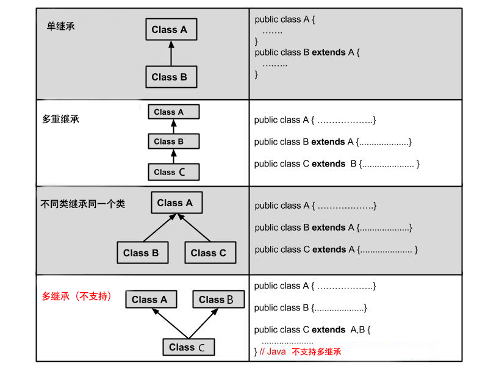
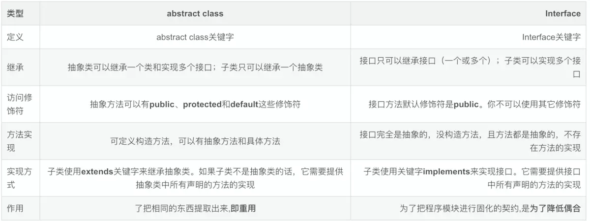

## 1、Java 继承

### 继承的概念

继承是java面向对象编程技术的一块基石，因为它允许创建分等级层次的类。

继承就是子类继承父类的特征和行为，使得子类对象（实例）具有父类的实例域和方法，或子类从父类继承方法，使得子类具有父类相同的行为。

继承需要符合的关系是：is-a，父类更通用，子类更具体。

#### 类的继承格式

在 Java 中通过 extends 关键字可以申明一个类是从另外一个类继承而来的，一般形式如下：

~~~java
class 父类 {
}
 
class 子类 extends 父类 {
}
~~~

#### 为什么需要继承

接下来我们通过实例来说明这个需求。

开发动物类，其中动物分别为企鹅以及老鼠，要求如下：

- 企鹅：属性（姓名，id），方法（吃，睡，自我介绍）
- 老鼠：属性（姓名，id），方法（吃，睡，自我介绍）

~~~java
//企鹅类
public class Penguin { 
    private String name; 
    private int id; 
    public Penguin(String myName, int  myid) { 
        name = myName; 
        id = myid; 
    } 
    public void eat(){ 
        System.out.println(name+"正在吃"); 
    }
    public void sleep(){
        System.out.println(name+"正在睡");
    }
    public void introduction() { 
        System.out.println("大家好！我是"         + id + "号" + name + "."); 
    } 
}
~~~

~~~java
//老鼠类
public class Mouse { 
    private String name; 
    private int id; 
    public Mouse(String myName, int  myid) { 
        name = myName; 
        id = myid; 
    } 
    public void eat(){ 
        System.out.println(name+"正在吃"); 
    }
    public void sleep(){
        System.out.println(name+"正在睡");
    }
    public void introduction() { 
        System.out.println("大家好！我是"         + id + "号" + name + "."); 
    } 
}
~~~

从这两段代码可以看出来，代码存在重复了，导致后果就是代码量大且臃肿，而且维护性不高(维护性主要是后期需要修改的时候，就需要修改很多的代码，容易出错)，所以要从根本上解决这两段代码的问题，就需要继承，将两段代码中相同的部分提取出来组成 一个父类：

~~~java
//公共父类
public class Animal { 
    private String name;  
    private int id; 
    public Animal(String myName, int myid) { 
        name = myName; 
        id = myid;
    } 
    public void eat(){ 
        System.out.println(name+"正在吃"); 
    }
    public void sleep(){
        System.out.println(name+"正在睡");
    }
    public void introduction() { 
        System.out.println("大家好！我是"         + id + "号" + name + "."); 
    } 
}
~~~

这个Animal类就可以作为一个父类，然后企鹅类和老鼠类继承这个类之后，就具有父类当中的属性和方法，子类就不会存在重复的代码，维护性也提高，代码也更加简洁，提高代码的复用性（复用性主要是可以多次使用，不用再多次写同样的代码） 继承之后的代码：

~~~java
//企鹅类
public class Penguin extends Animal { 
    public Penguin(String myName, int myid) { 
        super(myName, myid); 
    } 
}
~~~

~~~java
//老鼠类
public class Mouse extends Animal { 
    public Mouse(String myName, int myid) { 
        super(myName, myid); 
    } 
}
~~~

#### 继承类型

需要注意的是 Java 不支持多继承，但支持多重继承。



---

### 继承的特性

- 子类拥有父类非 private 的属性、方法。
- 子类可以拥有自己的属性和方法，即子类可以对父类进行扩展。
- 子类可以用自己的方式实现父类的方法。
- Java 的继承是单继承，但是可以多重继承，单继承就是一个子类只能继承一个父类，多重继承就是，例如 A 类继承 B 类，B 类继承 C 类，所以按照关系就是 C 类是 B 类的父类，B 类是 A 类的父类，这是 Java 继承区别于 C++ 继承的一个特性。
- 提高了类之间的耦合性（继承的缺点，耦合度高就会造成代码之间的联系越紧密，代码独立性越差）。

---

### 继承关键字

继承可以使用 extends 和 implements 这两个关键字来实现继承，而且所有的类都是继承于 java.lang.Object，当一个类没有继承的两个关键字，则默认继承object（这个类在 **java.lang** 包中，所以不需要 **import**）祖先类。

#### extends关键字

在 Java 中，类的继承是单一继承，也就是说，一个子类只能拥有一个父类，所以 extends 只能继承一个类。

~~~java
public class Animal { 
    private String name;   
    private int id; 
    public Animal(String myName, String myid) { 
        //初始化属性值
    } 
    public void eat() {  //吃东西方法的具体实现  } 
    public void sleep() { //睡觉方法的具体实现  } 
} 
 
public class Penguin  extends  Animal{ 
}
~~~

#### implements关键字

使用 implements 关键字可以变相的使java具有多继承的特性，使用范围为类继承接口的情况，可以同时继承多个接口（接口跟接口之间采用逗号分隔）。

~~~java
public interface A {
    public void eat();
    public void sleep();
}
 
public interface B {
    public void show();
}
 
public class C implements A,B {
}
~~~

#### super 与 this 关键字

==super关键字：我们可以通过super关键字来实现对父类成员的访问，用来引用当前对象的父类。==

==this关键字：指向自己的引用。==

~~~java
class Animal {
  void eat() {
    System.out.println("animal : eat");
  }
}
 
class Dog extends Animal {
  void eat() {
    System.out.println("dog : eat");
  }
  void eatTest() {
    this.eat();   // this 调用自己的方法
    super.eat();  // super 调用父类方法
  }
}
 
public class Test {
  public static void main(String[] args) {
    Animal a = new Animal();
    a.eat();
    Dog d = new Dog();
    d.eatTest();
  }
}
~~~

输出结果为：

```
animal : eat
dog : eat
animal : eat
```

#### final关键字

final 关键字声明类可以把类定义为不能继承的，即最终类；或者用于修饰方法，该方法不能被子类重写：

- 声明类：

  ```java
  final class 类名 {//类体}
  ```

- 声明方法：

  ```java
  修饰符(public/private/default/protected) final 返回值类型 方法名(){//方法体}
  ```

**注**:实例变量也可以被定义为 final，被定义为 final 的变量不能被修改。被声明为 final 类的方法自动地声明为 final，但是实例变量并不是 final。

---

### 构造器

子类是不继承父类的构造器（构造方法或者构造函数）的，它只是调用（隐式或显式）。如果父类的构造器带有参数，则必须在子类的构造器中显式地通过 **super** 关键字调用父类的构造器并配以适当的参数列表。

如果父类构造器没有参数，则在子类的构造器中不需要使用 **super** 关键字调用父类构造器，系统会自动调用父类的无参构造器。

#### 实例

~~~java
class SuperClass {
  private int n;
  SuperClass(){
    System.out.println("SuperClass()");
  }
  SuperClass(int n) {
    System.out.println("SuperClass(int n)");
    this.n = n;
  }
}
// SubClass 类继承
class SubClass extends SuperClass{
  private int n;
  
  SubClass(){ // 自动调用父类的无参数构造器
    System.out.println("SubClass");
  }  
  
  public SubClass(int n){ 
    super(300);  // 调用父类中带有参数的构造器
    System.out.println("SubClass(int n):"+n);
    this.n = n;
  }
}
// SubClass2 类继承
class SubClass2 extends SuperClass{
  private int n;
  
  SubClass2(){
    super(300);  // 调用父类中带有参数的构造器
    System.out.println("SubClass2");
  }  
  
  public SubClass2(int n){ // 自动调用父类的无参数构造器
    System.out.println("SubClass2(int n):"+n);
    this.n = n;
  }
}
public class TestSuperSub{
  public static void main (String args[]){
    System.out.println("------SubClass 类继承------");
    SubClass sc1 = new SubClass();
    SubClass sc2 = new SubClass(100); 
    System.out.println("------SubClass2 类继承------");
    SubClass2 sc3 = new SubClass2();
    SubClass2 sc4 = new SubClass2(200); 
  }
}
~~~

输出结果为：

```
------SubClass 类继承------
SuperClass()
SubClass
SuperClass(int n)
SubClass(int n):100
------SubClass2 类继承------
SuperClass(int n)
SubClass2
SuperClass()
SubClass2(int n):200
```

---


## 2、Java 重写(Override)与重载(Overload)

### 重写(Override)

重写是子类对父类的允许访问的方法的实现过程进行重新编写, 返回值和形参都不能改变。**即外壳不变，核心重写！**

重写的好处在于子类可以根据需要，定义特定于自己的行为。 也就是说子类能够根据需要实现父类的方法。

重写方法不能抛出新的检查异常或者比被重写方法申明更加宽泛的异常。例如： 父类的一个方法申明了一个检查异常 IOException，但是在重写这个方法的时候不能抛出 Exception 异常，因为 Exception 是 IOException 的父类，只能抛出 IOException 的子类异常。

在面向对象原则里，重写意味着可以重写任何现有方法。实例如下：

~~~java
class Animal{
   public void move(){
      System.out.println("动物可以移动");
   }
}
 
class Dog extends Animal{
   public void move(){
      System.out.println("狗可以跑和走");
   }
}
 
public class TestDog{
   public static void main(String args[]){
      Animal a = new Animal(); // Animal 对象
      Animal b = new Dog(); // Dog 对象
 
      a.move();// 执行 Animal 类的方法
 
      b.move();//执行 Dog 类的方法
   }
}
~~~

以上实例编译运行结果如下：

```
动物可以移动
狗可以跑和走
```

在上面的例子中可以看到，尽管 b 属于 Animal 类型，但是它运行的是 Dog 类的 move方法。

这是由于在编译阶段，只是检查参数的引用类型。

然而在运行时，Java 虚拟机(JVM)指定对象的类型并且运行该对象的方法。

因此在上面的例子中，之所以能编译成功，是因为 Animal 类中存在 move 方法，然而运行时，运行的是特定对象的方法。

思考以下例子：

~~~java
class Animal{
   public void move(){
      System.out.println("动物可以移动");
   }
}
 
class Dog extends Animal{
   public void move(){
      System.out.println("狗可以跑和走");
   }
   public void bark(){
      System.out.println("狗可以吠叫");
   }
}
 
public class TestDog{
   public static void main(String args[]){
      Animal a = new Animal(); // Animal 对象
      Animal b = new Dog(); // Dog 对象
 
      a.move();// 执行 Animal 类的方法
      b.move();//执行 Dog 类的方法
      b.bark();
   }
}
~~~

以上实例编译运行结果如下：

```
TestDog.java:30: cannot find symbol
symbol  : method bark()
location: class Animal
                b.bark();
                 ^
```

该程序将抛出一个编译错误，因为b的引用类型Animal没有bark方法。

---

#### 方法的重写规则

- 参数列表必须完全与被重写方法的相同。
- 返回类型与被重写方法的返回类型可以不相同，但是必须是父类返回值的派生类（java5 及更早版本返回类型要一样，java7 及更高版本可以不同）。
- 访问权限不能比父类中被重写的方法的访问权限更低。例如：如果父类的一个方法被声明为 public，那么在子类中重写该方法就不能声明为 protected。
- 父类的成员方法只能被它的子类重写。
- 声明为 final 的方法不能被重写。
- 声明为 static 的方法不能被重写，但是能够被再次声明。
- 子类和父类在同一个包中，那么子类可以重写父类所有方法，除了声明为 private 和 final 的方法。
- 子类和父类不在同一个包中，那么子类只能够重写父类的声明为 public 和 protected 的非 final 方法。
- 重写的方法能够抛出任何非强制异常，无论被重写的方法是否抛出异常。但是，重写的方法不能抛出新的强制性异常，或者比被重写方法声明的更广泛的强制性异常，反之则可以。
- 构造方法不能被重写。
- 如果不能继承一个方法，则不能重写这个方法。

---

#### Super 关键字的使用

当需要在子类中调用父类的被重写方法时，要使用 super 关键字。

~~~java
class Animal{
   public void move(){
      System.out.println("动物可以移动");
   }
}
 
class Dog extends Animal{
   public void move(){
      super.move(); // 应用super类的方法
      System.out.println("狗可以跑和走");
   }
}
 
public class TestDog{
   public static void main(String args[]){
 
      Animal b = new Dog(); // Dog 对象
      b.move(); //执行 Dog类的方法
 
   }
}
~~~

以上实例编译运行结果如下：

```
动物可以移动
狗可以跑和走
```

### 重载(Overload)

重载(overloading) 是==在一个类里面，方法名字相同，而参数不同。返回类型可以相同也可以不同。==

每个重载的方法（或者构造函数）都必须有一个独一无二的参数类型列表。

最常用的地方就是构造器的重载。

**重载规则:**

- 被重载的方法必须改变参数列表(参数个数或类型不一样)；
- 被重载的方法可以改变返回类型；
- 被重载的方法可以改变访问修饰符；
- 被重载的方法可以声明新的或更广的检查异常；
- 方法能够在同一个类中或者在一个子类中被重载。
- 无法以返回值类型作为重载函数的区分标准。

#### 实例

~~~java
public class Overloading {
    public int test(){
        System.out.println("test1");
        return 1;
    }
 
    public void test(int a){
        System.out.println("test2");
    }   
 
    //以下两个参数类型顺序不同
    public String test(int a,String s){
        System.out.println("test3");
        return "returntest3";
    }   
 
    public String test(String s,int a){
        System.out.println("test4");
        return "returntest4";
    }   
 
    public static void main(String[] args){
        Overloading o = new Overloading();
        System.out.println(o.test());
        o.test(1);
        System.out.println(o.test(1,"test3"));
        System.out.println(o.test("test4",1));
    }
}
~~~

---

### 重写与重载之间的区别

| 区别点   | 重载方法 | 重写方法                                       |
| :------- | :------- | :--------------------------------------------- |
| 参数列表 | 必须修改 | 一定不能修改                                   |
| 返回类型 | 可以修改 | 一定不能修改                                   |
| 异常     | 可以修改 | 可以减少或删除，一定不能抛出新的或者更广的异常 |
| 访问     | 可以修改 | 一定不能做更严格的限制（可以降低限制）         |

---

### 总结

方法的重写(Overriding)和重载(Overloading)是java多态性的不同表现，重写是父类与子类之间多态性的一种表现，重载可以理解成多态的具体表现形式。

- (1)方法重载是一个类中定义了多个方法名相同,而他们的参数的数量不同或数量相同而类型和次序不同,则称为方法的重载(Overloading)。

- (2)方法重写是在子类存在方法与父类的方法的名字相同,而且参数的个数与类型一样,返回值也一样的方法,就称为重写(Overriding)。

- (3)方法重载是一个类的多态性表现,而方法重写是子类与父类的一种多态性表现。

  

  ​						重写：子类与父类之间                                                    重载：同一个类

---


## 3、Java 多态

多态是同一个行为具有多个不同表现形式或形态的能力。

多态就是同一个接口，使用不同的实例而执行不同操作，如图所示：

多态性是对象多种表现形式的体现。

```
现实中，比如我们按下 F1 键这个动作：

如果当前在 Flash 界面下弹出的就是 AS 3 的帮助文档；
如果当前在 Word 下弹出的就是 Word 帮助；
在 Windows 下弹出的就是 Windows 帮助和支持。
同一个事件发生在不同的对象上会产生不同的结果。
```

### 多态的优点

- 消除类型之间的耦合关系
- 替换性
- 可扩充性
- 接口性
- 灵活性
- 简化性

### 多态存在的三个必要条件

- 继承
- 重写
- 父类引用指向子类对象

比如：

~~~java
Parent p = new Child();
~~~

**当使用多态方式调用方法时，首先检查父类中是否有该方法，如果没有，则编译错误；如果有，再去调用子类的同名方法。**

多态的好处：可以使程序有良好的扩展，并可以对所有类的对象进行通用处理。

以下是一个多态实例的演示，详细说明请看注释：

~~~java
public class Test {
    public static void main(String[] args) {
      show(new Cat());  // 以 Cat 对象调用 show 方法
      show(new Dog());  // 以 Dog 对象调用 show 方法
                
      Animal a = new Cat();  // 向上转型  
      a.eat();               // 调用的是 Cat 的 eat
      Cat c = (Cat)a;        // 向下转型  
      c.work();        // 调用的是 Cat 的 work
  }  
            
    public static void show(Animal a)  {
      a.eat();  
        // 类型判断
        if (a instanceof Cat)  {  // 猫做的事情 
            Cat c = (Cat)a;  
            c.work();  
        } else if (a instanceof Dog) { // 狗做的事情 
            Dog c = (Dog)a;  
            c.work();  
        }  
    }  
}
 
abstract class Animal {  
    abstract void eat();  
}  
  
class Cat extends Animal {  
    public void eat() {  
        System.out.println("吃鱼");  
    }  
    public void work() {  
        System.out.println("抓老鼠");  
    }  
}  
  
class Dog extends Animal {  
    public void eat() {  
        System.out.println("吃骨头");  
    }  
    public void work() {  
        System.out.println("看家");  
    }  
}
~~~

执行以上程序，输出结果为：

```
吃鱼
抓老鼠
吃骨头
看家
吃鱼
抓老鼠
```

---

### 虚函数

虚函数的存在是为了多态。

Java 中其实没有虚函数的概念，它的普通函数就相当于 C++ 的虚函数，动态绑定是Java的默认行为。如果 Java 中不希望某个函数具有虚函数特性，可以加上 final 关键字变成非虚函数。

#### 重写

我们将介绍在 Java 中，当设计类时，被重写的方法的行为怎样影响多态性。

我们已经讨论了方法的重写，也就是子类能够重写父类的方法。

当子类对象调用重写的方法时，调用的是子类的方法，而不是父类中被重写的方法。

要想调用父类中被重写的方法，则必须使用关键字 **super**。

~~~JAVA 
/* 文件名 : Employee.java */
public class Employee {
   private String name;
   private String address;
   private int number;
   public Employee(String name, String address, int number) {
      System.out.println("Employee 构造函数");
      this.name = name;
      this.address = address;
      this.number = number;
   }
   public void mailCheck() {
      System.out.println("邮寄支票给： " + this.name
       + " " + this.address);
   }
   public String toString() {
      return name + " " + address + " " + number;
   }
   public String getName() {
      return name;
   }
   public String getAddress() {
      return address;
   }
   public void setAddress(String newAddress) {
      address = newAddress;
   }
   public int getNumber() {
     return number;
   }
}
~~~

假设下面的类继承Employee类：

~~~JAVA 
/* 文件名 : Salary.java */
public class Salary extends Employee
{
   private double salary; // 全年工资
   public Salary(String name, String address, int number, double salary) {
       super(name, address, number);
       setSalary(salary);
   }
   public void mailCheck() {
       System.out.println("Salary 类的 mailCheck 方法 ");
       System.out.println("邮寄支票给：" + getName()
       + " ，工资为：" + salary);
   }
   public double getSalary() {
       return salary;
   }
   public void setSalary(double newSalary) {
       if(newSalary >= 0.0) {
          salary = newSalary;
       }
   }
   public double computePay() {
      System.out.println("计算工资，付给：" + getName());
      return salary/52;
   }
}
~~~

现在我们仔细阅读下面的代码，尝试给出它的输出结果：

~~~JAVA 
/* 文件名 : VirtualDemo.java */
public class VirtualDemo {
   public static void main(String [] args) {
      Salary s = new Salary("员工 A", "北京", 3, 3600.00);
      Employee e = new Salary("员工 B", "上海", 2, 2400.00);
      System.out.println("使用 Salary 的引用调用 mailCheck -- ");
      s.mailCheck();
      System.out.println("\n使用 Employee 的引用调用 mailCheck--");
      e.mailCheck();
    }
}
~~~

以上实例编译运行结果如下：

```
Employee 构造函数
Employee 构造函数
使用 Salary 的引用调用 mailCheck -- 
Salary 类的 mailCheck 方法 
邮寄支票给：员工 A ，工资为：3600.0

使用 Employee 的引用调用 mailCheck--
Salary 类的 mailCheck 方法 
邮寄支票给：员工 B ，工资为：2400.0
```

#### 例子解析

- 实例中，实例化了两个 Salary 对象：一个使用 Salary 引用 s，另一个使用 Employee 引用 e。
- 当调用 s.mailCheck() 时，编译器在编译时会在 Salary 类中找到 mailCheck()，执行过程 JVM 就调用 Salary 类的 mailCheck()。
- 因为 e 是 Employee 的引用，所以调用 e 的 mailCheck() 方法时，编译器会去 Employee 类查找 mailCheck() 方法 。
- 在编译的时候，编译器使用 Employee 类中的 mailCheck() 方法验证该语句， 但是在运行的时候，Java虚拟机(JVM)调用的是 Salary 类中的 mailCheck() 方法。

以上整个过程被称为虚拟方法调用，该方法被称为虚拟方法。

Java中所有的方法都能以这种方式表现，因此，重写的方法能在运行时调用，不管编译的时候源代码中引用变量是什么数据类型

---

### 多态的实现方式

#### 方式一：重写：

这个内容已经在上一章节详细讲过，就不再阐述。

#### 方式二：接口

- 生活中的接口最具代表性的就是插座，例如一个三接头的插头都能接在三孔插座中，因为这个是每个国家都有各自规定的接口规则，有可能到国外就不行，那是因为国外自己定义的接口类型。
- java中的接口类似于生活中的接口，就是一些方法特征的集合，但没有方法的实现。具体可以看 java接口这一章节的内容。

#### 方式三：抽象类和抽象方法

详见java抽象类章节。

---


## 4、Java 抽象类

------

在面向对象的概念中，所有的对象都是通过类来描绘的，但是反过来，并不是所有的类都是用来描绘对象的，如果一个类中没有包含足够的信息来描绘一个具体的对象，这样的类就是抽象类。

抽象类除了不能实例化对象之外，类的其它功能依然存在，成员变量、成员方法和构造方法的访问方式和普通类一样。

由于抽象类不能实例化对象，所以抽象类必须被继承，才能被使用。也是因为这个原因，通常在设计阶段决定要不要设计抽象类。

父类包含了子类集合的常见的方法，但是由于父类本身是抽象的，所以不能使用这些方法。

在Java中抽象类表示的是一种继承关系，一个类只能继承一个抽象类，而一个类却可以实现多个接口。

---

### 抽象类

在Java语言中使用abstract class来定义抽象类。如下实例：

~~~java 
/* 文件名 : Employee.java */
public abstract class Employee
{
   private String name;
   private String address;
   private int number;
   public Employee(String name, String address, int number)
   {
      System.out.println("Constructing an Employee");
      this.name = name;
      this.address = address;
      this.number = number;
   }
   public double computePay()
   {
     System.out.println("Inside Employee computePay");
     return 0.0;
   }
   public void mailCheck()
   {
      System.out.println("Mailing a check to " + this.name
       + " " + this.address);
   }
   public String toString()
   {
      return name + " " + address + " " + number;
   }
   public String getName()
   {
      return name;
   }
   public String getAddress()
   {
      return address;
   }
   public void setAddress(String newAddress)
   {
      address = newAddress;
   }
   public int getNumber()
   {
     return number;
   }
}
~~~

注意到该 Employee 类没有什么不同，尽管该类是抽象类，但是它仍然有 3 个成员变量，7 个成员方法和 1 个构造方法。 现在如果你尝试如下的例子：	

~~~java 
/* 文件名 : AbstractDemo.java */
public class AbstractDemo
{
   public static void main(String [] args)
   {
      /* 以下是不允许的，会引发错误 */
      Employee e = new Employee("George W.", "Houston, TX", 43);
 
      System.out.println("\n Call mailCheck using Employee reference--");
      e.mailCheck();
    }
}
~~~

当你尝试编译AbstractDemo类时，会产生如下错误：

```
Employee.java:46: Employee is abstract; cannot be instantiated
      Employee e = new Employee("George W.", "Houston, TX", 43);
                   ^
1 error
```

### 继承抽象类

我们能通过一般的方法继承Employee类：

~~~java 
/* 文件名 : Salary.java */
public class Salary extends Employee
{
   private double salary; //Annual salary
   public Salary(String name, String address, int number, double
      salary)
   {
       super(name, address, number);
       setSalary(salary);
   }
   public void mailCheck()
   {
       System.out.println("Within mailCheck of Salary class ");
       System.out.println("Mailing check to " + getName()
       + " with salary " + salary);
   }
   public double getSalary()
   {
       return salary;
   }
   public void setSalary(double newSalary)
   {
       if(newSalary >= 0.0)
       {
          salary = newSalary;
       }
   }
   public double computePay()
   {
      System.out.println("Computing salary pay for " + getName());
      return salary/52;
   }
}
~~~

尽管我们不能实例化一个 Employee 类的对象，但是如果我们实例化一个 Salary 类对象，该对象将从 Employee 类继承 7 个成员方法，且通过该方法可以设置或获取三个成员变量。

~~~java 
/* 文件名 : AbstractDemo.java */
public class AbstractDemo
{
   public static void main(String [] args)
   {
      Salary s = new Salary("Mohd Mohtashim", "Ambehta, UP", 3, 3600.00);
      Employee e = new Salary("John Adams", "Boston, MA", 2, 2400.00);
 
      System.out.println("Call mailCheck using Salary reference --");
      s.mailCheck();
 
      System.out.println("\n Call mailCheck using Employee reference--");
      e.mailCheck();
    }
}
~~~

以上程序编译运行结果如下：

```
Constructing an Employee
Constructing an Employee
Call mailCheck using  Salary reference --
Within mailCheck of Salary class
Mailing check to Mohd Mohtashim with salary 3600.0

Call mailCheck using Employee reference--
Within mailCheck of Salary class
Mailing check to John Adams with salary 2400.
```

### 抽象方法

如果你想设计这样一个类，该类包含一个特别的成员方法，该方法的具体实现由它的子类确定，那么你可以在父类中声明该方法为抽象方法。

Abstract 关键字同样可以用来声明抽象方法，抽象方法只包含一个方法名，而没有方法体。

抽象方法没有定义，方法名后面直接跟一个分号，而不是花括号。

~~~java 
public abstract class Employee
{
   private String name;
   private String address;
   private int number;
   
   public abstract double computePay();
   
   //其余代码
}
~~~

声明抽象方法会造成以下两个结果：

- 如果一个类包含抽象方法，那么该类必须是抽象类。
- **任何子类必须重写父类的抽象方法，或者声明自身为抽象类。**

继承抽象方法的子类必须重写该方法。否则，该子类也必须声明为抽象类。最终，必须有子类实现该抽象方法，否则，从最初的父类到最终的子类都不能用来实例化对象。

如果Salary类继承了Employee类，那么它必须实现computePay()方法：

~~~java 
/* 文件名 : Salary.java */
public class Salary extends Employee
{
   private double salary; // Annual salary
  
   public double computePay()
   {
      System.out.println("Computing salary pay for " + getName());
      return salary/52;
   }
 
   //其余代码
}
~~~

### 抽象类总结规定

1. **抽象类不能被实例化(初学者很容易犯的错)，如果被实例化，就会报错，编译无法通过。只有抽象类的非抽象子类可以创建对象。**
2. **抽象类中不一定包含抽象方法，但是有抽象方法的类必定是抽象类。**
3. **抽象类中的抽象方法只是声明，不包含方法体，就是不给出方法的具体实现也就是方法的具体功能。**
4. **构造方法，类方法（用 static 修饰的方法）不能声明为抽象方法。**
5. **抽象类的子类必须给出抽象类中的抽象方法的具体实现，除非该子类也是抽象类。**

---


## 5、Java 封装

在面向对象程式设计方法中，封装（英语：Encapsulation）是指一种将抽象性函式接口的实现细节部分包装、隐藏起来的方法。

封装可以被认为是一个保护屏障，防止该类的代码和数据被外部类定义的代码随机访问。

要访问该类的代码和数据，必须通过严格的接口控制。

封装最主要的功能在于我们能修改自己的实现代码，而不用修改那些调用我们代码的程序片段。

适当的封装可以让程式码更容易理解与维护，也加强了程式码的安全性。

#### 封装的优点

1. 良好的封装能够减少耦合。
2. 类内部的结构可以自由修改。
3. 可以对成员变量进行更精确的控制。
4. 隐藏信息，实现细节。

---

### 实现Java封装的步骤

1. 修改属性的可见性来限制对属性的访问（一般限制为private），例如：

~~~java
public class Person {
    private String name;
    private int age;
}
~~~

这段代码中，将 **name** 和 **age** 属性设置为私有的，只能本类才能访问，其他类都访问不了，如此就对信息进行了隐藏。

2. 对每个值属性提供对外的公共方法访问，也就是创建一对赋取值方法，用于对私有属性的访问，例如：

~~~java 
public class Person{
    private String name;
    private int age;
    
    public int getAge(){
      return age;
    }

    public String getName(){
      return name;
    }

    public void setAge(int age){
      this.age = age;
    }
    
    public void setName(String name){
      this.name = name;
    }
}
~~~

采用 **this** 关键字是为了解决实例变量（private String name）和局部变量（setName(String name)中的name变量）之间发生的同名的冲突。

---

#### 实例

~~~java
/* 文件名: EncapTest.java */
public class EncapTest{
 
   private String name;
   private String idNum;
   private int age;
 
   public int getAge(){
      return age;
   }
 
   public String getName(){
      return name;
   }
 
   public String getIdNum(){
      return idNum;
   }
 
   public void setAge( int newAge){
      age = newAge;
   }
 
   public void setName(String newName){
      name = newName;
   }
 
   public void setIdNum( String newId){
      idNum = newId;
   }
}
~~~

以上实例中public方法是外部类访问该类成员变量的入口。

通常情况下，这些方法被称为getter和setter方法。

因此，任何要访问类中私有成员变量的类都要通过这些getter和setter方法。

通过如下的例子说明EncapTest类的变量怎样被访问：

~~~java
/* F文件名 : RunEncap.java */
public class RunEncap{
   public static void main(String args[]){
      EncapTest encap = new EncapTest();
      encap.setName("James");
      encap.setAge(20);
      encap.setIdNum("12343ms");
 
      System.out.print("Name : " + encap.getName()+ 
                             " Age : "+ encap.getAge());
    }
}
~~~

以上代码编译运行结果如下:

```
Name : James Age : 20
```

---


## 6、Java 接口

接口（英文：Interface），在JAVA编程语言中是一个抽象类型，是抽象方法的集合，接口通常以interface来声明。一个类通过继承接口的方式，从而来继承接口的抽象方法。

接口并不是类，编写接口的方式和类很相似，但是它们属于不同的概念。类描述对象的属性和方法。接口则包含类要实现的方法。

除非实现接口的类是抽象类，否则该类要定义接口中的所有方法。

**接口无法被实例化，但是可以被实现。一个实现接口的类，必须实现接口内所描述的所有方法**，否则就必须声明为抽象类。另外，在 Java 中，接口类型可用来声明一个变量，他们可以成为一个空指针，或是被绑定在一个以此接口实现的对象。

#### 接口与类相似点：

-  一个接口可以有多个方法。
- 接口文件保存在 .java 结尾的文件中，文件名使用接口名。
- 接口的字节码文件保存在 .class 结尾的文件中。
- 接口相应的字节码文件必须在与包名称相匹配的目录结构中。

#### 接口与类的区别：

-  接口不能用于实例化对象。
- 接口没有构造方法。
- 接口中所有的方法必须是抽象方法。
- 接口不能包含成员变量，除了 static 和 final 变量。
- 接口不是被类继承了，而是要被类实现。
- 接口支持多继承。

#### 接口特性

-  接口中每一个方法也是隐式抽象的,接口中的方法会被隐式的指定为 **public abstract**（只能是 public abstract，其他修饰符都会报错）。
- 接口中可以含有变量，但是接口中的变量会被隐式的指定为 **public static final** 变量（并且只能是 public，用 private 修饰会报编译错误）。
- 接口中的方法是不能在接口中实现的，只能由实现接口的类来实现接口中的方法。

#### 抽象类和接口的区别

-  抽象类中的方法可以有方法体，就是能实现方法的具体功能，但是接口中的方法不行。
- 抽象类中的成员变量可以是各种类型的，而接口中的成员变量只能是 **public static final** 类型的。
- 接口中不能含有静态代码块以及静态方法(用 static 修饰的方法)，而抽象类是可以有静态代码块和静态方法。
- 一个类只能继承一个抽象类，而一个类却可以实现多个接口。

**注***：JDK 1.8 以后，接口里可以有静态方法和方法体了。*



----

### 接口的声明

接口的声明语法格式如下：

~~~Java
[可见度] interface 接口名称 [extends 其他的接口名] {
        // 声明变量
        // 抽象方法
}
~~~

Interface关键字用来声明一个接口。下面是接口声明的一个简单例子。

~~~java
/* 文件名 : NameOfInterface.java */
import java.lang.*;
//引入包
 
public interface NameOfInterface
{
   //任何类型 final, static 字段
   //抽象方法
}
~~~

接口有以下特性：

- 接口是隐式抽象的，当声明一个接口的时候，不必使用**abstract**关键字。
- 接口中每一个方法也是隐式抽象的，声明时同样不需要**abstract**关键字。
- 接口中的方法都是公有的

#### 实例

~~~java
/* 文件名 : Animal.java */
interface Animal {
   public void eat();
   public void travel();
}
~~~

### 接口的实现

当类实现接口的时候，类要实现接口中所有的方法。否则，类必须声明为抽象的类。

类使用implements关键字实现接口。在类声明中，Implements关键字放在class声明后面。

实现一个接口的语法，可以使用这个公式：

#### 实例

~~~java
/* 文件名 : MammalInt.java */
public class MammalInt implements Animal{
 
   public void eat(){
      System.out.println("Mammal eats");
   }
 
   public void travel(){
      System.out.println("Mammal travels");
   } 
 
   public int noOfLegs(){
      return 0;
   }
 
   public static void main(String args[]){
      MammalInt m = new MammalInt();
      m.eat();
      m.travel();
   }
}
~~~

以上实例编译运行结果如下:

```
Mammal eats
Mammal travels
```

重写接口中声明的方法时，需要注意以下规则：

- 类在实现接口的方法时，不能抛出强制性异常，只能在接口中，或者继承接口的抽象类中抛出该强制性异常。
- 类在重写方法时要保持一致的方法名，并且应该保持相同或者相兼容的返回值类型。
- 如果实现接口的类是抽象类，那么就没必要实现该接口的方法。

在实现接口的时候，也要注意一些规则：

- 一个类可以同时实现多个接口。
- 一个类只能继承一个类，但是能实现多个接口。
- 一个接口能继承另一个接口，这和类之间的继承比较相似。

---

### 接口的继承

在Java中，类的多继承是不合法，但接口允许多继承。

在接口的多继承中extends关键字只需要使用一次，在其后跟着继承接口。 如下所示：

~~~java
public interface Hockey extends Sports, Event
~~~

以上的程序片段是合法定义的子接口，与类不同的是，接口允许多继承，而 Sports及 Event 可能定义或是继承相同的方法。

---

### 标记接口

最常用的继承接口是没有包含任何方法的接口。

标记接口是没有任何方法和属性的接口.它仅仅表明它的类属于一个特定的类型,供其他代码来测试允许做一些事情。

标记接口作用：简单形象的说就是给某个对象打个标（盖个戳），使对象拥有某个或某些特权。

例如：java.awt.event 包中的 MouseListener 接口继承的 java.util.EventListener 接口定义如下：

~~~java
package java.util;
public interface EventListener
{}
~~~

没有任何方法的接口被称为标记接口。标记接口主要用于以下两种目的：

- 建立一个公共的父接口：

  正如EventListener接口，这是由几十个其他接口扩展的Java API，你可以使用一个标记接口来建立一组接口的父接口。例如：当一个接口继承了EventListener接口，Java虚拟机(JVM)就知道该接口将要被用于一个事件的代理方案。

- 向一个类添加数据类型：

  这种情况是标记接口最初的目的，实现标记接口的类不需要定义任何接口方法(因为标记接口根本就没有方法)，但是该类通过多态性变成一个接口类型。

---


## 7、Java 包(package)

为了更好地组织类，Java 提供了包机制，用于区别类名的命名空间。

#### 包的作用

1. 把功能相似或相关的类或接口组织在同一个包中，方便类的查找和使用。
2. 如同文件夹一样，包也采用了树形目录的存储方式。同一个包中的类名字是不同的，不同的包中的类的名字是可以相同的，当同时调用两个不同包中相同类名的类时，应该加上包名加以区别。因此，包可以避免名字冲突。
3. 包也限定了访问权限，拥有包访问权限的类才能访问某个包中的类。

Java 使用包（package）这种机制是为了防止命名冲突，访问控制，提供搜索和定位类（class）、接口、枚举（enumerations）和注释（annotation）等。

包语句的语法格式为：

~~~java
package pkg1[．pkg2[．pkg3…]];
~~~

例如,一个Something.java 文件它的内容

~~~java
package net.java.util;
public class Something{
   ...
}
~~~

那么它的路径应该是 **net/java/util/Something.java** 这样保存的。 package(包) 的作用是把不同的 java 程序分类保存，更方便的被其他 java 程序调用。

一个包（package）可以定义为一组相互联系的类型（类、接口、枚举和注释），为这些类型提供访问保护和命名空间管理的功能。

以下是一些 Java 中的包：

- **java.lang**-打包基础的类
- **java.io**-包含输入输出功能的函数

开发者可以自己把一组类和接口等打包，并定义自己的包。而且在实际开发中这样做是值得提倡的，当你自己完成类的实现之后，将相关的类分组，可以让其他的编程者更容易地确定哪些类、接口、枚举和注释等是相关的。

由于包创建了新的命名空间（namespace），所以不会跟其他包中的任何名字产生命名冲突。使用包这种机制，更容易实现访问控制，并且让定位相关类更加简单。

---

### 创建包

创建包的时候，你需要为这个包取一个合适的名字。之后，如果其他的一个源文件包含了这个包提供的类、接口、枚举或者注释类型的时候，都必须将这个包的声明放在这个源文件的开头。

包声明应该在源文件的第一行，每个源文件只能有一个包声明，这个文件中的每个类型都应用于它。

如果一个源文件中没有使用包声明，那么其中的类，函数，枚举，注释等将被放在一个无名的包（unnamed package）中。

#### 例子

让我们来看一个例子，这个例子创建了一个叫做animals的包。通常使用小写的字母来命名避免与类、接口名字的冲突。

在 animals 包中加入一个接口（interface）：	

~~~java 
/* 文件名: Animal.java */
package animals;
 
interface Animal {
   public void eat();
   public void travel();
}
~~~

接下来，在同一个包中加入该接口的实现：

~~~java
package animals;
 
/* 文件名 : MammalInt.java */
public class MammalInt implements Animal{
 
   public void eat(){
      System.out.println("Mammal eats");
   }
 
   public void travel(){
      System.out.println("Mammal travels");
   } 
 
   public int noOfLegs(){
      return 0;
   }
 
   public static void main(String args[]){
      MammalInt m = new MammalInt();
      m.eat();
      m.travel();
   }
}
~~~

然后，编译这两个文件，并把他们放在一个叫做animals的子目录中。 用下面的命令来运行：

```
$ mkdir animals
$ cp Animal.class  MammalInt.class animals
$ java animals/MammalInt
Mammal eats
Mammal travel
```

---

### import 关键字

为了能够使用某一个包的成员，我们需要在 Java 程序中明确导入该包。使用 "import" 语句可完成此功能。

在 java 源文件中 import 语句应位于 package 语句之后，所有类的定义之前，可以没有，也可以有多条，其语法格式为：

~~~java
import package1[.package2…].(classname|*);
~~~

如果在一个包中，一个类想要使用本包中的另一个类，那么该包名可以省略。

#### 例子

下面的 payroll 包已经包含了 Employee 类，接下来向 payroll 包中添加一个 Boss 类。Boss 类引用 Employee 类的时候可以不用使用 payroll 前缀，Boss 类的实例如下。

~~~java
package payroll;
 
public class Boss
{
   public void payEmployee(Employee e)
   {
      e.mailCheck();
   }
}
~~~

如果 Boss 类不在 payroll 包中又会怎样？Boss 类必须使用下面几种方法之一来引用其他包中的类。

使用类全名描述，例如：

~~~java
payroll.Employee
~~~

用 **import** 关键字引入，使用通配符 "*"

~~~java
import payroll.*;
~~~

使用 **import** 关键字引入 Employee 类:

~~~java
import payroll.Employee;
~~~

**注意：**

类文件中可以包含任意数量的 import 声明。import 声明必须在包声明之后，类声明之前。

---


