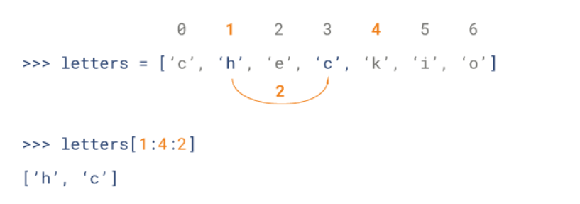
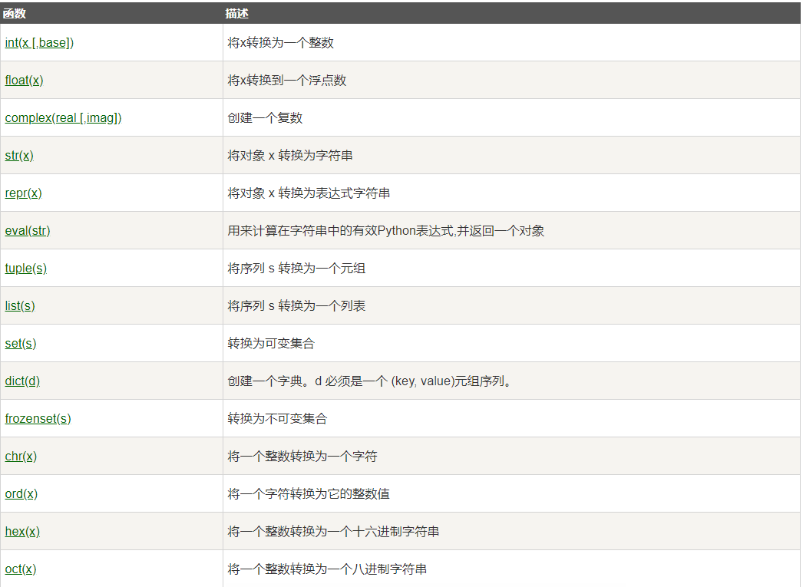

## Python 3基本语法

#### Hello

~~~python
#!/usr/bin/python3
 
# 第一个注释
print ("Hello, Python!") # 第二个注释
~~~

多行注释可以用多个 # 号，还有 ''' 和 """：

~~~python
#!/usr/bin/python3
 
# 第一个注释
# 第二个注释
 
'''
第三注释
第四注释
'''
 
"""
第五注释
第六注释
"""
print ("Hello, Python!")
~~~

#### 行与缩进

python最具特色的就是使用缩进来表示代码块，不需要使用大括号 {} 。

缩进的空格数是可变的，但是同一个代码块的语句必须包含相同的缩进空格数

~~~python
if True:
    print ("True")
else:
    print ("False")
~~~

#### 多行语句

Python 通常是一行写完一条语句，但如果语句很长，我们可以使用反斜杠(\)来实现多行语句

~~~python
total = item_one + \
        item_two + \
        item_three
~~~

在 [], {}, 或 () 中的多行语句，不需要使用反斜杠(\)

~~~python
total = ['item_one', 'item_two', 'item_three',
        'item_four', 'item_five']
~~~

#### 数字(Number)类型

python中数字有四种类型：整数、布尔型、浮点数和复数。

- **int** (整数), 如 1, 只有一种整数类型 int，表示为长整型，没有 python2 中的 Long。
- **bool** (布尔), 如 True。
- **float** (浮点数), 如 1.23、3E-2
- **complex** (复数), 如 1 + 2j、 1.1 + 2.2j

#### 字符串(String)

- python中单引号和双引号使用完全相同。
- 使用三引号('''或""")可以指定一个多行字符串。
- 转义符 '\'
- 反斜杠可以用来转义，使用r可以让反斜杠不发生转义。。 如 r"this is a line with \n" 则\n会显示，并不是换行。
- 按字面意义级联字符串，如"this " "is " "string"会被自动转换为this is string。
- 字符串可以用 + 运算符连接在一起，用 * 运算符重复。
- Python 中的字符串有两种索引方式，从左往右以 0 开始，从右往左以 -1 开始。
- Python中的字符串不能改变。
- Python 没有单独的字符类型，一个字符就是长度为 1 的字符串。
- 字符串的截取的语法格式如下：**变量[头下标:尾下标:步长]**

~~~python
word = '字符串'
sentence = "这是一个句子。"
paragraph = """这是一个段落，
可以由多行组成"""
~~~

~~~python
#!/usr/bin/python3
 
str='Runoob'
 
print(str)                 # 输出字符串
print(str[0:-1])           # 输出第一个到倒数第二个的所有字符
print(str[0])              # 输出字符串第一个字符
print(str[2:5])            # 输出从第三个开始到第五个的字符
print(str[2:])             # 输出从第三个开始后的所有字符
print(str * 2)             # 输出字符串两次
print(str + '你好')        # 连接字符串
 
print('------------------------------')
 
print('hello\nrunoob')      # 使用反斜杠(\)+n转义特殊字符
print(r'hello\nrunoob')     # 在字符串前面添加一个 r，表示原始字符串，不会发生转义
~~~

#### 空行

函数之间或类的方法之间用空行分隔，表示一段新的代码的开始。类和函数入口之间也用一行空行分隔，以突出函数入口的开始。

空行与代码缩进不同，空行并不是Python语法的一部分。书写时不插入空行，Python解释器运行也不会出错。但是空行的作用在于分隔两段不同功能或含义的代码，便于日后代码的维护或重构。

**记住:**空行也是程序代码的一部分。

#### 等待用户输入

执行下面的程序在按回车键后就会等待用户输入：

~~~python
#!/usr/bin/python3
 
input("\n\n按下 enter 键后退出。")
~~~

以上代码中 ，"\n\n"在结果输出前会输出两个新的空行。一旦用户按下 enter 键时，程序将退出。

#### 同一行显示多条语句

Python可以在同一行中使用多条语句，语句之间使用分号(;)分割，以下是一个简单的实例：

~~~python
import sys; x = 'runoob'; sys.stdout.write(x + '\n') #结果为：runoob
~~~

#### 多个语句构成代码组

缩进相同的一组语句构成一个代码块，我们称之代码组。

像if、while、def和class这样的复合语句，首行以关键字开始，以冒号( : )结束，该行之后的一行或多行代码构成代码组。

我们将首行及后面的代码组称为一个子句(clause)。

~~~python
if expression : 
   suite
elif expression : 
   suite 
else : 
   suite
~~~

#### Print 输出

print 默认输出是换行的，如果要实现不换行需要在变量末尾加上 **end=""**：

~~~python
#!/usr/bin/python3
 
x="a"
y="b"
# 换行输出
print( x )
print( y )
 
print('---------')
# 不换行输出
print( x, end=" " )
print( y, end=" " )
print()
~~~

#### import 与 from...import

在 python 用 **import** 或者 **from...import** 来导入相应的模块。

将整个模块(somemodule)导入，格式为： **import somemodule**

从某个模块中导入某个函数,格式为： **from somemodule import somefunction**

从某个模块中导入多个函数,格式为： **from somemodule import firstfunc, secondfunc, thirdfunc**

将某个模块中的全部函数导入，格式为： **from somemodule import ***

**导入sys模块**

~~~python
import sys
print('================Python import mode==========================')
print('命令行参数为:')
for i in sys.argv:
    print(i)
print('\n python 路径为',sys.path)
~~~

**导入sys模块的argv,path成员**

~~~python
from sys import argv,path  #  导入特定的成员
 
print('================python from import===================================')
print('path:',path) # 因为已经导入path成员，所以此处引用时不需要加sys.path
~~~

## Python 3基本数据类型

#### 变量

Python 中的变量不需要声明。每个变量在使用前都必须赋值，变量赋值以后该变量才会被创建。

在 Python 中，变量就是变量，它没有类型，我们所说的"类型"是变量所指的内存中对象的类型。

等号（=）用来给变量赋值。

~~~python
#!/usr/bin/python3
 
counter = 100          # 整型变量
miles   = 1000.0       # 浮点型变量
name    = "runoob"     # 字符串
 
print (counter)
print (miles)
print (name)
~~~

#### 多个变量赋值

~~~python
a = b = c = 1    #创建一个整型对象，值为 1，从后向前赋值，三个变量被赋予相同的数值。

a, b, c = 1, 2, "runoob"   #两个整型对象 1 和 2 的分配给变量 a 和 b，字符串对象 "runoob" 分配给变量 c
~~~

#### 标准数据类型

Python 3 中有六个标准的数据类型：

- Number（数字）
- String（字符串）
- List（列表）
- Tuple（元组）
- Set（集合）
- Dictionary（字典）

Python 3 的六个标准数据类型中：

- **不可变数据（3 个）：**Number（数字）、String（字符串）、Tuple（元组）；
- **可变数据（3 个）：**List（列表）、Dictionary（字典）、Set（集合）。

#### Number（数字）

Python3 支持 **int、float、bool、complex（复数）**。

在Python 3里，只有一种整数类型 int，表示为长整型。

内置的 type() 函数可以用来查询变量所指的对象类型。

~~~python
a, b, c, d = 20, 5.5, True, 4+3j
print(type(a), type(b), type(c), type(d))

'''
结果为：
<class 'int'> <class 'float'> <class 'bool'> <class 'complex'>
'''
~~~

此外还可以用 isinstance 来判断：

~~~python
a = 111
isinstance(a, int)

#结果为：True
~~~

isinstance 和 type 的区别在于：

- type()不会认为子类是一种父类类型。
- isinstance()会认为子类是一种父类类型。

**注意：** *<u>在 Python 2 中是没有布尔型的，它用数字 0 表示 False，用 1 表示 True。到 Python 3 中，把 True 和 False 定义成关键字了，但它们的值还是 1 和 0，它们可以和数字相加。</u>*

当你指定一个值时，Number 对象就会被创建：

~~~python
var1 = 1
var2 = 10
~~~

您也可以使用del语句删除一些对象引用。

del语句的语法是：

~~~python
del var1[,var2[,var3[....,varN]]]
~~~

您可以通过使用del语句删除单个或多个对象。例如：

~~~python
del var
del var_a, var_b
~~~

##### 数值运算

~~~python
>>>5 + 4  # 加法
9
>>> 4.3 - 2 # 减法
2.3
>>> 3 * 7  # 乘法,在混合计算时，Python会把整型转换成为浮点数。
21
>>> 2 / 4  # 除法，得到一个浮点数
0.5
>>> 2 // 4 # 除法，得到一个整数
0
>>> 17 % 3 # 取余 
2
>>> 2 ** 5 # 乘方
32
~~~

#### String（字符串）

Python中的字符串用单引号 ' 或双引号 " 括起来，同时使用反斜杠 \ 转义特殊字符。

字符串的截取的语法格式如下：

~~~python
变量[头下标:尾下标]
~~~

索引值以 0 为开始值，-1 为从末尾的开始位置。

加号 + 是字符串的连接符， 星号 * 表示复制当前字符串，紧跟的数字为复制的次数。实例如下：

~~~python
#!/usr/bin/python3
 
str = 'Runoob'
 
print (str)          # 输出字符串
print (str[0:-1])    # 输出第一个到倒数第二个的所有字符
print (str[0])       # 输出字符串第一个字符
print (str[2:5])     # 输出从第三个开始到第五个的字符
print (str[2:])      # 输出从第三个开始的后的所有字符
print (str * 2)      # 输出字符串两次
print (str + "TEST") # 连接字符串
~~~

Python 使用反斜杠(\)转义特殊字符，如果你不想让反斜杠发生转义，可以在字符串前面添加一个 r，表示原始字符串：

~~~python
>>> print('Ru\noob')
Ru
oob
>>> print(r'Ru\noob')
Ru\noob
>>> 
~~~

**与 C 字符串不同的是，Python 字符串不能被改变。向一个索引位置赋值，比如word[0] = 'm'会导致错误。**

#### List（列表）

List（列表） 是 Python 中使用最频繁的数据类型。

列表可以完成大多数集合类的数据结构实现。列表中元素的类型可以不相同，它支持数字，字符串甚至可以包含列表（所谓嵌套）。

列表是写在方括号 [] 之间、用逗号分隔开的元素列表。

和字符串一样，列表同样可以被索引和截取，列表被截取后返回一个包含所需元素的新列表。

列表截取的语法格式如下：

~~~python
变量[头下标:尾下标] #索引值以 0 为开始值，-1 为从末尾的开始位置。
~~~

加号 + 是列表连接运算符，星号 * 是重复操作。如下实例：

~~~python
#!/usr/bin/python3
 
list = [ 'abcd', 786 , 2.23, 'runoob', 70.2 ]
tinylist = [123, 'runoob']
 
print (list)            # 输出完整列表
print (list[0])         # 输出列表第一个元素
print (list[1:3])       # 从第二个开始输出到第三个元素
print (list[2:])        # 输出从第三个元素开始的所有元素
print (tinylist * 2)    # 输出两次列表
print (list + tinylist) # 连接列表

'''
['abcd', 786, 2.23, 'runoob', 70.2]
abcd
[786, 2.23]
[2.23, 'runoob', 70.2]
[123, 'runoob', 123, 'runoob']
['abcd', 786, 2.23, 'runoob', 70.2, 123, 'runoob']
'''
~~~

与Python字符串不一样的是，列表中的元素是可以改变的：

~~~python
>>>a = [1, 2, 3, 4, 5, 6]
>>> a[0] = 9
>>> a[2:5] = [13, 14, 15]
>>> a
[9, 2, 13, 14, 15, 6]
>>> a[2:5] = []   # 将对应的元素值设置为 [] 
>>> a
[9, 2, 6]
~~~

Python 列表截取可以接收第三个参数，参数作用是截取的步长，以下实例在索引 1 到索引 4 的位置并设置为步长为 2（间隔一个位置）来截取字符串：

如果第三个参数为负数表示逆向读取，以下实例用于翻转字符串：

~~~python
def reverseWords(input): 
      
    # 通过空格将字符串分隔符，把各个单词分隔为列表
    inputWords = input.split(" ") 
  
    # 翻转字符串
    # 假设列表 list = [1,2,3,4],  
    # list[0]=1, list[1]=2 ，而 -1 表示最后一个元素 list[-1]=4 ( 与 list[3]=4 一样) 
    # inputWords[-1::-1] 有三个参数
    # 第一个参数 -1 表示最后一个元素
    # 第二个参数为空，表示移动到列表末尾
    # 第三个参数为步长，-1 表示逆向
    inputWords=inputWords[-1::-1] 
  
    # 重新组合字符串
    output = ' '.join(inputWords) 
      
    return output 
  
if __name__ == "__main__": 
    input = 'I like runoob'
    rw = reverseWords(input) 
    print(rw)
    
    #结果为：runoob like I
~~~

#### Tuple（元组）

元组（tuple）与列表类似，不同之处在于元组的元素不能修改。元组写在小括号 () 里，元素之间用逗号隔开。

元组中的元素类型也可以不相同：

~~~python
#!/usr/bin/python3
 
tuple = ( 'abcd', 786 , 2.23, 'runoob', 70.2  )
tinytuple = (123, 'runoob')
 
print (tuple)             # 输出完整元组
print (tuple[0])          # 输出元组的第一个元素
print (tuple[1:3])        # 输出从第二个元素开始到第三个元素
print (tuple[2:])         # 输出从第三个元素开始的所有元素
print (tinytuple * 2)     # 输出两次元组
print (tuple + tinytuple) # 连接元组

"""
以上实例输出结果：
('abcd', 786, 2.23, 'runoob', 70.2)
abcd
(786, 2.23)
(2.23, 'runoob', 70.2)
(123, 'runoob', 123, 'runoob')
('abcd', 786, 2.23, 'runoob', 70.2, 123, 'runoob')
"""
~~~

元组与字符串类似，可以被索引且下标索引从0开始，-1 为从末尾开始的位置。也可以进行截取（看上面，这里不再赘述）。

其实，可以把字符串看作一种特殊的元组。

~~~python
>>>tup = (1, 2, 3, 4, 5, 6)
>>> print(tup[0])
1
>>> print(tup[1:5])
(2, 3, 4, 5)
>>> tup[0] = 11  # 修改元组元素的操作是非法的
Traceback (most recent call last):
  File "<stdin>", line 1, in <module>
TypeError: 'tuple' object does not support item assignment
>>>
~~~

虽然tuple的元素不可改变，但它可以包含可变的对象，比如list列表。

构造包含 0 个或 1 个元素的元组比较特殊，所以有一些额外的语法规则：

~~~python
tup1 = ()    # 空元组
tup2 = (20,) # 一个元素，需要在元素后添加逗号
~~~

#### Set（集合）

集合（set）是由一个或数个形态各异的大小整体组成的，构成集合的事物或对象称作元素或是成员。

基本功能是进行成员关系测试和删除重复元素。

可以使用大括号 **{ }** 或者 **set()** 函数创建集合，注意：创建一个空集合必须用 **set()** 而不是 **{ }**，因为 **{ }** 是用来创建一个空字典。

创建格式：

~~~python
parame = {value01,value02,...}
或者
set(value)
~~~

~~~python
#!/usr/bin/python3
 
student = {'Tom', 'Jim', 'Mary', 'Tom', 'Jack', 'Rose'}
 
print(student)   # 输出集合，重复的元素被自动去掉
 
# 成员测试
if 'Rose' in student :
    print('Rose 在集合中')
else :
    print('Rose 不在集合中')
 
 
# set可以进行集合运算
a = set('abracadabra')
b = set('alacazam')
 
print(a)
 
print(a - b)     # a 和 b 的差集
 
print(a | b)     # a 和 b 的并集
 
print(a & b)     # a 和 b 的交集
 
print(a ^ b)     # a 和 b 中不同时存在的元素

"""
以上实例输出结果：
{'Mary', 'Jim', 'Rose', 'Jack', 'Tom'}
Rose 在集合中
{'b', 'a', 'c', 'r', 'd'}
{'b', 'd', 'r'}
{'l', 'r', 'a', 'c', 'z', 'm', 'b', 'd'}
{'a', 'c'}
{'l', 'r', 'z', 'm', 'b', 'd'}
"""
~~~

#### Dictionary（字典）

字典（dictionary）是Python中另一个非常有用的内置数据类型。

列表是有序的对象集合，字典是无序的对象集合。两者之间的区别在于：字典当中的元素是通过键来存取的，而不是通过偏移存取。

字典是一种映射类型，字典用 **{ }** 标识，它是一个无序的 **键(key) : 值(value)** 的集合。

键(key)必须使用不可变类型。

在同一个字典中，键(key)必须是唯一的。

~~~python
#!/usr/bin/python3
 
dict = {}
dict['one'] = "1 - 菜鸟教程"
dict[2]     = "2 - 菜鸟工具"
 
tinydict = {'name': 'runoob','code':1, 'site': 'www.runoob.com'}
 
 
print (dict['one'])       # 输出键为 'one' 的值
print (dict[2])           # 输出键为 2 的值
print (tinydict)          # 输出完整的字典
print (tinydict.keys())   # 输出所有键
print (tinydict.values()) # 输出所有值

"""
以上实例输出结果：
1 - 菜鸟教程
2 - 菜鸟工具
{'name': 'runoob', 'code': 1, 'site': 'www.runoob.com'}
dict_keys(['name', 'code', 'site'])
dict_values(['runoob', 1, 'www.runoob.com'])
"""
~~~

构造函数 dict() 可以直接从键值对序列中构建字典如下：

~~~python
>>>dict([('Runoob', 1), ('Google', 2), ('Taobao', 3)])
{ 'Runoob': 1, 'Google': 2,'Taobao': 3}
 
>>> {x: x**2 for x in (2, 4, 6)}
{2: 4, 4: 16, 6: 36}
 
>>> dict(Runoob=1, Google=2, Taobao=3)
{'Runoob': 1, 'Google': 2, 'Taobao': 3}
~~~

另外，字典类型也有一些内置的函数，例如clear()、keys()、values()等。

**注意：**

- 1、字典是一种映射类型，它的元素是键值对。
- 2、字典的关键字必须为不可变类型，且不能重复。
- 3、创建空字典使用 **{ }**。

#### Python数据类型转换

有时候，我们需要对数据内置的类型进行转换，数据类型的转换，你只需要将数据类型作为函数名即可。

以下几个内置的函数可以执行数据类型之间的转换。这些函数返回一个新的对象，表示转换的值。

## Python3 输入和输出

#### 输出格式美化

Python两种输出值的方式: **表达式语句**和 **print() 函数**。

第三种方式是使用文件对象的 write() 方法，标准输出文件可以用 sys.stdout 引用。

如果你希望输出的形式更加多样，可以使用 str.format() 函数来格式化输出值。

如果你希望将输出的值转成字符串，可以使用 repr() 或 str() 函数来实现。

- **str()：** 函数返回一个用户易读的表达形式。

- **repr()：** 产生一个解释器易读的表达形式。

这里有两种方式输出一个平方与立方的表:

~~~python
>>> for x in range(1, 11):
...     print(repr(x).rjust(2), repr(x*x).rjust(3), end=' ')
...     # 注意前一行 'end' 的使用
...     print(repr(x*x*x).rjust(4))
...
 1   1    1
 2   4    8
 3   9   27
 4  16   64
 5  25  125
 6  36  216
 7  49  343
 8  64  512
 9  81  729
10 100 1000

>>> for x in range(1, 11):
...     print('{0:2d} {1:3d} {2:4d}'.format(x, x*x, x*x*x))
...
 1   1    1
 2   4    8
 3   9   27
 4  16   64
 5  25  125
 6  36  216
 7  49  343
 8  64  512
 9  81  729
10 100 1000
~~~

**注意：**在第一个例子中, 每列间的空格由 print() 添加。

这个例子展示了字符串对象的 rjust() 方法, 它可以将字符串靠右, 并在左边填充空格。

还有类似的方法, 如 ljust() 和 center()。 这些方法并不会写任何东西, 它们仅仅返回新的字符串。

str.**format()** 的基本使用如下:

~~~python
>>> print('{}网址： "{}!"'.format('菜鸟教程', 'www.runoob.com'))
菜鸟教程网址： "www.runoob.com!"
~~~

括号及其里面的字符 (称作格式化字段) 将会被 format() 中的参数替换。

在括号中的数字用于指向传入对象在 format() 中的位置，如下所示：

~~~python
>>> print('{0} 和 {1}'.format('Google', 'Runoob'))
Google 和 Runoob
>>> print('{1} 和 {0}'.format('Google', 'Runoob'))
Runoob 和 Google 	
~~~

如果在 format() 中使用了关键字参数, 那么它们的值会指向使用该名字的参数。

~~~python
>>> print('{name}网址： {site}'.format(name='菜鸟教程', site='www.runoob.com'))
菜鸟教程网址： www.runoob.com
~~~

位置及关键字参数可以任意的结合:

~~~python
>>> print('站点列表 {0}, {1}, 和 {other}。'.format('Google', 'Runoob', other='Taobao'))
站点列表 Google, Runoob, 和 Taobao。
~~~

**!a** (使用 **ascii()**), **!s** (使用 **str()**) 和 **!r** (使用 **repr()**) 可以用于在格式化某个值之前对其进行转化:

~~~python
>>> import math
>>> print('常量 PI 的值近似为： {}。'.format(math.pi))
常量 PI 的值近似为： 3.141592653589793。
>>> print('常量 PI 的值近似为： {!r}。'.format(math.pi))
常量 PI 的值近似为： 3.141592653589793。
~~~

可选项 : 和格式标识符可以跟着字段名。 这就允许对值进行更好的格式化。 下面的例子将 Pi 保留到小数点后三位：

~~~python
>>> import math
>>> print('常量 PI 的值近似为 {0:.3f}。'.format(math.pi))
常量 PI 的值近似为 3.142。
~~~

在 : 后传入一个整数, 可以保证该域至少有这么多的宽度。 用于美化表格时很有用。

~~~python
>>> table = {'Google': 1, 'Runoob': 2, 'Taobao': 3}
>>> for name, number in table.items():
...     print('{0:10} ==> {1:10d}'.format(name, number))
... 
Google     ==>          1
Runoob     ==>          2
Taobao     ==>          3
~~~

如果你有一个很长的格式化字符串, 而你不想将它们分开, 那么在格式化时通过变量名而非位置会是很好的事情。

最简单的就是传入一个字典, 然后使用方括号 [] 来访问键值 :

~~~python
>>> table = {'Google': 1, 'Runoob': 2, 'Taobao': 3}
>>> print('Runoob: {0[Runoob]:d}; Google: {0[Google]:d}; Taobao: {0[Taobao]:d}'.format(table))
Runoob: 2; Google: 1; Taobao: 3
~~~

也可以通过在 table 变量前使用 ** 来实现相同的功能：

~~~python
>>> table = {'Google': 1, 'Runoob': 2, 'Taobao': 3}
>>> print('Runoob: {Runoob:d}; Google: {Google:d}; Taobao: {Taobao:d}'.format(**table))
Runoob: 2; Google: 1; Taobao: 3
~~~

