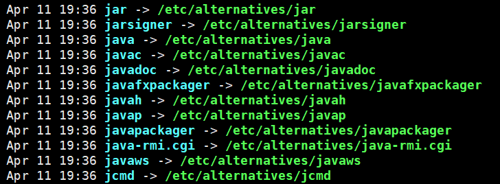

通过RPM方式安装时，是严格遵照Linux对环境变量的路径的要求，比如：

```bash
/usr/bin 可执行的命令安装目录
/usr/lib 程序所使用的库函数保存位置
/usr/share/doc 基本的软件使用手册保存位置
/usr/share/man 帮助文件保存位置
```

举例来说，我使用RPM安装的jdk1.8，安装完成后，没做任何配置，即可全局使用java命令，本以为安装过程自动在~/.bash_profile或者/etc/profile中做了环境配置，但是查看后并没有，通过$PATH也查看不到jdk的路径。
 但是在 /usr/bin中看到了如下：



也就是说，将jdk安装目录下的bin下的java、javac等命令“复制”到了这里，当然这不是简单的复制，但道理就是那个道理。所以，也就是说，当我们在任意的位置执行java相关命令时，系统会到/usr/bin中来执行。
 所以就可以理解为：/usr/bin是针对RPM安装的软件的profile文件，RPM安装过程会自动将一些可执行文件添加到/usr/bin里，从而“配置了环境”，而不需我们配置路径到profile里。

查看/usr/lib后也可以发现其中有jdk安装目录下的lib中的相关包，查看/usr/share/man后也可以发下其中有jdk安装目录下的man中的相关文档。
 所以，说到这里，应该可以理解为什么RPM不需配置环境了。

所以，在执行Java某一个命令时，若其按照RPM方式安装，就到/usr/bin下寻找该命令，找到便执行；若其是按照普通方式安装，就到profile文件里配置的路径下寻找该命令，找到便执行。

Tips：并不是说随便将一个可执行文件复制到/usr/bin中就可以全局执行（亲测不行）。如果是通过源码编译安装的JDK，则需要配置环境变量。

JDK环境变量的作用：

```bash
JAVA_HOME =你的JDK安装位置

CLASSPATH = .;%JAVA_HOME%\lib

PATH = %JAVA_HOME%\bin
```

第一个JAVA_HOME主要是给后面两个环境变量使用的。

第二个CLASSPATH指定的是默认的类库的位置，如上设置，为当前目录和JAVA_HOME的lib目录

第三个PATH是把java的bin加入到系统路径中，这样在命令行或其他程序全局调用java,javac, javaw等命令了。