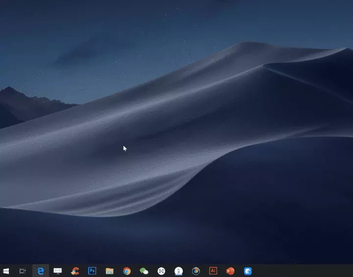
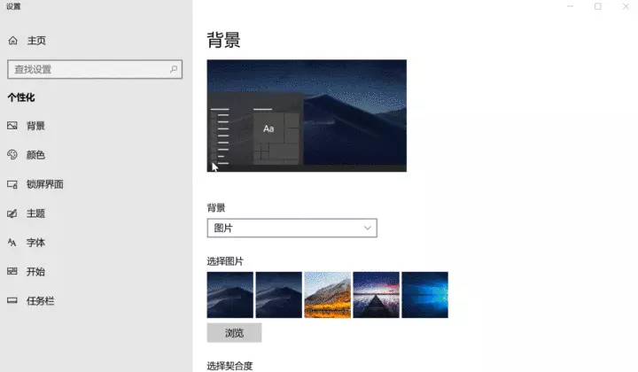

## Windows快捷键

Win+D：显示桌面

Win+E：打开资源管理器

Win+I：打开设置界面

Win+L：锁定屏幕

Win+R：打开运行窗口

Win+P：使用投影仪时，打开投影选项

Win+Q/S：打开Cortana搜索框

Win+W：打开Windows INK工作区，内有便利贴等功能

Ctrl+Alt+Del：打开任务管理器

Win+数字键：打开固定在任务栏的软件

Win+数字键，它可以用来快速打开固定在任务栏的软件，下图是使用**Win+1**来打开Edge，依此类推，打开排在第四的Photoshop，则需要用快捷键**Win+4**。

## 黑夜模式

在设置--个性化--颜色中，将默认应用模式由亮更改为暗，就可以打开Win10的黑夜模式了。

开启黑夜模式后，除了设置界面，我的电脑和部分浏览器的标签栏也会变成深色背景，这样一来，晚上也可以愉快地加班了。

## 任务视图

打开任务视图，可以使用快捷键**Win+Tab**。

在任务视图中，你可以看到所有正在运行的软件，通过点击缩略图进行软件的切换。

此外，继续往下滑动任务视图，你还可以根据时间的先后顺序，查看你在当天早些时候和过去几天打开的**文件或网页**等。

## 自带输入法

以往的Windows系统，其自带的输入法功能都比较弱，大家一般都会选择安装第三方输入法。

而在Win10中，相比以往自带的输入法，系统输入法已经有了很大的进步，但大部分人都没发现它的优点。

这里我想介绍它的三个好用功能：

**①丰富的表情包**

当你处于编辑文档的场景下，按快捷键win+.，就可以调出Win10的特殊符号面板，里面有Win10内置的表情包、颜文字和特殊标点符号等。

我平常用得最多的是特殊符号，以前我都是直接上网搜索，而自从发现了系统输入法的这个妙处，我就基本告别了以前上网搜索的方法。

