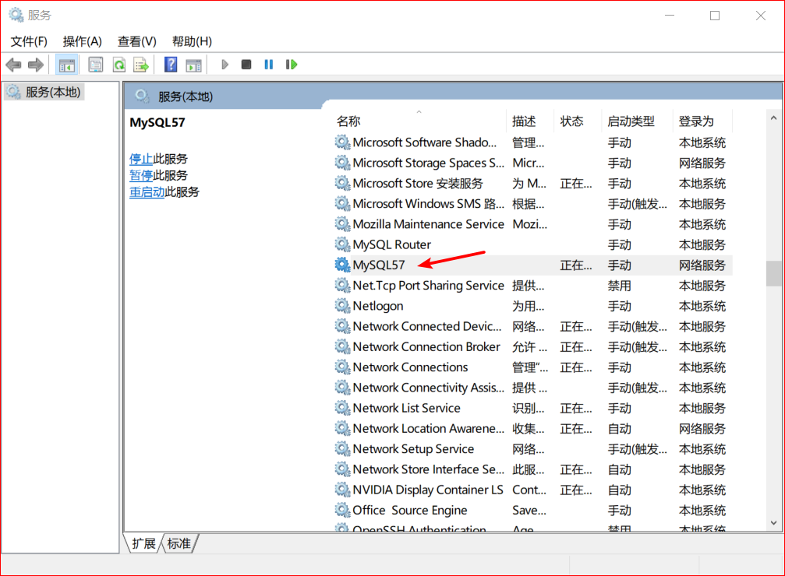
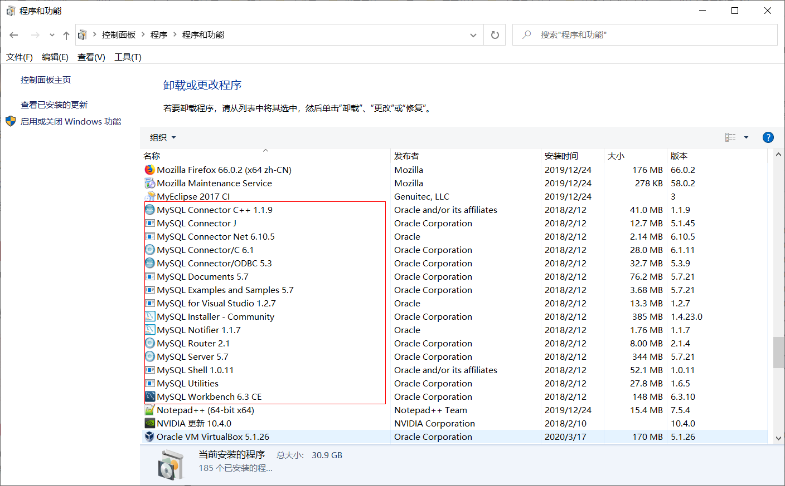
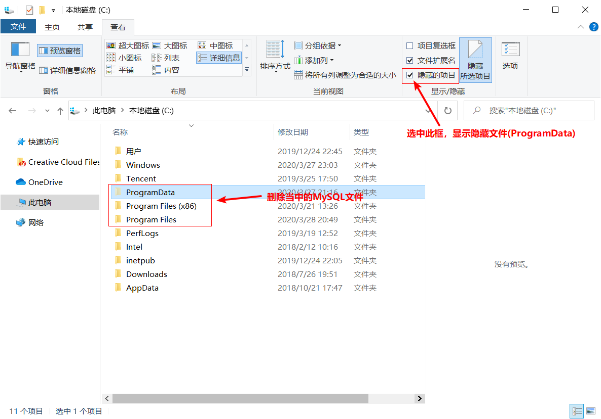

**1.停止mysql服务**

**2.将控制面板中的mysql正常卸载**

**3.找到安装路径，将所有关于mysql的文件夹都卸载**(默认安装在C盘下)

 **4、在注册表中彻底清除mysql的东西**（特别重要！！！！）

**主要删除路径** 
**路径1：**\HKEY_LOCAL_MACHINE\SYSTEM\ControlSet001\services\eventlog\Application\MySQL

**路径2：**\HKEY_LOCAL_MACHINE\SYSTEM\ControlSet002\services\eventlog\Application\MySQL

**路径3：**\HKEY_LOCAL_MACHINE\SYSTEM\CurrentControlSet\Services\Eventlog\Application\MySQL

**删除整个MySQL文件夹即可**  ，**如果没有相应的文件夹，就不用删除了。**

**5、重启电脑，开始安装新版MySQL**

