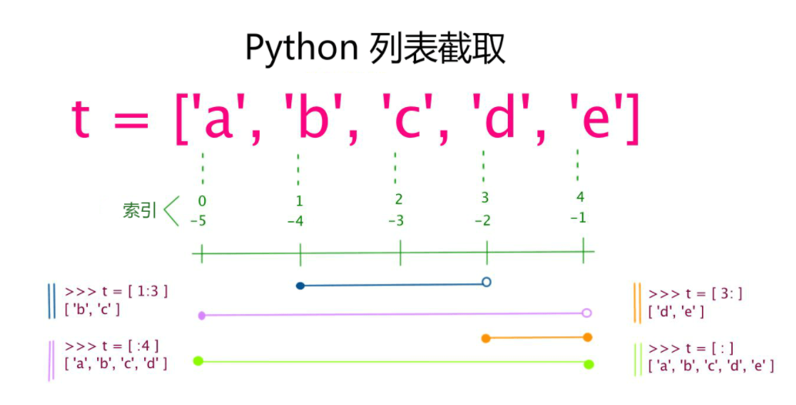
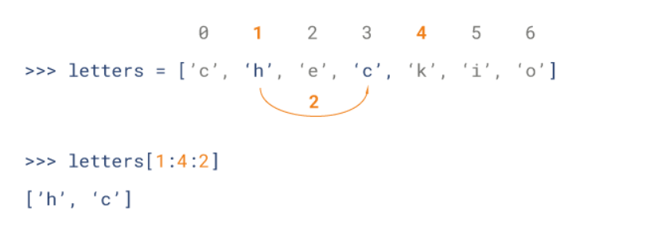
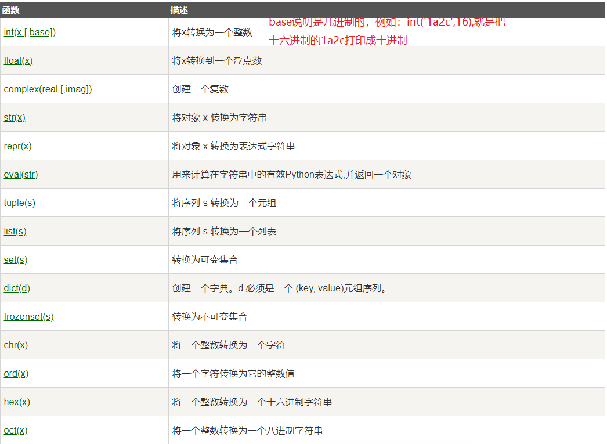
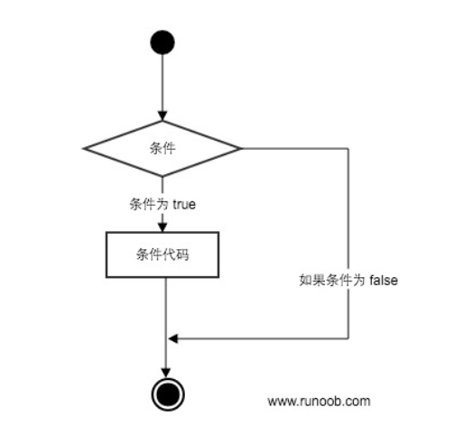
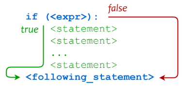
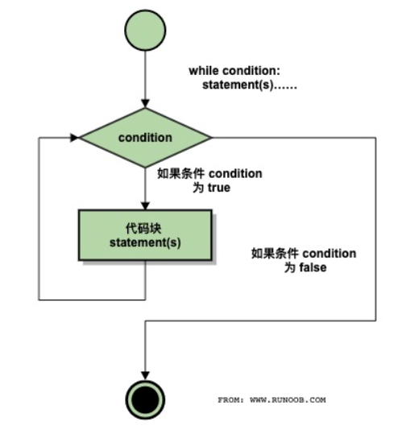
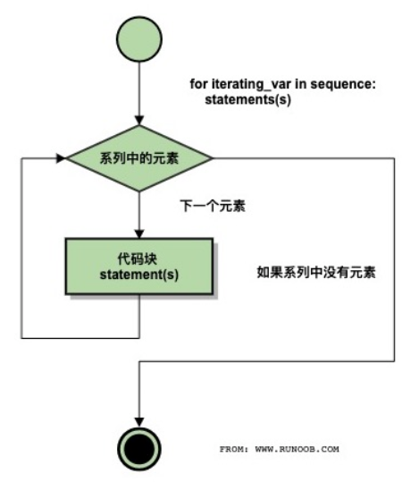
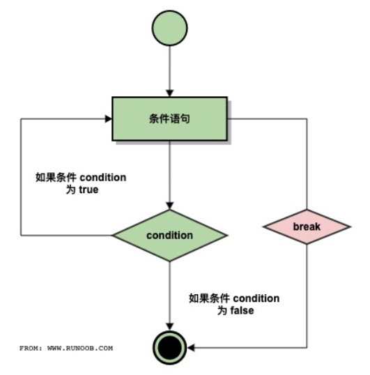
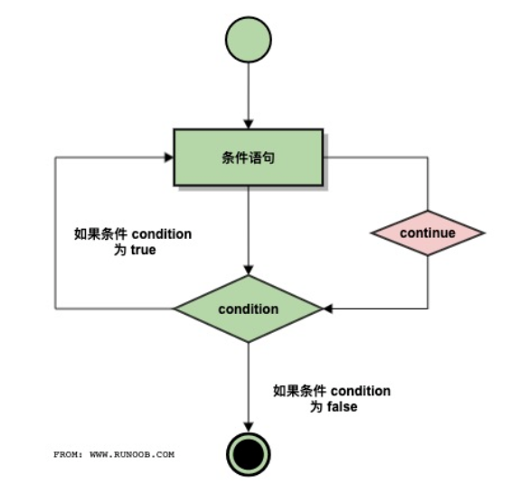
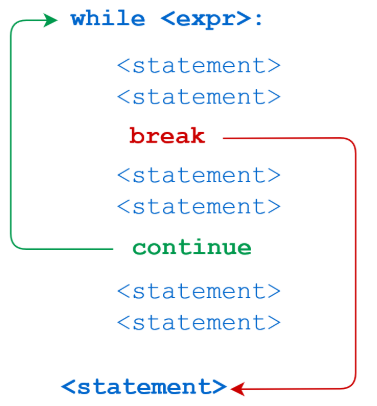

## 1、Python3 简介

### 1.1 是什么

Python 是一个高层次的结合了解释性、编译性、互动性和面向对象的脚本语言。

Python 的设计具有很强的可读性，相比其他语言经常使用英文关键字，其他语言的一些标点符号，它具有比其他语言更有特色语法结构。

- **Python 是一种解释型语言**： 这意味着开发过程中没有了编译这个环节。类似于PHP和Perl语言。
- **Python 是交互式语言** ：这意味着，您可以在一个 Python 提示符 **>>>** 后直接执行代码。
- **Python 是面向对象语言** ：这意味着Python支持面向对象的风格或代码封装在对象的编程技术。
- **Python 是初学者的语言**：Python 对初级程序员而言，是一种伟大的语言，它支持广泛的应用程序开发，从简单的文字处理到 WWW 浏览器再到游戏。

### 1.2 发展历史

Python 是由 Guido van Rossum 在八十年代末和九十年代初，在荷兰国家数学和计算机科学研究所设计出来的。

Python 本身也是由诸多其他语言发展而来的,这包括 ABC、Modula-3、C、C++、Algol-68、SmallTalk、Unix shell 和其他的脚本语言等等。

像 Perl 语言一样，Python 源代码同样遵循 GPL(GNU General Public License)协议。

现在 Python 是由一个核心开发团队在维护，Guido van Rossum 仍然占据着至关重要的作用，指导其进展。

Python 2.0 于 2000 年 10 月 16 日发布，增加了实现完整的垃圾回收，并且支持 Unicode。

Python 3.0 于 2008 年 12 月 3 日发布，此版不完全兼容之前的 Python 源代码。不过，很多新特性后来也被移植到旧的Python 2.6/2.7版本。

Python 3.0 版本，常被称为 Python 3000，或简称 Py3k。相对于 Python 的早期版本，这是一个较大的升级。

Python 2.7 被确定为最后一个 Python 2.x 版本，它除了支持 Python 2.x 语法外，还支持部分 Python 3.1 语法。

### 1.3 特点

- **1.易于学习**：Python有相对较少的关键字，结构简单，和一个明确定义的语法，学习起来更加简单。
- **2.易于阅读**：Python代码定义的更清晰。
- **3.易于维护**：Python的成功在于它的源代码是相当容易维护的。
- **4.一个广泛的标准库**：Python的最大的优势之一是丰富的库，跨平台的，在UNIX，Windows和Macintosh兼容很好。
- **5.互动模式**：互动模式的支持，您可以从终端输入执行代码并获得结果的语言，互动的测试和调试代码片断。
- **6.可移植**：基于其开放源代码的特性，Python已经被移植（也就是使其工作）到许多平台。
- **7.可扩展**：如果你需要一段运行很快的关键代码，或者是想要编写一些不愿开放的算法，你可以使用C或C++完成那部分程序，然后从你的Python程序中调用。
- **8.数据库**：Python提供所有主要的商业数据库的接口。
- **9.GUI编程**：Python支持GUI可以创建和移植到许多系统调用。
- **10.可嵌入**: 你可以将Python嵌入到C/C++程序，让你的程序的用户获得"脚本化"的能力。

**Python的设计哲学**

~~~shell
C:\Users\LWJ
λ python
Python 3.6.10 |Anaconda, Inc.| (default, Jan  7 2020, 15:18:16) [MSC v.1916 64 bit (AMD64)] on win32

Warning:
This Python interpreter is in a conda environment, but the environment has
not been activated. Libraries may fail to load.  To activate this environment
please see https://conda.io/activation

Type "help", "copyright", "credits" or "license" for more information.
>>> import this   #下面就是设计哲学
The Zen of Python, by Tim Peters

Beautiful is better than ugly.
Explicit is better than implicit.
Simple is better than complex.
Complex is better than complicated.
Flat is better than nested.
Sparse is better than dense.
Readability counts.
Special cases aren't special enough to break the rules.
Although practicality beats purity.
Errors should never pass silently.
Unless explicitly silenced.
In the face of ambiguity, refuse the temptation to guess.
There should be one-- and preferably only one --obvious way to do it.
Although that way may not be obvious at first unless you're Dutch.
Now is better than never.
Although never is often better than *right* now.
If the implementation is hard to explain, it's a bad idea.
If the implementation is easy to explain, it may be a good idea.
Namespaces are one honking great idea -- let's do more of those!
>>>
~~~


### 1.3 应用

- Youtube - 视频社交网站
- Reddit - 社交分享网站
- Dropbox - 文件分享服务
- 豆瓣网 - 图书、唱片、电影等文化产品的资料数据库网站
- 知乎 - 一个问答网站
- 果壳 - 一个泛科技主题网站
- Bottle - Python微Web框架
- EVE - 网络游戏EVE大量使用Python进行开发
- Blender - 使用Python作为建模工具与GUI语言的开源3D绘图软件
- Inkscape - 一个开源的SVG矢量图形编辑器。
- ...


- **Web应用开发**

Python经常被用于Web开发。比如，通过mod_wsgi模块，Apache可以运行用Python编写的Web程序。Python定义了WSGI标准应用接口来协调Http服务器与基于Python的Web程序之间的通信。一些Web框架，如Django，TurboGears，web2py，Zope等，可以让程序员轻松地开发和管理复杂的Web程序。

基于Python的Web开发框架不要太多，比如耳熟能详的Django，还有Tornado，Flask。其中的Python+Django架构，应用范围非常广，开发速度非常快，学习门槛也很低，能够帮助你快速的搭建起可用的WEB服务。

- **操作系统管理、服务器运维的自动化脚本**

在很多操作系统里，Python是标准的系统组件。大多数Linux发行版以及NetBSD、OpenBSD和MacOSX都集成了Python，可以在终端下直接运行Python。有一些Linux发行版的安装器使用Python语言编写，比如Ubuntu的Ubiquity安装器，RedHatLinux和Fedora的Anaconda安装器。GentooLinux使用Python来编写它的Portage包管理系统。Python标准库包含了多个调用操作系统功能的库。通过pywin32这个第三方软件包，Python能够访问Windows的COM服务及其它WindowsAPI。使用IronPython，Python程序能够直接调用.NetFramework。一般说来，Python编写的系统管理脚本在可读性、性能、代码重用度、扩展性几方面都优于普通的shell脚本。

- **科学计算**

NumPy，SciPy，Matplotlib可以让Python程序员编写科学计算程序。

- **桌面软件**

PyQt、PySide、wxPython、PyGTK是Python快速开发桌面应用程序的利器。

- **服务器软件（网络软件）**

Python对于各种网络协议的支持很完善，因此经常被用于编写服务器软件、网络爬虫。第三方库Twisted支持异步网络编程和多数标准的网络协议（包含客户端和服务器），并且提供了多种工具，被广泛用于编写高性能的服务器软件。

- **网络爬虫**

也称网络蜘蛛，是大数据行业获取数据的核心工具。没有网络爬虫自动地、不分昼夜地、高智能地在互联网上爬取免费的数据，那些大数据相关的公司恐怕要少四分之三。能够编写网络爬虫的编程语言有不少，但Python绝对是其中的主流之一，其Scripy爬虫框架应用非常广泛。

- **游戏**

很多游戏使用C++编写图形显示等高性能模块，而使用Python或者Lua编写游戏的逻辑、服务器。相较于Python，Lua的功能更简单、体积更小；而Python则支持更多的特性和数据类型。

YouTube、Google、Yahoo！、NASA都在内部大量地使用Python。

- **数据分析**

在大量数据的基础上，结合科学计算、机器学习等技术，对数据进行清洗、去重、规格化和针对性的分析是大数据行业的基石。Python是数据分析的主流语言之一。

- **人工智能**

Python在人工智能大范畴领域内的机器学习、神经网络、深度学习等方面都是主流的编程语言，得到广泛的支持和应用。

---

安装配置python anaconda

开发工具pycharm

**pycharm快捷键**

全局搜索：双击shift

快速格式化代码：Ctrl+alt+L

快速复制粘贴选中的代码：Ctrl + D

移动一行代码：Ctrl + shift + 上下键


---

## 2、Python 3基本语法

### 2.1 编码

默认情况下，Python 3 源码文件以 **UTF-8** 编码，所有字符串都是 unicode（统一码，万国码） 字符串。 当然你也可以为源码文件指定不同的编码：

```python
# -*- coding: cp-1252 -*-
```

上述定义允许在源文件中使用 Windows-1252 字符集中的字符编码，对应适合语言为保加利亚语、白罗斯语、马其顿语、俄语、塞尔维亚语。

~~~python
# 使用内置函数 chr 和 ord 能顾查看数字和字符的对应关系
# ord 获取字符对应的编码；chr 根据编码获取对应的字符
print(ord('a'))	# 字符对应的编码是97  unicode编码
print(chr(65))	# A
print(12375)	# 日文 你好
~~~

### 2.2 标识符

- 第一个字符必须是字母表中字母或下划线 **_** 。
- 标识符的其他的部分由字母、数字和下划线组成。
- **标识符对大小写敏感。**

在 Python 3 中，**可以用中文作为变量名**，非 ASCII 标识符也是允许的了。

**命名规则**

- 小驼峰命名法：第一个单词的首字母小写，以后每个单词的首字母大写
- 大驼峰命名法：每个单词的首字母都大写
- 使用下划线连接

**python里的命名规则**

- **python里的变量、函数和模块名使用下划线连接**
- **python里的类名使用大驼峰命名法**

### 2.3 python保留字

保留字即关键字，我们不能把它们用作任何标识符名称。Python 的标准库提供了一个 keyword 模块，可以输出当前版本的所有关键字：

```shell
>>> import keyword
>>> keyword.kwlist
['False', 'None', 'True', 'and', 'as', 'assert', 'break', 'class', 'continue', 'def', 'del', 'elif', 'else', 'except', 'finally', 'for', 'from', 'global', 'if', 'import', 'in', 'is', 'lambda', 'nonlocal', 'not', 'or', 'pass', 'raise', 'return', 'try', 'while', 'with', 'yield']
```

### 2.4 注释

Python中单行注释以 **#** 开头，实例如下：

~~~python
#!/usr/bin/python3
 
# 第一个注释
print ("Hello, Python!") # 第二个注释
~~~

多行注释可以用多个 # 号，还有 ''' 和 """：

~~~python
#!/usr/bin/python3
 
# 第一个注释
# 第二个注释
 
'''
第三注释
第四注释
'''
 
"""
第五注释
第六注释
"""
print ("Hello, Python!")
~~~

执行以上代码，输出结果为：

```python
Hello, Python!
```

### 2.5 行与缩进

python最具特色的就是使用缩进来表示代码块，不需要使用大括号 {} 。

缩进的空格数是可变的，但是同一个代码块的语句必须包含相同的缩进空格数

~~~python
if True:
    print ("True")
else:
    print ("False")
~~~

### 2.6 多行语句

Python 通常是一行写完一条语句，但如果语句很长，我们可以使用反斜杠(\)来实现多行语句

~~~python
total = item_one + \
        item_two + \
        item_three
~~~

在 [], {}, 或 () 中的多行语句，不需要使用反斜杠(\)

~~~python
total = ['item_one', 'item_two', 'item_three',
        'item_four', 'item_five']
~~~

### 2.7 空行

函数之间或类的方法之间用空行分隔，表示一段新的代码的开始。类和函数入口之间也用一行空行分隔，以突出函数入口的开始。

空行与代码缩进不同，空行并不是Python语法的一部分。书写时不插入空行，Python解释器运行也不会出错。但是空行的作用在于分隔两段不同功能或含义的代码，便于日后代码的维护或重构。

**记住:**空行也是程序代码的一部分。

### 2.8 同一行显示多条语句

Python可以在同一行中使用多条语句，语句之间使用分号(;)分割，以下是一个简单的实例：

~~~python
import sys; x = 'runoob'; sys.stdout.write(x + '\n') 
#结果为：runoob
~~~

### 2.9 多个语句构成代码组

缩进相同的一组语句构成一个代码块，我们称之代码组。

像if、while、def和class这样的复合语句，首行以关键字开始，以冒号( : )结束，该行之后的一行或多行代码构成代码组。

我们将首行及后面的代码组称为一个子句(clause)。

~~~python
if expression : 
   suite
elif expression : 
   suite 
else : 
   suite
~~~

### 2.10 import 与 from...import

在 python 用 **import** 或者 **from...import** 来导入相应的模块。

将整个模块(somemodule)导入，格式为： **import somemodule**

从某个模块中导入某个函数,格式为： **from somemodule import somefunction**

从某个模块中导入多个函数,格式为： **from somemodule import firstfunc, secondfunc, thirdfunc**

将某个模块中的全部函数导入，格式为： **from somemodule import ***

**导入sys模块**

~~~python
import sys
print('================Python import mode==========================')
print('命令行参数为:')
for i in sys.argv:
    print(i)
print('\n python 路径为',sys.path)
~~~

**导入sys模块的argv,path成员**

~~~python
from sys import argv,path  #  导入特定的成员
 
print('================python from import===================================')
print('path:',path) # 因为已经导入path成员，所以此处引用时不需要加sys.path
~~~

---

## 3、Python 3基本数据类型

### 3.1 变量的定义

**Python 中的变量不需要声明。每个变量在使用前都必须赋值，变量赋值以后该变量才会被创建。**

在 Python 中，变量就是变量，它没有类型，我们所说的"类型"是变量所指的内存中对象的类型。

等号（=）用来给变量赋值。

~~~python
#!/usr/bin/python3
 
counter = 100          # 整型变量
miles   = 1000.0       # 浮点型变量
name    = "runoob"     # 字符串
 
print (counter)
print (miles)
print (name)
~~~

### 3.2 多个变量赋值

~~~python
a = b = c = 1    #创建一个整型对象，值为 1，从后向前赋值，三个变量被赋予相同的数值。

a, b, c = 1, 2, "runoob"   #两个整型对象 1 和 2 的分配给变量 a 和 b，字符串对象 "runoob" 分配给变量 c
~~~

#### 3.2.1 交换两个变量

~~~python
a = 13
b = 20

# 方法一：使用第三个变量实现
c = b
b = a
a = c

# 方法二：使用运算符来实现，只能是数字 
a = a + b
b = a - b
a = a - b

# 方法三：使用异或运算符
a = a ^ b
b = a ^ b
a = a ^ b

# 方法四：使用python特有
a,b = b,a

print(a)	#20
print(b)	#13
~~~

### 3.3 标准数据类型

Python 3 中有六个标准的数据类型：

- **Number（数字）**
- **String（字符串）**
- **List（列表）**
- **Tuple（元组）**
- **Set（集合）**
- **Dictionary（字典）**

Python 3 的六个标准数据类型中：

- **不可变数据（3 个）**：Number（数字）、String（字符串）、Tuple（元组）；
- **可变数据（3 个）**：List（列表）、Dictionary（字典）、Set（集合）。
- **不可变类型**：变量赋值 **a=5** 后再赋值 **a=10**，这里实际是新生成一个 int 值对象 10，再让 a 指向它，而 5 被丢弃，不是改变a的值，相当于新生成了a。
- **可变类型**：变量赋值 **la=[1,2,3,4]** 后再赋值 **la[2]=5** 则是将 list la 的第三个元素值更改，本身la没有动，只是其内部的一部分值被修改了。

### 3.4 Number（数字）

python中数字有四种类型：整数、布尔型、浮点数和复数。

- **int** (整数), 如 1, 只有一种整数类型 int，表示为长整型，没有 python2 中的 Long。
- **bool** (布尔), 如 True。
- **float** (浮点数), 如 1.23、3E-2
- **complex** (复数), 如 1 + 2j、 1.1 + 2.2j

在Python 3里，只有一种整数类型 int，表示为长整型，没有 python2 中的 Long。

内置的 type() 函数可以用来查询变量所指的对象类型。

~~~python
>>> a, b, c, d = 20, 5.5, True, 4+3j
>>> print(type(a), type(b), type(c), type(d))
<class 'int'> <class 'float'> <class 'bool'> <class 'complex'>
~~~

此外还可以用 isinstance 来判断：

~~~python
>>> a = 111
>>> isinstance(a, int)
True
>>>
~~~

isinstance 和 type 的区别在于：

- type()不会认为子类是一种父类类型。
- isinstance()会认为子类是一种父类类型。

**注意：** *<u>在 Python 2 中是没有布尔型的，它用数字 0 表示 False，用 1 表示 True。到 Python 3 中，把 True 和 False 定义成关键字了，但它们的值还是 1 和 0，它们可以和数字相加。</u>*

当你指定一个值时，Number 对象就会被创建：

~~~python
var1 = 1
var2 = 10
~~~

您也可以使用del语句删除一些对象引用。

del语句的语法是：

~~~python
del var1[,var2[,var3[....,varN]]]
~~~

您可以通过使用del语句删除单个或多个对象。例如：

~~~python
del var
del var_a, var_b
~~~

**数值运算**

~~~python
>>>5 + 4  # 加法
9
>>> 4.3 - 2 # 减法
2.3
>>> 3 * 7  # 乘法,在混合计算时，Python会把整型转换成为浮点数。
21
>>> 2 / 4  # 除法，得到一个浮点数
0.5
>>> 2 // 4 # 除法，得到一个整数
0
>>> 17 % 3 # 取余 
2
>>> 2 ** 5 # 乘方
32
~~~

还有**数学函数、随机数函数、三角函数**

**数学常量**

| 常量 | 描述                                  |
| :--- | :------------------------------------ |
| pi   | 数学常量 pi（圆周率，一般以π来表示）  |
| e    | 数学常量 e，e即自然常数（自然常数）。 |

#### 不同进制数据的表示方式

~~~python
b = 0b101010101	# 以0b开头的数字是二进制
print(b)	# 当print语句打印一个数字的时候，默认是使用十进制打印的

c = 0o34	# 以0o开头的数字是八进制的
print(c)	# 十进制是28

d = 0x23	# 以0x开头的数字是十六进制
print(d)	# 35
~~~

**十进制转换为二进制**

~~~python
e = [0,0,0,0,0,0,0,0]
s = int(input("请输入一个十位数："))
for i in range(0,8,1):
    e[i] = int(s%2)
    s=s//2
e.reverse()
print("二进制数为：",e)
~~~

**二进制转换为八进制和十六进制**

~~~python

~~~


**使用内置函数实现进制转换**

~~~python
# 十进制转换成二进制
num = 8
v = bin(num)
print(v)   ------0b1000------

# 十进制转换成八进制
num = 8
v = oct(num)
print(v)    ------0o10------

# 十进制转换成十六进制
num = 8
v = hex(num)
print(v)   ------0x8------

# 二进制转换成十进制
# print直接输出，默认输出十进制
v1 = 0b1111
print(v1)   ------15------
# 八进制转换成十进制
v1 = 0o1111
print(v1)   ------585------
# 十六进制转换成十进制
v1 = 0x1111
print(v1)    ------4369------
~~~

### 3.5 String（字符串）

#### 3.5.1 字符串的表示方式

Python中的字符串用单引号 ' 或双引号 " 括起来，同时使用反斜杠 \ 转义特殊字符。

创建字符串很简单，只要为变量分配一个值即可。例如：

~~~python
var1 = 'Hello World!'
var2 = "Runoob"
~~~

**Python三引号**

python三引号允许一个字符串跨多行，字符串中可以包含换行符、制表符以及其他特殊字符。实例如下：

~~~python
#!/usr/bin/python3
 
para_str = """这是一个多行字符串的实例
多行字符串可以使用制表符
TAB ( \t )。
也可以使用换行符 [ \n ]。
"""
print (para_str)
~~~

以上实例执行结果为：

```python
这是一个多行字符串的实例
多行字符串可以使用制表符
TAB (    )。
也可以使用换行符 [ 
 ]。
```

三引号让程序员从引号和特殊字符串的泥潭里面解脱出来，自始至终保持一小块字符串的格式是所谓的WYSIWYG（所见即所得）格式的。

一个典型的用例是，当你需要一块HTML或者SQL时，这时用字符串组合，特殊字符串转义将会非常的繁琐。

**Python转义字符**

在需要在字符中使用特殊字符时，python用反斜杠`\`转义字符。如下表：

| 转义字符    | 描述                                                         |
| :---------- | :----------------------------------------------------------- |
| \(在行尾时) | 续行符                                                       |
| \\          | 反斜杠符号                                                   |
| \'          | 单引号                                                       |
| \"          | 双引号                                                       |
| \a          | 响铃                                                         |
| \b          | 退格(Backspace)                                              |
| \000        | 空                                                           |
| \n          | 换行                                                         |
| \v          | 纵向制表符                                                   |
| \t          | 横向制表符                                                   |
| \r          | 回车                                                         |
| \f          | 换页                                                         |
| \oyy        | 八进制数，**yy** 代表的字符，例如：**\o12** 代表换行，其中 o 是字母，不是数字 0。 |
| \xyy        | 十六进制数，yy代表的字符，例如：\x0a代表换行                 |
| \other      | 其它的字符以普通格式输出                                     |

**Unicode 字符串**

在Python2中，普通字符串是以8位ASCII码进行存储的，而Unicode字符串则存储为16位unicode字符串，这样能够表示更多的字符集。使用的语法是在字符串前面加上前缀 **u**。

在Python3中，所有的字符串都是Unicode字符串。

#### 3.5.2 访问字符串中的值

(字符串的下标和切片)

字符串的获取的语法格式如下：

~~~python
变量[头下标:尾下标:step]
~~~

索引值以 0 为开始值，-1 为从末尾的开始位置。

加号 + 是字符串的连接符， 星号 * 表示复制当前字符串，紧跟的数字为复制的次数。实例如下：

~~~python
#!/usr/bin/python3
 
str = 'Runoob'
 
print (str)          # 输出字符串
print (str[0:-1])    # 输出第一个到倒数第二个的所有字符
print (str[0])       # 输出字符串第一个字符
print (str[2:5])     # 输出从第三个开始到第五个的字符
print (str[2:])      # 输出从第三个开始的后的所有字符
print (str * 2)      # 输出字符串两次
print (str + "TEST") # 连接字符串

'''
执行以上程序会输出如下结果：
Runoob
Runoo
R
noo
noob
RunoobRunoob
RunoobTEST
'''
~~~

Python 使用反斜杠`\`转义特殊字符，如果你不想让反斜杠发生转义，可以在字符串前面添加一个 r，表示原始字符串：

~~~python
>>> print('Ru\noob')
Ru
oob
>>> print(r'Ru\noob')
Ru\noob
>>> 
~~~

**与 C 字符串不同的是，Python 字符串不能被改变。向一个索引位置赋值，比如word[0] = 'm'会导致错误。**

#### 3.5.3 字符串运算符

下表实例变量a值为字符串 "Hello"，b变量值为 "Python"：

| 操作符 | 描述                                                         | 实例                            |
| :----- | :----------------------------------------------------------- | :------------------------------ |
| +      | 字符串连接                                                   | a + b 输出结果： HelloPython    |
| *      | 重复输出字符串                                               | a*2 输出结果：HelloHello        |
| []     | 通过索引获取字符串中字符                                     | a[1] 输出结果 **e**             |
| [ : ]  | 截取字符串中的一部分，遵循**左闭右开**原则，str[0:2] 是不包含第 3 个字符的。 | a[1:4] 输出结果 **ell**         |
| in     | 成员运算符 - 如果字符串中包含给定的字符返回 True             | **'H' in a** 输出结果 True      |
| not in | 成员运算符 - 如果字符串中不包含给定的字符返回 True           | **'M' not in a** 输出结果 True  |
| r/R    | 原始字符串 - 原始字符串：所有的字符串都是直接按照字面的意思来使用，没有转义特殊或不能打印的字符。 原始字符串除在字符串的第一个引号前加上字母 **r**（可以大小写）以外，与普通字符串有着几乎完全相同的语法。 | `print( r'\n' ) print( R'\n' )` |
| %      | 格式字符串                                                   | 请看Python字符串格式化。        |

~~~python
#!/usr/bin/python3
 
a = "Hello"
b = "Python"
 
print("a + b 输出结果：", a + b)
print("a * 2 输出结果：", a * 2)
print("a[1] 输出结果：", a[1])
print("a[1:4] 输出结果：", a[1:4])
 
if( "H" in a) :
    print("H 在变量 a 中")
else :
    print("H 不在变量 a 中")
 
if( "M" not in a) :
    print("M 不在变量 a 中")
else :
    print("M 在变量 a 中")
 
print (r'\n')
print (R'\n')
~~~

以上实例输出结果为：

```python
a + b 输出结果： HelloPython
a * 2 输出结果： HelloHello
a[1] 输出结果： e
a[1:4] 输出结果： ell
H 在变量 a 中
M 不在变量 a 中
\n
\n
```

#### 3.5.4 字符串格式化

Python 支持格式化字符串的输出 。尽管这样可能会用到非常复杂的表达式，但最基本的用法是将一个值插入到一个有字符串格式符 %s 的字符串中。

在 Python 中，字符串格式化使用与 C 中 sprintf 函数一样的语法。

~~~python
#!/usr/bin/python3
 
print ("我叫 %s 今年 %d 岁!" % ('小明', 10))
~~~

以上实例输出结果：

```python
我叫 小明 今年 10 岁!
```

python字符串格式化符号:

| 符  号 | 描述                                 |
| :----- | :----------------------------------- |
| %c     | 格式化字符及其ASCII码                |
| %s     | 格式化字符串                         |
| %d     | 格式化整数                           |
| %u     | 格式化无符号整型                     |
| %o     | 格式化无符号八进制数                 |
| %x     | 格式化无符号十六进制数               |
| %X     | 格式化无符号十六进制数（大写）       |
| %f     | 格式化浮点数字，可指定小数点后的精度 |
| %e     | 用科学计数法格式化浮点数             |
| %E     | 作用同%e，用科学计数法格式化浮点数   |
| %g     | %f和%e的简写                         |
| %G     | %f 和 %E 的简写                      |
| %p     | 用十六进制数格式化变量的地址         |

Python2.6 开始，新增了一种格式化字符串的函数 [str.format()](https://www.runoob.com/python/att-string-format.html)，它增强了字符串格式化的功能。**format使用方式见5.3**

**f-string**

f-string 是 python3.6 之后版本添加的，称之为字面量格式化字符串，是新的格式化字符串的语法。

之前我们习惯用百分号 (%):

~~~python
>>> name = 'Runoob'
>>> 'Hello %s' % name
'Hello Runoob'
~~~

f-string 格式化字符串以 f 开头，后面跟着字符串，字符串中的表达式用大括号 {} 包起来，它会将变量或表达式计算后的值替换进去，实例如下：

~~~python
>>> name = 'Runoob'
>>> f'Hello {name}'  # 替换变量

>>> f'{1+2}'         # 使用表达式
'3'

>>> w = {'name': 'Runoob', 'url': 'www.runoob.com'}
>>> f'{w["name"]}: {w["url"]}'
'Runoob: www.runoob.com'
~~~

用了这种方式明显更简单了，不用再去判断使用 %s，还是 %d。

在 Python 3.8 的版本中可以使用 **=** 符号来拼接运算表达式与结果：

~~~python
>>> x = 1
>>> print(f'{x+1}')   # Python 3.6
2

>>> x = 1
>>> print(f'{x+1=}')   # Python 3.8
'x+1=2'
~~~

#### 3.5.5 字符串内建函数

Python 的字符串常用内建函数如下：

| 序号 | 方法                                                         | 描述                                                         |
| :--- | :----------------------------------------------------------- | ------------------------------------------------------------ |
| 1    | [capitalize()](https://www.runoob.com/python3/python3-string-capitalize.html) | 将字符串的第一个字符转换为大写                               |
| 2    | [center(width, fillchar)](https://www.runoob.com/python3/python3-string-center.html) | 返回一个指定的宽度 width 居中的字符串，fillchar 为填充的字符，默认为空格。 |
| 3    | [count(str, beg= 0,end=len(string))](https://www.runoob.com/python3/python3-string-count.html) | 返回 str 在 string 里面出现的次数，如果 beg 或者 end 指定则返回指定范围内 str 出现的次数 |
| 4    | [bytes.decode(encoding="utf-8", errors="strict")](https://www.runoob.com/python3/python3-string-decode.html) | Python3 中没有 decode 方法，但我们可以使用 bytes 对象的 decode() 方法来解码给定的 bytes 对象，这个 bytes 对象可以由 str.encode() 来编码返回。 |
| 5    | [encode(encoding='UTF-8',errors='strict')](https://www.runoob.com/python3/python3-string-encode.html) | 以 encoding 指定的编码格式编码字符串，如果出错默认报一个ValueError 的异常，除非 errors 指定的是'ignore'或者'replace' |
| 6    | [endswith(suffix, beg=0, end=len(string))](https://www.runoob.com/python3/python3-string-endswith.html) | 检查字符串是否以 obj 结束，如果beg 或者 end 指定则检查指定的范围内是否以 obj 结束，如果是，返回 True,否则返回 False. |
| 7    | [expandtabs(tabsize=8)](https://www.runoob.com/python3/python3-string-expandtabs.html) | 把字符串 string 中的 tab 符号转为空格，tab 符号默认的空格数是 8 。 |
| 8    | [find(str, beg=0, end=len(string))](https://www.runoob.com/python3/python3-string-find.html) | 检测 str 是否包含在字符串中，如果指定范围 beg 和 end ，则检查是否包含在指定范围内，如果包含返回开始的索引值，否则返回-1 |
| 9    | [index(str, beg=0, end=len(string))](https://www.runoob.com/python3/python3-string-index.html) | 跟find()方法一样，只不过如果str不在字符串中会报一个异常.     |
| 10   | [isalnum()](https://www.runoob.com/python3/python3-string-isalnum.html) | 如果字符串至少有一个字符并且所有字符都是字母或数字则返 回 True,否则返回 False |
| 11   | [isalpha()](https://www.runoob.com/python3/python3-string-isalpha.html) | 如果字符串至少有一个字符并且所有字符都是字母则返回 True, 否则返回 False |
| 12   | [isdigit()](https://www.runoob.com/python3/python3-string-isdigit.html) | 如果字符串只包含数字则返回 True 否则返回 False..             |
| 13   | [islower()](https://www.runoob.com/python3/python3-string-islower.html) | 如果字符串中包含至少一个区分大小写的字符，并且所有这些(区分大小写的)字符都是小写，则返回 True，否则返回 False |
| 14   | [isnumeric()](https://www.runoob.com/python3/python3-string-isnumeric.html) | 如果字符串中只包含数字字符，则返回 True，否则返回 False      |
| 15   | [isspace()](https://www.runoob.com/python3/python3-string-isspace.html) | 如果字符串中只包含空白，则返回 True，否则返回 False.         |
| 16   | [istitle()](https://www.runoob.com/python3/python3-string-istitle.html) | 如果字符串是标题化的(见 title())则返回 True，否则返回 False  |
| 17   | [isupper()](https://www.runoob.com/python3/python3-string-isupper.html) | 如果字符串中包含至少一个区分大小写的字符，并且所有这些(区分大小写的)字符都是大写，则返回 True，否则返回 False |
| 18   | [join(seq)](https://www.runoob.com/python3/python3-string-join.html) | 以指定字符串作为分隔符，将 seq 中所有的元素(的字符串表示)合并为一个新的字符串 |
| 19   | [len(string)](https://www.runoob.com/python3/python3-string-len.html) | 返回字符串长度                                               |
| 20   | [ljust(width[, fillchar\])](https://www.runoob.com/python3/python3-string-ljust.html) | 返回一个原字符串左对齐,并使用 fillchar 填充至长度 width 的新字符串，fillchar 默认为空格。 |
| 21   | [lower()](https://www.runoob.com/python3/python3-string-lower.html) | 转换字符串中所有大写字符为小写.                              |
| 22   | [lstrip()](https://www.runoob.com/python3/python3-string-lstrip.html) | 截掉字符串左边的空格或指定字符。                             |
| 23   | [maketrans()](https://www.runoob.com/python3/python3-string-maketrans.html) | 创建字符映射的转换表，对于接受两个参数的最简单的调用方式，第一个参数是字符串，表示需要转换的字符，第二个参数也是字符串表示转换的目标。 |
| 24   | [max(str)](https://www.runoob.com/python3/python3-string-max.html) | 返回字符串 str 中最大的字母。                                |
| 25   | [min(str)](https://www.runoob.com/python3/python3-string-min.html) | 返回字符串 str 中最小的字母。                                |
| 26   | [replace(old, new [, max\])](https://www.runoob.com/python3/python3-string-replace.html) | 把 将字符串中的 str1 替换成 str2,如果 max 指定，则替换不超过 max 次。 |
| 27   | [rfind(str, beg=0,end=len(string))](https://www.runoob.com/python3/python3-string-rfind.html) | 类似于 find()函数，不过是从右边开始查找.                     |
| 28   | [rindex( str, beg=0, end=len(string))](https://www.runoob.com/python3/python3-string-rindex.html) | 类似于 index()，不过是从右边开始.                            |
| 29   | [rjust(width,[, fillchar\])](https://www.runoob.com/python3/python3-string-rjust.html) | 返回一个原字符串右对齐,并使用fillchar(默认空格）填充至长度 width 的新字符串 |
| 30   | [rstrip()](https://www.runoob.com/python3/python3-string-rstrip.html) | 删除字符串字符串末尾的空格.                                  |
| 31   | [split(str="", num=string.count(str))](https://www.runoob.com/python3/python3-string-split.html) | num=string.count(str)) 以 str 为分隔符截取字符串，如果 num 有指定值，则仅截取 num+1 个子字符串 |
| 32   | [splitlines([keepends\])](https://www.runoob.com/python3/python3-string-splitlines.html) | 按照行('\r', '\r\n', \n')分隔，返回一个包含各行作为元素的列表，如果参数 keepends 为 False，不包含换行符，如果为 True，则保留换行符。 |
| 33   | [startswith(substr, beg=0,end=len(string))](https://www.runoob.com/python3/python3-string-startswith.html) | 检查字符串是否是以指定子字符串 substr 开头，是则返回 True，否则返回 False。如果beg 和 end 指定值，则在指定范围内检查。 |
| 34   | [strip([chars\])](https://www.runoob.com/python3/python3-string-strip.html) | 在字符串上执行 lstrip()和 rstrip()                           |
| 35   | [swapcase()](https://www.runoob.com/python3/python3-string-swapcase.html) | 将字符串中大写转换为小写，小写转换为大写                     |
| 36   | [title()](https://www.runoob.com/python3/python3-string-title.html) | 返回"标题化"的字符串,就是说所有单词都是以大写开始，其余字母均为小写(见 istitle()) |
| 37   | [translate(table, deletechars="")](https://www.runoob.com/python3/python3-string-translate.html) | 根据 str 给出的表(包含 256 个字符)转换 string 的字符, 要过滤掉的字符放到 deletechars 参数中 |
| 38   | [upper()](https://www.runoob.com/python3/python3-string-upper.html) | 转换字符串中的小写字母为大写                                 |
| 39   | [zfill (width)](https://www.runoob.com/python3/python3-string-zfill.html) | 返回长度为 width 的字符串，原字符串右对齐，前面填充0         |
| 40   | [isdecimal()](https://www.runoob.com/python3/python3-string-isdecimal.html) | 检查字符串是否只包含十进制字符，如果是返回 true，否则返回 false。 |

~~~python
x = 'abcdefghijklmnl'

# 1.使用内置函数 len 可以获取字符串的长度
print(len(x))

# 2.查找内容相关的方法 find/index/rfind/rindex
# 获取指定字符的下标
print(x.find('l'))	# 11
print(x.index('l'))	# 11
print(x.find('p'))	# -1 如果字符不在字符串中，结果为-1
print(x.index('p'))	# 使用index，如果字符不存在就报错
print(x.rfind('l'))	# 14,返回有字符l的最大下标

# 3.判断相关的方法startswith endswith isalpha isdigit isalnum isspace
# is开头的是判断，结果是bool类型
print('hello'.startswith('he'))	# True,判断是否以he开头
print('hello'.endswith('o'))	# True,判断是否以o结尾
print('hel45ll'.isalpha())	#False,判断是否为字母
print('123'.isdigit())	# True,判断是否是数字
print('123helllo'.isalnum())	#True,判断是否有数字、字母组成
print('   '.isspace())	# True,判断是否全是空格

# 4.大小写转换 capitalize title upper lower swapcase
# capitalize 将字符串的第一个字符大写
print(x.capitalize())   #Abcdefghijklmnl
y = 'share_paple'
# title 将字符串的每个单词首字母大写
print(y.title())    #Share_Paple
# upper 全部大写
print(x.upper())    #ABCDEFGHIJKLMNL
z = 'AbCd'
# lower 全部小写
print(z.lower())    #abcd
# swapcase 大小写互换
print(z.swapcase()) #aBcD

# 5.字符串的拆分和连接 split join
# 语法：被拆对象.split(分隔符) 处理字符串，生成列表。
sa = 'aaacbbbcddd'
sc = sa.split('c')
print(sc)   # ['aaa', 'bbb', 'ddd']

# 语法：'S'.join(iterable) -> str
# S：表示分隔符。可以为字符串、变量或为空，为空时引号内不填，但必须有引号,''.join(seq)
# iterable：要连接的元素序列、字符串、元组、字典(只作用于key)
# 返回值：返回一个以分隔符S连接各个元素后生成的字符串
# 对字符串进行操作
a = "hello good boy doiido"
print(':'.join(a))  # h:e:l:l:o: :g:o:o:d: :b:o:y: :d:o:i:i:d:o

# 对元组进行操作
b = ('hello', 'good', 'boy', 'doiido')
print(':'.join(b))  # hello:good:boy:doiido

# 对字典进行操作
c = {'hello': 1, 'good': 2, 'boy': 3, 'doiido': 4}
print(':'.join(c))  # hello:good:boy:doiido

# 6.去除空白字符 strip 去两边空格 lstrip 去左边空格 rstrip 去右边空格
m1 = '   abcd  '
print(m1.strip())       #abcd
m2 = '***abcd***'
print(m2.strip('*'))    #abcd

print(m1.lstrip())      #abcd  这里有空格
print(m2.lstrip('*'))   #abcd***
print(m1.rstrip())      #   abcd
print(m2.rstrip('*'))   #***abcd

~~~

注：使用红点瞄准镜，定位到函数

---

### 3.6 List（列表）

#### 3.6.1 列表的表示方式

List（列表） 是 Python 中使用最频繁的数据类型。列表是有序可变的。

列表可以完成大多数集合类的数据结构实现。列表中元素的类型可以不相同，它支持数字，字符串甚至可以包含列表（所谓嵌套）。

**列表是写在方括号 [] 之间、用逗号分隔开的元素列表。**

和字符串一样，列表同样可以被索引和截取，列表被截取后返回一个包含所需元素的新列表。

~~~python
#创建列表的第一种方式
name = ['张三','李四','王五']
#第二种方式
#可以使用list(可迭代对象)，将可迭代对象转换为列表
name = list(('兰陵王','王昭君','东皇太一'))
print(name)
~~~

#### 3.6.2 访问列表中的值

列表截取的语法格式如下：

~~~python
变量[头下标:尾下标] #索引值以 0 为开始值，-1 为从末尾的开始位置。
~~~



加号 + 是列表连接运算符，星号 * 是重复操作。如下实例：

~~~python
#!/usr/bin/python3
 
list = [ 'abcd', 786 , 2.23, 'runoob', 70.2 ]
tinylist = [123, 'runoob']
 
print (list)            # 输出完整列表
print (list[0])         # 输出列表第一个元素
print (list[1:3])       # 从第二个开始输出到第三个元素
print (list[2:])        # 输出从第三个元素开始的所有元素
print (tinylist * 2)    # 输出两次列表
print (list + tinylist) # 连接列表

'''
['abcd', 786, 2.23, 'runoob', 70.2]
abcd
[786, 2.23]
[2.23, 'runoob', 70.2]
[123, 'runoob', 123, 'runoob']
['abcd', 786, 2.23, 'runoob', 70.2, 123, 'runoob']
'''
~~~

**函数查询元素相关的方法**

~~~python
tanks = ['亚瑟','程咬金','盾山','张飞','廉颇','程咬金']
# 查询相关的方法
print(tanks.index('盾山'))	# 2
# print(tanks.index('庄周'))	# 如果元素不存在，会报错
print(tanks.count('程咬金'))	# 2
~~~

#### 3.6.3 更新列表

与Python字符串不一样的是，列表中的元素是可以改变的：

~~~python
>>>a = [1, 2, 3, 4, 5, 6]
>>> a[0] = 9
>>> a[2:5] = [13, 14, 15]
>>> a
[9, 2, 13, 14, 15, 6]
>>> a[2:5] = []   # 将对应的元素值设置为 [] 
>>> a
[9, 2, 6]
~~~

**注意：**我们会在接下来的章节讨论append()方法的使用

Python 列表截取可以接收第三个参数，参数作用是截取的步长，以下实例在索引 1 到索引 4 的位置并设置为步长为 2（间隔一个位置）来截取字符串：



如果第三个参数为负数表示逆向读取，以下实例用于翻转字符串：

~~~python
def reverseWords(input): 
      
    # 通过空格将字符串分隔符，把各个单词分隔为列表
    inputWords = input.split(" ") 
  
    # 翻转字符串
    # 假设列表 list = [1,2,3,4],  
    # list[0]=1, list[1]=2 ，而 -1 表示最后一个元素 list[-1]=4 ( 与 list[3]=4 一样) 
    # inputWords[-1::-1] 有三个参数
    # 第一个参数 -1 表示最后一个元素
    # 第二个参数为空，表示移动到列表末尾
    # 第三个参数为步长，-1 表示逆向
    inputWords=inputWords[-1::-1] 
  
    # 重新组合字符串
    output = ' '.join(inputWords) 
      
    return output 
  
if __name__ == "__main__": 
    input = 'I like runoob'
    rw = reverseWords(input) 
    print(rw)
    
    #结果为：runoob like I
~~~

**函数添加元素的方法**

~~~python
heros = ['阿珂','嬴政','韩信','露娜','后羿','亚瑟','李元芳']
# 添加元素的方法 append insert extend
heros.append('黄忠')
print(heros) #append 在列表的最后面追加一个数据

heros.insert(3,'李白')
print(heros) #insert 在列表的指定位置插入一个数据

x = ['马可波罗','米莱迪','狄仁杰']
heros.extend(x)
print(heros) #extend(iterable) 在列表的最后面追加可迭代对象的数据
~~~

#### 3.6.4 删除列表元素

可以使用 del 语句来删除列表的的元素，如下实例：

~~~python 
#!/usr/bin/python3
 
list = ['Google', 'Runoob', 1997, 2000]
 
print ("原始列表 : ", list)
del list[2]
print ("删除第三个元素 : ", list)
~~~

以上实例输出结果：

```
原始列表 :  ['Google', 'Runoob', 1997, 2000]
删除第三个元素 :  ['Google', 'Runoob', 2000]
```

**注意：**我们会在接下来的章节讨论 remove() 方法的使用

**函数删除元素的方法**

~~~python
masters = ['王昭君','甄姬','貂蝉','妲己','小乔','大乔']
# 删除数据有三个相关的方法 pop remove clear
# pop 方法默认删除列表里最后一个数据，并且返回这个数据，
# pop 出栈操作 
# pop(index) 使用index，删除指定位置的元素
x = master.pop()
print(x)	# 大乔
x = master.pop(3)
print(x)	# 妲己
print(masters)

# remove 用来删除指定的元素
masters.remove('小乔')	# 删除了 小乔
# masters.remove('妲己')	# 如果数据在列表中不存在，会报错
print(masters)

# clear 用来清空一个列表
masters.clear()
print(masters)
~~~

**实例**（删除列表的空字符串）

~~~python
# 删除列表的空字符串
words = ['hello', 'good', '','', 'yes', 'ok', '']
# words = ['hell0','good','yes','ok']
# 在使用for...in循环遍历时，最好不要对元素进行增删操作
# for word in words:
#     if word == '':
#         words.remove(word)
#
# print(words)

# i = 0
# while i < len(words):
#     if words[i] == '':
#         words.remove(words[i])
#         i -= 1  #删除一个要回去一个
#     i += 1
# print(words)

# 创建一个新列表，填进去
words2 = []
for word in words:
    if word != '':
        words2.append(word)

words = words2
print(words)
~~~

#### 3.6.5 列表脚本操作符

列表对 + 和 * 的操作符与字符串相似。+ 号用于组合列表，* 号用于重复列表。

如下所示：

| Python 表达式                         | 结果                         | 描述                   |
| :------------------------------------ | :--------------------------- | :--------------------- |
| len([1, 2, 3])                        | 3                            | 长度                   |
| [1, 2, 3] + [4, 5, 6]                 | [1, 2, 3, 4, 5, 6]           | 组合                   |
| ['Hi!'] * 4                           | ['Hi!', 'Hi!', 'Hi!', 'Hi!'] | 重复                   |
| 3 in [1, 2, 3]                        | True                         | 元素是否存在于列表中   |
| for x in [1, 2, 3]: print(x, end=" ") | 1 2 3                        | 迭代（**列表的遍历**） |

#### 3.6.6 列表排序和反转

~~~python
nums = [6, 5, 3, 1, 8, 7, 2, 4]

# 调用 sort 方法可以直接对列表进行排序
# 直接对原有的列表进行排序
nums.sort()
# 倒叙
nums.sort(reverse=True)
print(nums)
# 内置函数sorted(),不会改变原有的列表数据，会生成一个新的有序数据
x = sorted(nums)
print(nums)
print(x)


# 前后倒置
names = ['zhangsan','lisi','wangwu']
names = reverse()
print(names)	# ['wangwu','lisi','zhangsan']
# 也可使用切片语法进行倒置
print(names[::-1])
~~~

#### 3.6.7 列表的复制

~~~python
x = [100,200,300]
y = x	# x 和 y 指向了同一个内存空间，会有相互的影响

# 前面改 x 会影响到 y,
# 调用copy方法，可以复制一个列表
# 这个新列表和原列表内容一样，但是指向不同的内存空间
z = x.copy()
~~~

#### 3.6.8 列表的嵌套

使用嵌套列表即在列表里创建其它列表，例如：

~~~python
>>>a = ['a', 'b', 'c']
>>> n = [1, 2, 3]
>>> x = [a, n]
>>> x
[['a', 'b', 'c'], [1, 2, 3]]
>>> x[0]
['a', 'b', 'c']
>>> x[0][1]
'b'
~~~

#### 3.6.9 列表的推导式

列表的推导式作用是使用简单的语法创建一个列表

~~~python
nums = [i for i in range(10)]
print(nums)		# [0, 1, 2, 3, 4, 5, 6, 7, 8, 9]

x = [i for i in range(10) if i % 2]
print(x)       # [1, 3, 5, 7, 9]

# points 是一个列表，这个列表中的元素都是元祖
points = [(x,y) for x in range(5,9) for y in range(10,20)]
print(points) 	
~~~

#### 3.6.10 列表的方法和函数

Python包含以下函数:

| 序号 | 函数                                                         |
| :--- | :----------------------------------------------------------- |
| 1    | [len(list)](https://www.runoob.com/python3/python3-att-list-len.html) 列表元素个数 |
| 2    | [max(list)](https://www.runoob.com/python3/python3-att-list-max.html) 返回列表元素最大值 |
| 3    | [min(list)](https://www.runoob.com/python3/python3-att-list-min.html) 返回列表元素最小值 |
| 4    | [list(seq)](https://www.runoob.com/python3/python3-att-list-list.html) 将元组转换为列表 |

Python包含以下方法:

| 序号 | 方法                                                         |
| :--- | :----------------------------------------------------------- |
| 1    | [list.append(obj)](https://www.runoob.com/python3/python3-att-list-append.html) 在列表末尾添加新的对象 |
| 2    | [list.count(obj)](https://www.runoob.com/python3/python3-att-list-count.html) 统计某个元素在列表中出现的次数 |
| 3    | [list.extend(seq)](https://www.runoob.com/python3/python3-att-list-extend.html) 在列表末尾一次性追加另一个序列中的多个值（用新列表扩展原来的列表） |
| 4    | [list.index(obj)](https://www.runoob.com/python3/python3-att-list-index.html) 从列表中找出某个值第一个匹配项的索引位置 |
| 5    | [list.insert(index, obj)](https://www.runoob.com/python3/python3-att-list-insert.html) 将对象插入列表 |
| 6    | [list.pop([index=-1\])](https://www.runoob.com/python3/python3-att-list-pop.html) 移除列表中的一个元素（默认最后一个元素），并且返回该元素的值 |
| 7    | [list.remove(obj)](https://www.runoob.com/python3/python3-att-list-remove.html) 移除列表中某个值的第一个匹配项 |
| 8    | [list.reverse()](https://www.runoob.com/python3/python3-att-list-reverse.html) 反向列表中元素 |
| 9    | [list.sort( key=None, reverse=False)](https://www.runoob.com/python3/python3-att-list-sort.html) 对原列表进行排序 |
| 10   | [list.clear()](https://www.runoob.com/python3/python3-att-list-clear.html) 清空列表 |
| 11   | [list.copy()](https://www.runoob.com/python3/python3-att-list-copy.html) 复制列表 |

Python中列表是可变的，这是它区别于字符串和元组的最重要的特点，一句话概括即：列表可以修改，而字符串和元组不能。

以下是 Python 中列表的方法：

| 方法              | 描述                                                         |
| :---------------- | :----------------------------------------------------------- |
| list.append(x)    | 把一个元素添加到列表的结尾，相当于 a[len(a):] = [x]。        |
| list.extend(L)    | 通过添加指定列表的所有元素来扩充列表，相当于 a[len(a):] = L。 |
| list.insert(i, x) | 在指定位置插入一个元素。第一个参数是准备插入到其前面的那个元素的索引，例如 a.insert(0, x) 会插入到整个列表之前，而 a.insert(len(a), x) 相当于 a.append(x) 。 |
| list.remove(x)    | 删除列表中值为 x 的第一个元素。如果没有这样的元素，就会返回一个错误。 |
| list.pop([i])     | 从列表的指定位置移除元素，并将其返回。如果没有指定索引，a.pop()返回最后一个元素。元素随即从列表中被移除。（方法中 i 两边的方括号表示这个参数是可选的，而不是要求你输入一对方括号，你会经常在 Python 库参考手册中遇到这样的标记。） |
| list.clear()      | 移除列表中的所有项，等于del a[:]。                           |
| list.index(x)     | 返回列表中第一个值为 x 的元素的索引。如果没有匹配的元素就会返回一个错误。 |
| list.count(x)     | 返回 x 在列表中出现的次数。                                  |
| list.sort()       | 对列表中的元素进行排序。                                     |
| list.reverse()    | 倒排列表中的元素。                                           |
| list.copy()       | 返回列表的浅复制，等于a[:]。                                 |

下面示例演示了列表的大部分方法：

~~~python
>>> a = [66.25, 333, 333, 1, 1234.5]
>>> print(a.count(333), a.count(66.25), a.count('x'))
2 1 0
>>> a.insert(2, -1)
>>> a.append(333)
>>> a
[66.25, 333, -1, 333, 1, 1234.5, 333]
>>> a.index(333)
1
>>> a.remove(333)
>>> a
[66.25, -1, 333, 1, 1234.5, 333]
>>> a.reverse()
>>> a
[333, 1234.5, 1, 333, -1, 66.25]
>>> a.sort()
>>> a
[-1, 1, 66.25, 333, 333, 1234.5]
~~~

注意：类似 insert, remove 或 sort 等修改列表的方法没有返回值。

#### 3.6.11 实例

**将列表当做堆栈使用**

列表方法使得列表可以很方便的作为一个堆栈来使用，堆栈作为特定的数据结构，最先进入的元素最后一个被释放（后进先出）。用 append() 方法可以把一个元素添加到堆栈顶。用不指定索引的 pop() 方法可以把一个元素从堆栈顶释放出来。例如：

~~~python
>>> stack = [3, 4, 5]
>>> stack.append(6)
>>> stack.append(7)
>>> stack
[3, 4, 5, 6, 7]
>>> stack.pop()
7
>>> stack
[3, 4, 5, 6]
>>> stack.pop()
6
>>> stack.pop()
5
>>> stack
[3, 4]
~~~

**将列表当作队列使用**

也可以把列表当做队列用，只是在队列里第一加入的元素，第一个取出来；但是拿列表用作这样的目的效率不高。在列表的最后添加或者弹出元素速度快，然而在列表里插入或者从头部弹出速度却不快（因为所有其他的元素都得一个一个地移动）。

~~~python
>>> from collections import deque
>>> queue = deque(["Eric", "John", "Michael"])
>>> queue.append("Terry")           # Terry arrives
>>> queue.append("Graham")          # Graham arrives
>>> queue.popleft()                 # The first to arrive now leaves
'Eric'
>>> queue.popleft()                 # The second to arrive now leaves
'John'
>>> queue                           # Remaining queue in order of arrival
deque(['Michael', 'Terry', 'Graham'])
~~~

---

### 3.7 Tuple（元组）

元组（tuple）与列表类似，不同之处在于元组的元素不能修改。

元组写在小括号 () 里，元素之间用逗号隔开。

元组中的元素类型也可以不相同：

#### 元组索引，截取

~~~python
#!/usr/bin/python3
 
tuple = ( 'abcd', 786 , 2.23, 'runoob', 70.2  )
tinytuple = (123, 'runoob')
 
print (tuple)             # 输出完整元组
print (tuple[0])          # 输出元组的第一个元素
print (tuple[1:3])        # 输出从第二个元素开始到第三个元素
print (tuple[2:])         # 输出从第三个元素开始的所有元素
print (tinytuple * 2)     # 输出两次元组
print (tuple + tinytuple) # 连接元组

"""
以上实例输出结果：
('abcd', 786, 2.23, 'runoob', 70.2)
abcd
(786, 2.23)
(2.23, 'runoob', 70.2)
(123, 'runoob', 123, 'runoob')
('abcd', 786, 2.23, 'runoob', 70.2, 123, 'runoob')
"""
~~~

元组与字符串类似，可以被索引且下标索引从0开始，-1 为从末尾开始的位置。也可以进行截取（看上面，这里不再赘述）。

其实，可以把字符串看作一种特殊的元组。

~~~python
>>>tup = (1, 2, 3, 4, 5, 6)
>>> print(tup[0])
1
>>> print(tup[1:5])
(2, 3, 4, 5)
>>> tup[0] = 11  # 修改元组元素的操作是非法的
Traceback (most recent call last):
  File "<stdin>", line 1, in <module>
TypeError: 'tuple' object does not support item assignment
>>>
~~~

虽然tuple的元素不可改变，但它可以包含可变的对象，比如list列表。

构造包含 0 个或 1 个元素的元组比较特殊，所以有一些额外的语法规则：

~~~python
tup1 = ()    # 空元组
tup2 = (20,) # 一个元素，需要在元素后添加逗号
~~~

#### 修改元组

元组中的元素值是不允许修改的，但我们可以对元组进行连接组合，如下实例:

~~~python 
#!/usr/bin/python3
 
tup1 = (12, 34.56)
tup2 = ('abc', 'xyz')
 
# 以下修改元组元素操作是非法的。
# tup1[0] = 100
 
# 创建一个新的元组
tup3 = tup1 + tup2
print (tup3)
~~~

以上实例输出结果：

```
(12, 34.56, 'abc', 'xyz')
```

#### 删除元组

元组中的元素值是不允许删除的，但我们可以使用del语句来删除整个元组，如下实例:

~~~python
#!/usr/bin/python3
 
tup = ('Google', 'Runoob', 1997, 2000)
 
print (tup)
del tup
print ("删除后的元组 tup : ")
print (tup)
~~~

以上实例元组被删除后，输出变量会有异常信息，输出如下所示：

```python 
删除后的元组 tup : 
Traceback (most recent call last):
  File "test.py", line 8, in <module>
    print (tup)
NameError: name 'tup' is not defined
```

#### 元组运算符

与字符串一样，元组之间可以使用 + 号和 * 号进行运算。这就意味着他们可以组合和复制，运算后会生成一个新的元组。

| Python 表达式                  | 结果                         | 描述         |
| :----------------------------- | :--------------------------- | :----------- |
| len((1, 2, 3))                 | 3                            | 计算元素个数 |
| (1, 2, 3) + (4, 5, 6)          | (1, 2, 3, 4, 5, 6)           | 连接         |
| ('Hi!',) * 4                   | ('Hi!', 'Hi!', 'Hi!', 'Hi!') | 复制         |
| 3 in (1, 2, 3)                 | True                         | 元素是否存在 |
| for x in (1, 2, 3): print (x,) | 1 2 3                        | 迭代         |

#### 元组内置函数

Python元组包含了以下内置函数

| 序号 | 方法及描述                               | 实例                                                         |
| :--- | :--------------------------------------- | :----------------------------------------------------------- |
| 1    | len(tuple) 计算元组元素个数。            | `>>> tuple1 = ('Google', 'Runoob', 'Taobao') >>> len(tuple1) 3 >>> ` |
| 2    | max(tuple) 返回元组中元素最大值。        | `>>> tuple2 = ('5', '4', '8') >>> max(tuple2) '8' >>> `      |
| 3    | min(tuple) 返回元组中元素最小值。        | `>>> tuple2 = ('5', '4', '8') >>> min(tuple2) '4' >>> `      |
| 4    | tuple(iterable) 将可迭代系列转换为元组。 | `>>> list1= ['Google', 'Taobao', 'Runoob', 'Baidu'] >>> tuple1=tuple(list1) >>> tuple1 ('Google', 'Taobao', 'Runoob', 'Baidu')` |

#### 关于元组是不可变的

所谓元组的不可变指的是元组所指向的内存中的内容不可变。

~~~python
>>> tup = ('r', 'u', 'n', 'o', 'o', 'b')
>>> tup[0] = 'g'     # 不支持修改元素
Traceback (most recent call last):
  File "<stdin>", line 1, in <module>
TypeError: 'tuple' object does not support item assignment
>>> id(tup)     # 查看内存地址
4440687904
>>> tup = (1,2,3)
>>> id(tup)
4441088800    # 内存地址不一样了
~~~

从以上实例可以看出，重新赋值的元组 tup，绑定到新的对象了，不是修改了原来的对象。

### 3.8 Set（集合）

集合（set）是一个无序的不重复元素序列。

集合（set）是由一个或数个形态各异的大小整体组成的，构成集合的事物或对象称作元素或是成员。

基本功能是进行成员关系测试和删除重复元素。

可以使用大括号 **{ }** 或者 **set()** 函数创建集合，注意：创建一个空集合必须用 **set()** 而不是 **{ }**，因为 **{ }** 是用来创建一个空字典。

创建格式：

~~~python
parame = {value01,value02,...}
或者
set(value)
~~~

~~~python
#!/usr/bin/python3
 
student = {'Tom', 'Jim', 'Mary', 'Tom', 'Jack', 'Rose'}
 
print(student)   # 输出集合，重复的元素被自动去掉
 
# 成员测试
if 'Rose' in student :
    print('Rose 在集合中')
else :
    print('Rose 不在集合中')
 
 
# set可以进行集合运算
a = set('abracadabra')
b = set('alacazam')
 
print(a)
 
print(a - b)     # a 和 b 的差集
 
print(a | b)     # a 和 b 的并集
 
print(a & b)     # a 和 b 的交集
 
print(a ^ b)     # a 和 b 中不同时存在的元素

"""
以上实例输出结果：
{'Mary', 'Jim', 'Rose', 'Jack', 'Tom'}
Rose 在集合中
{'b', 'a', 'c', 'r', 'd'}
{'b', 'd', 'r'}
{'l', 'r', 'a', 'c', 'z', 'm', 'b', 'd'}
{'a', 'c'}
{'l', 'r', 'z', 'm', 'b', 'd'}
"""
~~~

#### 集合的基本操作

**1、添加元素**
语法格式如下：

~~~python
s.add( x )
~~~

将元素 x 添加到集合 s 中，如果元素已存在，则不进行任何操作。

~~~python
>>>thisset = set(("Google", "Runoob", "Taobao"))
>>>thisset.add("Facebook")
>>>print(thisset)
{'Taobao', 'Facebook', 'Google', 'Runoob'}
~~~

还有一个方法，也可以添加元素，且参数可以是列表，元组，字典等，语法格式如下：

~~~python
s.update( x )
~~~

x 可以有多个，用逗号分开。

~~~python
>>>thisset = set(("Google", "Runoob", "Taobao"))
>>> thisset.update({1,3})
>>> print(thisset)
{1, 3, 'Google', 'Taobao', 'Runoob'}
>>> thisset.update([1,4],[5,6])  
>>> print(thisset)
{1, 3, 4, 5, 6, 'Google', 'Taobao', 'Runoob'}
>>>
~~~

**2、移除元素**
语法格式如下：

~~~python
s.remove( x )
~~~

将元素 x 从集合 s 中移除，如果元素不存在，则会发生错误。

~~~python
>>>thisset = set(("Google", "Runoob", "Taobao"))
>>>thisset.remove("Taobao")
>>>print(thisset)
{'Google', 'Runoob'}
>>> thisset.remove("Facebook")   # 不存在会发生错误
Traceback (most recent call last):
  File "<stdin>", line 1, in <module>
KeyError: 'Facebook'
>>>
~~~

此外还有一个方法也是移除集合中的元素，且如果元素不存在，不会发生错误。格式如下所示：

~~~python
s.discard( x )
~~~

~~~python
>>>thisset = set(("Google", "Runoob", "Taobao"))
>>> thisset.discard("Facebook")  # 不存在不会发生错误
>>> print(thisset)
{'Taobao', 'Google', 'Runoob'}
~~~

我们也可以设置随机删除集合中的一个元素，语法格式如下：

~~~python
s.pop() 
~~~

~~~python
thisset = set(("Google", "Runoob", "Taobao", "Facebook"))
x = thisset.pop()
 
print(x)
~~~

输出结果：

```python
$ python3 test.py 
Runoob
```

多次执行测试结果都不一样。

set 集合的 pop 方法会对集合进行无序的排列，然后将这个无序排列集合的左面第一个元素进行删除。

**3、计算集合元素个数**
语法格式如下：

~~~python
len(s)
~~~

计算集合 s 元素个数。

~~~python
>>>thisset = set(("Google", "Runoob", "Taobao"))
>>> len(thisset)
3
~~~

**4、清空集合**
语法格式如下：

~~~python
s.clear()
~~~

清空集合 s。

~~~python
>>>thisset = set(("Google", "Runoob", "Taobao"))
>>> thisset.clear()
>>> print(thisset)
set()
~~~

**5、判断元素是否在集合中存在**
语法格式如下：

~~~python
x in s
~~~

判断元素 x 是否在集合 s 中，存在返回 True，不存在返回 False。

~~~python
>>>thisset = set(("Google", "Runoob", "Taobao"))
>>> "Runoob" in thisset
True
>>> "Facebook" in thisset
False
>>>
~~~

#### 集合内置方法完整列表

| 方法                                                         | 描述                                                         |
| :----------------------------------------------------------- | :----------------------------------------------------------- |
| [add()](https://www.runoob.com/python3/ref-set-add.html)     | 为集合添加元素                                               |
| [clear()](https://www.runoob.com/python3/ref-set-clear.html) | 移除集合中的所有元素                                         |
| [copy()](https://www.runoob.com/python3/ref-set-copy.html)   | 拷贝一个集合                                                 |
| [difference()](https://www.runoob.com/python3/ref-set-difference.html) | 返回多个集合的差集                                           |
| [difference_update()](https://www.runoob.com/python3/ref-set-difference_update.html) | 移除集合中的元素，该元素在指定的集合也存在。                 |
| [discard()](https://www.runoob.com/python3/ref-set-discard.html) | 删除集合中指定的元素                                         |
| [intersection()](https://www.runoob.com/python3/ref-set-intersection.html) | 返回集合的交集                                               |
| [intersection_update()](https://www.runoob.com/python3/ref-set-intersection_update.html) | 返回集合的交集。                                             |
| [isdisjoint()](https://www.runoob.com/python3/ref-set-isdisjoint.html) | 判断两个集合是否包含相同的元素，如果没有返回 True，否则返回 False。 |
| [issubset()](https://www.runoob.com/python3/ref-set-issubset.html) | 判断指定集合是否为该方法参数集合的子集。                     |
| [issuperset()](https://www.runoob.com/python3/ref-set-issuperset.html) | 判断该方法的参数集合是否为指定集合的子集                     |
| [pop()](https://www.runoob.com/python3/ref-set-pop.html)     | 随机移除元素                                                 |
| [remove()](https://www.runoob.com/python3/ref-set-remove.html) | 移除指定元素                                                 |
| [symmetric_difference()](https://www.runoob.com/python3/ref-set-symmetric_difference.html) | 返回两个集合中不重复的元素集合。                             |
| [symmetric_difference_update()](https://www.runoob.com/python3/ref-set-symmetric_difference_update.html) | 移除当前集合中在另外一个指定集合相同的元素，并将另外一个指定集合中不同的元素插入到当前集合中。 |
| [union()](https://www.runoob.com/python3/ref-set-union.html) | 返回两个集合的并集                                           |
| [update()](https://www.runoob.com/python3/ref-set-update.html) | 给集合添加元素                                               |


### 3.9 Dictionary（字典）

字典（dictionary）是Python中另一个非常有用的内置数据类型。

列表是有序的对象集合，字典是无序的对象集合。两者之间的区别在于：字典当中的元素是通过键来存取的，而不是通过偏移存取。

字典是一种映射类型，字典用 **{ }** 标识，它是一个无序的 **键(key) : 值(value)** 的集合。

键(key)必须使用不可变类型。

在同一个字典中，键(key)必须是唯一的。

#### 访问字典里的值

~~~python
#!/usr/bin/python3
 
dict = {}
dict['one'] = "1 - 菜鸟教程"
dict[2]     = "2 - 菜鸟工具"
 
tinydict = {'name': 'runoob','code':1, 'site': 'www.runoob.com'}
 
 
print (dict['one'])       # 输出键为 'one' 的值
print (dict[2])           # 输出键为 2 的值
print (tinydict)          # 输出完整的字典
print (tinydict.keys())   # 输出所有键
print (tinydict.values()) # 输出所有值

"""
以上实例输出结果：
1 - 菜鸟教程
2 - 菜鸟工具
{'name': 'runoob', 'code': 1, 'site': 'www.runoob.com'}
dict_keys(['name', 'code', 'site'])
dict_values(['runoob', 1, 'www.runoob.com'])
"""
~~~

构造函数 dict() 可以直接从键值对序列中构建字典如下：

~~~python
>>>dict([('Runoob', 1), ('Google', 2), ('Taobao', 3)])
{ 'Runoob': 1, 'Google': 2,'Taobao': 3}
 
>>> {x: x**2 for x in (2, 4, 6)}
{2: 4, 4: 16, 6: 36}
 
>>> dict(Runoob=1, Google=2, Taobao=3)
{'Runoob': 1, 'Google': 2, 'Taobao': 3}
~~~

另外，字典类型也有一些内置的函数，例如clear()、keys()、values()等。

**注意：**

- 1、字典是一种映射类型，它的元素是键值对。
- 2、字典的关键字必须为不可变类型，且不能重复。
- 3、创建空字典使用 **{ }**。

#### 修改字典

向字典添加新内容的方法是增加新的键/值对，修改或删除已有键/值对如下实例:

~~~python 
#!/usr/bin/python3
 
dict = {'Name': 'Runoob', 'Age': 7, 'Class': 'First'}
 
dict['Age'] = 8               # 更新 Age
dict['School'] = "菜鸟教程"  # 添加信息
 
 
print ("dict['Age']: ", dict['Age'])
print ("dict['School']: ", dict['School'])
~~~

以上实例输出结果：

```python 
dict['Age']:  8
dict['School']:  菜鸟教程
```

#### 删除字典元素

能删单一的元素也能清空字典，清空只需一项操作。

显示删除一个字典用del命令，如下实例：

~~~python 
#!/usr/bin/python3
 
dict = {'Name': 'Runoob', 'Age': 7, 'Class': 'First'}
 
del dict['Name'] # 删除键 'Name'
dict.clear()     # 清空字典
del dict         # 删除字典
 
print ("dict['Age']: ", dict['Age'])
print ("dict['School']: ", dict['School'])
~~~

但这会引发一个异常，因为用执行 del 操作后字典不再存在：

```python
Traceback (most recent call last):
  File "test.py", line 9, in <module>
    print ("dict['Age']: ", dict['Age'])
TypeError: 'type' object is not subscriptable
```

#### 字典键的特性 

字典值可以是任何的 python 对象，既可以是标准的对象，也可以是用户定义的，但键不行。

两个重要的点需要记住：

1）不允许同一个键出现两次。创建时如果同一个键被赋值两次，后一个值会被记住，如下实例：

~~~python
#!/usr/bin/python3
 
dict = {'Name': 'Runoob', 'Age': 7, 'Name': '小菜鸟'}
 
print ("dict['Name']: ", dict['Name'])
~~~

以上实例输出结果：

```python
dict['Name']:  小菜鸟
```

2）键必须不可变，所以可以用数字，字符串或元组充当，而用列表就不行，如下实例：

~~~python 
#!/usr/bin/python3
 
dict = {['Name']: 'Runoob', 'Age': 7}
 
print ("dict['Name']: ", dict['Name'])
~~~

以上实例输出结果：

```python
Traceback (most recent call last):
  File "test.py", line 3, in <module>
    dict = {['Name']: 'Runoob', 'Age': 7}
TypeError: unhashable type: 'list'
```

#### 字典内置函数&方法

Python字典包含了以下内置函数：

| 序号 | 函数及描述                                                   | 实例                                                         |
| :--- | :----------------------------------------------------------- | :----------------------------------------------------------- |
| 1    | len(dict) 计算字典元素个数，即键的总数。                     | `>>> dict = {'Name': 'Runoob', 'Age': 7, 'Class': 'First'} >>> len(dict) 3` |
| 2    | str(dict) 输出字典，以可打印的字符串表示。                   | `>>> dict = {'Name': 'Runoob', 'Age': 7, 'Class': 'First'} >>> str(dict) "{'Name': 'Runoob', 'Class': 'First', 'Age': 7}"` |
| 3    | type(variable) 返回输入的变量类型，如果变量是字典就返回字典类型。 | `>>> dict = {'Name': 'Runoob', 'Age': 7, 'Class': 'First'} >>> type(dict) <class 'dict'>` |

Python字典包含了以下内置方法：

| 序号 | 函数及描述                                                   |
| :--- | :----------------------------------------------------------- |
| 1    | [radiansdict.clear()](https://www.runoob.com/python3/python3-att-dictionary-clear.html) 删除字典内所有元素 |
| 2    | [radiansdict.copy()](https://www.runoob.com/python3/python3-att-dictionary-copy.html) 返回一个字典的浅复制 |
| 3    | [radiansdict.fromkeys()](https://www.runoob.com/python3/python3-att-dictionary-fromkeys.html) 创建一个新字典，以序列seq中元素做字典的键，val为字典所有键对应的初始值 |
| 4    | [radiansdict.get(key, default=None)](https://www.runoob.com/python3/python3-att-dictionary-get.html) 返回指定键的值，如果值不在字典中返回default值 |
| 5    | [key in dict](https://www.runoob.com/python3/python3-att-dictionary-in.html) 如果键在字典dict里返回true，否则返回false |
| 6    | [radiansdict.items()](https://www.runoob.com/python3/python3-att-dictionary-items.html) 以列表返回可遍历的(键, 值) 元组数组 |
| 7    | [radiansdict.keys()](https://www.runoob.com/python3/python3-att-dictionary-keys.html) 返回一个迭代器，可以使用 list() 来转换为列表 |
| 8    | [radiansdict.setdefault(key, default=None)](https://www.runoob.com/python3/python3-att-dictionary-setdefault.html) 和get()类似, 但如果键不存在于字典中，将会添加键并将值设为default |
| 9    | [radiansdict.update(dict2)](https://www.runoob.com/python3/python3-att-dictionary-update.html) 把字典dict2的键/值对更新到dict里 |
| 10   | [radiansdict.values()](https://www.runoob.com/python3/python3-att-dictionary-values.html) 返回一个迭代器，可以使用 list() 来转换为列表 |
| 11   | [pop(key[,default\])](https://www.runoob.com/python3/python3-att-dictionary-pop.html) 删除字典给定键 key 所对应的值，返回值为被删除的值。key值必须给出。 否则，返回default值。 |
| 12   | [popitem()](https://www.runoob.com/python3/python3-att-dictionary-popitem.html) 随机返回并删除字典中的最后一对键和值。 |

### 3.10 Python数据类型转换

有时候，我们需要对数据内置的类型进行转换，数据类型的转换，你只需要将数据类型作为函数名即可。

以下几个内置的函数可以执行数据类型之间的转换。这些函数返回一个新的对象，表示转换的值。




---

## 4、Python3 解释器

### 4.1 交互式编程

我们可以在命令提示符中输入"Python"命令来启动Python解释器：

~~~shell
C:\Users\LWJ
(tensorflow) λ python
~~~

执行以上命令后，出现如下窗口信息：

~~~shell
C:\Users\LWJ
(tensorflow) λ python
Python 3.6.10 |Anaconda, Inc.| (default, May  7 2020, 19:46:08) [MSC v.1916 64 bit (AMD64)] on win32
Type "help", "copyright", "credits" or "license" for more information.
>>>
~~~

### 4.2 脚本式编程

将如下代码拷贝至 **hello.py**文件中：

```python
print ("Hello, Python!");	
```

通过以下命令执行该脚本：

```python
python hello.py
```

输出结果为：

```python
Hello, Python!
```

---

## 5、Python3 输入和输出

#### 5.1 Print 输出

```python
def print(self, *args, sep=' ', end='\n', file=None): # known special case of print
    """
    print(value, ..., sep=' ', end='\n', file=sys.stdout, flush=False)
    
    Prints the values to a stream, or to sys.stdout by default.
    Optional keyword arguments:
    file:  a file-like object (stream); defaults to the current sys.stdout.
    sep:   string inserted between values, default a space.默认使用空格作为分隔符
    end:   string appended after the last value, default a newline.
    flush: whether to forcibly flush the stream.
    """
    pass
```

print 默认输出是换行的，如果要实现不换行需要在变量末尾加上 **end=""**：

~~~python
#!/usr/bin/python3
 
x="a"
y="b"
# 换行输出
print( x )
print( y )
 
print('---------')
# 不换行输出
print( x, end=" " )
print( y, end=" " )
print()
~~~

**输出字符串和数字**

~~~python
>>>print("runoob")  # 输出字符串
runoob 
>>> print(100)            # 输出数字
100
>>> str = 'runoob'
>>> print(str)            # 输出变量
runoob
>>> L = [1,2,'a']         # 列表 
>>> print(L)  
[1, 2, 'a']  
>>> t = (1,2,'a')         # 元组
>>> print(t)  
(1, 2, 'a')  
>>> d = {'a':1, 'b':2}    # 字典
>>> print(d)  
{'a': 1, 'b': 2}
~~~

#### 5.2 通过说明符格式化输出

支持参数格式化，与 C 语言的 printf 类似

~~~python
>>>str = "the length of (%s) is %d" %('runoob',len('runoob'))
>>> print(str)
the length of (runoob) is 6
~~~

python字符串格式化符号:

| 符  号 | 描述                                 |
| :----- | :----------------------------------- |
| %c     | 格式化字符及其ASCII码                |
| %s     | 格式化字符串                         |
| %d     | 格式化整数                           |
| %u     | 格式化无符号整型                     |
| %o     | 格式化无符号八进制数                 |
| %x     | 格式化无符号十六进制数               |
| %X     | 格式化无符号十六进制数（大写）       |
| %f     | 格式化浮点数字，可指定小数点后的精度 |
| %e     | 用科学计数法格式化浮点数             |
| %E     | 作用同%e，用科学计数法格式化浮点数   |
| %g     | %f和%e的简写                         |
| %G     | %f 和 %E 的简写                      |
| %p     | 用十六进制数格式化变量的地址         |

格式化操作符辅助指令:

| 符号  | 功能                                                         |
| :---- | :----------------------------------------------------------- |
| *     | 定义宽度或者小数点精度                                       |
| -     | 用做左对齐                                                   |
| +     | 在正数前面显示加号( + )                                      |
| <sp>  | 在正数前面显示空格                                           |
| #     | 在八进制数前面显示零('0')，在十六进制前面显示'0x'或者'0X'(取决于用的是'x'还是'X') |
| 0     | 显示的数字前面填充'0'而不是默认的空格                        |
| %     | '%%'输出一个单一的'%'                                        |
| (var) | 映射变量(字典参数)                                           |
| m.n.  | m 是显示的最小总宽度,n 是小数点后的位数(如果可用的话)        |

**格式化输出16进制，十进制，八进制整数**

~~~python
# %x --- hex 十六进制
# %d --- dec 十进制
# %o --- oct 八进制
>>>nHex = 0xFF
>>> print("nHex = %x,nDec = %d,nOct = %o" %(nHex,nHex,nHex))
nHex = ff,nDec = 255,nOct = 377
~~~

**格式化输出浮点数(float)**

~~~python
>>>pi = 3.141592653  
>>> print('%10.3f' % pi) #字段宽10，精度3  
     3.142  
>>> print("pi = %.*f" % (3,pi)) #用*从后面的元组中读取字段宽度或精度  
pi = 3.142  
>>> print('%010.3f' % pi) #用0填充空白  
000003.142  
>>> print('%-10.3f' % pi) #左对齐  
3.142       
>>> print('%+f' % pi) #显示正负号  
+3.141593
~~~

#### 5.3 通过 format 方式输出

Python2.6 开始，新增了一种格式化字符串的函数 **str.format()**，它增强了字符串格式化的功能。

基本语法是通过 **{}** 和 **:** 来代替以前的 **%** 。

format 函数可以接受不限个参数，位置可以不按顺序。

str.**format()** 的基本使用如下:

~~~python
>>> print('{}网址： "{}!"'.format('菜鸟教程', 'www.runoob.com')) # 不设置指定位置，按默认顺序
菜鸟教程网址： "www.runoob.com!"
~~~

括号及其里面的字符 (称作格式化字段) 将会被 format() 中的参数替换。

在括号中的数字用于指向传入对象在 format() 中的位置，如下所示：

~~~python
>>> print('{0} 和 {1}'.format('Google', 'Runoob')) # 设置指定位置
Google 和 Runoob
>>> print('{1} 和 {0}'.format('Google', 'Runoob')) # 设置指定位置
Runoob 和 Google 	
~~~

也可以设置参数：

~~~python
#!/usr/bin/python
# -*- coding: UTF-8 -*-
 
print("网站名：{name}, 地址 {url}".format(name="菜鸟教程", url="www.runoob.com"))

#位置及关键字参数可以任意的结合:
print('站点列表 {0}, {1}, 和 {other}。'.format('Google', 'Runoob', other='Taobao'))
站点列表 Google, Runoob, 和 Taobao。

# 通过字典设置参数
site = {"name": "菜鸟教程", "url": "www.runoob.com"}
print("网站名：{name}, 地址 {url}".format(**site))
 
# 通过列表索引设置参数
my_list = ['菜鸟教程', 'www.runoob.com']
print("网站名：{0[0]}, 地址 {0[1]}".format(my_list))  # "0" 是必须的
print("网站名：{}, 地址 {}".format(*my_list)) #加一个星号进行拆包
~~~

输出结果为：

```python
网站名：菜鸟教程, 地址 www.runoob.com
网站名：菜鸟教程, 地址 www.runoob.com
网站名：菜鸟教程, 地址 www.runoob.com
网站名：菜鸟教程, 地址 www.runoob.com
```

也可以向 **str.format()** 传入对象：

~~~python
#!/usr/bin/python
# -*- coding: UTF-8 -*-
 
class AssignValue(object):
    def __init__(self, value):
        self.value = value
my_value = AssignValue(6)
print('value 为: {0.value}'.format(my_value))  # "0" 是可选的
~~~

输出结果为：

```python
value 为: 6
```

---

## 6、Python3 运算符

Python语言支持以下类型的运算符:

- **算术运算符、比较（关系）运算符、赋值运算符、逻辑运算符**
- 位运算符、成员运算符、身份运算符
- **运算符优先级**

### 6.1 算术运算符

以下假设变量a为10，变量b为21：

| 运算符 | 描述                                            | 实例                                   |
| :----- | :---------------------------------------------- | :------------------------------------- |
| +      | 加 - 两个对象相加                               | a + b 输出结果 31                      |
| -      | 减 - 得到负数或是一个数减去另一个数             | a - b 输出结果 -11                     |
| *      | 乘 - 两个数相乘或是返回一个被重复若干次的字符串 | a * b 输出结果 210                     |
| /      | 除 - x 除以 y                                   | b / a 输出结果 2.1                     |
| %      | 取模 - 返回除法的余数                           | b % a 输出结果 1                       |
| **     | 幂 - 返回x的y次幂                               | a**b 为10的21次方                      |
| //     | 取整除 - 向下取接近商的整数                     | 9//2 结果为：4        -9//2 结果为：-5 |

### 6.2 比较运算符

以下假设变量a为10，变量b为20：

| 运算符 | 描述                                                         | 实例                  |
| :----- | :----------------------------------------------------------- | :-------------------- |
| ==     | 等于 - 比较对象是否相等                                      | (a == b) 返回 False。 |
| !=     | 不等于 - 比较两个对象是否不相等                              | (a != b) 返回 True。  |
| >      | 大于 - 返回x是否大于y                                        | (a > b) 返回 False。  |
| <      | 小于 - 返回x是否小于y。所有比较运算符返回1表示真，返回0表示假。这分别与特殊的变量True和False等价。注意，这些变量名的大写。 | (a < b) 返回 True。   |
| >=     | 大于等于 - 返回x是否大于等于y。                              | (a >= b) 返回 False。 |
| <=     | 小于等于 - 返回x是否小于等于y。                              | (a <= b) 返回 True。  |

### 6.3 赋值运算符

以下假设变量a为10，变量b为20：

| 运算符 | 描述                                                         | 实例                                                         |
| :----- | :----------------------------------------------------------- | :----------------------------------------------------------- |
| =      | 简单的赋值运算符                                             | c = a + b 将 a + b 的运算结果赋值为 c                        |
| +=     | 加法赋值运算符                                               | c += a 等效于 c = c + a                                      |
| -=     | 减法赋值运算符                                               | c -= a 等效于 c = c - a                                      |
| *=     | 乘法赋值运算符                                               | c *= a 等效于 c = c * a                                      |
| /=     | 除法赋值运算符                                               | c /= a 等效于 c = c / a                                      |
| %=     | 取模赋值运算符                                               | c %= a 等效于 c = c % a                                      |
| **=    | 幂赋值运算符                                                 | c **= a 等效于 c = c ** a                                    |
| //=    | 取整除赋值运算符                                             | c //= a 等效于 c = c // a                                    |
| :=     | 海象运算符，可在表达式内部为变量赋值。**Python3.8 版本新增运算符**。 | 在这个示例中，赋值表达式可以避免调用 len() 两次:`if (n := len(a)) > 10:    print(f"List is too long ({n} elements, expected <= 10)")` |

**赋值运算符的特殊场景**

~~~python
a = b = c = d = 'hello'
print(a,b,c,d)		#hello hello hello hello

m,n = 5,6
print(m,n)	#5 6

#拆包时，变量的个数和值的个数不一致会报错
#y,z = 1,2,3,4,5	#报错，拆包出现问题
#print(y,z)

x = 'hello','good','yes'	# 与x = ('hello','good','yes')一样，是元组的赋值
print(x)	#('hello','good','yes')

o,*p,q = 1,2,3,4,5  # *号代表可变长度，1赋值给o，5赋值给q，剩下的p全要
print(o,p,q) 		# 1 [2,3,4] 5

*o,p,q = 1,2,3,4,5
print(o,p,q) 		# [1,2,3] 4 5
~~~

**注：赋值中*号的使用**

### 6.4 逻辑运算符

Python语言支持逻辑运算符，以下假设变量 a 为 10, b为 20:

| 运算符 | 逻辑表达式 | 描述                                                         | 实例                    |
| :----- | :--------- | :----------------------------------------------------------- | :---------------------- |
| and    | x and y    | 布尔"与" - 如果 x 为 False，x and y 返回 False，否则它返回 y 的计算值。 | (a and b) 返回 20。     |
| or     | x or y     | 布尔"或" - 如果 x 是 True，它返回 x 的值，否则它返回 y 的计算值。 | (a or b) 返回 10。      |
| not    | not x      | 布尔"非" - 如果 x 为 True，返回 False 。如果 x 为 False，它返回 True。 | not(a and b) 返回 False |

**逻辑运算的短路问题**

~~~python
# 逻辑与运算，只要有一个运算数是False，结果就是False
4 > 3 and print('hello world')	# 只会打印 hello world
4 < 3 and print('你好世界')	     # 出现了False，后面不执行了

#逻辑或运算，只要有一个运算数是True，结果就是True
4 > 3 or print('哈哈哈')	# 4 > 3,出现了True，后边的就不执行了
4 < 3 or print('嘿嘿嘿')	# 只会打印 嘿嘿嘿

#逻辑运算的结果，一定是布尔值么？	不一定
#逻辑与运算做取值时，取第一个为False的值；如果所有的运算数都是True,取最后一个值
print(3 and 5 and 0 and 'hello')	# 0
print('good','yes','ok',100)		#100

#逻辑或运算做取值时，取第一个为True的值，如果所有的运算数都是False，取最后一个值
print(0 or [] or 'lisi' or 5 or 'ok')	#lisi
print(0 or [] or {} or ())				#()
~~~

### 6.5 位运算符

按位运算符是把数字看作二进制来进行计算的。Python中的按位运算法则如下：

下表中变量 a 为 60，b 为 13二进制格式如下：

```shell
a = 0011 1100

b = 0000 1101

-----------------

a&b = 0000 1100

a|b = 0011 1101

a^b = 0011 0001

~a  = 1100 0011
```

| 运算符 | 描述                                                         | 实例                                                         |
| :----- | :----------------------------------------------------------- | :----------------------------------------------------------- |
| &      | 按位与运算符：参与运算的两个值,如果两个相应位都为1,则该位的结果为1,否则为0 | (a & b) 输出结果 12 ，二进制解释： 0000 1100                 |
| \|     | 按位或运算符：只要对应的二个二进位有一个为1时，结果位就为1。 | (a \| b) 输出结果 61 ，二进制解释： 0011 1101                |
| ^      | 按位异或运算符：当两对应的二进位相异时，结果为1              | (a ^ b) 输出结果 49 ，二进制解释： 0011 0001                 |
| ~      | 按位取反运算符：对数据的每个二进制位取反,即把1变为0,把0变为1。**~x** 类似于 **-x-1** | (~a ) 输出结果 -61 ，二进制解释： 1100 0011， 在一个有符号二进制数的补码形式。 |
| <<     | 左移动运算符：运算数的各二进位全部左移若干位，由"<<"右边的数指定移动的位数，高位丢弃，低位补0。 | a << 2 输出结果 240 ，二进制解释： 1111 0000                 |
| >>     | 右移动运算符：把">>"左边的运算数的各二进位全部右移若干位，">>"右边的数指定移动的位数 | a >> 2 输出结果 15 ，二进制解释： 0000 1111                  |

### 6.6 成员运算符

除了以上的一些运算符之外，Python还支持成员运算符，测试实例中包含了一系列的成员，包括字符串，列表或元组。

| 运算符 | 描述                                                    | 实例                                              |
| :----- | :------------------------------------------------------ | :------------------------------------------------ |
| in     | 如果在指定的序列中找到值返回 True，否则返回 False。     | x 在 y 序列中 , 如果 x 在 y 序列中返回 True。     |
| not in | 如果在指定的序列中没有找到值返回 True，否则返回 False。 | x 不在 y 序列中 , 如果 x 不在 y 序列中返回 True。 |

### 6.7 身份运算符

身份运算符用于比较两个对象的存储单元

| 运算符 | 描述                                        | 实例                                                         |
| :----- | :------------------------------------------ | :----------------------------------------------------------- |
| is     | is 是判断两个标识符是不是引用自一个对象     | **x is y**, 类似 **id(x) == id(y)** , 如果引用的是同一个对象则返回 True，否则返回 False |
| is not | is not 是判断两个标识符是不是引用自不同对象 | **x is not y** ， 类似 **id(a) != id(b)**。如果引用的不是同一个对象则返回结果 True，否则返回 False。 |

**注：** `id() `函数用于获取对象内存地址。

以下实例演示了Python所有身份运算符的操作：

~~~python
#!/usr/bin/python3
 
a = 20
b = 20
 
if ( a is b ):
   print ("1 - a 和 b 有相同的标识")
else:
   print ("1 - a 和 b 没有相同的标识")
 
if ( id(a) == id(b) ):
   print ("2 - a 和 b 有相同的标识")
else:
   print ("2 - a 和 b 没有相同的标识")
 
# 修改变量 b 的值
b = 30
if ( a is b ):
   print ("3 - a 和 b 有相同的标识")
else:
   print ("3 - a 和 b 没有相同的标识")
 
if ( a is not b ):
   print ("4 - a 和 b 没有相同的标识")
else:
   print ("4 - a 和 b 有相同的标识")
~~~

以上实例输出结果：

```python 
1 - a 和 b 有相同的标识
2 - a 和 b 有相同的标识
3 - a 和 b 没有相同的标识
4 - a 和 b 没有相同的标识
```

> is 与 == 区别：
>
> is 用于判断两个变量引用对象是否为同一个， == 用于判断引用变量的值是否相等。

~~~python
>>>a = [1, 2, 3]
>>> b = a      #指向同一个对象
>>> b is a 
True
>>> b == a
True
>>> b = a[:]   #创建一个新对象
>>> print(type(b))
<class 'list'>
>>> print(type(a))
<class 'list'>
>>> b is a
False
>>> b == a
True
~~~

> b=a与b=a[:]的区别

- b=a将两者指向同一个对象
- b=a[:]会创建一个新的与a完全相同的对象，但是与a并不指向同一对象。

**在计算机中，不同的对象即不同的内存地址。**
   可理解为：

- b=a将创建a与b两个快捷方式并指向同一文件；
- b=a[:]先将a指向的文件复制一份作为副本，然后创建一个指向该副本的快捷方式b。

### 6.8 运算符优先级

以下表格列出了从最高到最低优先级的所有运算符：

| 运算符                                 | 描述                                                   |
| :------------------------------------- | :----------------------------------------------------- |
| **                                     | 指数 (最高优先级)                                      |
| ~      +      -     (按位取反，正负号) | 按位翻转, 一元加号和减号 (最后两个的方法名为 +@ 和 -@) |
| *   /    %    //                       | 乘，除，求余数和取整除                                 |
| + -                                    | 加法减法                                               |
| >> <<                                  | 右移，左移运算符                                       |
| &                                      | 位 'AND'                                               |
| ^ \|                                   | 位运算符                                               |
| <=  <  >  >=                           | 比较运算符                                             |
| ==  !=                                 | 等于运算符                                             |
| =   %=   /=   //=   -=  +=  *=  **=    | 赋值运算符                                             |
| is         is not                      | 身份运算符                                             |
| in        not in                       | 成员运算符                                             |
| not      and       or                  | 逻辑运算符                                             |

**注意：逻辑运算优先级：not >and >or**    主要是：**先算and再算or**

~~~python 
print(True or False and True)  #True
print(False or not False)	   #True
print(True or True and False)  #True
~~~

> 强烈建议：在开发中，使用括号来说明运算符的优先级

---

## 7、Python3 条件判断语句

Python 条件语句是通过一条或多条语句的执行结果（True 或者 False）来决定执行的代码块。

可以通过下图来简单了解条件语句的执行过程:



代码执行过程：



### 7.1 if 语句

Python中if语句的一般形式如下所示：

~~~python
if condition_1:
    statement_block_1
elif condition_2:
    statement_block_2
else:
    statement_block_3
~~~

- 如果 "condition_1" 为 True 将执行 "statement_block_1" 块语句
- 如果 "condition_1" 为False，将判断 "condition_2"
- 如果"condition_2" 为 True 将执行 "statement_block_2" 块语句
- 如果 "condition_2" 为False，将执行"statement_block_3"块语句

Python 中用 **elif** 代替了 **else if**，所以if语句的关键字为：**if – elif – else**。

**注意**：

- 1、每个条件后面要使用冒号 **:**，表示接下来是满足条件后要执行的语句块。
- 2、使用缩进来划分语句块，相同缩进数的语句在一起组成一个语句块。
- 3、在Python中没有switch – case语句。

以下实例演示了狗的年龄计算判断：

~~~python
#!/usr/bin/python3
 
age = int(input("请输入你家狗狗的年龄: "))
print("")
if age <= 0:
    print("你是在逗我吧!")
elif age == 1:
    print("相当于 14 岁的人。")
elif age == 2:
    print("相当于 22 岁的人。")
elif age > 2:
    human = 22 + (age -2)*5
    print("对应人类年龄: ", human)
 
### 退出提示
input("点击 enter 键退出")
~~~

将以上脚本保存在dog.py文件中，并执行该脚本：

```python
$ python3 dog.py 
请输入你家狗狗的年龄: 1

相当于 14 岁的人。
点击 enter 键退出
```

输入年，写代码判断输入的年是否是闰年，并且打印对应的结果

(是闰年的条件，能被4整除但不能被100整除，或者能被400整除)

~~~python
year = int(input('请输入一个年份:'))
if (year % 4 == 0 and year % 100 != 0) or (year % 400 == 0):
    print(year,'是一个闰年')
~~~

### 7.2 if 嵌套

在嵌套 if 语句中，可以把 if...elif...else 结构放在另外一个 if...elif...else 结构中。

```python
if 表达式1:
    语句
    if 表达式2:
        语句
    elif 表达式3:
        语句
    else:
        语句
elif 表达式4:
    语句
else:
    语句
```

~~~python
# !/usr/bin/python3
 
num=int(input("输入一个数字："))
if num%2==0:
    if num%3==0:
        print ("你输入的数字可以整除 2 和 3")
    else:
        print ("你输入的数字可以整除 2，但不能整除 3")
else:
    if num%3==0:
        print ("你输入的数字可以整除 3，但不能整除 2")
    else:
        print  ("你输入的数字不能整除 2 和 3")
~~~

将以上程序保存到 test_if.py 文件中，执行后输出结果为：

```python
$ python3 test.py 
输入一个数字：6
你输入的数字可以整除 2 和 3
```

**猜拳游戏**

~~~python
import random

# 电脑随机输出一个数字 [0,2]
computer = random.randint(0,2)
print('电脑出的是',computer)

player = int(input ('请输入 (0)剪刀 (1)石头 (2)布:'))
print('用户输入的是',player)

if (player == 0 and computer == 2) or (player == 1 and computer == 0) or (player == 2 and computer == 1):
    print('恭喜你，你赢了！')
elif player == computer:
    print('平局')
else:
    print('你输啦！')
~~~

### 7.3 if 语句的注意点

1. 区间判断

~~~python
# 在某些语言里，区间判断不能连写
# 需要使用逻辑运算符来连接	score >= 0 and score < 60
# python 可以使用连续的区间判断
if 60 > score >= 0:
    print('不及格')
~~~

2. 隐式类型转换

~~~python
if 4:	# if 后面是一个bool类型的值
    # 如果if后面不是bool类型，会自动转换为bool类型
    print('hello world')
~~~

3. 三元表达式（对if...else的简写）

~~~python
num1 = int(input('请输入一个数字:'))
num2 = int(input('请再输入一个数字:'))

if num1 > num2:
    x = num1
else:
    x = num2
print('两个数中较大的数是',x)

# 上面的if...else语句可以简化为
x = num1 if num1 > num2 else num2
print('两个数中较大的数是',x)
~~~

---

## 8、Python3 循环语句

Python 中的循环语句有 for 和 while。

- while循环适用于未知的的循环次数【用于判断】
- for循环适用于已知的循环次数【可迭代对象遍历】

### 8.1 while 循环

Python 中 while 语句的一般形式：

```python
while 判断条件(condition):
    执行语句(statements)……
```

执行流程图如下：



同样需要注意冒号和缩进。另外，在 Python 中没有 do..while 循环。

以下实例使用了 while 来计算 1 到 100 的总和：

~~~python
#!/usr/bin/env python3
 
n = 100
 
sum = 0
counter = 1
while counter <= n:
    sum = sum + counter
    counter += 1
 
print("1 到 %d 之和为: %d" % (n,sum))
~~~

执行结果如下：

```python
1 到 100 之和为: 5050
```

#### 无限循环

我们可以通过设置条件表达式永远不为 false 来实现无限循环，实例如下：

~~~python
#!/usr/bin/python3
 
var = 1
while var == 1 :  # 表达式永远为 true
   num = int(input("输入一个数字  :"))
   print ("你输入的数字是: ", num)
 
print ("Good bye!")
~~~

执行以上脚本，输出结果如下：

```
输入一个数字  :5
你输入的数字是:  5
输入一个数字  :
```

你可以使用 **CTRL+C** 来退出当前的无限循环。

无限循环在服务器上客户端的实时请求非常有用。

**实例**

~~~python
# 不断的询问用户，我爱你，你爱我么？只要答案不是爱，就一直问，知道答案是爱
while True:
    answer = input('我爱你，你爱我么？')
    if answer == '爱':
    	break
        
        
# 不断的让用户输入用户名和密码，只要用户名不是zhangsan,密码不是123，就一直问。
while True:
    username = input('请输入用户名:')
    password = input('请输入密码:')
    if username == 'zhangsan' and password == '123':
        break
        
        
# 另一种容易进入思维误区的操作，不推荐        
username = input('请输入用户名:')
password = input('请输入密码:')
while not(username == 'zhangsan' and password == '123'):
    username = input('请输入用户名:')
	password = input('请输入密码:')
~~~

#### while 循环使用 else 语句

在 while … else 在条件语句为 false 时执行 else 的语句块。

语法格式如下：

```python
while <expr>:
    <statement(s)>
else:
    <additional_statement(s)>
```

循环输出数字，并判断大小：

~~~python
#!/usr/bin/python3
 
count = 0
while count < 5:
   print (count, " 小于 5")
   count = count + 1
else:
   print (count, " 大于或等于 5")
~~~

执行以上脚本，输出结果如下：

```python
0  小于 5
1  小于 5
2  小于 5
3  小于 5
4  小于 5
5  大于或等于 5
```

#### 简单语句组

类似if语句的语法，如果你的while循环体中只有一条语句，你可以将该语句与while写在同一行中， 如下所示：	

~~~python
#!/usr/bin/python
 
flag = 1
 
while (flag): print ('欢迎访问菜鸟教程!')
 
print ("Good bye!")
~~~

**注意：**以上的无限循环你可以使用 CTRL+C 来中断循环。

执行以上脚本，输出结果如下：

```python
欢迎访问菜鸟教程!
欢迎访问菜鸟教程!
欢迎访问菜鸟教程!
欢迎访问菜鸟教程!
欢迎访问菜鸟教程!
……
```

### 8.2 for 循环

Python for循环可以遍历任何序列的项目，如一个列表或者一个字符串。

注意：for...in后面一定是一个可迭代对象：

​		已知的可迭代对象：字符串，列表，元祖，字典，集合，range()

for循环的一般格式如下：

~~~python
for <variable> in <sequence>:
    <statements>
else:
    <statements>
~~~

流程图：



Python for 循环实例：

~~~python
>>>languages = ["C", "C++", "Perl", "Python"] 
>>> for x in languages:
...     print (x)
... 
C
C++
Perl
Python
>>>
~~~

以下 for 实例中使用了 break 语句，break 语句用于跳出当前循环体：

~~~python
#!/usr/bin/python3
 
sites = ["Baidu", "Google","Runoob","Taobao"]
for site in sites:
    if site == "Runoob":
        print("菜鸟教程!")
        break
    print("循环数据 " + site)
else:
    print("没有循环数据!")
print("完成循环!")
~~~

执行脚本后，在循环到 "Runoob"时会跳出循环体：

```python
循环数据 Baidu
循环数据 Google
菜鸟教程!
完成循环!
```

#### range()函数

如果你需要遍历数字序列，可以使用内置range()函数。它会生成数列，例如:

~~~python
>>>for i in range(5):
...     print(i)
...
0
1
2
3
4
~~~

你也可以使用range指定区间的值：	

~~~python
>>>for i in range(5,9) :
    print(i)
     
5
6
7
8
>>>
~~~

也可以使range以指定数字开始并指定不同的增量(甚至可以是负数，有时这也叫做'步长'):

~~~python
>>>for i in range(0, 10, 3) :
    print(i)
   
0
3
6
9
>>>
~~~

负数：

~~~python
>>>for i in range(-10, -100, -30) :
    print(i)
    
-10
-40
-70
>>>
~~~

您可以结合range()和len()函数以遍历一个序列的索引,如下所示:

~~~python
>>>a = ['Google', 'Baidu', 'Runoob', 'Taobao', 'QQ']
>>> for i in range(len(a)):
...     print(i, a[i])
... 
0 Google
1 Baidu
2 Runoob
3 Taobao
4 QQ
>>>
~~~

还可以使用range()函数来创建一个列表：

~~~python
>>>list(range(5))
[0, 1, 2, 3, 4]
>>>
~~~

**for循环中使用else**

~~~python
# 求101到200的素数
for i in range(102,201):
    for j in range(2,i):
        if i % j == 0:
            break
    else:
        # for...else 语句，当循环里的break没有被执行的时候，执行else
        print(i,'是素数')
        
# 优化
for i in range(102,201):
    for j in range(2,int(i ** 0.5)+1):
        if i % j == 0:
            break
    else:
        # for...else 语句，当循环里的break没有被执行的时候，执行else
        print(i,'是素数')
        
# 假设法求质数
for i in range(102,201):
    flag = True
    for j in range(2,int(i ** 0.5)+1):
        if i % j == 0:
            # print(i,'是合数')
            flag = False
            break
    if flag:
        # for...else 语句，当循环里的break没有被执行的时候，执行else
        print(i,'是素数')
~~~

**实例：斐波那契数列**

~~~python
# 求斐波那契数列中年的第n个数的值，n是正整数

# 求斐波那契数列的第12个数

# 1,1,2,3,5,8,13,21,34,55,89,144
num1 = 1
num2 = 1
n = int(input('请输入要求斐波那契数列的第几个数的值：'))
for i in range (0,n-2):
    a = num1
    num1 = num2
    num2 = a + num1

print(num2)
~~~


### 8.3  break 和 continue 语句及循环中的 else 子句

break和continue在python中只能用在循环语句中

**break 执行流程图**：



**continue 执行流程图**：



代码执行过程：



**break** 语句可以跳出 for 和 while 的循环体。如果你从 for 或 while 循环中终止，任何对应的循环 else 块将不执行。

**continue** 语句被用来告诉 Python 跳过当前循环块中的剩余语句，然后继续进行下一轮循环。

while 中使用 break：

~~~python
n = 5
while n > 0:
    n -= 1
    if n == 2:
        break
    print(n)
print('循环结束。')
~~~

输出结果为：

```python
4
3
循环结束。
```

while 中使用 continue：

~~~python
n = 5
while n > 0:
    n -= 1
    if n == 2:
        continue
    print(n)
print('循环结束。')
~~~

输出结果为：

```python
4
3
1
0
循环结束。
```

更多实例如下：

~~~python
#!/usr/bin/python3
 
for letter in 'Runoob':     # 第一个实例
   if letter == 'b':
      break
   print ('当前字母为 :', letter)
  
var = 10                    # 第二个实例
while var > 0:              
   print ('当期变量值为 :', var)
   var = var -1
   if var == 5:
      break
 
print ("Good bye!")
~~~

执行以上脚本输出结果为：

```python
当前字母为 : R
当前字母为 : u
当前字母为 : n
当前字母为 : o
当前字母为 : o
当期变量值为 : 10
当期变量值为 : 9
当期变量值为 : 8
当期变量值为 : 7
当期变量值为 : 6
Good bye!
```

以下实例循环字符串 Runoob，碰到字母 o 跳过输出：

~~~python
#!/usr/bin/python3
 
for letter in 'Runoob':     # 第一个实例
   if letter == 'o':        # 字母为 o 时跳过输出
      continue
   print ('当前字母 :', letter)
 
var = 10                    # 第二个实例
while var > 0:              
   var = var -1
   if var == 5:             # 变量为 5 时跳过输出
      continue
   print ('当前变量值 :', var)
print ("Good bye!")
~~~

执行以上脚本输出结果为：

```python
当前字母 : R
当前字母 : u
当前字母 : n
当前字母 : b
当前变量值 : 9
当前变量值 : 8
当前变量值 : 7
当前变量值 : 6
当前变量值 : 4
当前变量值 : 3
当前变量值 : 2
当前变量值 : 1
当前变量值 : 0
Good bye!
```

循环语句可以有 else 子句，它在穷尽列表(以for循环)或条件变为 false (以while循环)导致循环终止时被执行，但循环被 break 终止时不执行。

如下实例用于查询质数的循环例子:

~~~python
#!/usr/bin/python3
 
for n in range(2, 10):
    for x in range(2, n):
        if n % x == 0:
            print(n, '等于', x, '*', n//x)
            break
    else:
        # 循环中没有找到元素
        print(n, ' 是质数')
~~~

执行以上脚本输出结果为：

```python
2  是质数
3  是质数
4 等于 2 * 2
5  是质数
6 等于 2 * 3
7  是质数
8 等于 2 * 4
9 等于 3 * 3
```

### 8.4 pass 语句

Python pass是空语句，是为了保持程序结构的完整性。

pass 不做任何事情，一般用做占位语句，如下实例

以下实例在字母为 o 时 执行 pass 语句块:

~~~python
#!/usr/bin/python3
 
for letter in 'Runoob': 
   if letter == 'o':
      pass
      print ('执行 pass 块')
   print ('当前字母 :', letter)
 
print ("Good bye!")
~~~

执行以上脚本输出结果为：

```python
当前字母 : R
当前字母 : u
当前字母 : n
执行 pass 块
当前字母 : o
执行 pass 块
当前字母 : o
当前字母 : b
Good bye!
```

~~~python 
if age > 18:
    pass		#这里不使用pass，print会报错的，需要使用pass占位
print('hello')
~~~

**打印九九乘法表**

~~~python 
# python里可以使用一层循环直接打印三角形
i = 0;
while i < 5:
    i += 1
    print(i * '*')
    
# 打印九九乘法表(外循环控制行数，内循环控制列数)
j = 0
while j < 9:
    j += 1
    i = 0
    while i < j:
        i += 1
        print(i,'*',j,'=',j*i,sep='',end='  ')
    print()
~~~

~~~txt
1*2=2  2*2=4  
1*3=3  2*3=6  3*3=9  
1*4=4  2*4=8  3*4=12  4*4=16  
1*5=5  2*5=10  3*5=15  4*5=20  5*5=25  
1*6=6  2*6=12  3*6=18  4*6=24  5*6=30  6*6=36  
1*7=7  2*7=14  3*7=21  4*7=28  5*7=35  6*7=42  7*7=49  
1*8=8  2*8=16  3*8=24  4*8=32  5*8=40  6*8=48  7*8=56  8*8=64  
1*9=9  2*9=18  3*9=27  4*9=36  5*9=45  6*9=54  7*9=63  8*9=72  9*9=81  
~~~

---

## 9、Python3 迭代器与生成器

### 9.1 迭代器

- 迭代是Python最强大的功能之一，是访问集合元素的一种方式。
- 迭代器是一个可以记住遍历的位置的对象。
- 迭代器对象从集合的第一个元素开始访问，直到所有的元素被访问完结束。迭代器只能往前不会后退。
- 迭代器有两个基本的方法：**iter()** 和 **next()**。

字符串，列表或元组对象都可用于创建迭代器：

~~~python
>>> list=[1,2,3,4]
>>> it = iter(list)    # 创建迭代器对象
>>> print (next(it))   # 输出迭代器的下一个元素
1
>>> print (next(it))
2
>>>
~~~

迭代器对象可以使用常规for语句进行遍历：

~~~python
#!/usr/bin/python3
 
list=[1,2,3,4]
it = iter(list)    # 创建迭代器对象
for x in it:
    print (x, end=" ")
~~~

执行以上程序，输出结果如下：

```python
1 2 3 4
```

也可以使用 next() 函数： 	

~~~python
#!/usr/bin/python3
 
import sys         # 引入 sys 模块
 
list=[1,2,3,4]
it = iter(list)    # 创建迭代器对象
 
while True:
    try:
        print (next(it))
    except StopIteration:
        sys.exit()
~~~

执行以上程序，输出结果如下：

```python
1
2
3
4
```

#### 创建一个迭代器

把一个类作为一个迭代器使用需要在类中实现两个方法 __iter__() 与 __next__() 。	

如果你已经了解的面向对象编程，就知道类都有一个构造函数，Python 的构造函数为 __init__(), 它会在对象初始化的时候执行。

__iter__() 方法返回一个特殊的迭代器对象， 这个迭代器对象实现了 __next__() 方法并通过 StopIteration 异常标识迭代的完成。

__next__() 方法（Python 2 里是 next()）会返回下一个迭代器对象。

创建一个返回数字的迭代器，初始值为 1，逐步递增 1：

#### 学完函数回来看


## 10、Python3 函数

函数是组织好的，可重复使用的，用来实现单一，或相关联功能的代码段。

函数能提高应用的模块性，和代码的重复利用率。你已经知道Python提供了许多内建函数，比如print()。但你也可以自己创建函数，这被叫做用户自定义函数。

### 10.1 定义一个函数

你可以定义一个由自己想要功能的函数，以下是简单的规则：

- 函数代码块以 **def** 关键词开头，后接函数标识符名称和圆括号 **()**。
- 任何传入参数和自变量必须放在圆括号中间，圆括号之间可以用于定义参数。
- 函数的第一行语句可以选择性地使用文档字符串—用于存放函数说明。
- 函数内容以冒号起始，并且缩进。
- **return [表达式]** 结束函数，选择性地返回一个值给调用方。不带表达式的return相当于返回 None。

Python 定义函数使用 def 关键字，一般格式如下：

```python
def 函数名（参数列表）:
    函数体
```

默认情况下，参数值和参数名称是按函数声明中定义的顺序匹配起来的。

**实例**

~~~python
>>>def hello() :
   print("Hello World!")
 
>>> hello()
Hello World!
>>>
~~~

~~~python
#!/usr/bin/python3
 
# 计算面积函数
def area(width, height):
    return width * height
 
def print_welcome(name):
    print("Welcome", name)
 
print_welcome("Runoob")
w = 4
h = 5
print("width =", w, " height =", h, " area =", area(w, h))
~~~

以上实例输出结果：

```python
Welcome Runoob
width = 4  height = 5  area = 20
```

**函数调用**

~~~python
#!/usr/bin/python3
 
# 定义函数
def printme( str ):
   # 打印任何传入的字符串
   print (str)
   return
 
# 调用函数
printme("我要调用用户自定义函数!")
printme("再次调用同一函数")
~~~

以上实例输出结果：

```python
我要调用用户自定义函数!
再次调用同一函数
```

### 10.2 参数传递

在 python 中，类型属于对象，变量是没有类型的：

```python
a=[1,2,3]

a="Runoob"
```

以上代码中，**[1,2,3]** 是 List 类型，**"Runoob"** 是 String 类型，而变量 a 是没有类型，她仅仅是一个对象的引用（一个指针），可以是指向 List 类型对象，也可以是指向 String 类型对象。

**可更改(mutable)与不可更改(immutable)对象**

在 python 中，strings, tuples, 和 numbers 是不可更改的对象，而 list,dict 等则是可以修改的对象。

- **不可变类型**：变量赋值 **a=5** 后再赋值 **a=10**，这里实际是新生成一个 int 值对象 10，再让 a 指向它，而 5 被丢弃，不是改变a的值，相当于新生成了a。
- **可变类型**：变量赋值 **la=[1,2,3,4]** 后再赋值 **la[2]=5** 则是将 list la 的第三个元素值更改，本身la没有动，只是其内部的一部分值被修改了。

python 函数的参数传递：

- **不可变类型：**类似 c++ 的值传递，如 整数、字符串、元组。如fun（a），传递的只是a的值，没有影响a对象本身。比如在 fun（a）内部修改 a 的值，只是修改另一个复制的对象，不会影响 a 本身。
- **可变类型：**类似 c++ 的引用传递，如 列表，字典。如 fun（la），则是将 la 真正的传过去，修改后fun外部的la也会受影响

python 中一切都是对象，严格意义我们不能说值传递还是引用传递，我们应该说传不可变对象和传可变对象。

**python 传不可变对象实例**

~~~python
#!/usr/bin/python3
 
def ChangeInt( a ):
    a = 10
 
b = 2
ChangeInt(b)
print( b ) # 结果是 2
~~~

实例中有 int 对象 2，指向它的变量是 b，在传递给 ChangeInt 函数时，按传值的方式复制了变量 b，a 和 b 都指向了同一个 Int 对象，在 a=10 时，则新生成一个 int 值对象 10，并让 a 指向它。

**传可变对象实例**

可变对象在函数里修改了参数，那么在调用这个函数的函数里，原始的参数也被改变了。例如：

~~~python
#!/usr/bin/python3
 
# 可写函数说明
def changeme( mylist ):
   "修改传入的列表"
   mylist.append([1,2,3,4])
   print ("函数内取值: ", mylist)
   return
 
# 调用changeme函数
mylist = [10,20,30]
changeme( mylist )
print ("函数外取值: ", mylist)
~~~

传入函数的和在末尾添加新内容的对象用的是同一个引用。故输出结果如下：

```python
函数内取值:  [10, 20, 30, [1, 2, 3, 4]]
函数外取值:  [10, 20, 30, [1, 2, 3, 4]]
```

### 10.3 参数

以下是调用函数时可使用的正式参数类型：

- 必需参数
- 关键字参数
- 默认参数
- 不定长参数

**必需参数**

必需参数须以正确的顺序传入函数。调用时的数量必须和声明时的一样。

调用 printme() 函数，你必须传入一个参数，不然会出现语法错误：

~~~python
#!/usr/bin/python3
 
#可写函数说明
def printme( str ):
   "打印任何传入的字符串"
   print (str)
   return
 
# 调用 printme 函数，不加参数会报错
printme()
~~~

以上实例输出结果：

```python
Traceback (most recent call last):
  File "test.py", line 10, in <module>
    printme()
TypeError: printme() missing 1 required positional argument: 'str'
```

**关键字参数**

关键字参数和函数调用关系紧密，函数调用使用关键字参数来确定传入的参数值。

使用关键字参数允许函数调用时参数的顺序与声明时不一致，因为 Python 解释器能够用参数名匹配参数值。

以下实例在函数 printme() 调用时使用参数名：

~~~python
#!/usr/bin/python3
 
#可写函数说明
def printme( str ):
   "打印任何传入的字符串"
   print (str)
   return
 
#调用printme函数
printme( str = "菜鸟教程")
~~~

以上实例输出结果：

```python
菜鸟教程
```

以下实例中演示了函数参数的使用不需要使用指定顺序：

~~~python
#!/usr/bin/python3
 
#可写函数说明
def printinfo( name, age ):
   "打印任何传入的字符串"
   print ("名字: ", name)
   print ("年龄: ", age)
   return
 
#调用printinfo函数
printinfo( age=50, name="runoob" )
~~~

以上实例输出结果：

```python
名字:  runoob
年龄:  50
```

**默认参数**

调用函数时，如果没有传递参数，则会使用默认参数。以下实例中如果没有传入 age 参数，则使用默认值：

~~~python
#!/usr/bin/python3
 
#可写函数说明
def printinfo( name, age = 35 ):
   "打印任何传入的字符串"
   print ("名字: ", name)
   print ("年龄: ", age)
   return
 
#调用printinfo函数
printinfo( age=50, name="runoob" )
print ("------------------------")
printinfo( name="runoob" )
~~~

以上实例输出结果：

```python
名字:  runoob
年龄:  50
------------------------
名字:  runoob
年龄:  35
```

**不定长参数**

你可能需要一个函数能处理比当初声明时更多的参数。这些参数叫做不定长参数，和上述 2 种参数不同，声明时不会命名。基本语法如下：

```python
def functionname([formal_args,] *var_args_tuple ):
   "函数_文档字符串"
   function_suite
   return [expression]
```

加了星号 ***** 的参数会以元组(tuple)的形式导入，存放所有未命名的变量参数。

~~~python
#!/usr/bin/python3
  
# 可写函数说明
def printinfo( arg1, *vartuple ):
   "打印任何传入的参数"
   print ("输出: ")
   print (arg1)
   print (vartuple)
 
# 调用printinfo 函数
printinfo( 70, 60, 50 )
~~~

以上实例输出结果：

```python
输出: 
70
(60, 50)
```

如果在函数调用时没有指定参数，它就是一个空元组。我们也可以不向函数传递未命名的变量。如下实例：

~~~python
#!/usr/bin/python3
 
# 可写函数说明
def printinfo( arg1, *vartuple ):
   "打印任何传入的参数"
   print ("输出: ")
   print (arg1)
   for var in vartuple:
      print (var)
   return
 
# 调用printinfo 函数
printinfo( 10 )
printinfo( 70, 60, 50 )
~~~

以上实例输出结果：

```python
输出:
10
输出:
70
60
50
```

还有一种就是参数带两个星号 ***\***基本语法如下：

```python
def functionname([formal_args,] **var_args_dict ):
   "函数_文档字符串"
   function_suite
   return [expression]
```

加了两个星号 ***\*** 的参数会以字典的形式导入。

~~~python
#!/usr/bin/python3
  
# 可写函数说明
def printinfo( arg1, **vardict ):
   "打印任何传入的参数"
   print ("输出: ")
   print (arg1)
   print (vardict)
 
# 调用printinfo 函数
printinfo(1, a=2,b=3)
~~~

以上实例输出结果：

```python
输出: 
1
{'a': 2, 'b': 3}
```

声明函数时，参数中星号 ***** 可以单独出现，例如:

```python
def f(a,b,*,c):
    return a+b+c
```

如果单独出现星号 ***** 后的参数必须用关键字传入。

~~~python
>>> def f(a,b,*,c):
...     return a+b+c
... 
>>> f(1,2,3)   # 报错
Traceback (most recent call last):
  File "<stdin>", line 1, in <module>
TypeError: f() takes 2 positional arguments but 3 were given
>>> f(1,2,c=3) # 正常
6
>>>
~~~

###  10.4 匿名函数

python 使用 lambda 来创建匿名函数。

所谓匿名，意即不再使用 def 语句这样标准的形式定义一个函数。

- lambda 只是一个表达式，函数体比 def 简单很多。
- lambda的主体是一个表达式，而不是一个代码块。仅仅能在lambda表达式中封装有限的逻辑进去。
- lambda 函数拥有自己的命名空间，且不能访问自己参数列表之外或全局命名空间里的参数。
- 虽然lambda函数看起来只能写一行，却不等同于C或C++的内联函数，后者的目的是调用小函数时不占用栈内存从而增加运行效率。

lambda 函数的语法只包含一个语句，如下：

```python
lambda [arg1 [,arg2,.....argn]]:expression
```

如下实例：

~~~python
#!/usr/bin/python3
 
# 可写函数说明
sum = lambda arg1, arg2: arg1 + arg2
 
# 调用sum函数
print ("相加后的值为 : ", sum( 10, 20 ))
print ("相加后的值为 : ", sum( 20, 20 ))
~~~

以上实例输出结果：

```python
相加后的值为 :  30
相加后的值为 :  40
```

### 10.5 return语句

**return [表达式]** 语句用于退出函数，选择性地向调用方返回一个表达式。不带参数值的return语句返回None。之前的例子都没有示范如何返回数值，以下实例演示了 return 语句的用法：

~~~python
#!/usr/bin/python3
 
# 可写函数说明
def sum( arg1, arg2 ):
   '返回2个参数的和 '
   total = arg1 + arg2
   print ("函数内 : ", total)
   return total
 
# 调用sum函数
total = sum( 10, 20 )
print ("函数外 : ", total)
~~~

以上实例输出结果：

```python
函数内 :  30
函数外 :  30
```

### 10.6 强制位置参数

Python3.8 新增了一个函数形参语法 / 用来指明函数形参必须使用指定位置参数，不能使用关键字参数的形式。

斜杠前的参数严格遵守仅位置参数的定义。

在以下的例子中，形参 a 和 b 必须使用指定位置参数，c 或 d 可以是位置形参或关键字形参，而 e 或 f 要求为关键字形参:

~~~python
def f(a, b, /, c, d, *, e, f):
    print(a, b, c, d, e, f)
~~~

以下使用方法是正确的:

~~~python
f(10, 20, 30, d=40, e=50, f=60)
~~~

以下使用方法会发生错误:

~~~python
f(10, b=20, c=30, d=40, e=50, f=60)   # b 不能使用关键字参数的形式
f(10, 20, 30, 40, 50, f=60)           # e 必须使用关键字参数的形式
~~~

---


